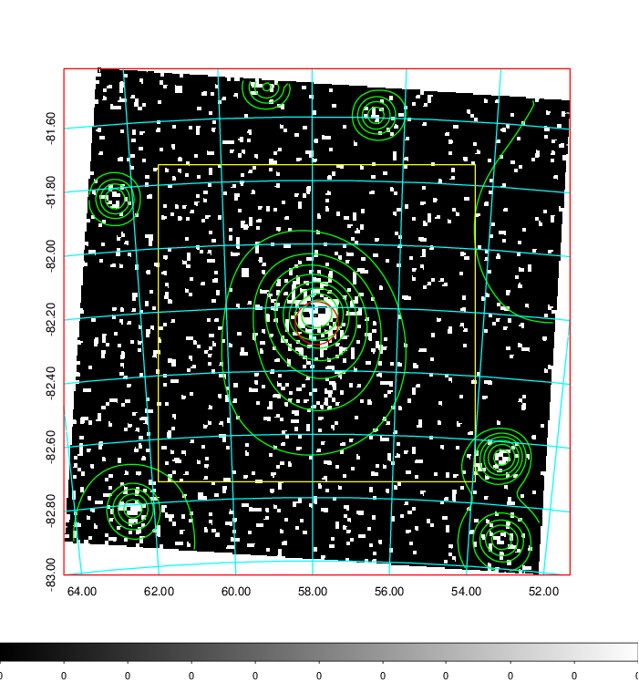
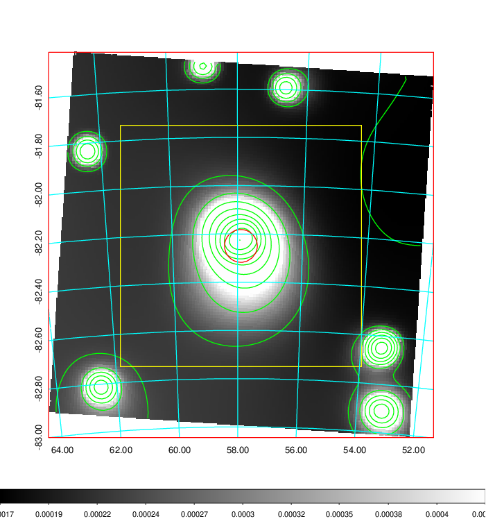
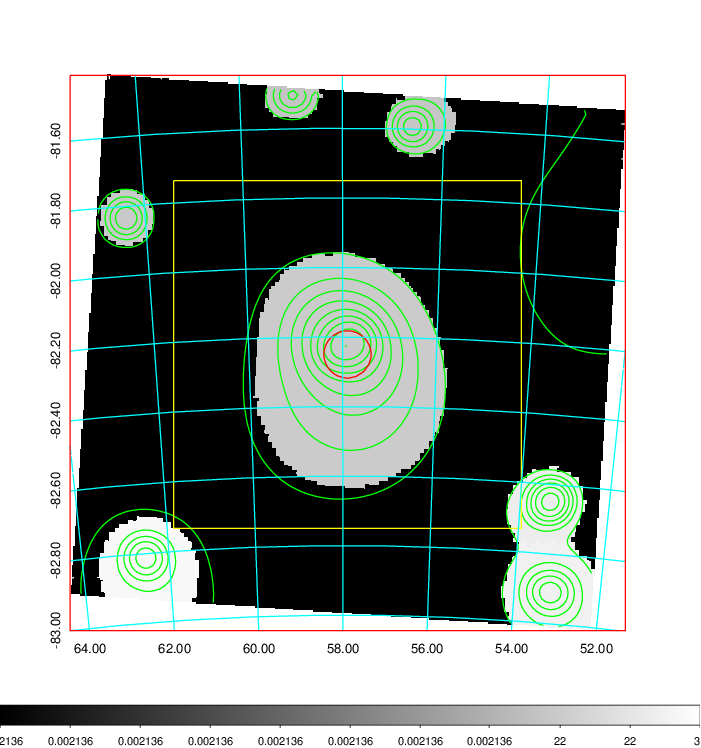
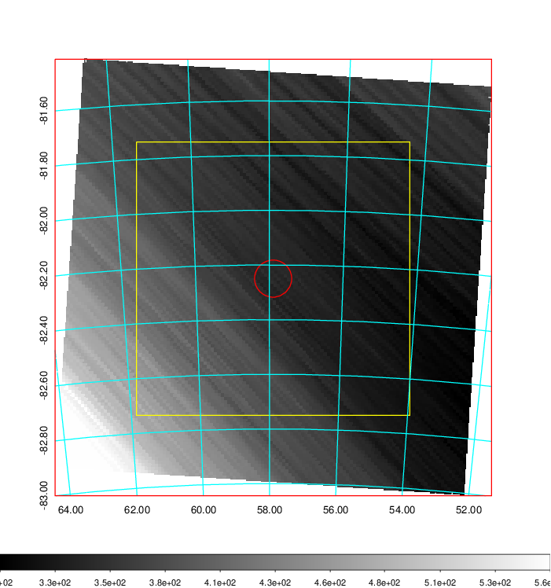
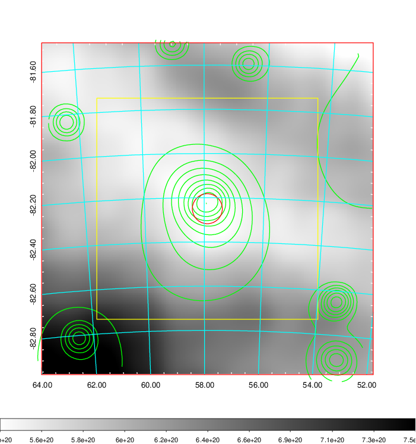
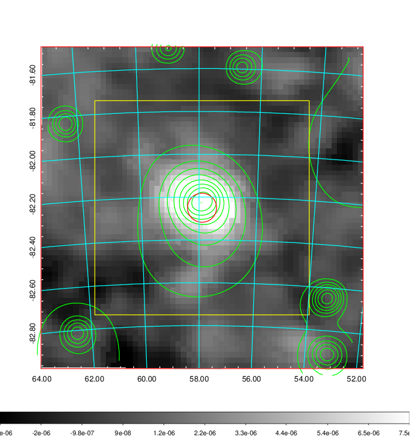
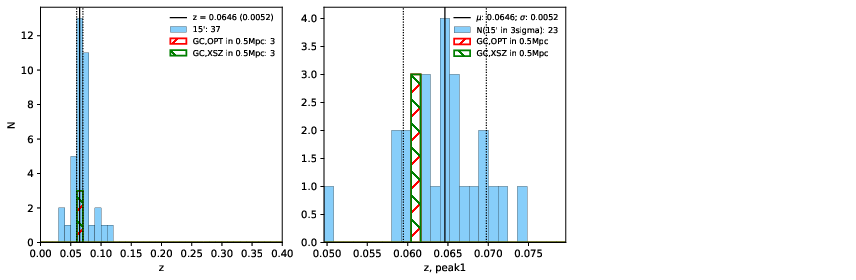
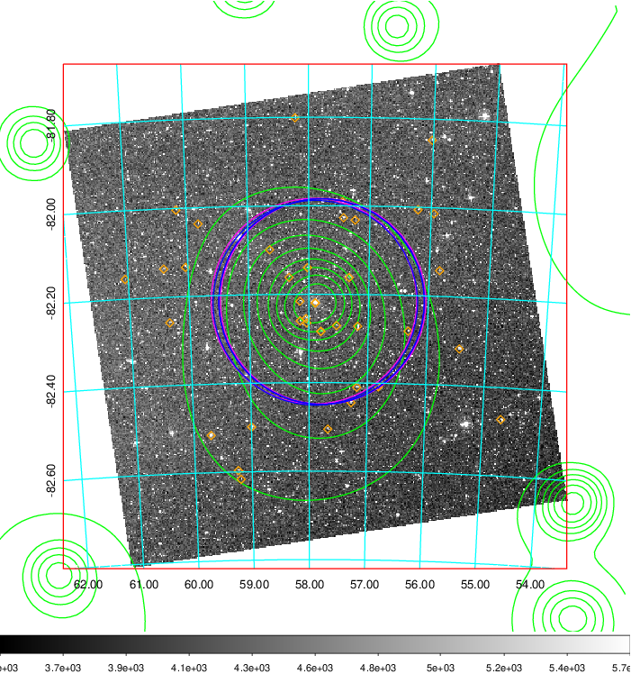
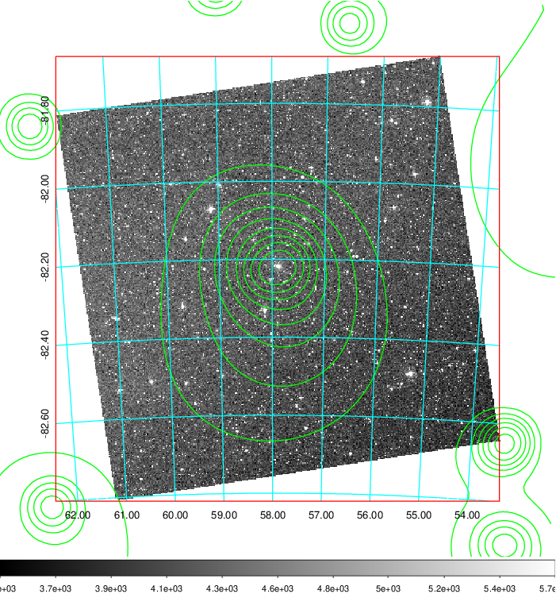
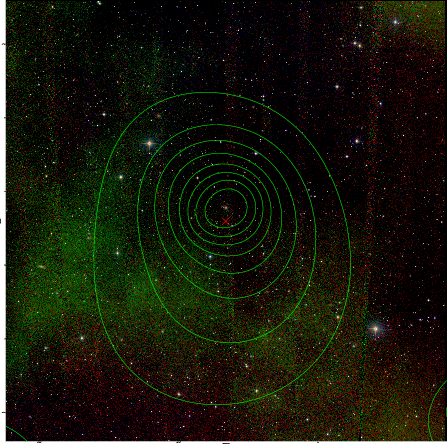

### 157

|Name|RAJ2000[deg]|DEJ2000[deg] |Ext[arcmin]| Ext,ml | z | z_src| C|GC(XSZ,Delta_z<0.01)| GC(OPT,Delta_z<0.01)|GC| R_sig[arcmin] | R500[arcmin] | R500[Mpc]| CRsig[c/s] | CR500[c/s] |L500[1E44 erg/s]|F500[1E-12 erg/s/cm^2]| M500[1E14 Msun]|Tx[keV]|Cnt_sig|Beta|Rc[arcmin]|Comment|Alias|
|---|---|---|---|---|---|------|---|--------|---------|----------|---|---|---|---|---|---|---|---|---|---|---|---|---|---|
|157| 57.897| -82.250| 4.07| 259.23| 0.0646(0.005)| z1, z_xsz| B| MCXC, PSZ2, Tar| A, W| A, MCXC, PSZ2, Tar, W| 20.750| 12.697| 0.946| 0.599(0.078)| 0.563(0.074)| 1.020(0.058)| 10.126(0.571)| 2.56(0.07)| 3.90(0.07)| 254.9| 0.939(-0.065+0.043)| 6.938(-0.610+0.432)| -| k483|

|[RASS image](../image/157/157_img.pdf)|[filtered image](../image/157/157_fil.pdf)|[Segment image](../image/157/157_seg.pdf)|
|-------------------|--------------------|-------------------|
|   |    |   |

|[Exposure image](../image/157/157_mex.pdf)| [nH image](../image/157/157_nh.pdf)| [Planck image](../image/157/157_p.pdf)|
|-------------------|--------------------|-------------------|
|   |     |  |

|[Redshift Histogram](../image/157/157_zg.pdf) | [DSS image(z1)](../image/157/157_dss_z1.pdf)      |  [DSS image(z2)](../image/157/157_dss_z2.pdf)    |
|-------------------|--------------------|-------------------|
| |  Blue circle for optical clusters;  Magenta circle for XSZ clusters;  all with r=1Mpc;  Only GC with Delta_z<0.01 are shown. |  Blue circle for optical clusters;  Magenta circle for XSZ clusters;  all with r=1Mpc;  Only GC with Delta_z<0.01 are shown.  |

|[Previous-identified clusters](../image/157/157_gc.pdf) | [2MASS image](../image/157/157_2mass.pdf)      |
|-------------------|-------------------|
|  Green, magenta, and blue circles  for optical, X-ray and SZ clusters  respectively, with redshift of clusters  labelled. The radius of circles  are 1Mpc.|  |

