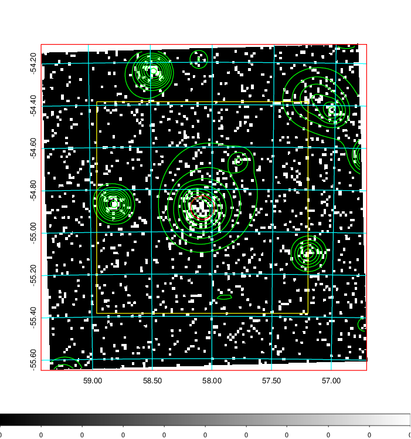
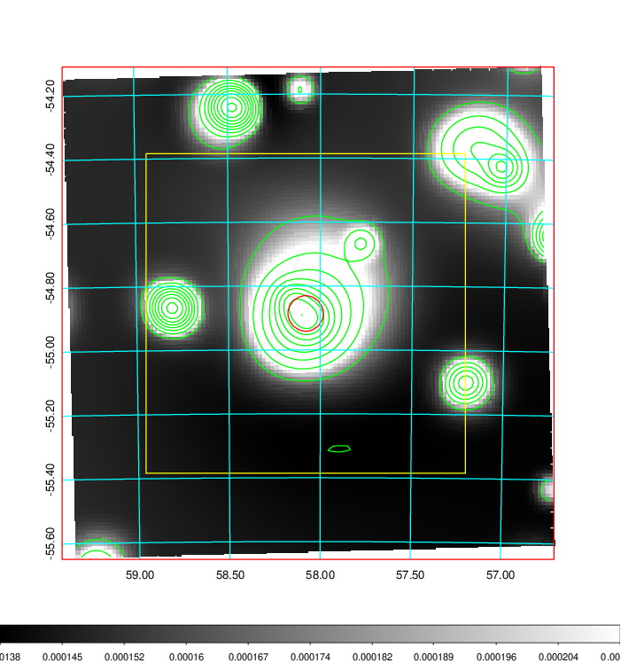
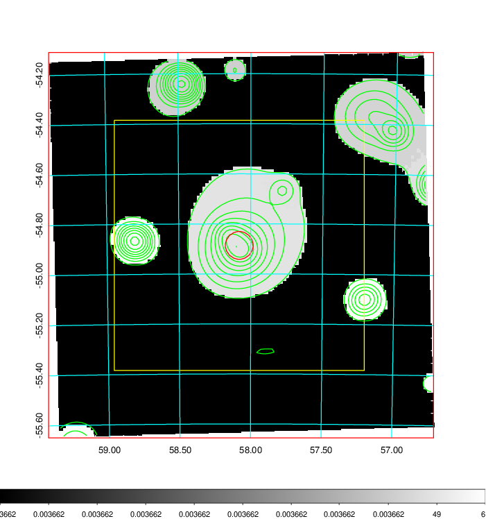
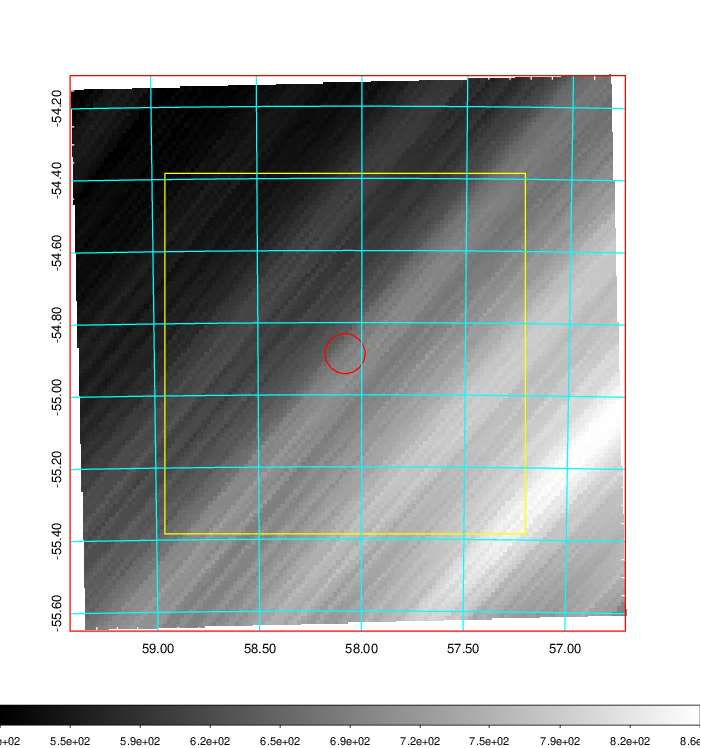
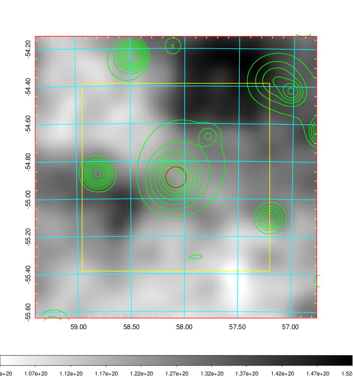
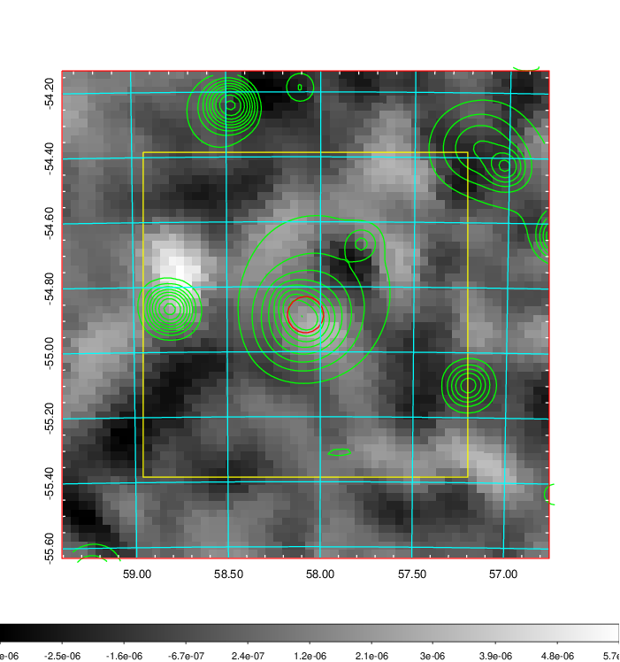
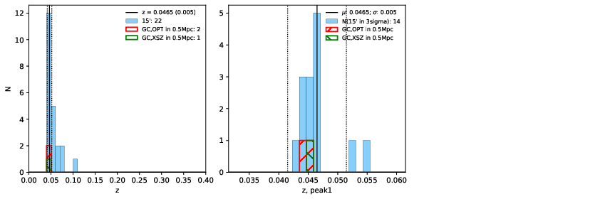
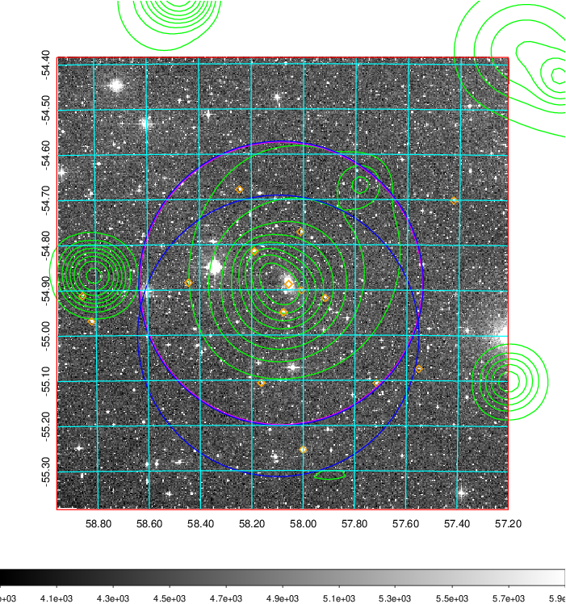
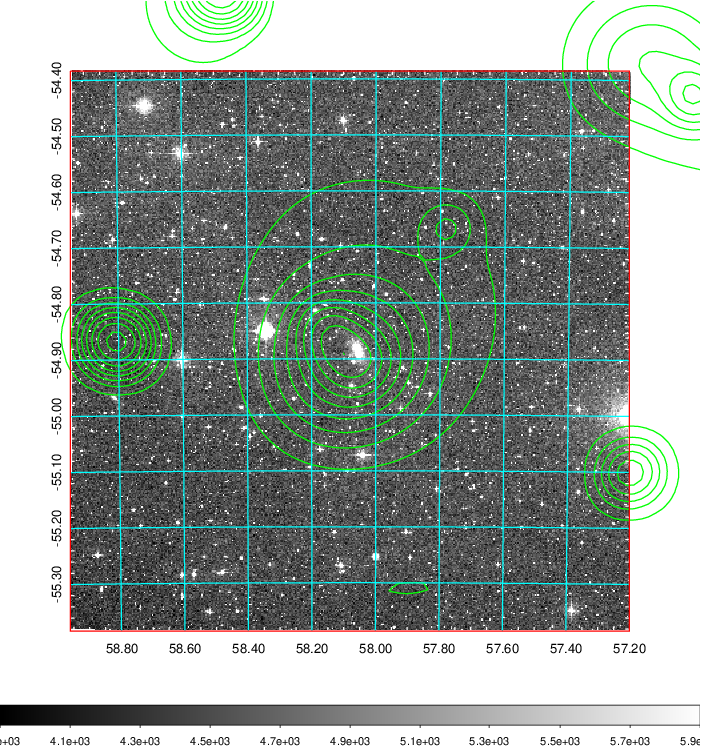
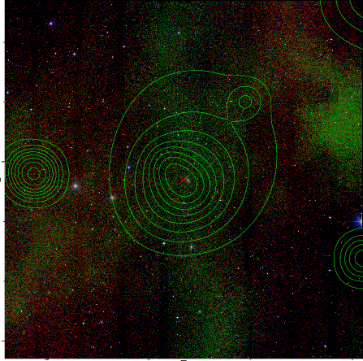

### 158

|Name|RAJ2000[deg]|DEJ2000[deg] |Ext[arcmin]| Ext,ml | z | z_src| C|GC(XSZ,Delta_z<0.01)| GC(OPT,Delta_z<0.01)|GC| R_sig[arcmin] | R500[arcmin] | R500[Mpc]| CRsig[c/s] | CR500[c/s] |L500[1E44 erg/s]|F500[1E-12 erg/s/cm^2]| M500[1E14 Msun]|Tx[keV]|Cnt_sig|Beta|Rc[arcmin]|Comment|Alias|
|---|---|---|---|---|---|------|---|--------|---------|----------|---|---|---|---|---|---|---|---|---|---|---|---|---|---|
|158| 58.080| -54.886| 3.34| 93.12| 0.0465(0.005)| z1, z_xsz| B| MCXC| N| MCXC, N| 10.750| 11.931| 0.653| 0.198(0.027)| 0.201(0.027)| 0.188(0.018)| 3.688(0.357)| 0.83(0.04)| 1.94(0.06)| 119.3| 0.907(-0.103+0.067)| 6.228(-0.823+0.591)| -| k408|

|[RASS image](../image/158/158_img.pdf)|[filtered image](../image/158/158_fil.pdf)|[Segment image](../image/158/158_seg.pdf)|
|-------------------|--------------------|-------------------|
|   |    |   |

|[Exposure image](../image/158/158_mex.pdf)| [nH image](../image/158/158_nh.pdf)| [Planck image](../image/158/158_p.pdf)|
|-------------------|--------------------|-------------------|
|   |     |  |

|[Redshift Histogram](../image/158/158_zg.pdf) | [DSS image(z1)](../image/158/158_dss_z1.pdf)      |  [DSS image(z2)](../image/158/158_dss_z2.pdf)    |
|-------------------|--------------------|-------------------|
| |  Blue circle for optical clusters;  Magenta circle for XSZ clusters;  all with r=1Mpc;  Only GC with Delta_z<0.01 are shown. |  Blue circle for optical clusters;  Magenta circle for XSZ clusters;  all with r=1Mpc;  Only GC with Delta_z<0.01 are shown.  |

|[known Abell/XSZ clusters](../image/158/158_gc.pdf) | [2MASS image](../image/158/158_2mass.pdf)      |
|-------------------|-------------------|
|  Magenta, blue and green circles  for optical, X-ray and SZ clusters  respectively, with redshift of clusters  labelled. The radius of circles  are 1Mpc.|  |

|[DES image](../image/158/158_des.pdf)   |
|-------------------|
|   |
