

### 159

|Name|RAJ2000[deg]|DEJ2000[deg] |Ext[arcmin]| Ext,ml | z | z_src| C|GC(XSZ,Delta_z<0.01)| GC(OPT,Delta_z<0.01)|GC| R_sig[arcmin] | R500[arcmin] | R500[Mpc]| CRsig[c/s] | CR500[c/s] |L500[1E44 erg/s]|F500[1E-12 erg/s/cm^2]| M500[1E14 Msun]|Tx[keV]|Cnt_sig|Beta|Rc[arcmin]|Comment|Alias|
|---|---|---|---|---|---|------|---|--------|---------|----------|---|---|---|---|---|---|---|---|---|---|---|---|---|---|
|159| 58.240| 19.658| 0.85| 25.61| 0.1043(0.009)| z1, z_xsz| B| MCXC| N| MCXC, N, W| 12.700| 8.890| 1.021| 0.301(0.039)| 0.287(0.038)| 1.375(0.065)| 4.955(0.233)| 3.35(0.08)| 4.66(0.07)| 111.8| 0.837(-0.120+0.108)| 2.970(-0.678+0.540)| -| k020|

|[RASS image](../image/159/159_img.pdf)|[filtered image](../image/159/159_fil.pdf)|[Segment image](../image/159/159_seg.pdf)|
|-------------------|--------------------|-------------------|
| 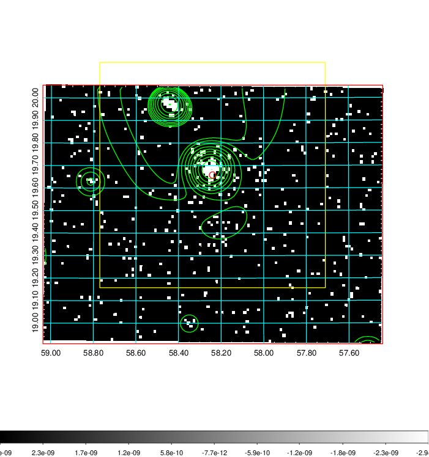  | 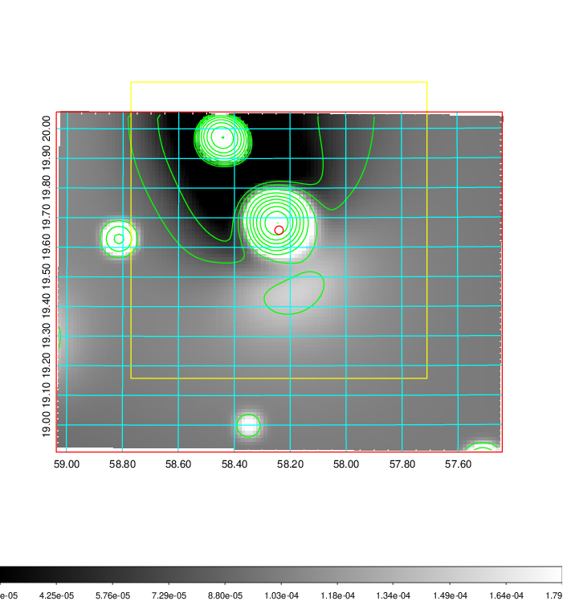   | 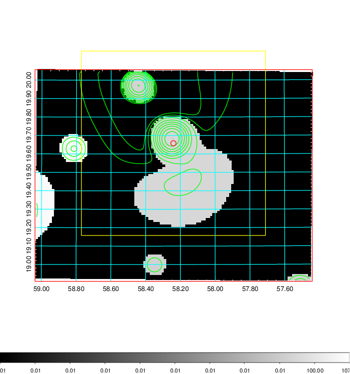  |

|[Exposure image](../image/159/159_mex.pdf)| [nH image](../image/159/159_nh.pdf)| [Planck image](../image/159/159_p.pdf)|
|-------------------|--------------------|-------------------|
|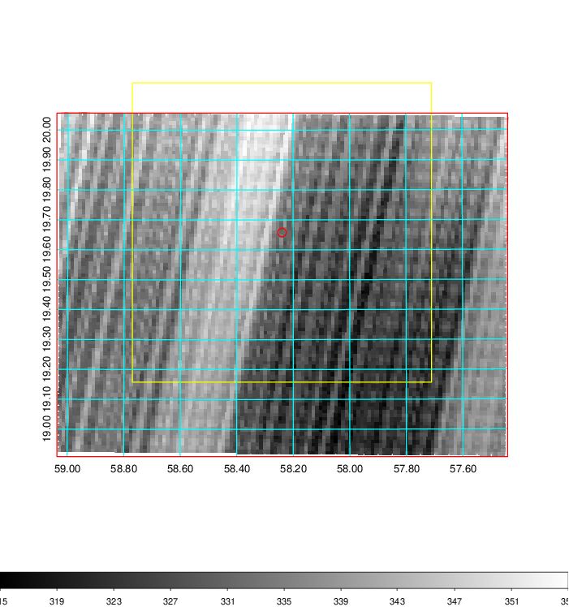   | 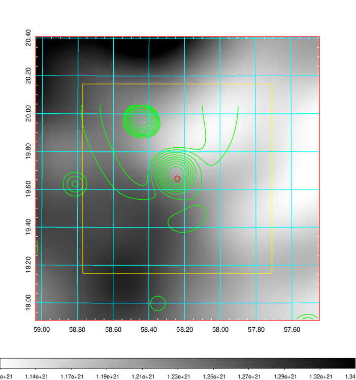    | 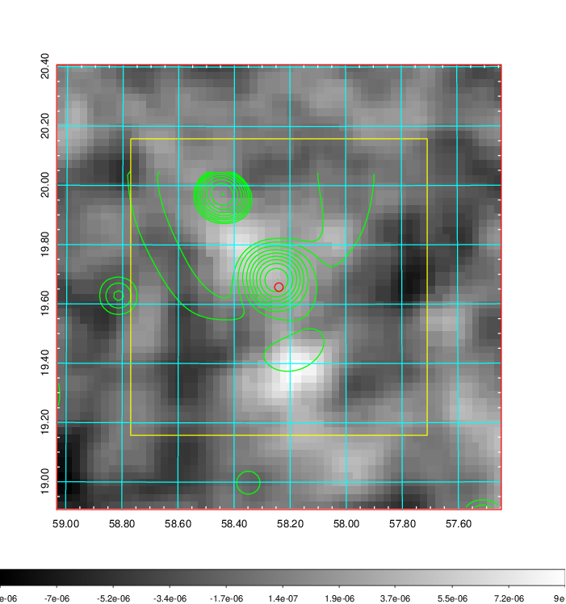 |

|[Redshift Histogram](../image/159/159_zg.pdf) | [DSS image(z1)](../image/159/159_dss_z1.pdf)      |  [DSS image(z2)](../image/159/159_dss_z2.pdf)    |
|-------------------|--------------------|-------------------|
|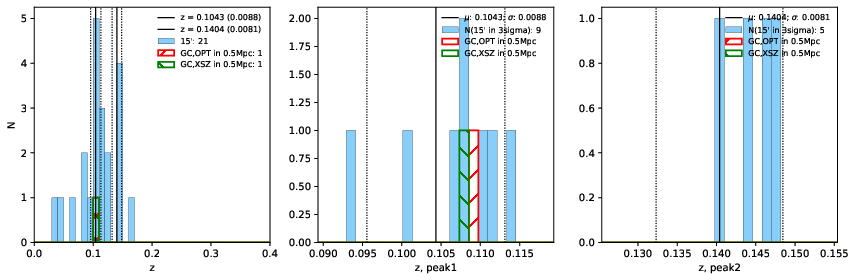 |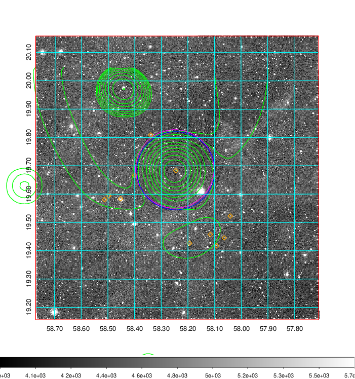  Blue circle for optical clusters;  Magenta circle for XSZ clusters;  all with r=1Mpc;  Only GC with Delta_z<0.01 are shown. | 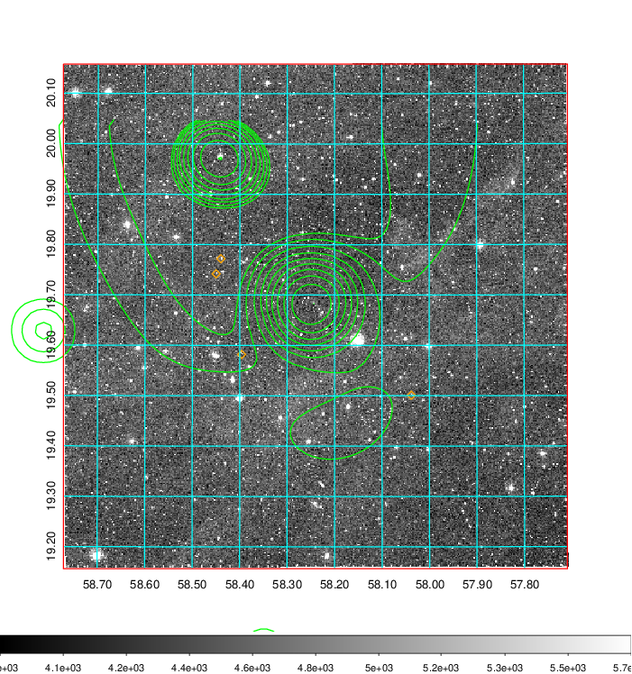 Blue circle for optical clusters;  Magenta circle for XSZ clusters;  all with r=1Mpc;  Only GC with Delta_z<0.01 are shown.  |

|[Previous-identified clusters](../image/159/159_gc.pdf) | [2MASS image](../image/159/159_2mass.pdf)      |
|-------------------|-------------------|
|  Green, magenta, and blue circles  for optical, X-ray and SZ clusters  respectively, with redshift of clusters  labelled. The radius of circles  are 1Mpc.|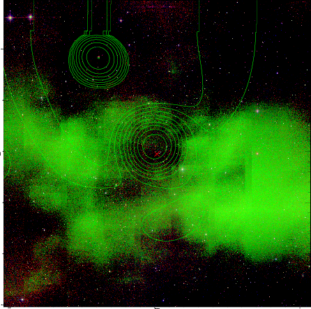  |

|[PS1 image](../image/159/159_ps1.pdf)            |
|-------------------|
| 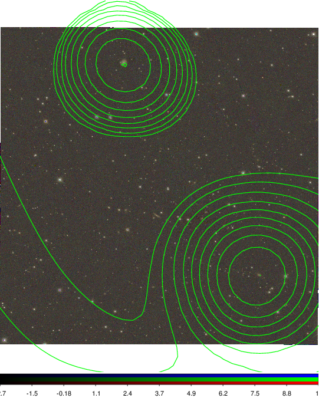  |
