

### 16

|Name|RAJ2000[deg]|DEJ2000[deg] |Ext[arcmin]| Ext,ml | z | z_src| C|GC(XSZ,Delta_z<0.01)| GC(OPT,Delta_z<0.01)|GC| R_sig[arcmin] | R500[arcmin] | R500[Mpc]| CRsig[c/s] | CR500[c/s] |L500[1E44 erg/s]|F500[1E-12 erg/s/cm^2]| M500[1E14 Msun]|Tx[keV]|Cnt_sig|Beta|Rc[arcmin]|Comment|Alias|
|---|---|---|---|---|---|------|---|--------|---------|----------|---|---|---|---|---|---|---|---|---|---|---|---|---|---|
|16| 4.135| -31.411| 3.47| 37.02| 0.1065(0.005)| z1, z_opt| S| -| A| A, MCXC, N, W| 9.775| 7.845| 0.918| 0.212(0.040)| 0.206(0.039)| 1.161(0.128)| 4.003(0.440)| 2.43(0.13)| 3.83(0.13)| 63.5| 0.928(-0.094+0.053)| 7.098(-0.802+0.650)| An X-ray cluster with $z$ = 0.0805 and offset = 0.45 Mpc| k424|

|[RASS image](../image/16/16_img.pdf)|[filtered image](../image/16/16_fil.pdf)|[Segment image](../image/16/16_seg.pdf)|
|-------------------|--------------------|-------------------|
| 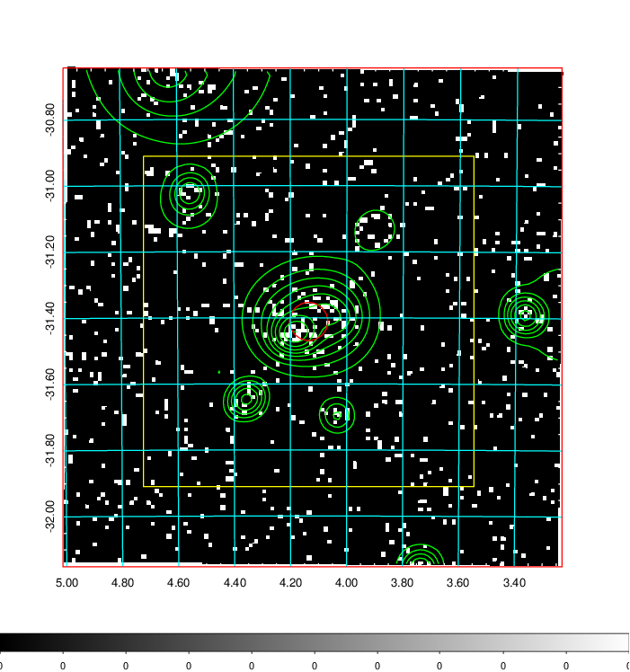  | 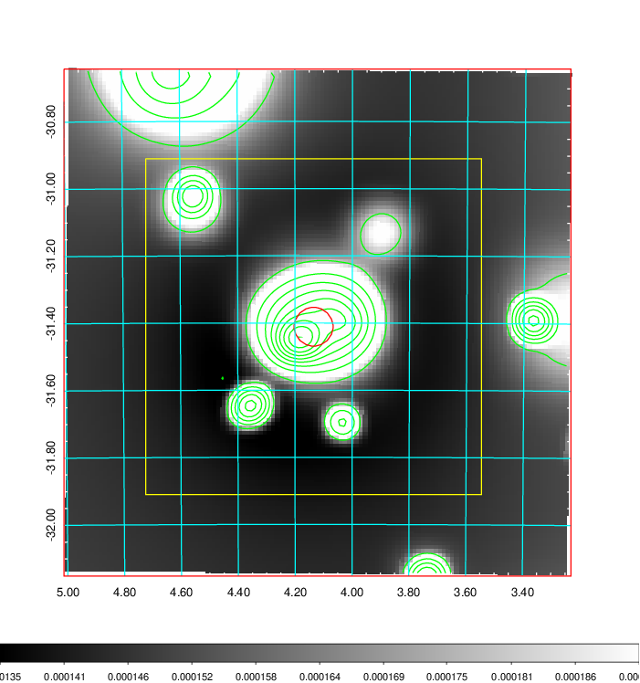   | 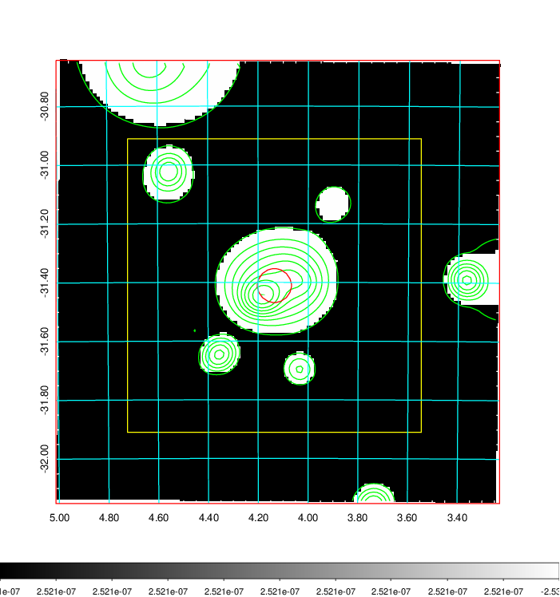  |

|[Exposure image](../image/16/16_mex.pdf)| [nH image](../image/16/16_nh.pdf)| [Planck image](../image/16/16_p.pdf)|
|-------------------|--------------------|-------------------|
|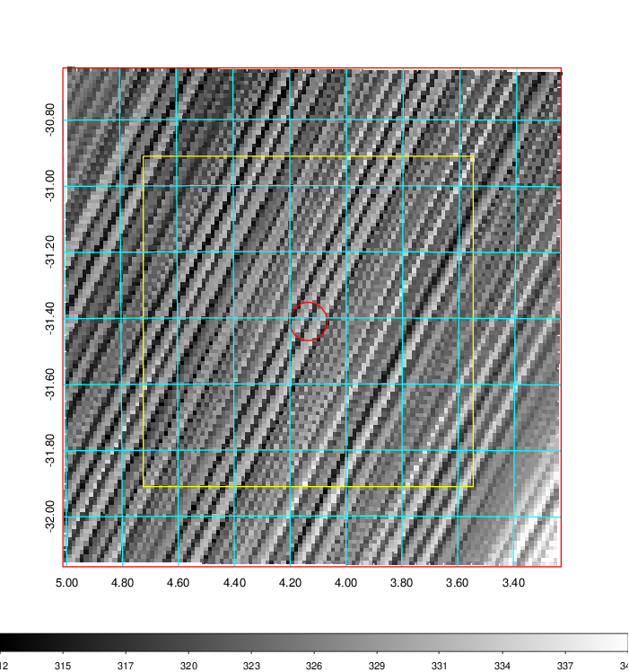   | 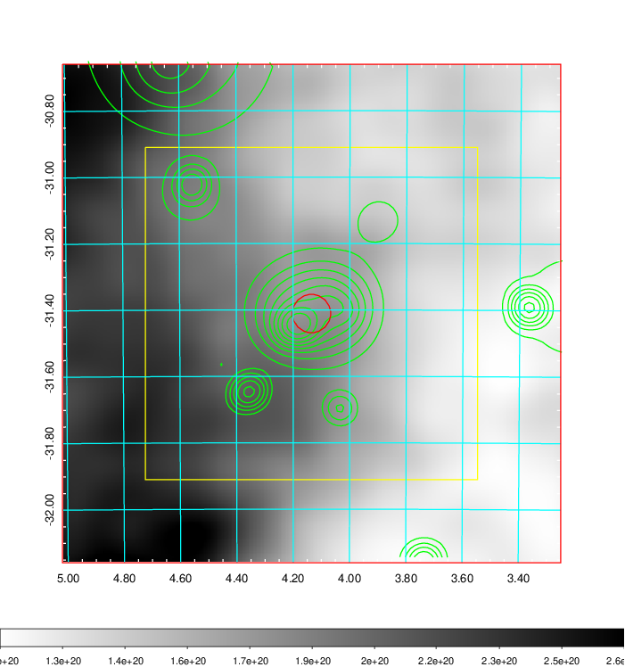    | 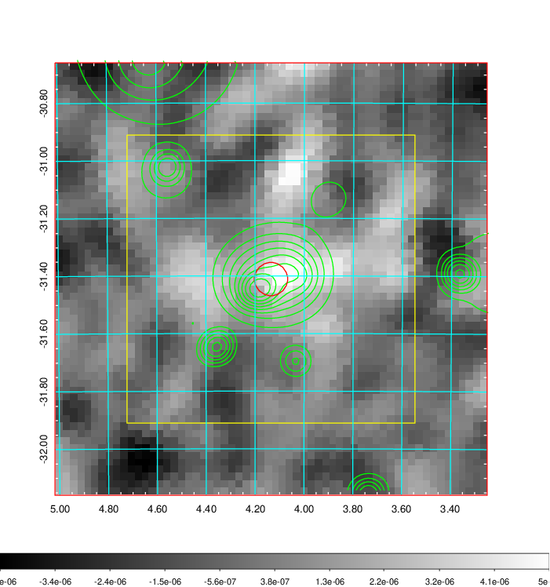 |

|[Redshift Histogram](../image/16/16_zg.pdf) | [DSS image(z1)](../image/16/16_dss_z1.pdf)      |  [DSS image(z2)](../image/16/16_dss_z2.pdf)    |
|-------------------|--------------------|-------------------|
|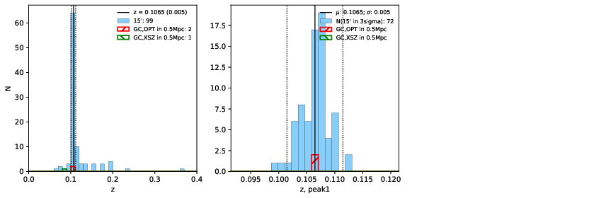 |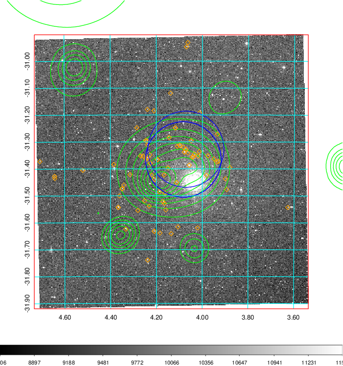  Blue circle for optical clusters;  Magenta circle for XSZ clusters;  all with r=1Mpc;  Only GC with Delta_z<0.01 are shown. | 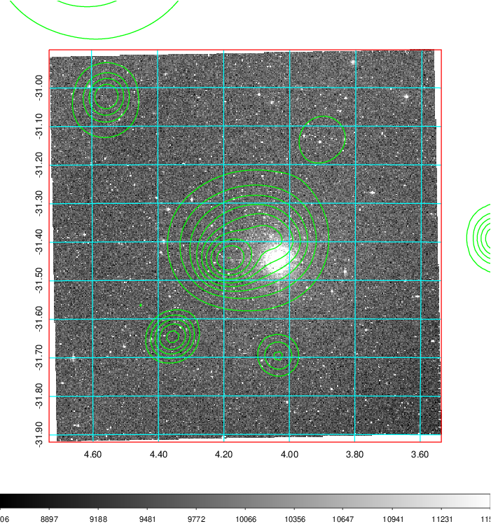 Blue circle for optical clusters;  Magenta circle for XSZ clusters;  all with r=1Mpc;  Only GC with Delta_z<0.01 are shown.  |

|[Previous-identified clusters](../image/16/16_gc.pdf) | [2MASS image](../image/16/16_2mass.pdf)      |
|-------------------|-------------------|
|  Green, magenta, and blue circles  for optical, X-ray and SZ clusters  respectively, with redshift of clusters  labelled. The radius of circles  are 1Mpc.|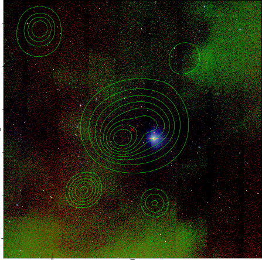  |

|[DES image](../image/16/16_des.pdf)   |[ATLAS image](../image/16/16_s.pdf)        |
|-------------------|-------------------|
| 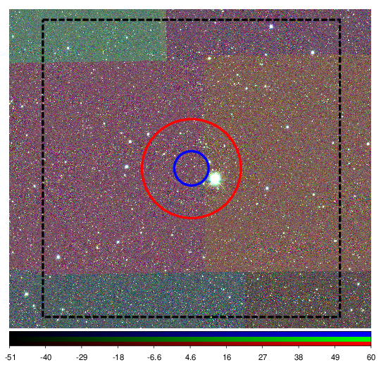  | 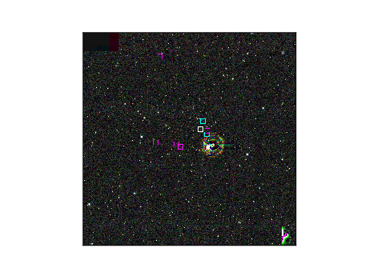  |
