

### 160

|Name|RAJ2000[deg]|DEJ2000[deg] |Ext[arcmin]| Ext,ml | z | z_src| C|GC(XSZ,Delta_z<0.01)| GC(OPT,Delta_z<0.01)|GC| R_sig[arcmin] | R500[arcmin] | R500[Mpc]| CRsig[c/s] | CR500[c/s] |L500[1E44 erg/s]|F500[1E-12 erg/s/cm^2]| M500[1E14 Msun]|Tx[keV]|Cnt_sig|Beta|Rc[arcmin]|Comment|Alias|
|---|---|---|---|---|---|------|---|--------|---------|----------|---|---|---|---|---|---|---|---|---|---|---|---|---|---|
|160| 60.048| -58.655| 4.11| 56.58| 0.1128(0.007)| z1, z_opt| S| -| W| Tar, W| 12.700| 7.006| 0.862| 0.146(0.021)| 0.135(0.020)| 0.849(0.109)| 2.588(0.333)| 2.03(0.13)| 3.43(0.14)| 168.3| 0.882(-0.130+0.084)| 7.348(-1.247+0.818)| An SZ cluster with no $z$ and offset = 0.16 Mpc| t204|

|[RASS image](../image/160/160_img.pdf)|[filtered image](../image/160/160_fil.pdf)|[Segment image](../image/160/160_seg.pdf)|
|-------------------|--------------------|-------------------|
| 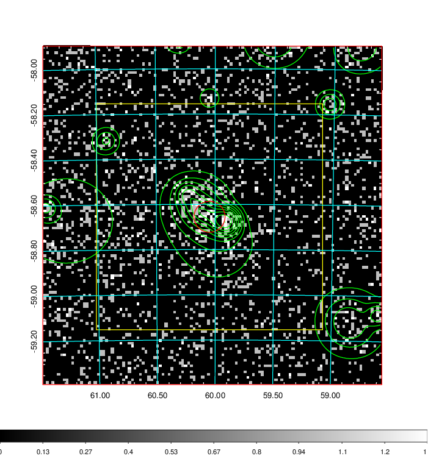  | 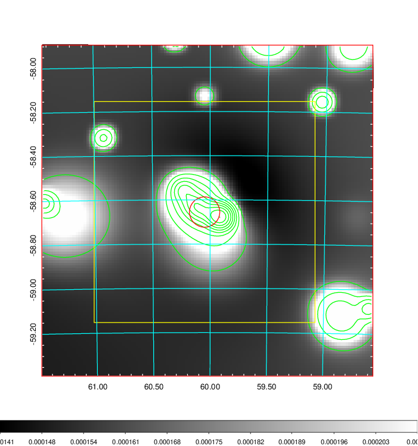   | 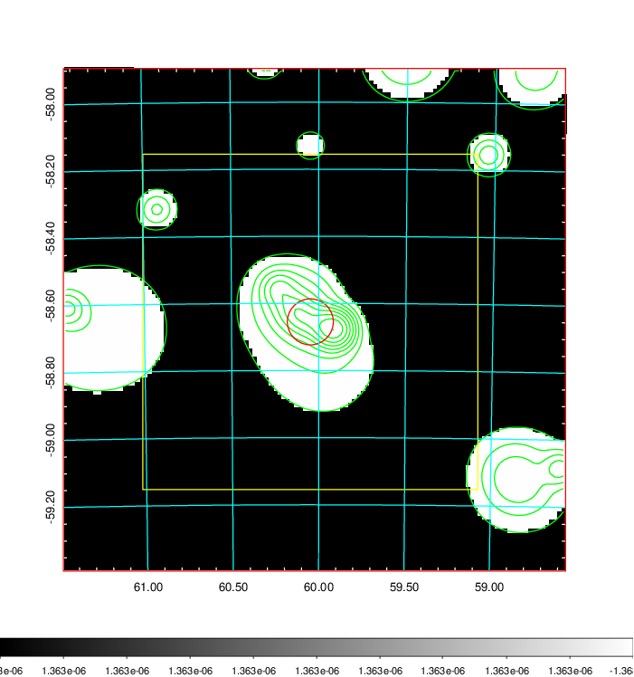  |

|[Exposure image](../image/160/160_mex.pdf)| [nH image](../image/160/160_nh.pdf)| [Planck image](../image/160/160_p.pdf)|
|-------------------|--------------------|-------------------|
|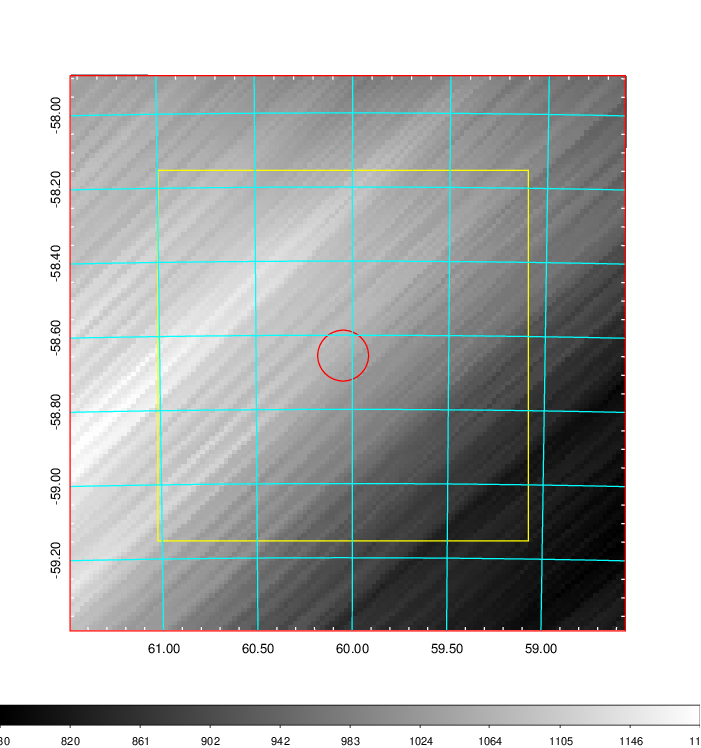   | 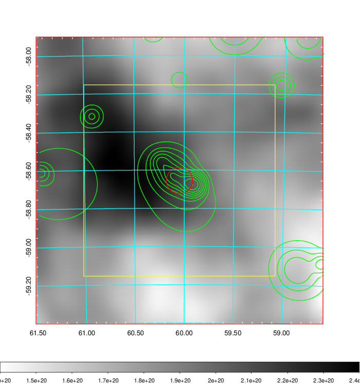    | 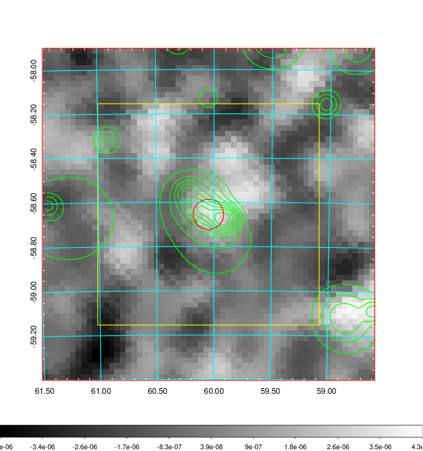 |

|[Redshift Histogram](../image/160/160_zg.pdf) | [DSS image(z1)](../image/160/160_dss_z1.pdf)      |  [DSS image(z2)](../image/160/160_dss_z2.pdf)    |
|-------------------|--------------------|-------------------|
|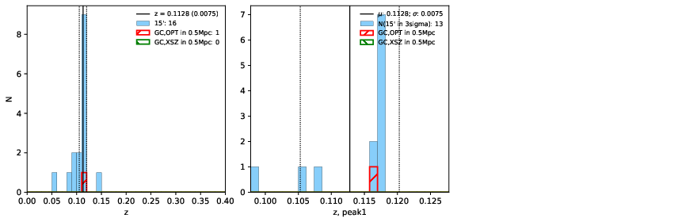 |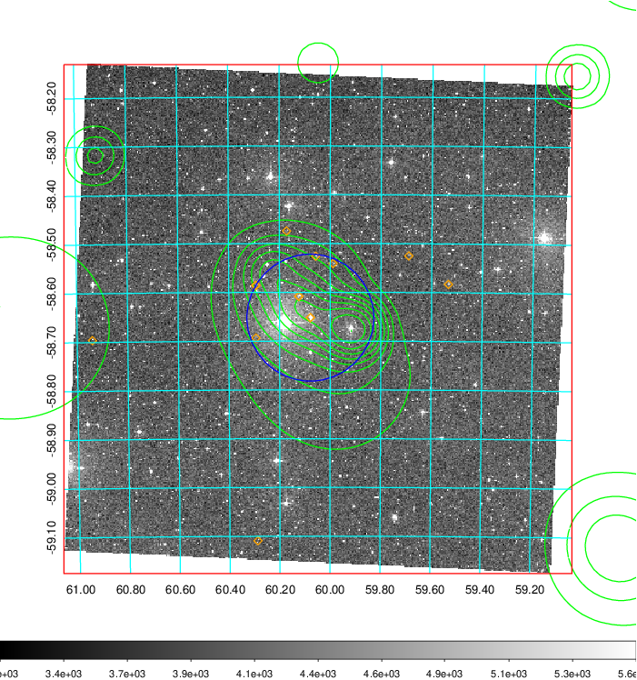  Blue circle for optical clusters;  Magenta circle for XSZ clusters;  all with r=1Mpc;  Only GC with Delta_z<0.01 are shown. | 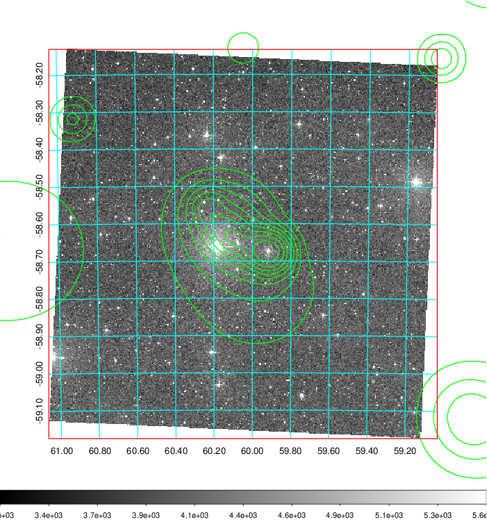 Blue circle for optical clusters;  Magenta circle for XSZ clusters;  all with r=1Mpc;  Only GC with Delta_z<0.01 are shown.  |

|[Previous-identified clusters](../image/160/160_gc.pdf) | [2MASS image](../image/160/160_2mass.pdf)      |
|-------------------|-------------------|
|  Green, magenta, and blue circles  for optical, X-ray and SZ clusters  respectively, with redshift of clusters  labelled. The radius of circles  are 1Mpc.|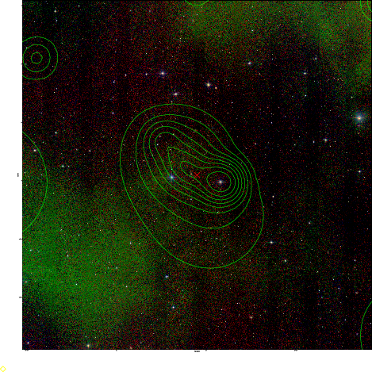  |

|[DES image](../image/160/160_des.pdf)   |
|-------------------|
| 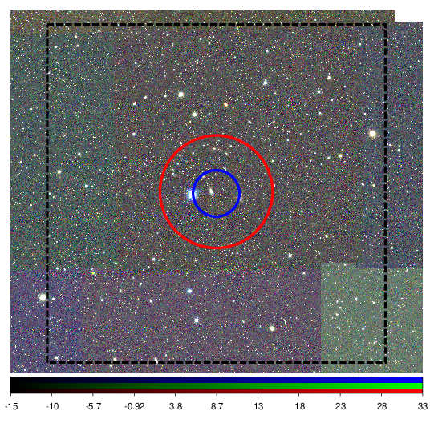  |
