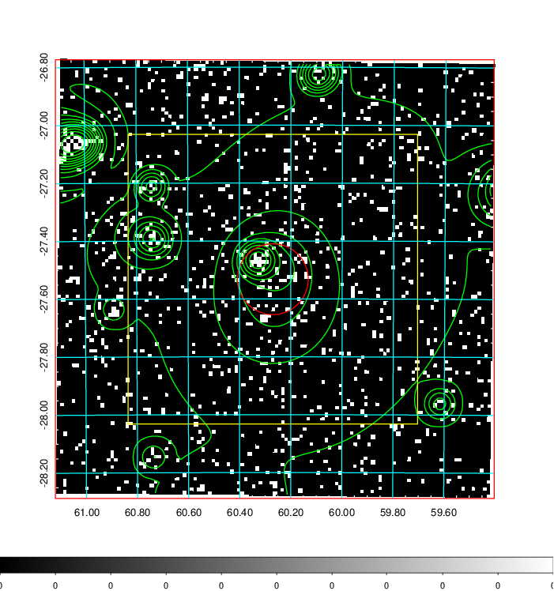
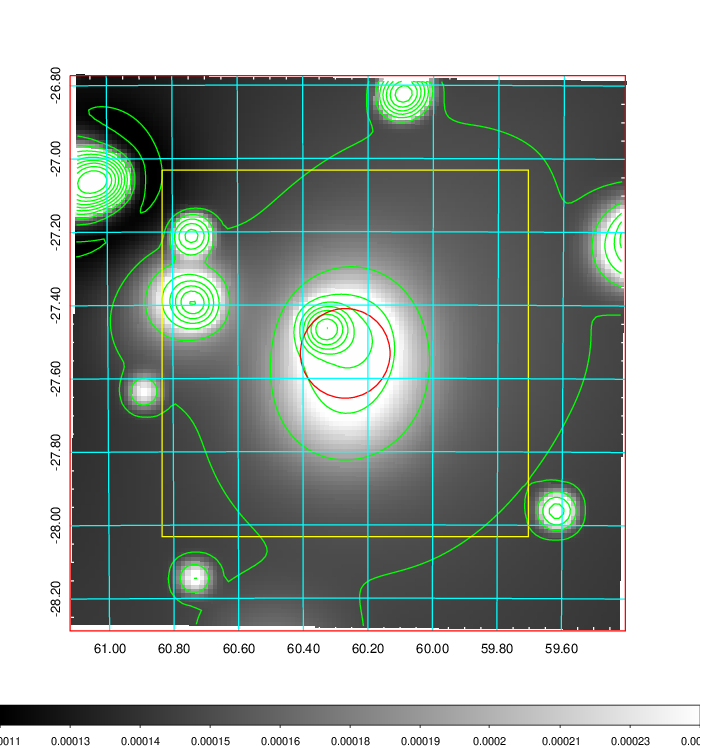
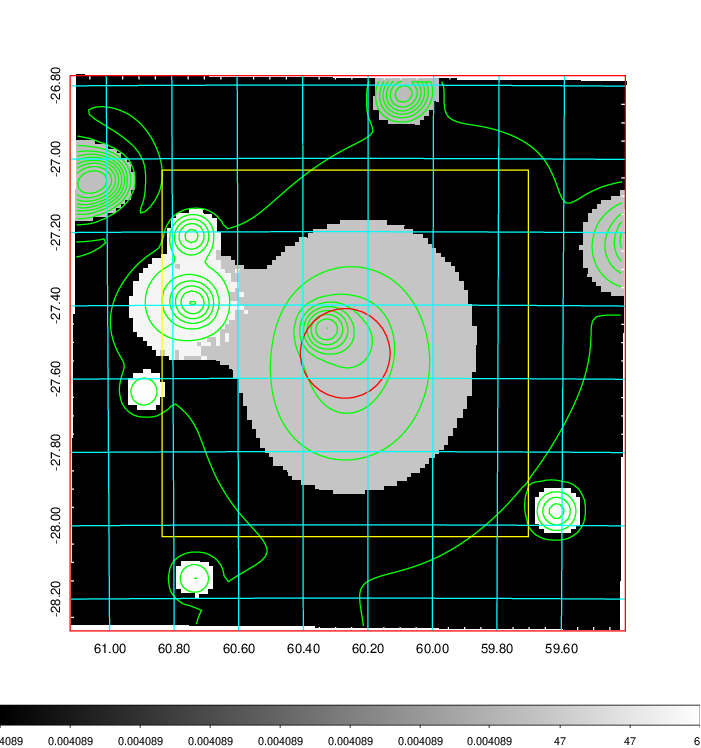
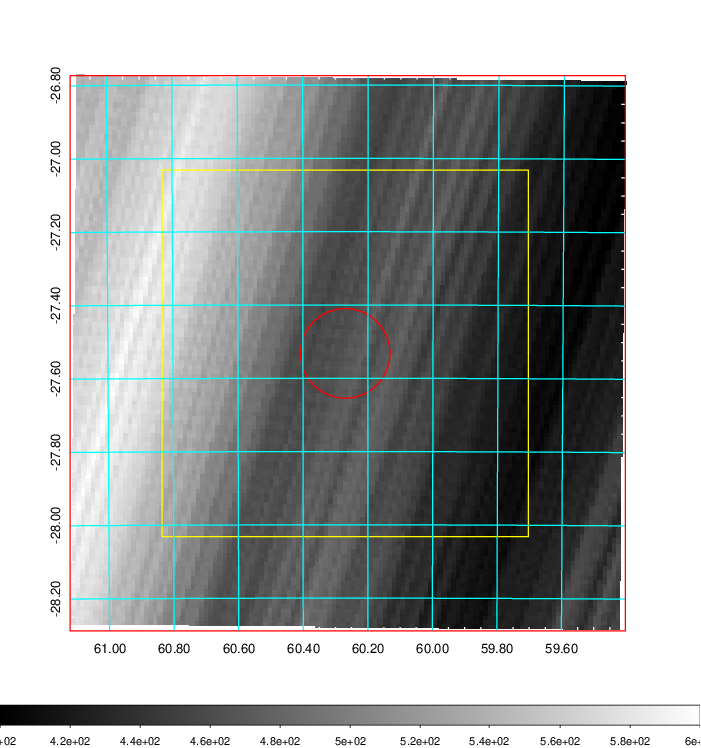
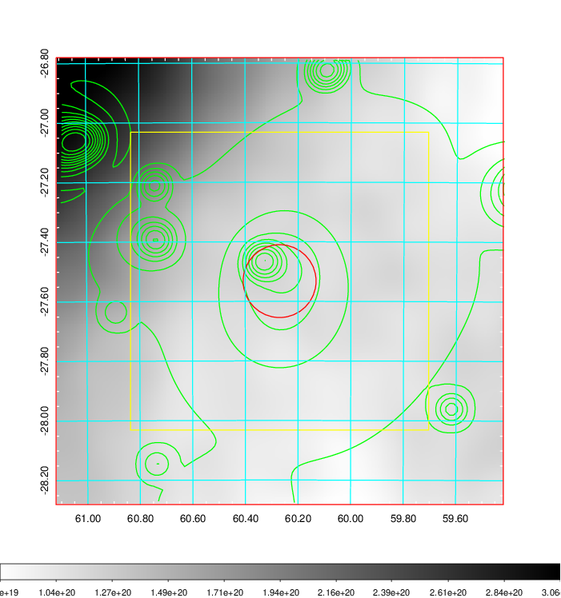
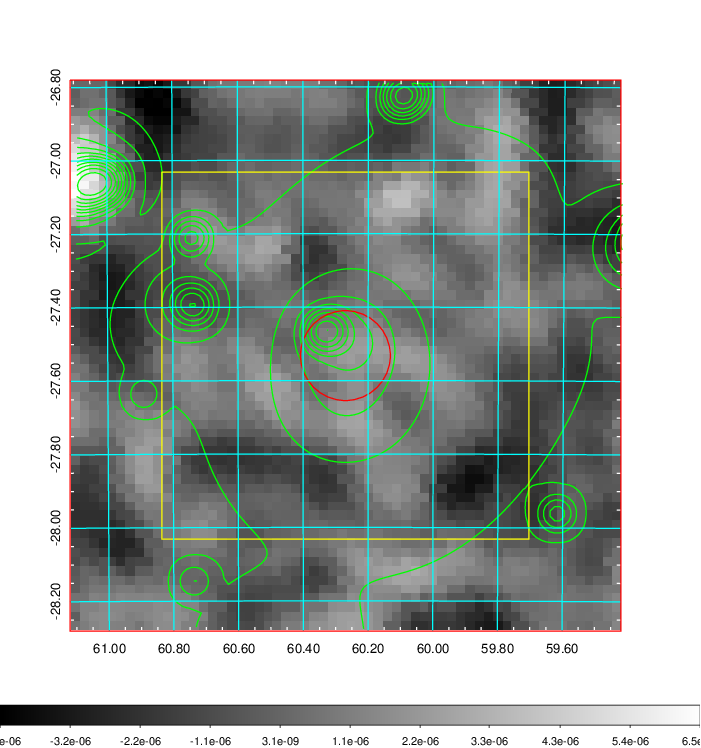
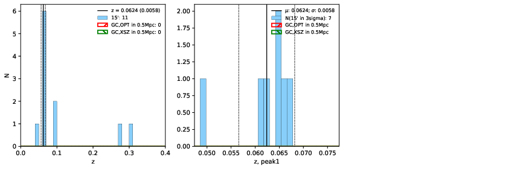
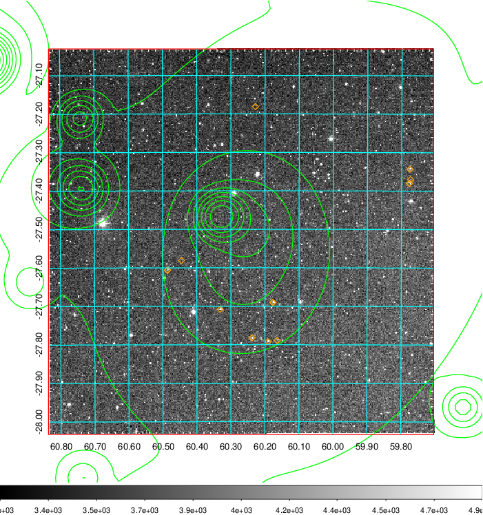
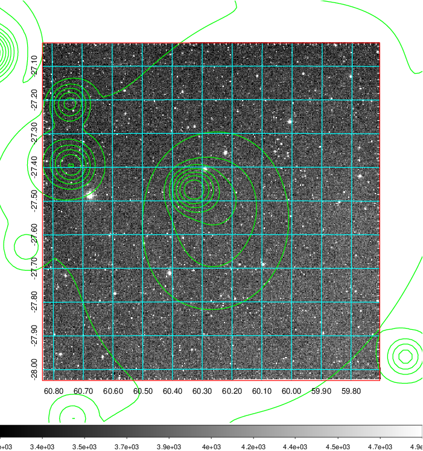
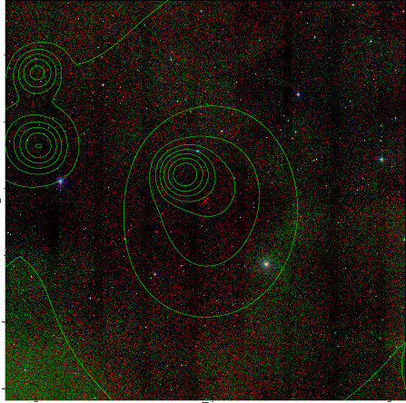

### 161

|Name|RAJ2000[deg]|DEJ2000[deg] |Ext[arcmin]| Ext,ml | z | z_src| C|GC(XSZ,Delta_z<0.01)| GC(OPT,Delta_z<0.01)|GC| R_sig[arcmin] | R500[arcmin] | R500[Mpc]| CRsig[c/s] | CR500[c/s] |L500[1E44 erg/s]|F500[1E-12 erg/s/cm^2]| M500[1E14 Msun]|Tx[keV]|Cnt_sig|Beta|Rc[arcmin]|Comment|Alias|
|---|---|---|---|---|---|------|---|--------|---------|----------|---|---|---|---|---|---|---|---|---|---|---|---|---|---|
|161| 60.270| -27.532| 7.34| 60.35| 0.0624(0.006)| z1,| G| -| -| A, N, W| 18.281| 9.995| 0.721| 0.193(0.052)| 0.179(0.048)| 0.324(0.096)| 3.453(1.023)| 1.13(0.17)| 2.35(0.22)| 92.5| 0.923(-0.094+0.056)| 11.476(-1.309+0.961)| An Abell cluster with no $z$ and offset = 0.53 Mpc(7.33 arcmin)| t371|

|[RASS image](../image/161/161_img.pdf)|[filtered image](../image/161/161_fil.pdf)|[Segment image](../image/161/161_seg.pdf)|
|-------------------|--------------------|-------------------|
|   |    |   |

|[Exposure image](../image/161/161_mex.pdf)| [nH image](../image/161/161_nh.pdf)| [Planck image](../image/161/161_p.pdf)|
|-------------------|--------------------|-------------------|
|   |     |  |

|[Redshift Histogram](../image/161/161_zg.pdf) | [DSS image(z1)](../image/161/161_dss_z1.pdf)      |  [DSS image(z2)](../image/161/161_dss_z2.pdf)    |
|-------------------|--------------------|-------------------|
| |  Blue circle for optical clusters;  Magenta circle for XSZ clusters;  all with r=1Mpc;  Only GC with Delta_z<0.01 are shown. |  Blue circle for optical clusters;  Magenta circle for XSZ clusters;  all with r=1Mpc;  Only GC with Delta_z<0.01 are shown.  |

|[known Abell/XSZ clusters](../image/161/161_gc.pdf) | [2MASS image](../image/161/161_2mass.pdf)      |
|-------------------|-------------------|
|  Magenta, blue and green circles  for optical, X-ray and SZ clusters  respectively, with redshift of clusters  labelled. The radius of circles  are 1Mpc.|  |

|[DES image](../image/161/161_des.pdf)   |[ATLAS image](../image/161/161_s.pdf)        |
|-------------------|-------------------|
|   |   |
