

### 162

|Name|RAJ2000[deg]|DEJ2000[deg] |Ext[arcmin]| Ext,ml | z | z_src| C|GC(XSZ,Delta_z<0.01)| GC(OPT,Delta_z<0.01)|GC| R_sig[arcmin] | R500[arcmin] | R500[Mpc]| CRsig[c/s] | CR500[c/s] |L500[1E44 erg/s]|F500[1E-12 erg/s/cm^2]| M500[1E14 Msun]|Tx[keV]|Cnt_sig|Beta|Rc[arcmin]|Comment|Alias|
|---|---|---|---|---|---|------|---|--------|---------|----------|---|---|---|---|---|---|---|---|---|---|---|---|---|---|
|162| 60.936| -17.163| 2.15| 34.66| 0.1441(0.000)| z_opt| S| -| W| A, PSZ2, Tar, W| 10.262| 6.059| 0.919| 0.126(0.031)| 0.118(0.030)| 1.304(0.152)| 2.339(0.272)| 2.54(0.15)| 3.98(0.15)| 43.3| 0.946(-0.073+0.039)| 4.570(-0.467+0.425)| $z$ of optical cluster; An SZ cluster with no $z$ and offset = 0.39 Mpc| k245|

|[RASS image](../image/162/162_img.pdf)|[filtered image](../image/162/162_fil.pdf)|[Segment image](../image/162/162_seg.pdf)|
|-------------------|--------------------|-------------------|
| 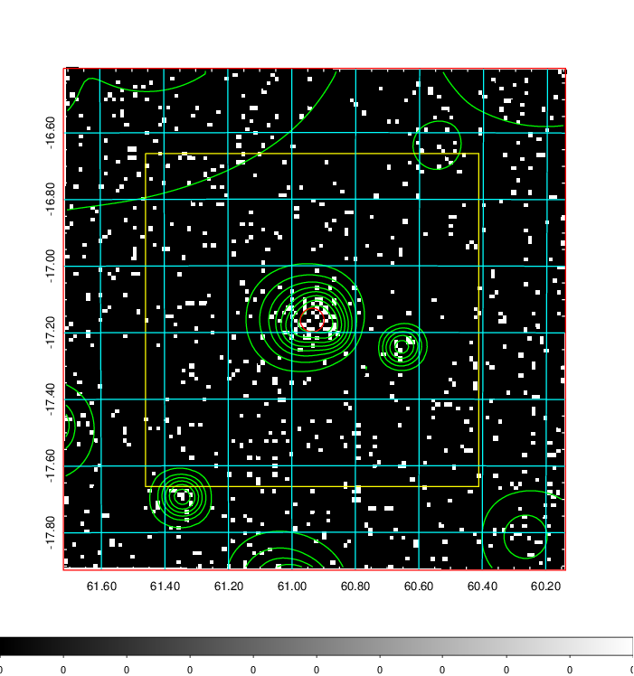  | 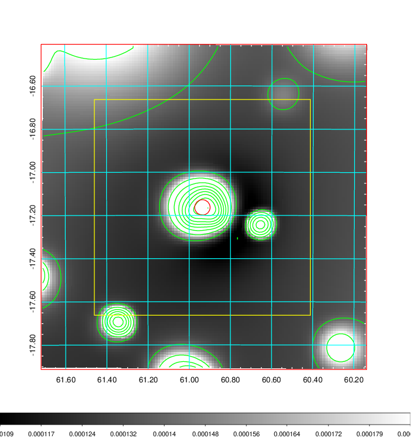   | 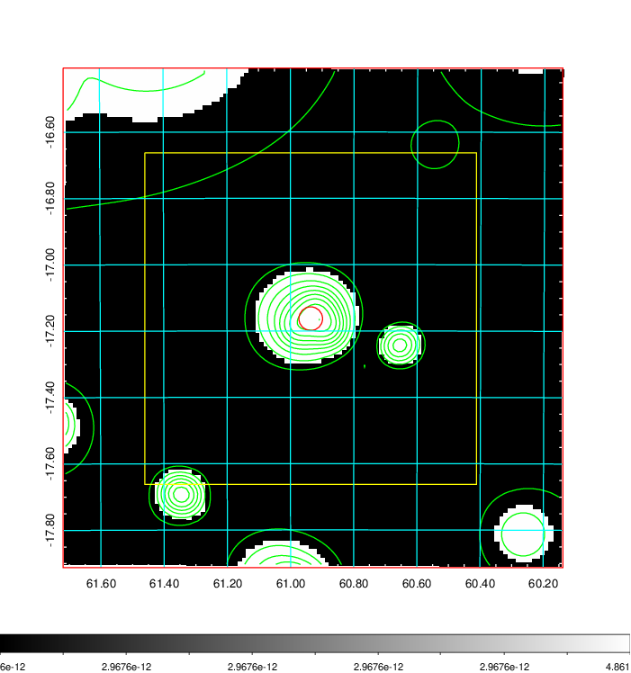  |

|[Exposure image](../image/162/162_mex.pdf)| [nH image](../image/162/162_nh.pdf)| [Planck image](../image/162/162_p.pdf)|
|-------------------|--------------------|-------------------|
|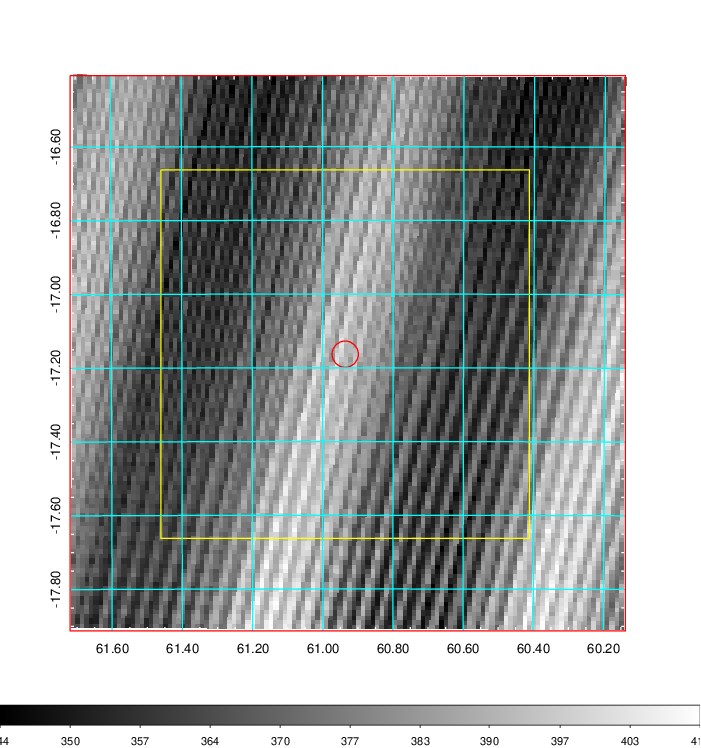   | 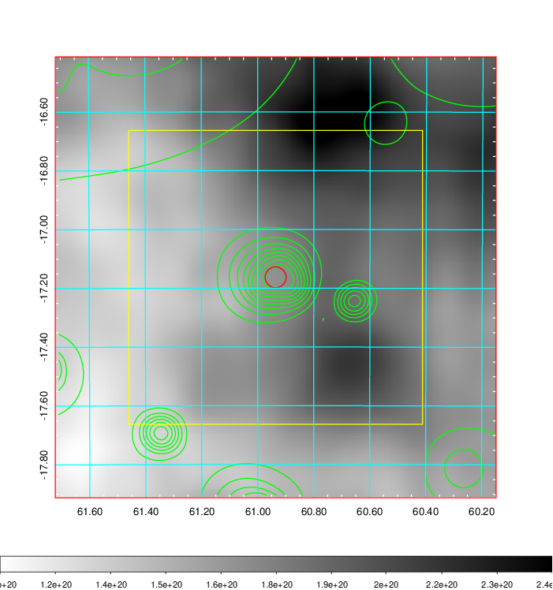    | 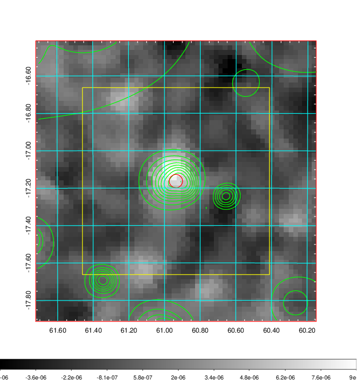 |

|[Redshift Histogram](../image/162/162_zg.pdf) | [DSS image(z1)](../image/162/162_dss_z1.pdf)      |  [DSS image(z2)](../image/162/162_dss_z2.pdf)    |
|-------------------|--------------------|-------------------|
|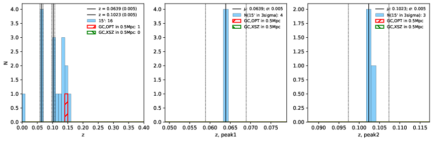 |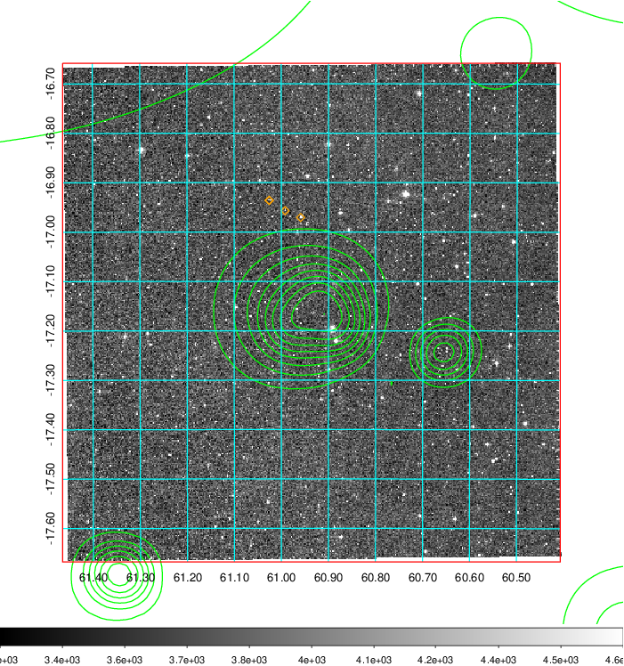  Blue circle for optical clusters;  Magenta circle for XSZ clusters;  all with r=1Mpc;  Only GC with Delta_z<0.01 are shown. | 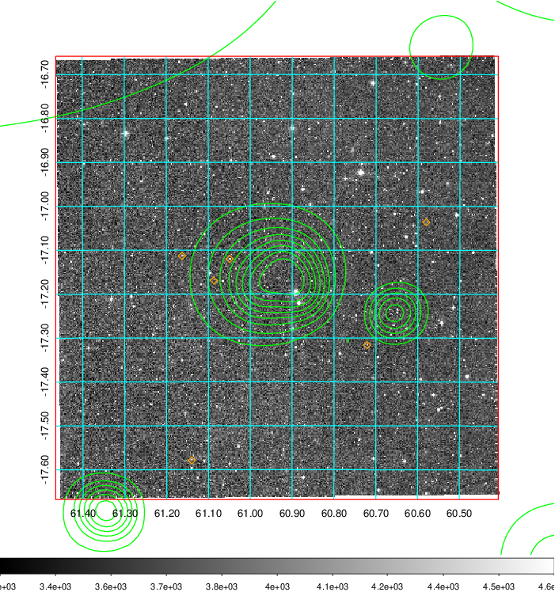 Blue circle for optical clusters;  Magenta circle for XSZ clusters;  all with r=1Mpc;  Only GC with Delta_z<0.01 are shown.  |

|[Previous-identified clusters](../image/162/162_gc.pdf) | [2MASS image](../image/162/162_2mass.pdf)      |
|-------------------|-------------------|
|  Green, magenta, and blue circles  for optical, X-ray and SZ clusters  respectively, with redshift of clusters  labelled. The radius of circles  are 1Mpc.|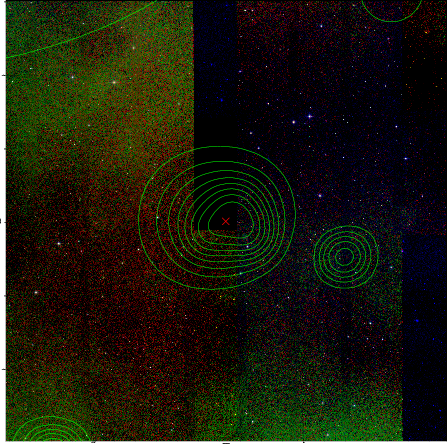  |

|[DES image](../image/162/162_des.pdf)   |[PS1 image](../image/162/162_ps1.pdf)            |
|-------------------|-------------------|
| 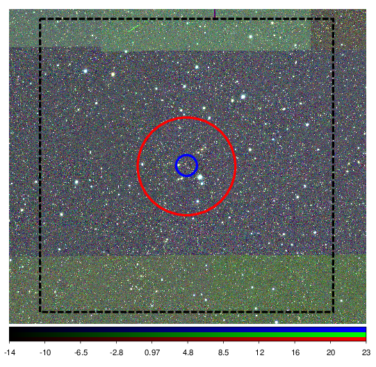  | 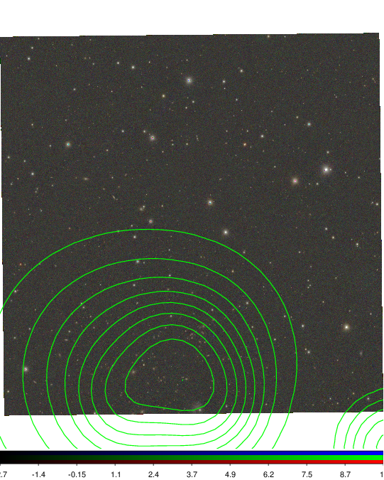  |
