

### 163

|Name|RAJ2000[deg]|DEJ2000[deg] |Ext[arcmin]| Ext,ml | z | z_src| C|GC(XSZ,Delta_z<0.01)| GC(OPT,Delta_z<0.01)|GC| R_sig[arcmin] | R500[arcmin] | R500[Mpc]| CRsig[c/s] | CR500[c/s] |L500[1E44 erg/s]|F500[1E-12 erg/s/cm^2]| M500[1E14 Msun]|Tx[keV]|Cnt_sig|Beta|Rc[arcmin]|Comment|Alias|
|---|---|---|---|---|---|------|---|--------|---------|----------|---|---|---|---|---|---|---|---|---|---|---|---|---|---|
|163| 62.082| -30.918| 6.17| 406.18| 0.0617(0.005)| z1, z_xsz| B| MCXC, PSZ2, Tar| A, N, W| A, MCXC, N, PSZ2, Tar, W| 14.650| 11.888| 0.849| 0.416(0.036)| 0.404(0.035)| 0.724(0.037)| 7.909(0.407)| 1.84(0.05)| 3.18(0.05)| 257.4| 0.957(-0.061+0.032)| 10.461(-0.648+0.507)| -| k545|

|[RASS image](../image/163/163_img.pdf)|[filtered image](../image/163/163_fil.pdf)|[Segment image](../image/163/163_seg.pdf)|
|-------------------|--------------------|-------------------|
| 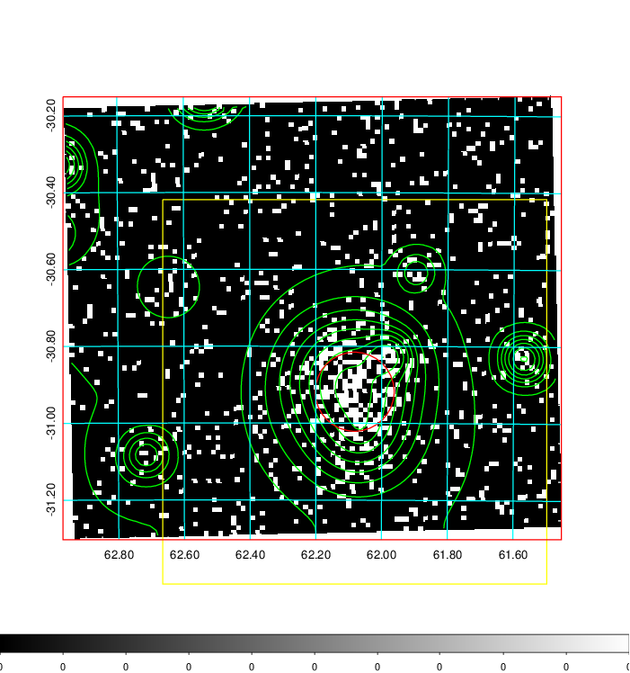  | 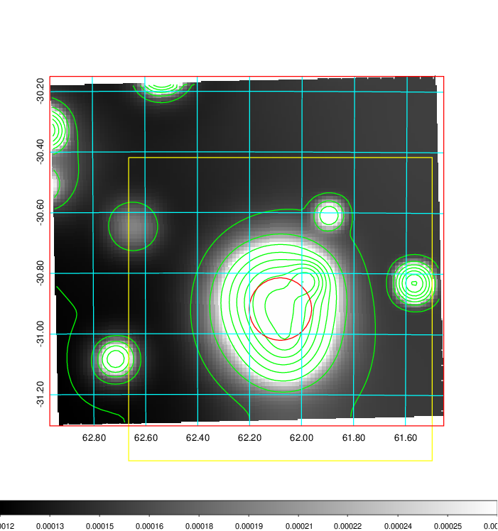   | 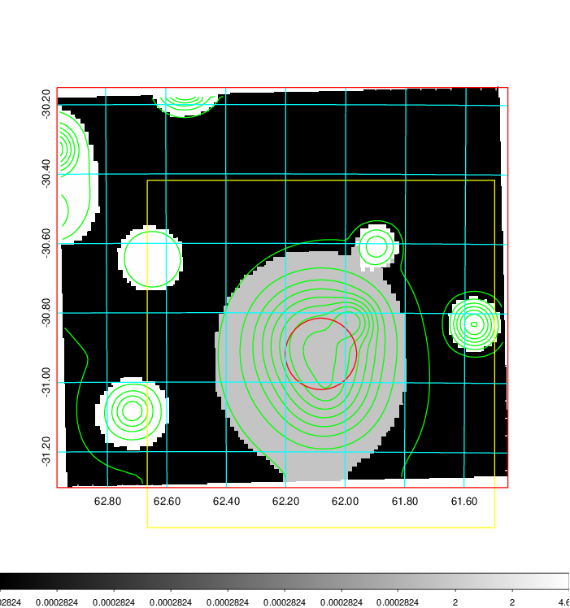  |

|[Exposure image](../image/163/163_mex.pdf)| [nH image](../image/163/163_nh.pdf)| [Planck image](../image/163/163_p.pdf)|
|-------------------|--------------------|-------------------|
|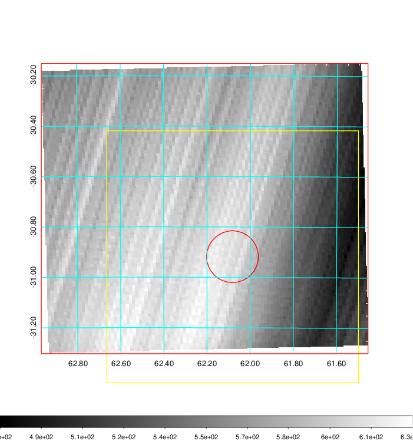   | 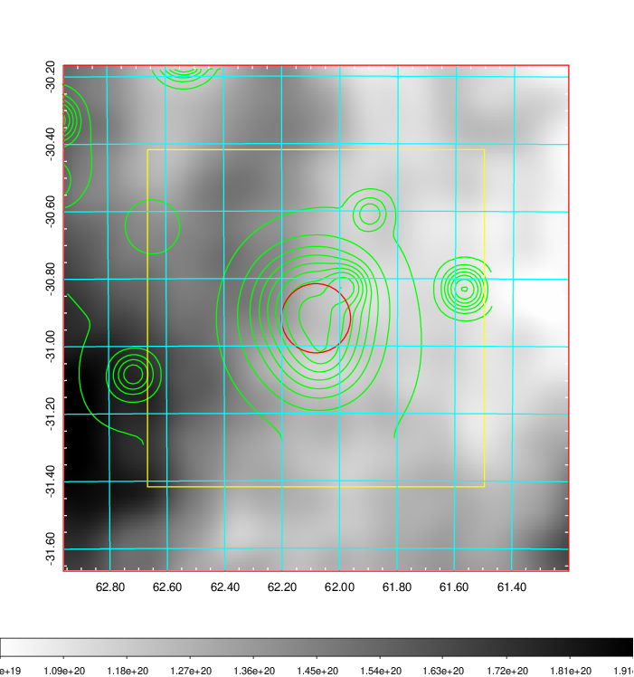    | 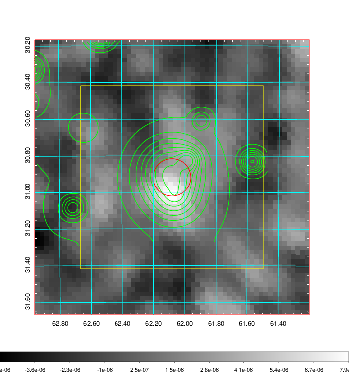 |

|[Redshift Histogram](../image/163/163_zg.pdf) | [DSS image(z1)](../image/163/163_dss_z1.pdf)      |  [DSS image(z2)](../image/163/163_dss_z2.pdf)    |
|-------------------|--------------------|-------------------|
|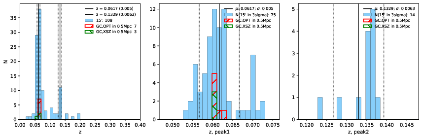 |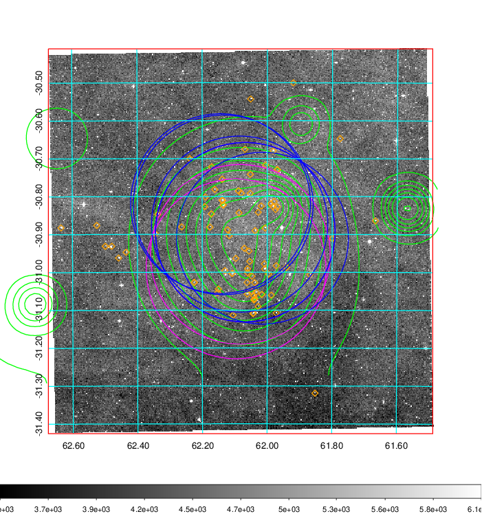  Blue circle for optical clusters;  Magenta circle for XSZ clusters;  all with r=1Mpc;  Only GC with Delta_z<0.01 are shown. | 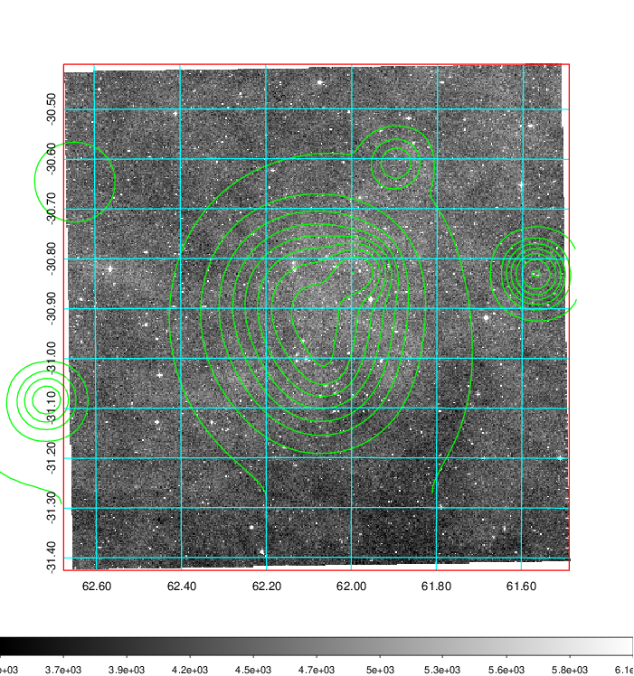 Blue circle for optical clusters;  Magenta circle for XSZ clusters;  all with r=1Mpc;  Only GC with Delta_z<0.01 are shown.  |

|[Previous-identified clusters](../image/163/163_gc.pdf) | [2MASS image](../image/163/163_2mass.pdf)      |
|-------------------|-------------------|
|  Green, magenta, and blue circles  for optical, X-ray and SZ clusters  respectively, with redshift of clusters  labelled. The radius of circles  are 1Mpc.|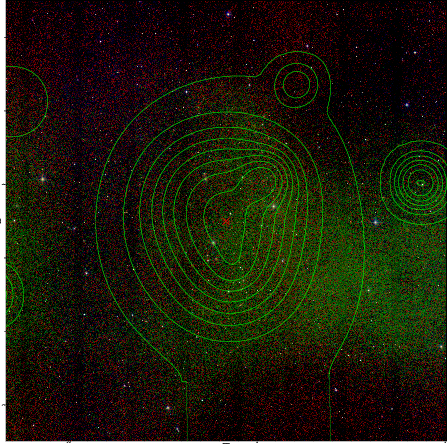  |

|[DES image](../image/163/163_des.pdf)   |[PS1 image](../image/163/163_ps1.pdf)            |
|-------------------|-------------------|
| 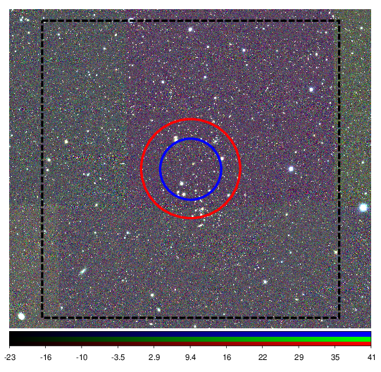  | 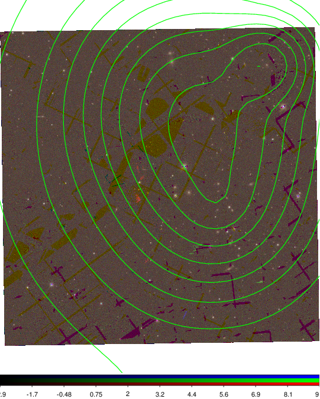  |
