

### 165

|Name|RAJ2000[deg]|DEJ2000[deg] |Ext[arcmin]| Ext,ml | z | z_src| C|GC(XSZ,Delta_z<0.01)| GC(OPT,Delta_z<0.01)|GC| R_sig[arcmin] | R500[arcmin] | R500[Mpc]| CRsig[c/s] | CR500[c/s] |L500[1E44 erg/s]|F500[1E-12 erg/s/cm^2]| M500[1E14 Msun]|Tx[keV]|Cnt_sig|Beta|Rc[arcmin]|Comment|Alias|
|---|---|---|---|---|---|------|---|--------|---------|----------|---|---|---|---|---|---|---|---|---|---|---|---|---|---|
|165| 63.354| 10.464| 1.09| 202.05| 0.0856(0.006)| z1, z_xsz| B| MCXC, PSZ2, Tar, XB| A, N, W| A, MCXC, N, PSZ2, Tar, W, XB| 11.238| 14.035| 1.352| 1.437(0.077)| 1.499(0.080)| 4.751(0.067)| 26.078(0.368)| 7.62(0.05)| 7.70(0.03)| 391.5| 0.755(-0.063+0.082)| 2.338(-0.391+0.447)| -| k041|

|[RASS image](../image/165/165_img.pdf)|[filtered image](../image/165/165_fil.pdf)|[Segment image](../image/165/165_seg.pdf)|
|-------------------|--------------------|-------------------|
| 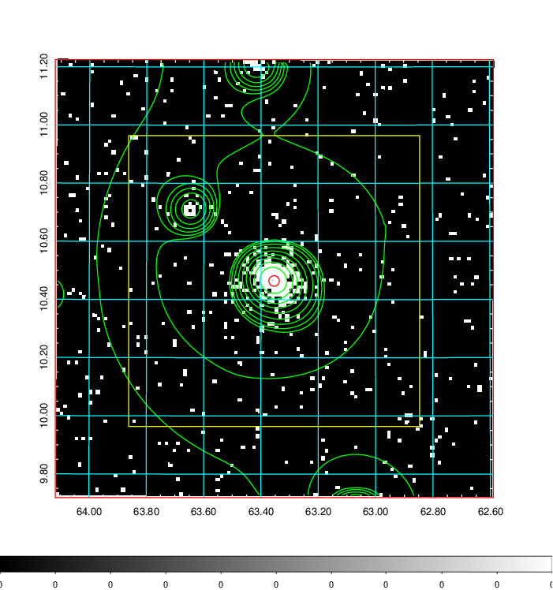  | 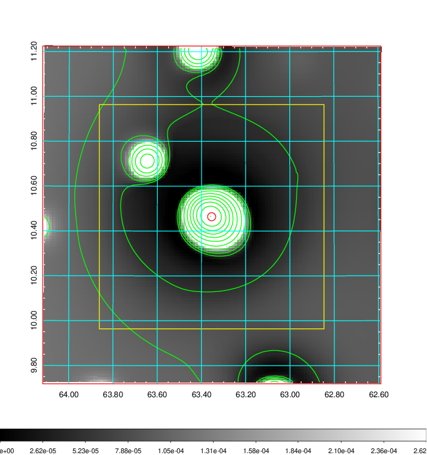   | 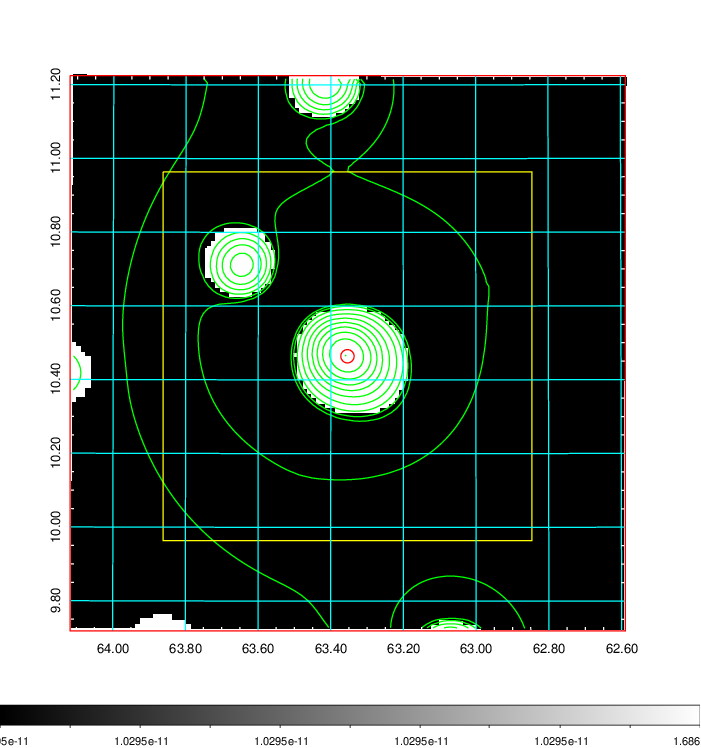  |

|[Exposure image](../image/165/165_mex.pdf)| [nH image](../image/165/165_nh.pdf)| [Planck image](../image/165/165_p.pdf)|
|-------------------|--------------------|-------------------|
|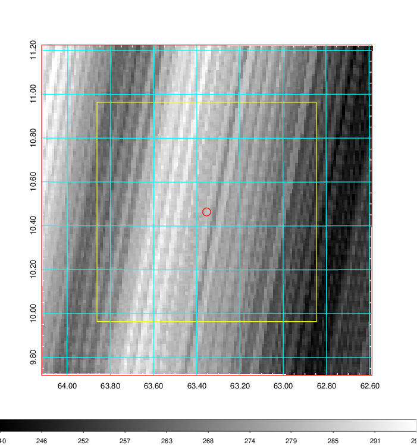   | 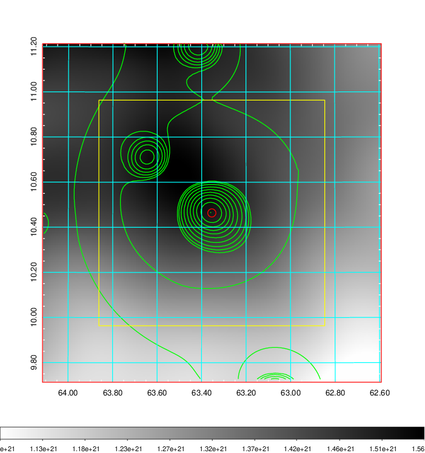    | 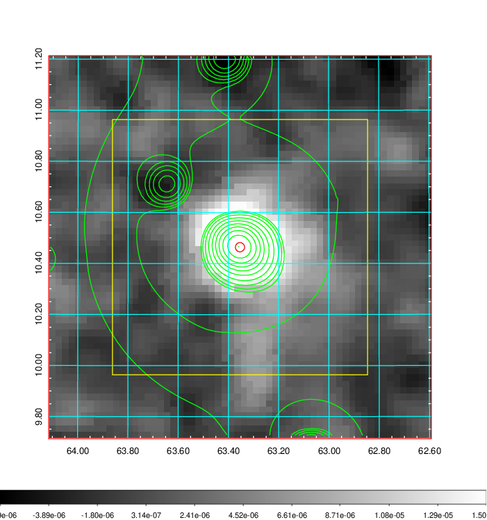 |

|[Redshift Histogram](../image/165/165_zg.pdf) | [DSS image(z1)](../image/165/165_dss_z1.pdf)      |  [DSS image(z2)](../image/165/165_dss_z2.pdf)    |
|-------------------|--------------------|-------------------|
|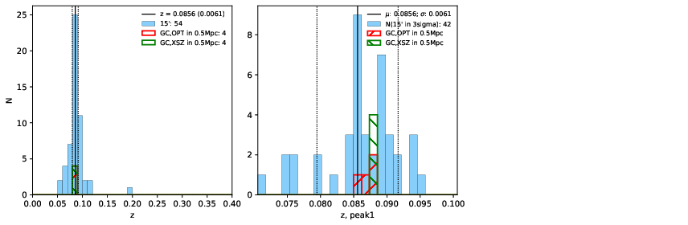 |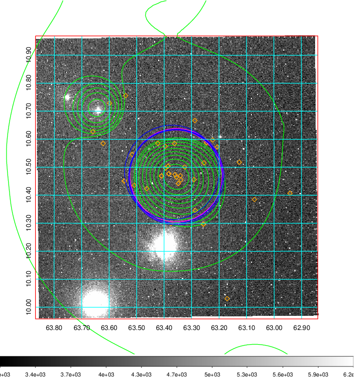  Blue circle for optical clusters;  Magenta circle for XSZ clusters;  all with r=1Mpc;  Only GC with Delta_z<0.01 are shown. | 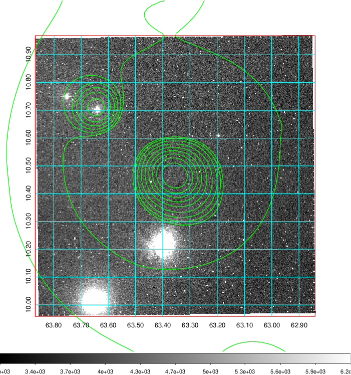 Blue circle for optical clusters;  Magenta circle for XSZ clusters;  all with r=1Mpc;  Only GC with Delta_z<0.01 are shown.  |

|[Previous-identified clusters](../image/165/165_gc.pdf) | [2MASS image](../image/165/165_2mass.pdf)      |
|-------------------|-------------------|
|  Green, magenta, and blue circles  for optical, X-ray and SZ clusters  respectively, with redshift of clusters  labelled. The radius of circles  are 1Mpc.|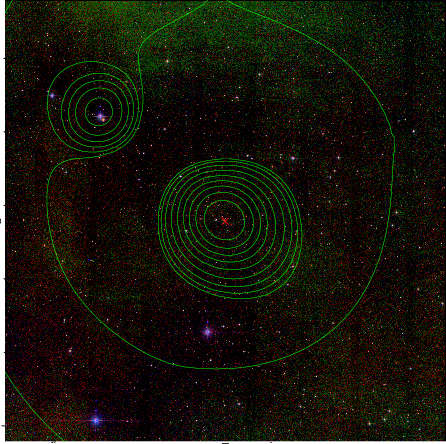  |

|[PS1 image](../image/165/165_ps1.pdf)            |
|-------------------|
| 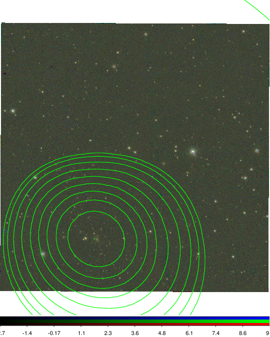  |
