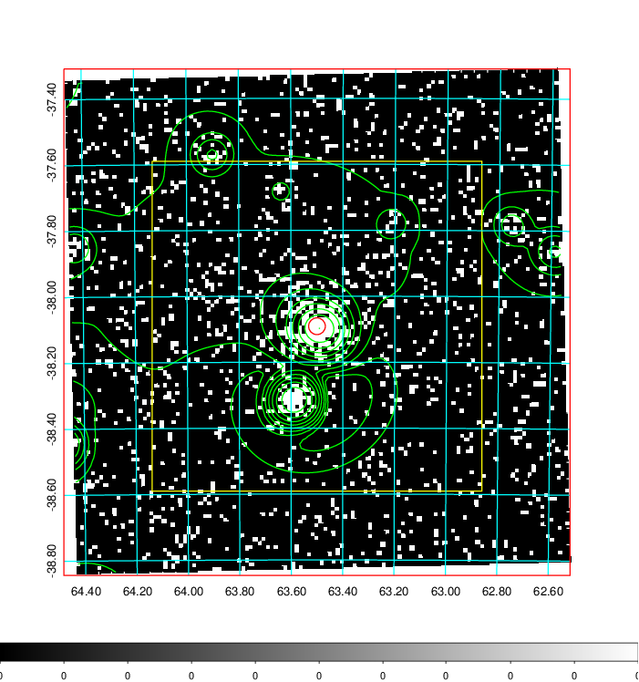
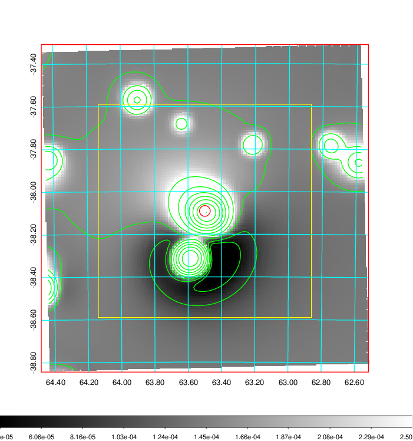
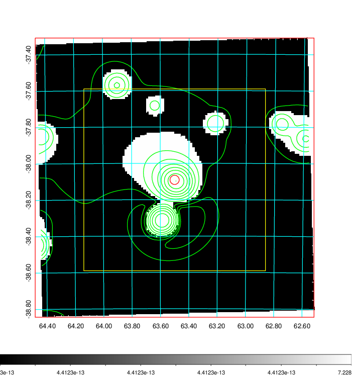
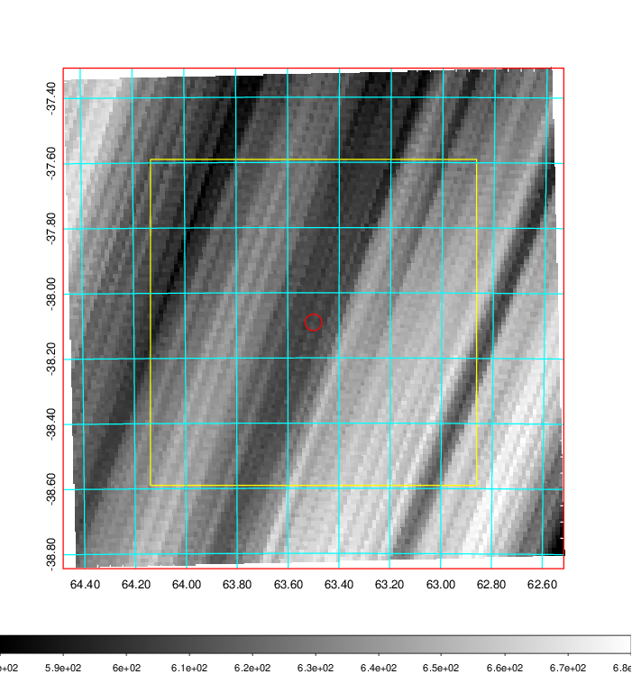
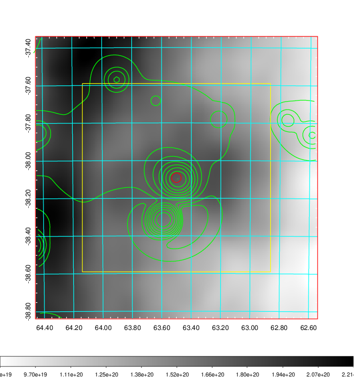
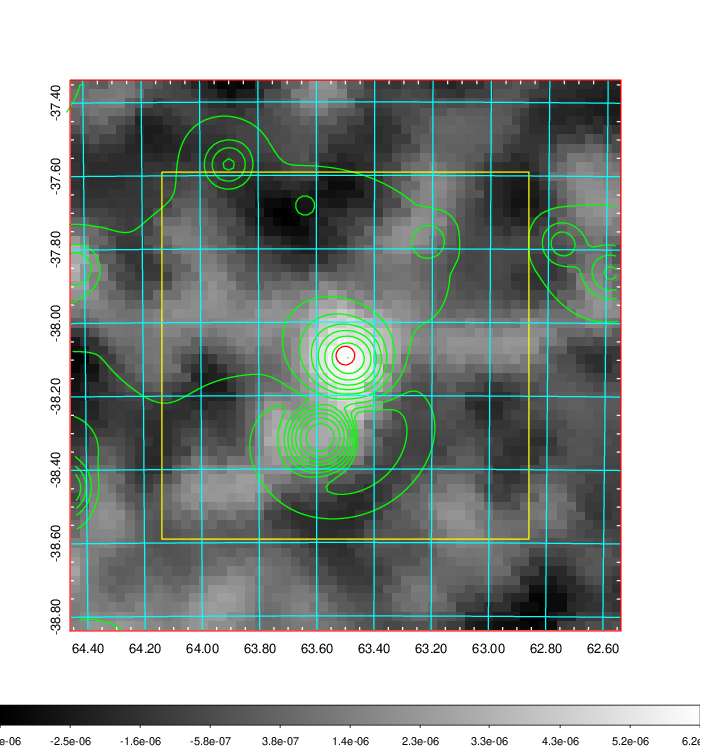
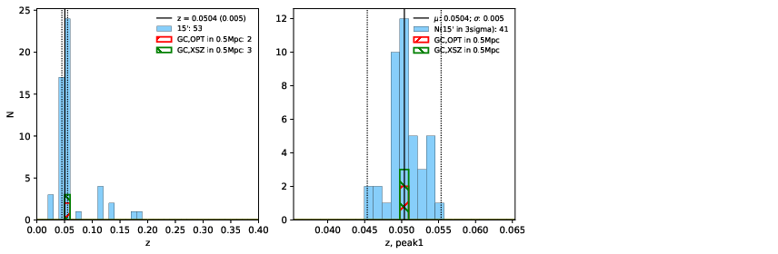
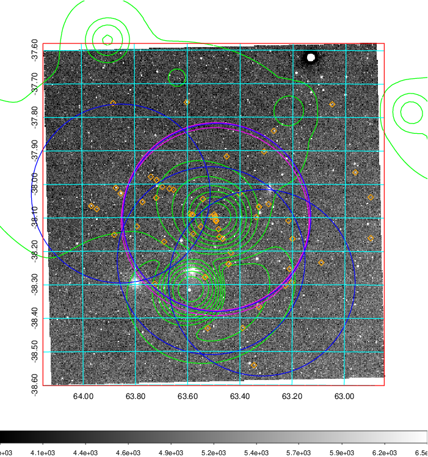
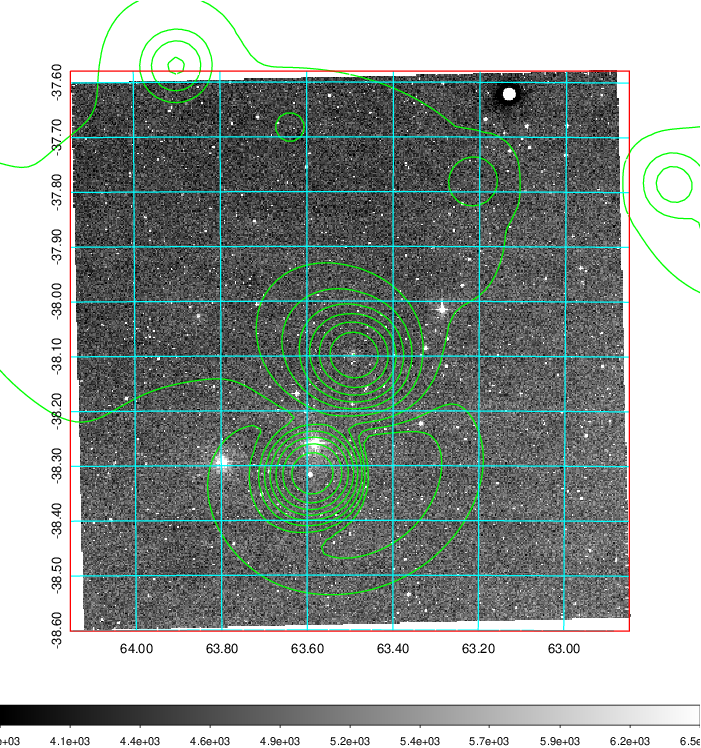
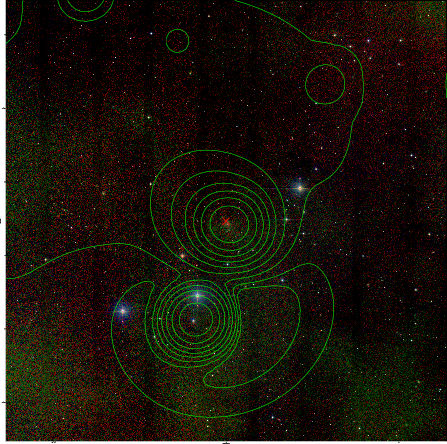

### 166

|Name|RAJ2000[deg]|DEJ2000[deg] |Ext[arcmin]| Ext,ml | z | z_src| C|GC(XSZ,Delta_z<0.01)| GC(OPT,Delta_z<0.01)|GC| R_sig[arcmin] | R500[arcmin] | R500[Mpc]| CRsig[c/s] | CR500[c/s] |L500[1E44 erg/s]|F500[1E-12 erg/s/cm^2]| M500[1E14 Msun]|Tx[keV]|Cnt_sig|Beta|Rc[arcmin]|Comment|Alias|
|---|---|---|---|---|---|------|---|--------|---------|----------|---|---|---|---|---|---|---|---|---|---|---|---|---|---|
|166| 63.500| -38.091| 1.52| 183.60| 0.0504(0.005)| z1, z_xsz| B| MCXC, PSZ2, Tar| N| MCXC, N, PSZ2, Tar| 21.738| 14.499| 0.857| 0.660(0.054)| 0.626(0.051)| 0.712(0.034)| 11.840(0.571)| 1.88(0.05)| 3.21(0.05)| 489.2| 0.619(-0.022+0.025)| 2.174(-0.238+0.258)| -| k120|

|[RASS image](../image/166/166_img.pdf)|[filtered image](../image/166/166_fil.pdf)|[Segment image](../image/166/166_seg.pdf)|
|-------------------|--------------------|-------------------|
|   |    |   |

|[Exposure image](../image/166/166_mex.pdf)| [nH image](../image/166/166_nh.pdf)| [Planck image](../image/166/166_p.pdf)|
|-------------------|--------------------|-------------------|
|   |     |  |

|[Redshift Histogram](../image/166/166_zg.pdf) | [DSS image(z1)](../image/166/166_dss_z1.pdf)      |  [DSS image(z2)](../image/166/166_dss_z2.pdf)    |
|-------------------|--------------------|-------------------|
| |  Blue circle for optical clusters;  Magenta circle for XSZ clusters;  all with r=1Mpc;  Only GC with Delta_z<0.01 are shown. |  Blue circle for optical clusters;  Magenta circle for XSZ clusters;  all with r=1Mpc;  Only GC with Delta_z<0.01 are shown.  |

|[known Abell/XSZ clusters](../image/166/166_gc.pdf) | [2MASS image](../image/166/166_2mass.pdf)      |
|-------------------|-------------------|
|  Magenta, blue and green circles  for optical, X-ray and SZ clusters  respectively, with redshift of clusters  labelled. The radius of circles  are 1Mpc.|  |

|[DES image](../image/166/166_des.pdf)   |
|-------------------|
|   |
