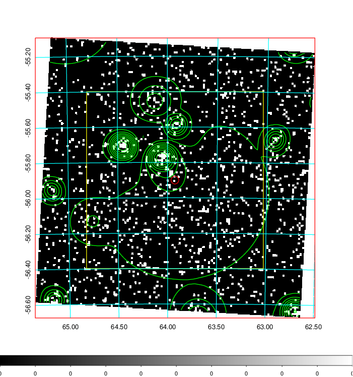
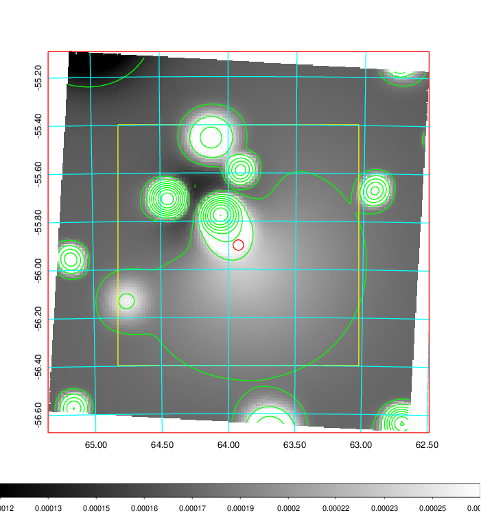
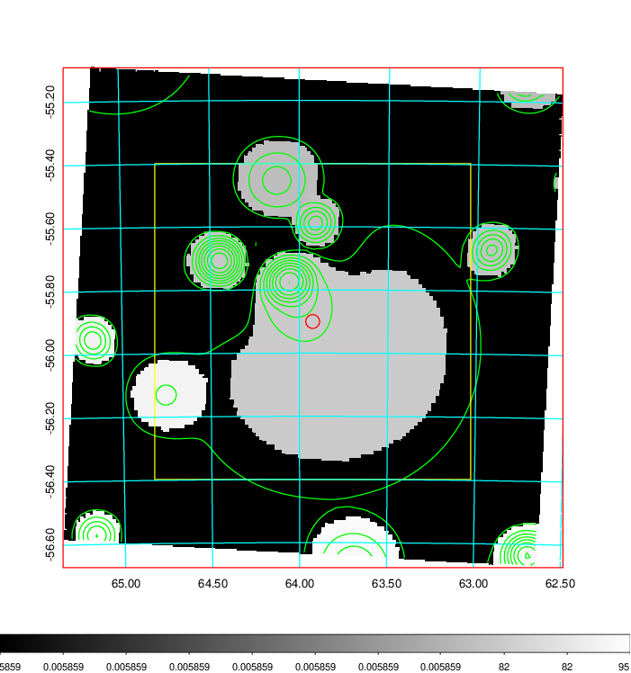
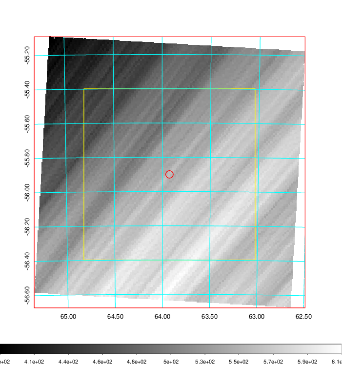
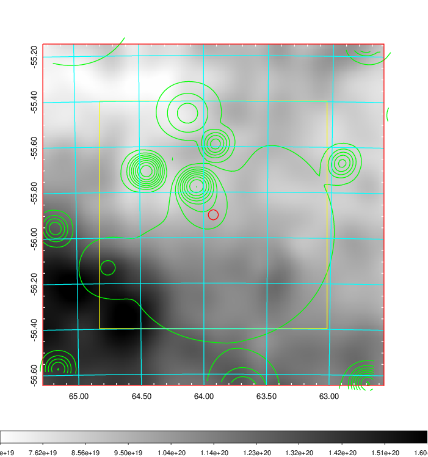
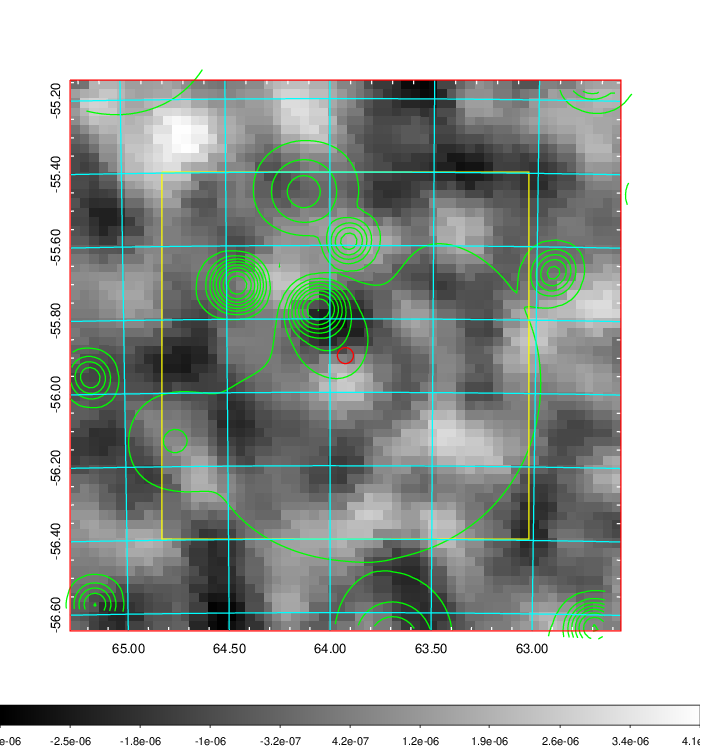
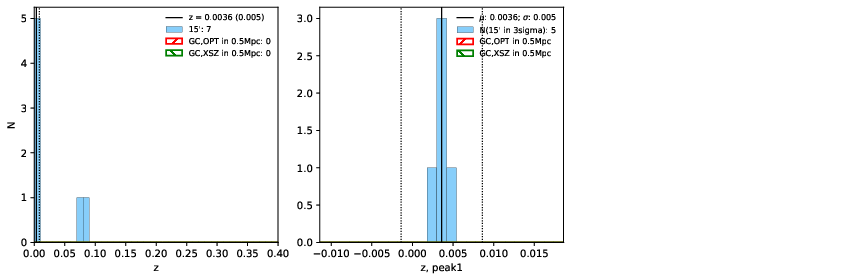
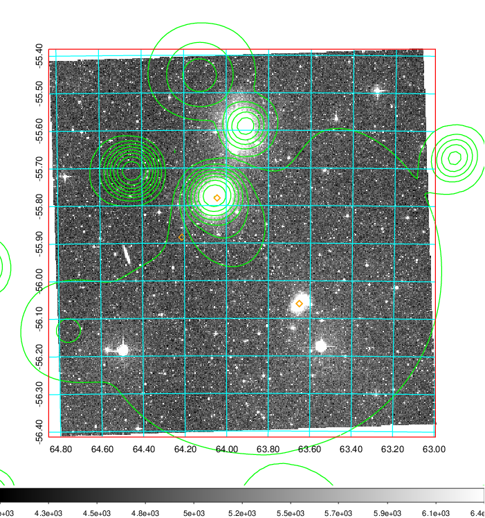
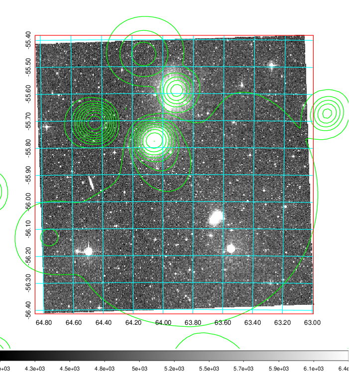
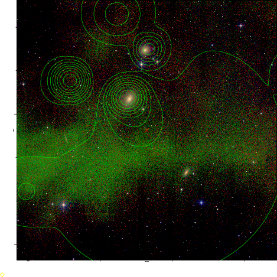

### 167

|Name|RAJ2000[deg]|DEJ2000[deg] |Ext[arcmin]| Ext,ml | z | z_src| C|GC(XSZ,Delta_z<0.01)| GC(OPT,Delta_z<0.01)|GC| R_sig[arcmin] | R500[arcmin] | R500[Mpc]| CRsig[c/s] | CR500[c/s] |L500[1E44 erg/s]|F500[1E-12 erg/s/cm^2]| M500[1E14 Msun]|Tx[keV]|Cnt_sig|Beta|Rc[arcmin]|Comment|Alias|
|---|---|---|---|---|---|------|---|--------|---------|----------|---|---|---|---|---|---|---|---|---|---|---|---|---|---|
|167| 63.925| -55.900| 1.31| 69.70| 0.0036(0.005)| z1,| G| -| -| N| 33.725| 64.015| 0.286| 0.307(0.068)| 0.336(0.079)| 0.002(0.000)| 6.091(1.330)| 0.07(0.01)| 0.40(0.03)| 247.2| 0.503(-0.003+0.006)| 6.760(-0.200+0.302)| An XSZ cluster with $z$ = 0.3650 and offset = 0.14 Mpc (30 arcmin)| t018|

|[RASS image](../image/167/167_img.pdf)|[filtered image](../image/167/167_fil.pdf)|[Segment image](../image/167/167_seg.pdf)|
|-------------------|--------------------|-------------------|
|   |    |   |

|[Exposure image](../image/167/167_mex.pdf)| [nH image](../image/167/167_nh.pdf)| [Planck image](../image/167/167_p.pdf)|
|-------------------|--------------------|-------------------|
|   |     |  |

|[Redshift Histogram](../image/167/167_zg.pdf) | [DSS image(z1)](../image/167/167_dss_z1.pdf)      |  [DSS image(z2)](../image/167/167_dss_z2.pdf)    |
|-------------------|--------------------|-------------------|
| |  Blue circle for optical clusters;  Magenta circle for XSZ clusters;  all with r=1Mpc;  Only GC with Delta_z<0.01 are shown. |  Blue circle for optical clusters;  Magenta circle for XSZ clusters;  all with r=1Mpc;  Only GC with Delta_z<0.01 are shown.  |

|[known Abell/XSZ clusters](../image/167/167_gc.pdf) | [2MASS image](../image/167/167_2mass.pdf)      |
|-------------------|-------------------|
|  Magenta, blue and green circles  for optical, X-ray and SZ clusters  respectively, with redshift of clusters  labelled. The radius of circles  are 1Mpc.|  |

|[DES image](../image/167/167_des.pdf)   |
|-------------------|
|   |
