

### 168

|Name|RAJ2000[deg]|DEJ2000[deg] |Ext[arcmin]| Ext,ml | z | z_src| C|GC(XSZ,Delta_z<0.01)| GC(OPT,Delta_z<0.01)|GC| R_sig[arcmin] | R500[arcmin] | R500[Mpc]| CRsig[c/s] | CR500[c/s] |L500[1E44 erg/s]|F500[1E-12 erg/s/cm^2]| M500[1E14 Msun]|Tx[keV]|Cnt_sig|Beta|Rc[arcmin]|Comment|Alias|
|---|---|---|---|---|---|------|---|--------|---------|----------|---|---|---|---|---|---|---|---|---|---|---|---|---|---|
|168| 64.906| 2.403| 3.66| 578.30| 0.0133(0.005)| z1, z_xsz| B| MCXC| N| MCXC, N| 30.205| 39.209| 0.639| 1.748(0.122)| 1.839(0.128)| 0.110(0.004)| 27.724(0.991)| 0.75(0.01)| 1.80(0.02)| 516.6| 0.657(-0.019+0.021)| 4.088(-0.302+0.330)| -| k454|

|[RASS image](../image/168/168_img.pdf)|[filtered image](../image/168/168_fil.pdf)|[Segment image](../image/168/168_seg.pdf)|
|-------------------|--------------------|-------------------|
| 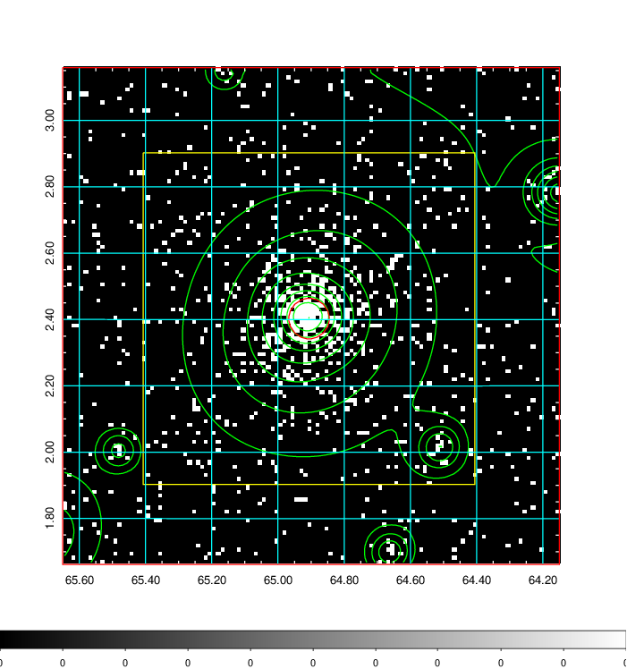  | 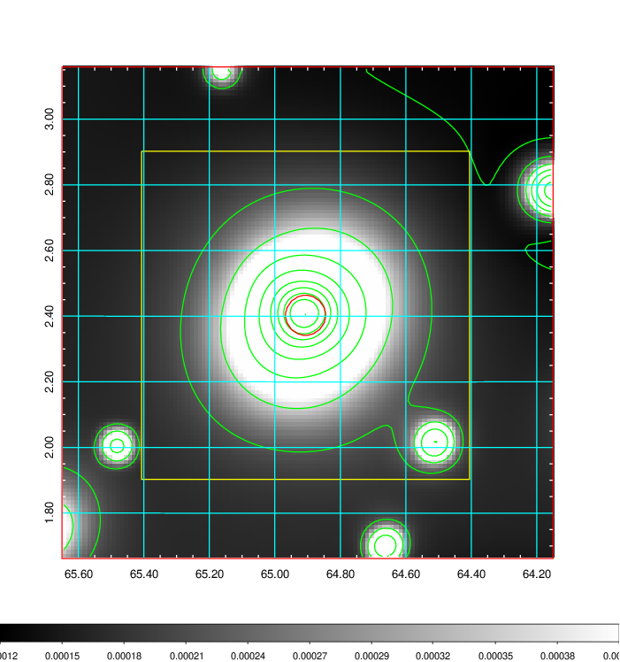   | 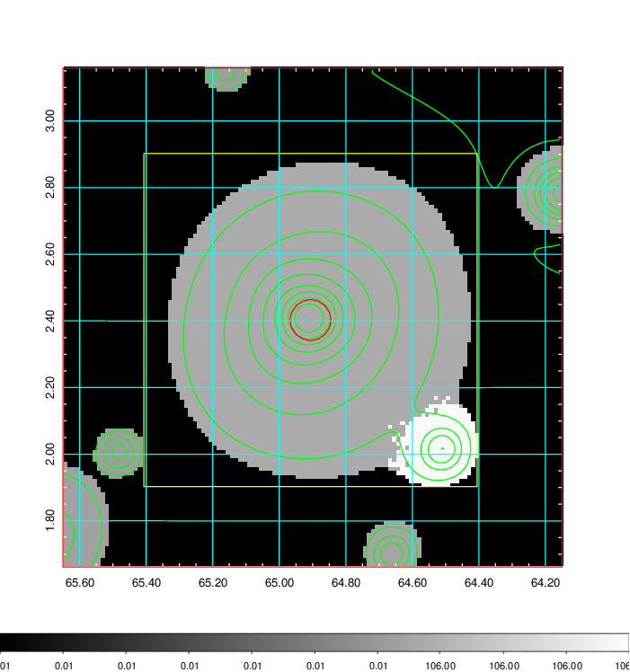  |

|[Exposure image](../image/168/168_mex.pdf)| [nH image](../image/168/168_nh.pdf)| [Planck image](../image/168/168_p.pdf)|
|-------------------|--------------------|-------------------|
|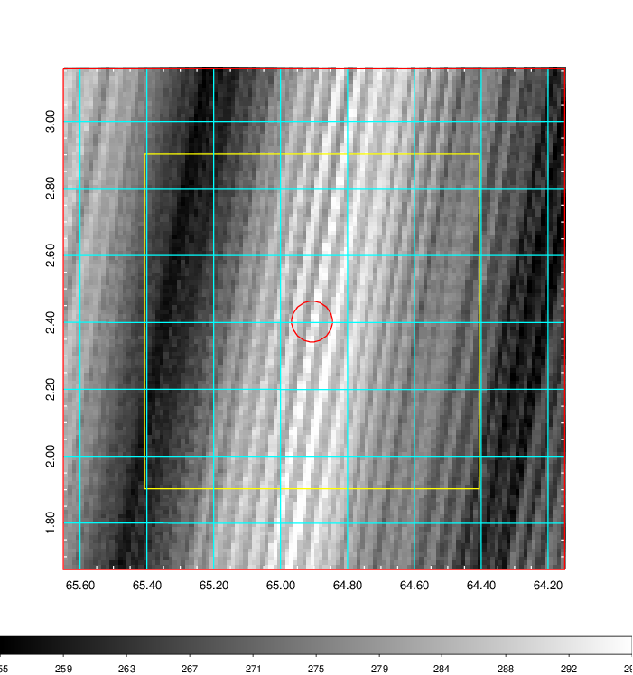   | 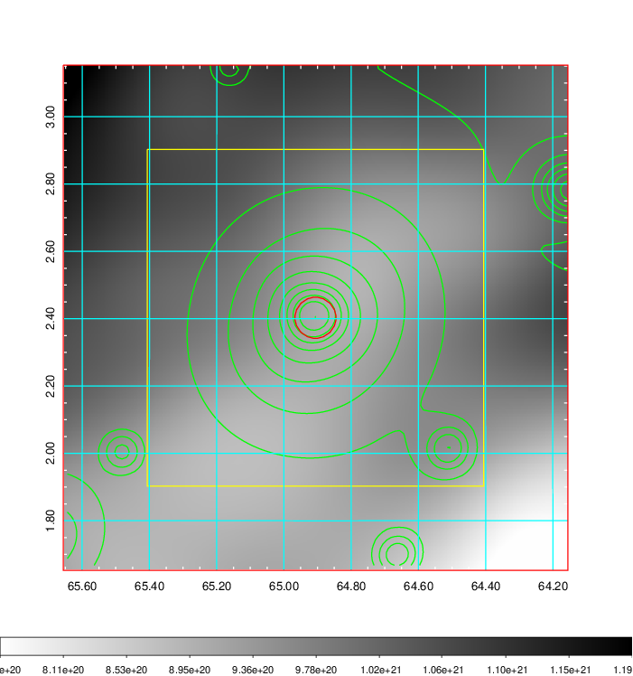    | 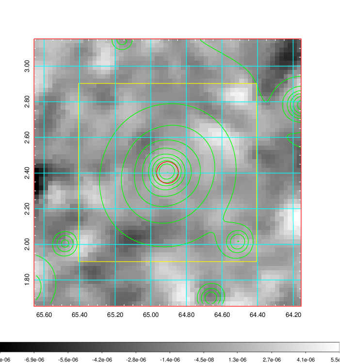 |

|[Redshift Histogram](../image/168/168_zg.pdf) | [DSS image(z1)](../image/168/168_dss_z1.pdf)      |  [DSS image(z2)](../image/168/168_dss_z2.pdf)    |
|-------------------|--------------------|-------------------|
|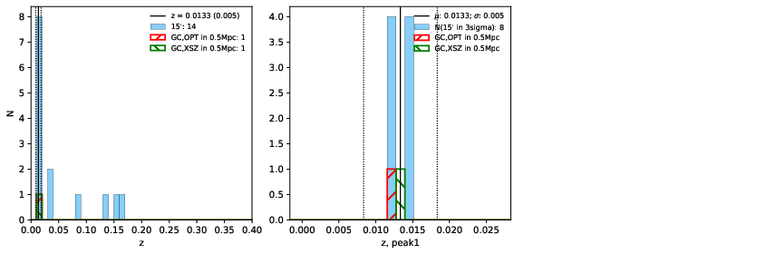 |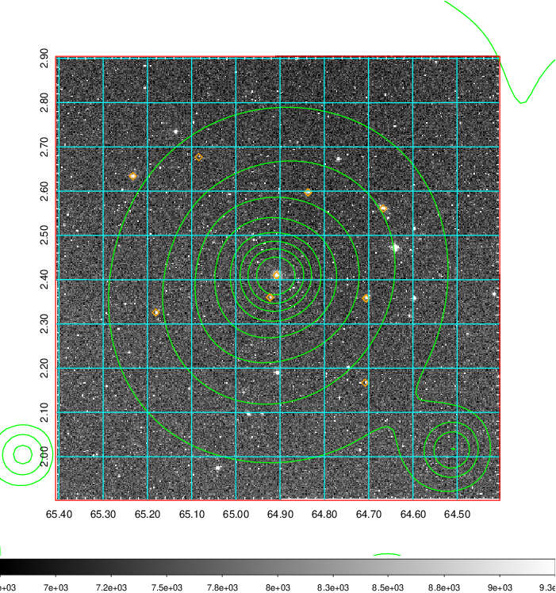  Blue circle for optical clusters;  Magenta circle for XSZ clusters;  all with r=1Mpc;  Only GC with Delta_z<0.01 are shown. | 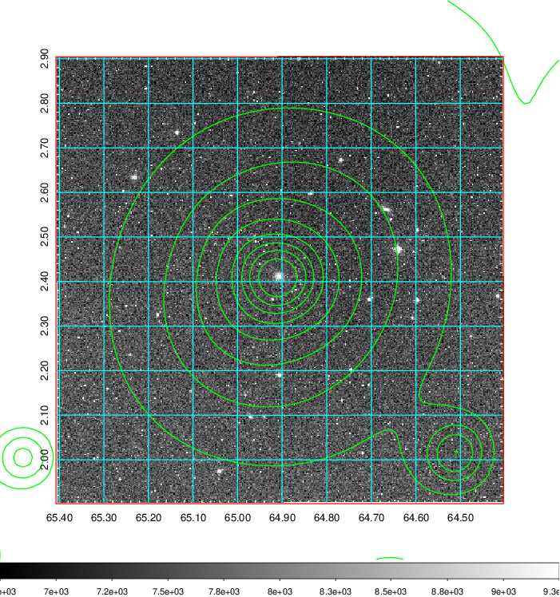 Blue circle for optical clusters;  Magenta circle for XSZ clusters;  all with r=1Mpc;  Only GC with Delta_z<0.01 are shown.  |

|[Previous-identified clusters](../image/168/168_gc.pdf) | [2MASS image](../image/168/168_2mass.pdf)      |
|-------------------|-------------------|
|  Green, magenta, and blue circles  for optical, X-ray and SZ clusters  respectively, with redshift of clusters  labelled. The radius of circles  are 1Mpc.|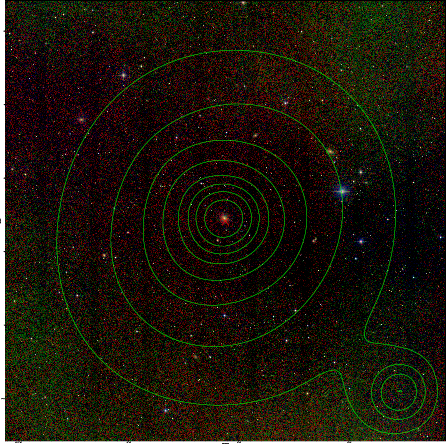  |

|[PS1 image](../image/168/168_ps1.pdf)            |
|-------------------|
| 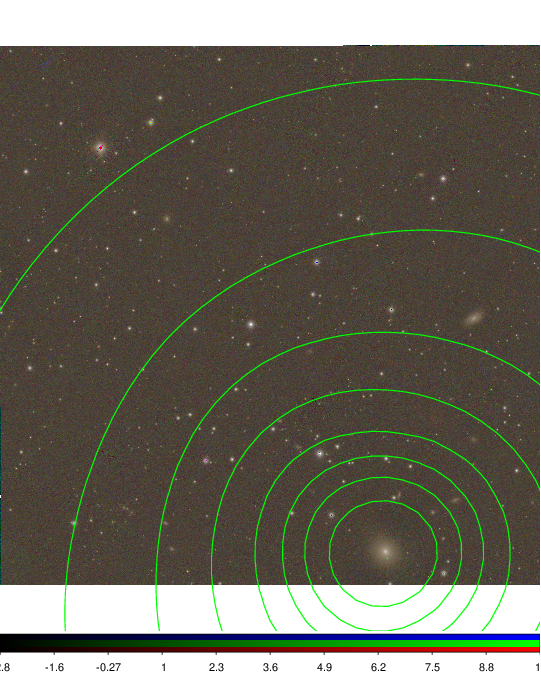  |
