

### 169

|Name|RAJ2000[deg]|DEJ2000[deg] |Ext[arcmin]| Ext,ml | z | z_src| C|GC(XSZ,Delta_z<0.01)| GC(OPT,Delta_z<0.01)|GC| R_sig[arcmin] | R500[arcmin] | R500[Mpc]| CRsig[c/s] | CR500[c/s] |L500[1E44 erg/s]|F500[1E-12 erg/s/cm^2]| M500[1E14 Msun]|Tx[keV]|Cnt_sig|Beta|Rc[arcmin]|Comment|Alias|
|---|---|---|---|---|---|------|---|--------|---------|----------|---|---|---|---|---|---|---|---|---|---|---|---|---|---|
|169| 65.893| 15.668| 1.94| 52.81| 0.0750(0.005)| z1,| G| -| -| -| 23.219| 9.557| 0.816| 0.191(0.043)| 0.174(0.039)| 0.388(0.027)| 2.814(0.197)| 1.66(0.06)| 3.00(0.07)| 147.7| 0.911(-0.091+0.063)| 4.485(-0.615+0.439)| -| t058|

|[RASS image](../image/169/169_img.pdf)|[filtered image](../image/169/169_fil.pdf)|[Segment image](../image/169/169_seg.pdf)|
|-------------------|--------------------|-------------------|
| 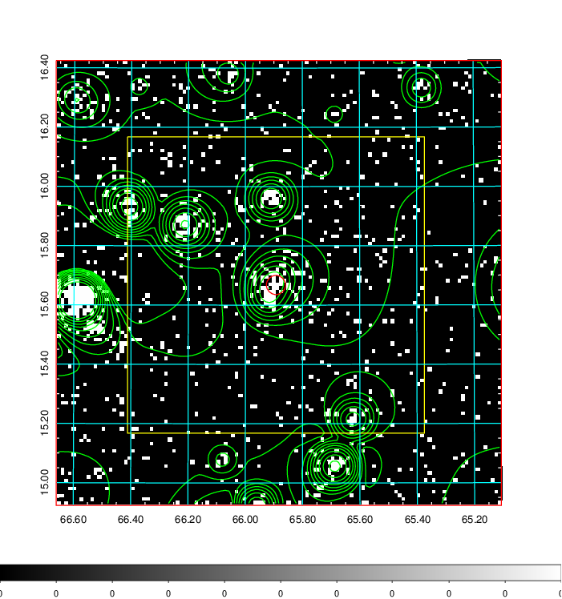  | 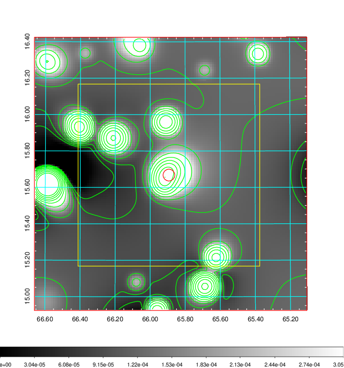   | 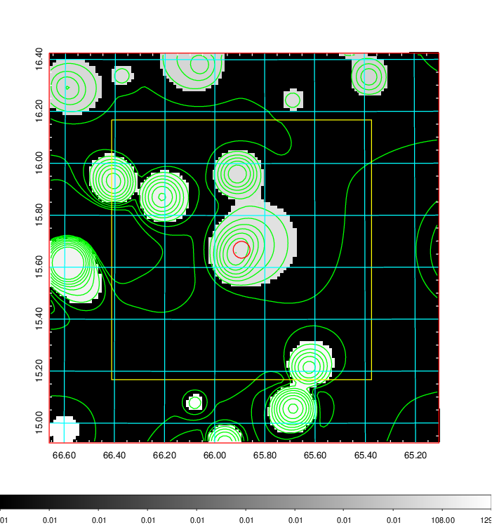  |

|[Exposure image](../image/169/169_mex.pdf)| [nH image](../image/169/169_nh.pdf)| [Planck image](../image/169/169_p.pdf)|
|-------------------|--------------------|-------------------|
|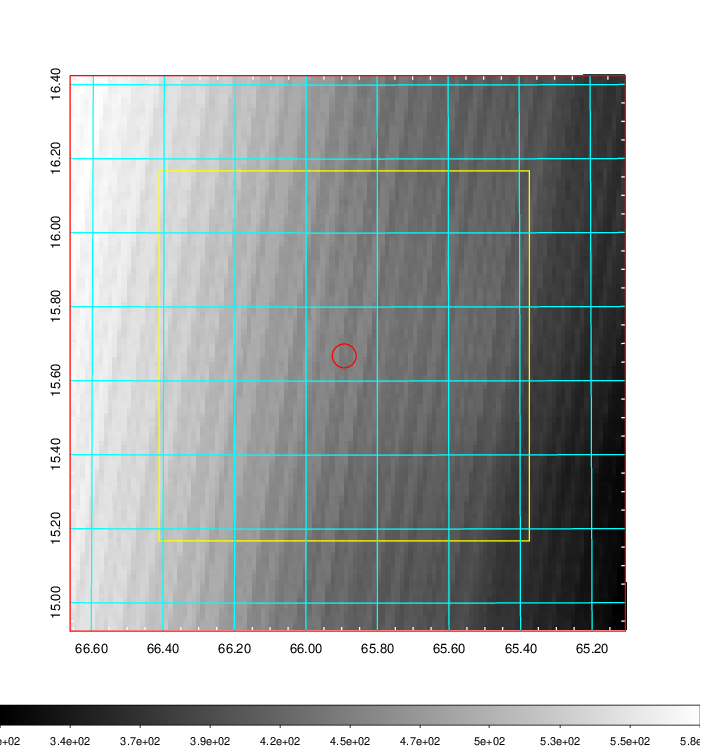   | 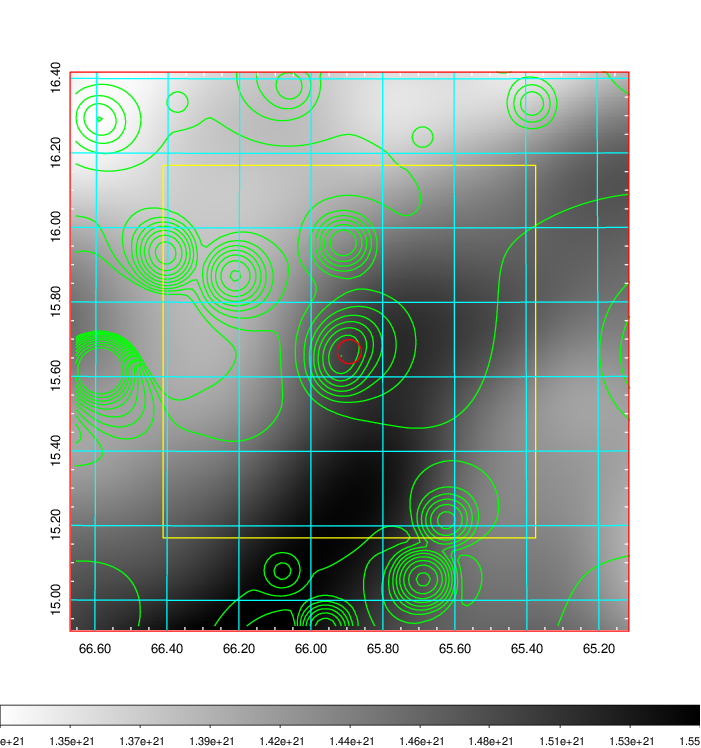    | 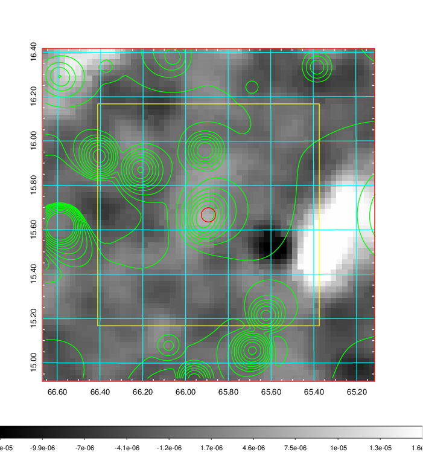 |

|[Redshift Histogram](../image/169/169_zg.pdf) | [DSS image(z1)](../image/169/169_dss_z1.pdf)      |  [DSS image(z2)](../image/169/169_dss_z2.pdf)    |
|-------------------|--------------------|-------------------|
|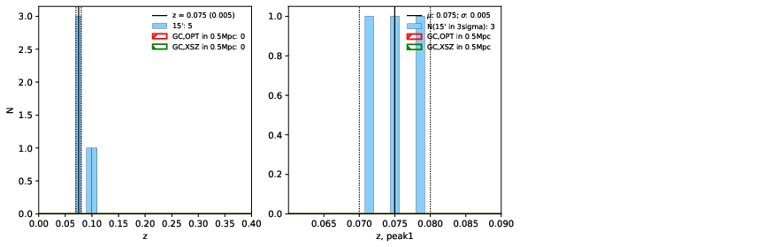 |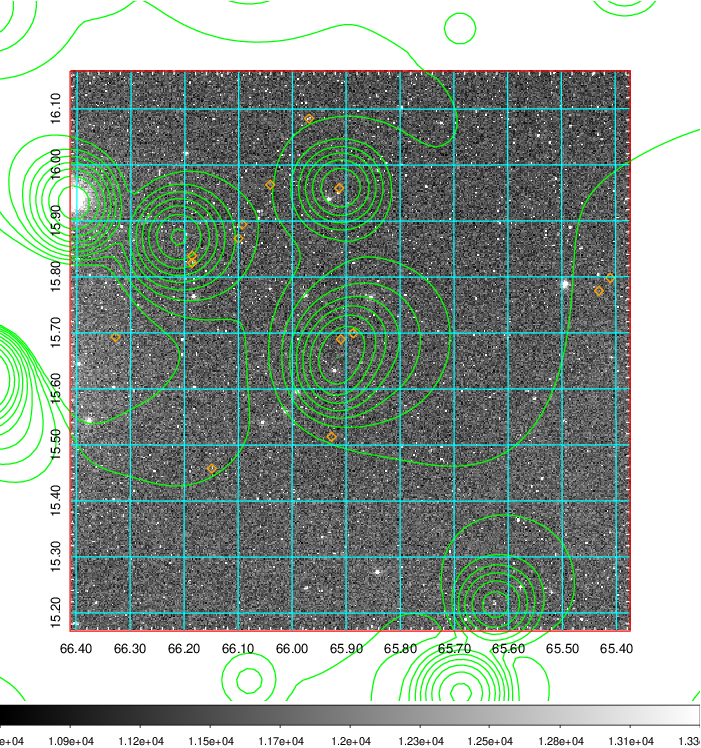  Blue circle for optical clusters;  Magenta circle for XSZ clusters;  all with r=1Mpc;  Only GC with Delta_z<0.01 are shown. | 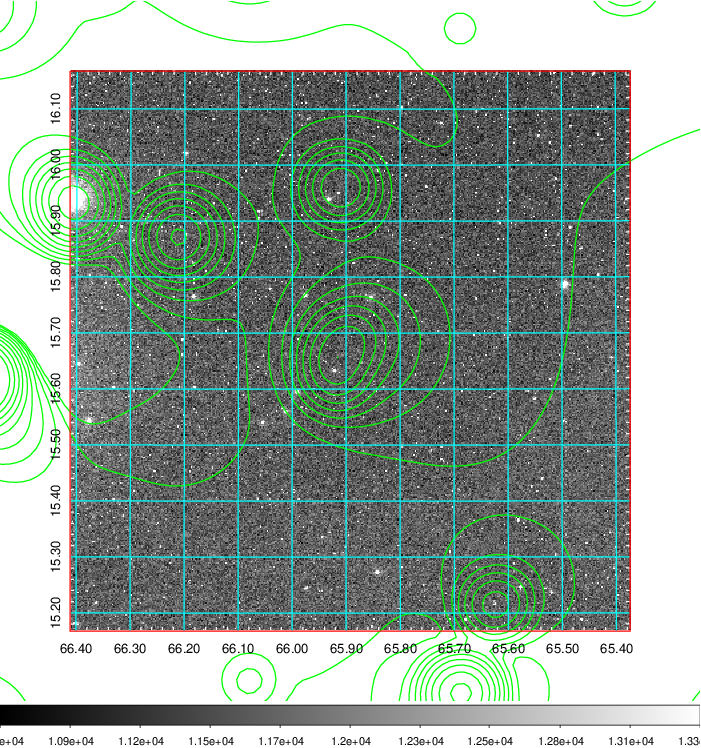 Blue circle for optical clusters;  Magenta circle for XSZ clusters;  all with r=1Mpc;  Only GC with Delta_z<0.01 are shown.  |

|[Previous-identified clusters](../image/169/169_gc.pdf) | [2MASS image](../image/169/169_2mass.pdf)      |
|-------------------|-------------------|
|  Green, magenta, and blue circles  for optical, X-ray and SZ clusters  respectively, with redshift of clusters  labelled. The radius of circles  are 1Mpc.|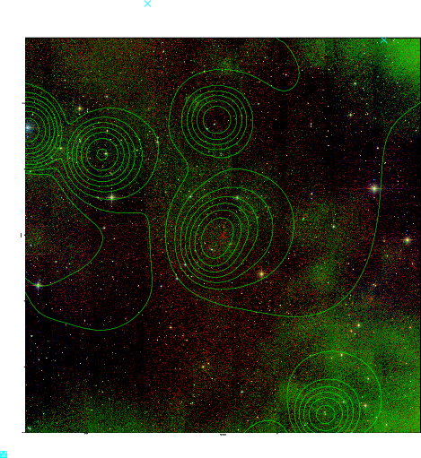  |

|[PS1 image](../image/169/169_ps1.pdf)            |
|-------------------|
| 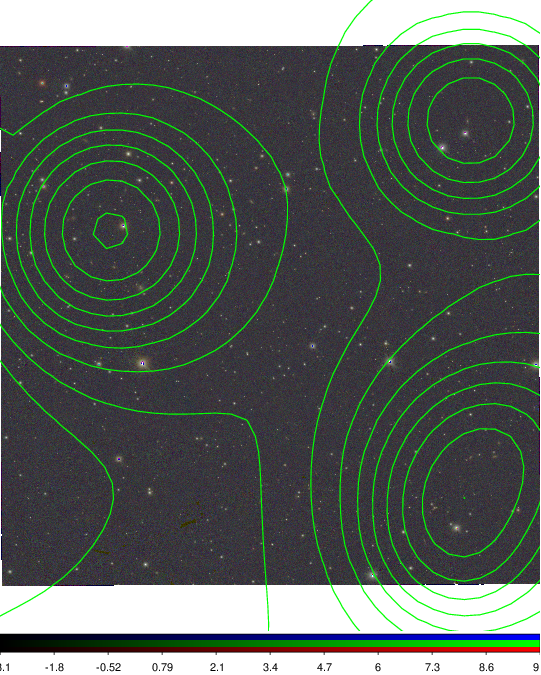  |
