

### 170

|Name|RAJ2000[deg]|DEJ2000[deg] |Ext[arcmin]| Ext,ml | z | z_src| C|GC(XSZ,Delta_z<0.01)| GC(OPT,Delta_z<0.01)|GC| R_sig[arcmin] | R500[arcmin] | R500[Mpc]| CRsig[c/s] | CR500[c/s] |L500[1E44 erg/s]|F500[1E-12 erg/s/cm^2]| M500[1E14 Msun]|Tx[keV]|Cnt_sig|Beta|Rc[arcmin]|Comment|Alias|
|---|---|---|---|---|---|------|---|--------|---------|----------|---|---|---|---|---|---|---|---|---|---|---|---|---|---|
|170| 66.459| -8.563| 1.49| 208.50| 0.0390(0.005)| z1, z_xsz| B| MCXC| N| MCXC, N, W| 11.725| 20.597| 0.955| 1.302(0.081)| 1.488(0.092)| 0.909(0.024)| 25.678(0.690)| 2.57(0.03)| 3.88(0.03)| 321.5| 0.660(-0.048+0.062)| 2.184(-0.387+0.448)| -| k110|

|[RASS image](../image/170/170_img.pdf)|[filtered image](../image/170/170_fil.pdf)|[Segment image](../image/170/170_seg.pdf)|
|-------------------|--------------------|-------------------|
| 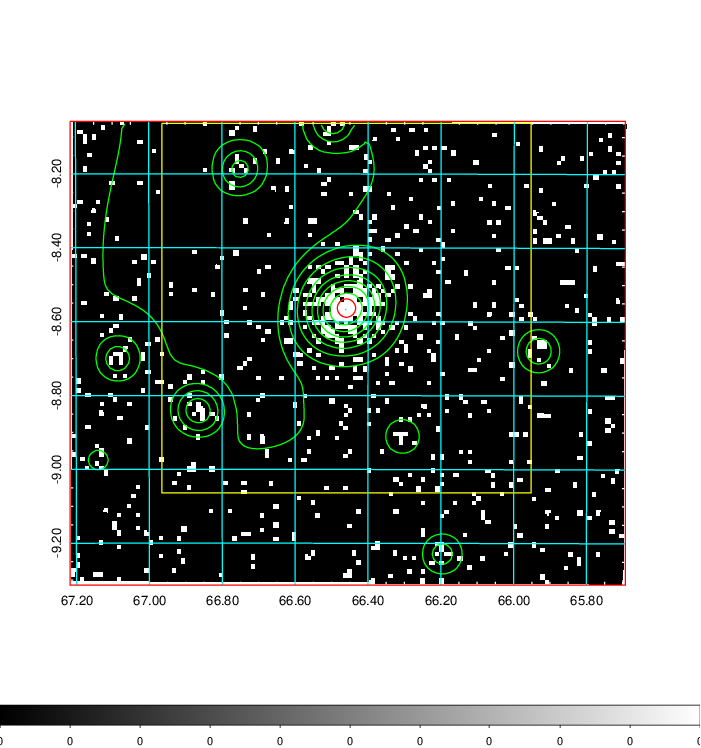  | 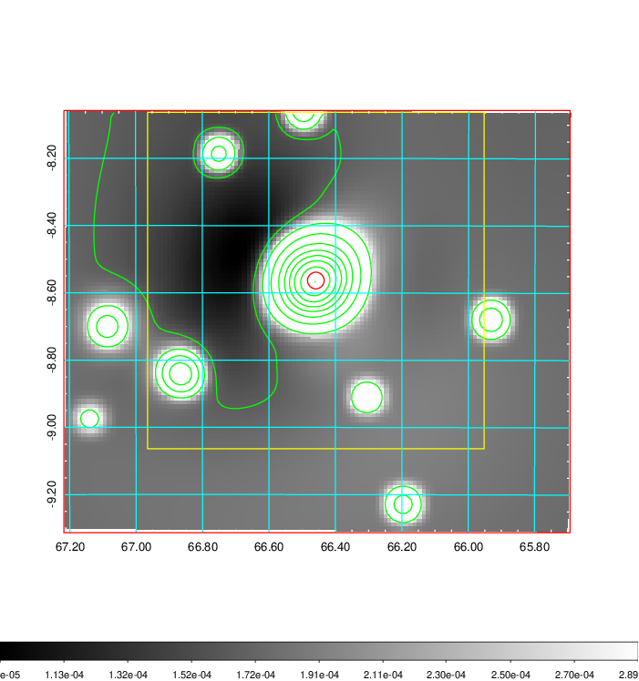   | 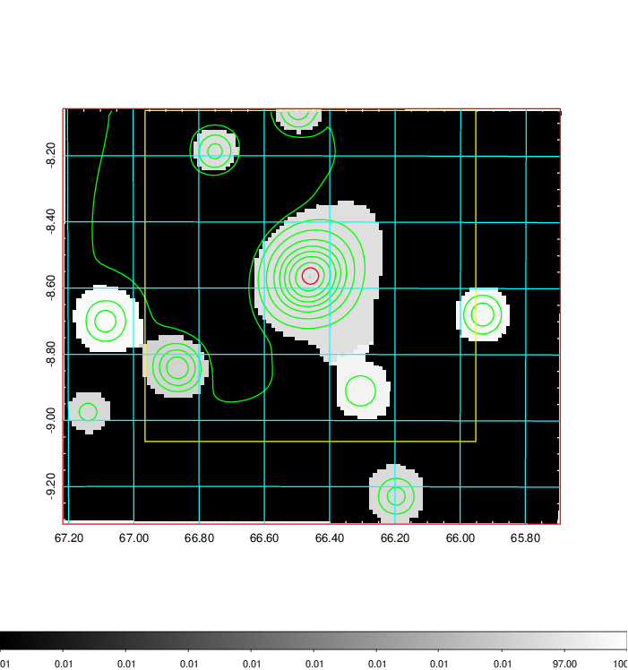  |

|[Exposure image](../image/170/170_mex.pdf)| [nH image](../image/170/170_nh.pdf)| [Planck image](../image/170/170_p.pdf)|
|-------------------|--------------------|-------------------|
|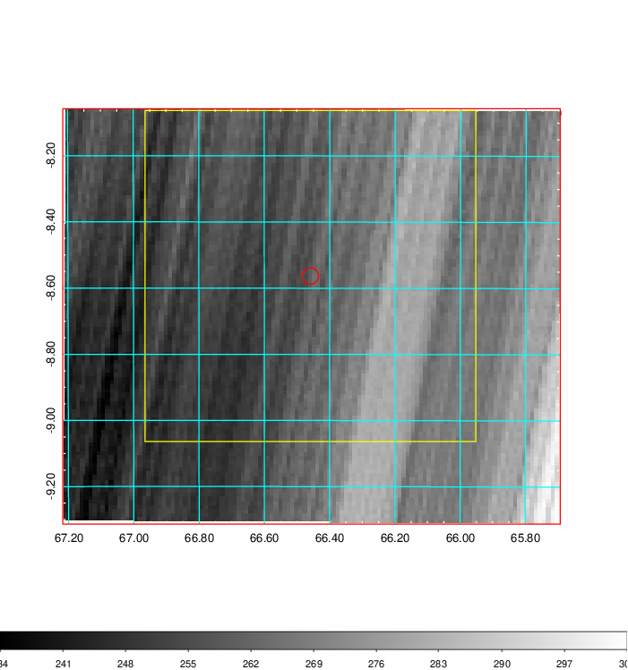   | 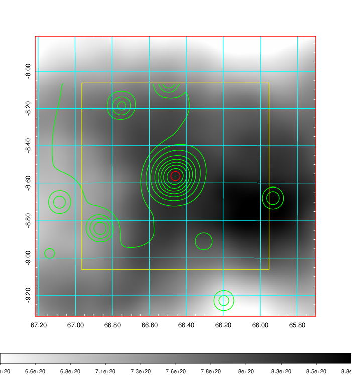    | 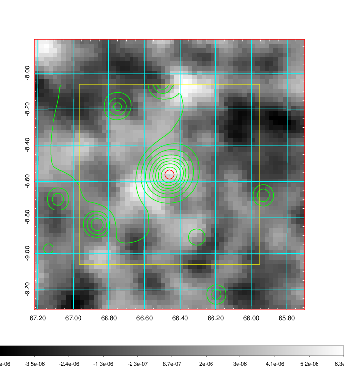 |

|[Redshift Histogram](../image/170/170_zg.pdf) | [DSS image(z1)](../image/170/170_dss_z1.pdf)      |  [DSS image(z2)](../image/170/170_dss_z2.pdf)    |
|-------------------|--------------------|-------------------|
|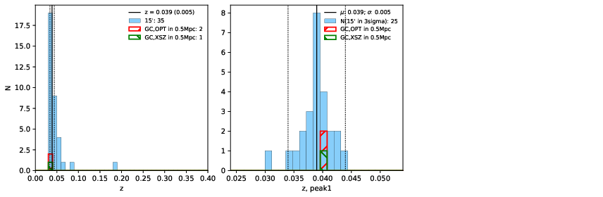 |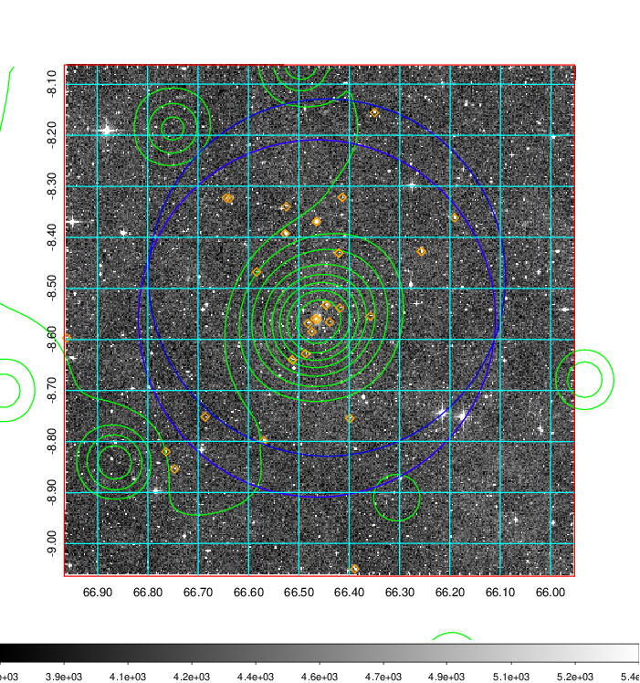  Blue circle for optical clusters;  Magenta circle for XSZ clusters;  all with r=1Mpc;  Only GC with Delta_z<0.01 are shown. | 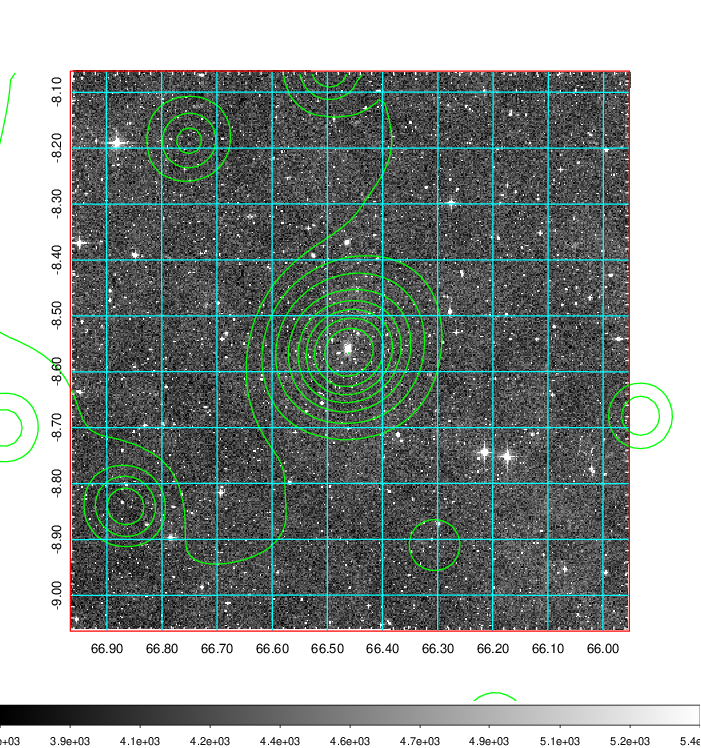 Blue circle for optical clusters;  Magenta circle for XSZ clusters;  all with r=1Mpc;  Only GC with Delta_z<0.01 are shown.  |

|[known Abell/XSZ clusters](../image/170/170_gc.pdf) | [2MASS image](../image/170/170_2mass.pdf)      |[SDSS image](../image/170/170_sdss.pdf)   |
|-------------------|-------------------|-------------------|
|  Magenta, blue and green circles  for optical, X-ray and SZ clusters  respectively, with redshift of clusters  labelled. The radius of circles  are 1Mpc.|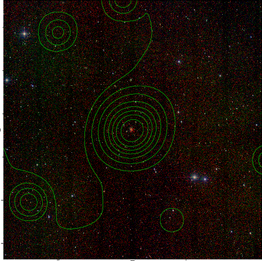  | 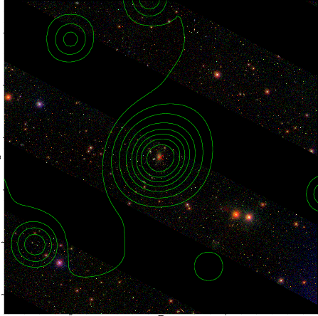  |

