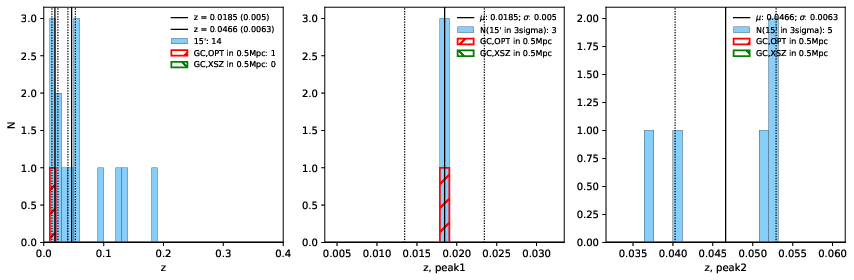

### 171

|Name|RAJ2000[deg]|DEJ2000[deg] |Ext[arcmin]| Ext,ml | z | z_src| C|GC(XSZ,Delta_z<0.01)| GC(OPT,Delta_z<0.01)|GC| R_sig[arcmin] | R500[arcmin] | R500[Mpc]| CRsig[c/s] | CR500[c/s] |L500[1E44 erg/s]|F500[1E-12 erg/s/cm^2]| M500[1E14 Msun]|Tx[keV]|Cnt_sig|Beta|Rc[arcmin]|Comment|Alias|
|---|---|---|---|---|---|------|---|--------|---------|----------|---|---|---|---|---|---|---|---|---|---|---|---|---|---|
|171| 66.770| -62.792| 2.51| 179.79| 0.0185(0.005)| z1, z_opt| S| -| N| N| 27.169| 22.782| 0.513| 0.427(0.040)| 0.416(0.039)| 0.046(0.003)| 6.005(0.422)| 0.39(0.01)| 1.21(0.03)| 590.1| 0.511(-0.008+0.013)| 1.882(-0.153+0.219)| -| t094|

|[RASS image](../image/171/171_img.pdf)|[filtered image](../image/171/171_fil.pdf)|[Segment image](../image/171/171_seg.pdf)|
|-------------------|--------------------|-------------------|
|   |    |   |

|[Exposure image](../image/171/171_mex.pdf)| [nH image](../image/171/171_nh.pdf)| [Planck image](../image/171/171_p.pdf)|
|-------------------|--------------------|-------------------|
|   |     |  |

|[Redshift Histogram](../image/171/171_zg.pdf) | [DSS image(z1)](../image/171/171_dss_z1.pdf)      |  [DSS image(z2)](../image/171/171_dss_z2.pdf)    |
|-------------------|--------------------|-------------------|
| |  Blue circle for optical clusters;  Magenta circle for XSZ clusters;  all with r=1Mpc;  Only GC with Delta_z<0.01 are shown. |  Blue circle for optical clusters;  Magenta circle for XSZ clusters;  all with r=1Mpc;  Only GC with Delta_z<0.01 are shown.  |

|[Previous-identified clusters](../image/171/171_gc.pdf) | [2MASS image](../image/171/171_2mass.pdf)      |
|-------------------|-------------------|
|  Green, magenta, and blue circles  for optical, X-ray and SZ clusters  respectively, with redshift of clusters  labelled. The radius of circles  are 1Mpc.|  |

|[DES image](../image/171/171_des.pdf)   |
|-------------------|
|   |
