

### 172

|Name|RAJ2000[deg]|DEJ2000[deg] |Ext[arcmin]| Ext,ml | z | z_src| C|GC(XSZ,Delta_z<0.01)| GC(OPT,Delta_z<0.01)|GC| R_sig[arcmin] | R500[arcmin] | R500[Mpc]| CRsig[c/s] | CR500[c/s] |L500[1E44 erg/s]|F500[1E-12 erg/s/cm^2]| M500[1E14 Msun]|Tx[keV]|Cnt_sig|Beta|Rc[arcmin]|Comment|Alias|
|---|---|---|---|---|---|------|---|--------|---------|----------|---|---|---|---|---|---|---|---|---|---|---|---|---|---|
|172| 66.917| 8.749| 4.33| 40.46| 0.1312(0.005)| z1,| G| -| -| N, W| 10.262| 6.561| 0.919| 0.118(0.028)| 0.111(0.026)| 0.862(0.115)| 1.895(0.252)| 2.51(0.17)| 3.94(0.16)| 50.9| 0.849(-0.151+0.107)| 7.304(-1.495+1.175)| -| t219|

|[RASS image](../image/172/172_img.pdf)|[filtered image](../image/172/172_fil.pdf)|[Segment image](../image/172/172_seg.pdf)|
|-------------------|--------------------|-------------------|
| 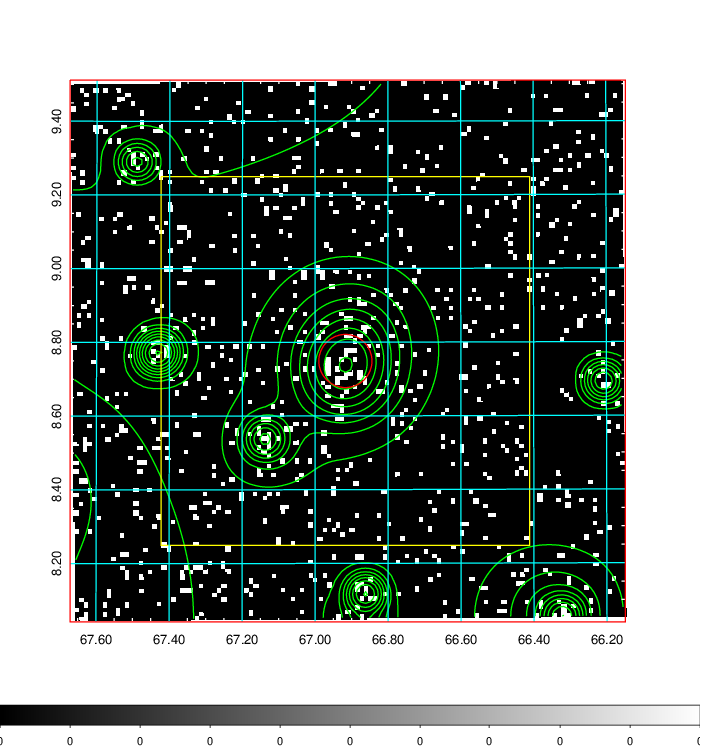  | 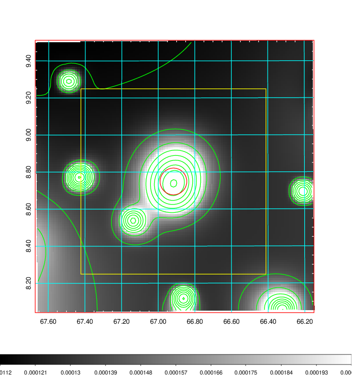   | 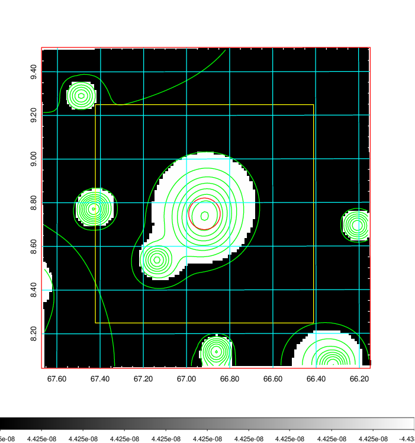  |

|[Exposure image](../image/172/172_mex.pdf)| [nH image](../image/172/172_nh.pdf)| [Planck image](../image/172/172_p.pdf)|
|-------------------|--------------------|-------------------|
|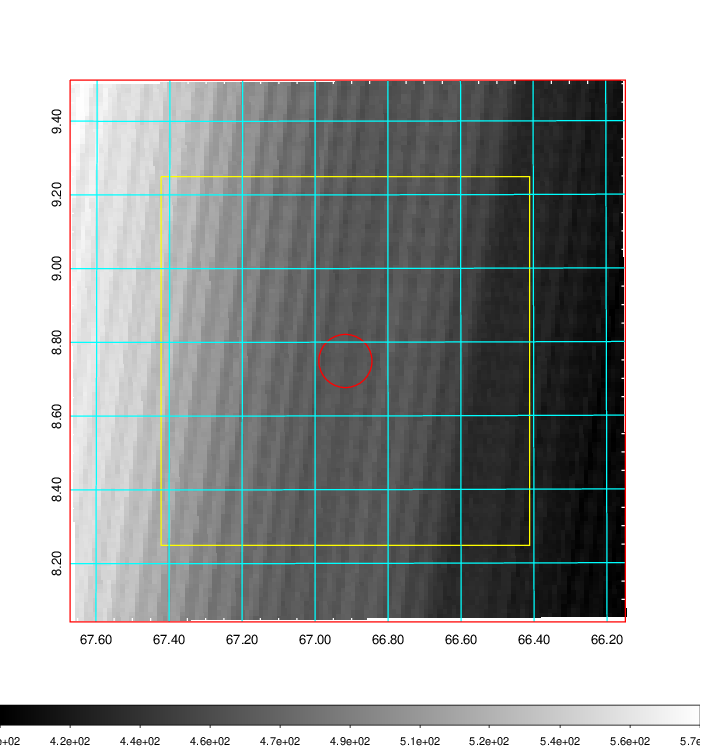   | 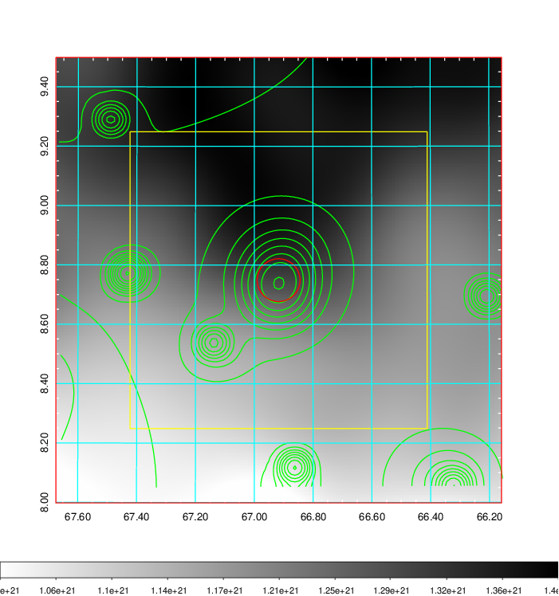    | 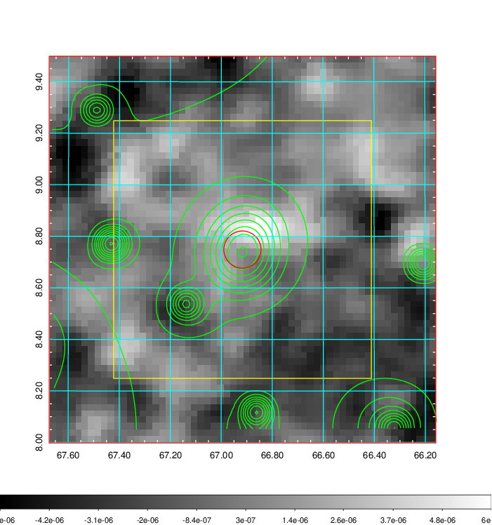 |

|[Redshift Histogram](../image/172/172_zg.pdf) | [DSS image(z1)](../image/172/172_dss_z1.pdf)      |  [DSS image(z2)](../image/172/172_dss_z2.pdf)    |
|-------------------|--------------------|-------------------|
|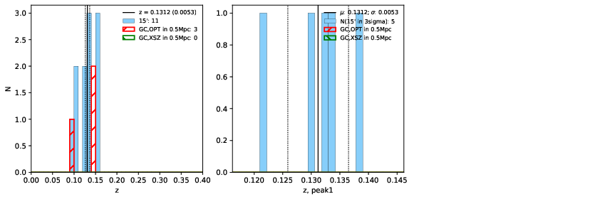 |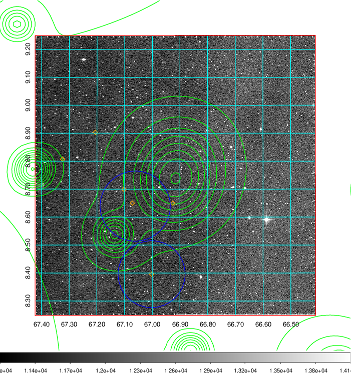  Blue circle for optical clusters;  Magenta circle for XSZ clusters;  all with r=1Mpc;  Only GC with Delta_z<0.01 are shown. | 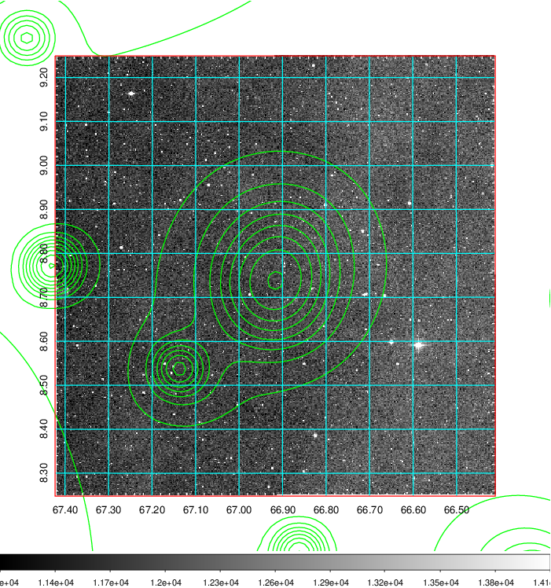 Blue circle for optical clusters;  Magenta circle for XSZ clusters;  all with r=1Mpc;  Only GC with Delta_z<0.01 are shown.  |

|[Previous-identified clusters](../image/172/172_gc.pdf) | [2MASS image](../image/172/172_2mass.pdf)      |[SDSS image](../image/172/172_sdss.pdf)   |
|-------------------|-------------------|-------------------|
|  Green, magenta, and blue circles  for optical, X-ray and SZ clusters  respectively, with redshift of clusters  labelled. The radius of circles  are 1Mpc.|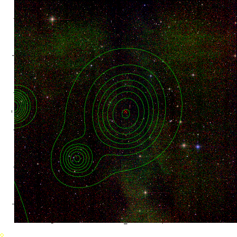  | 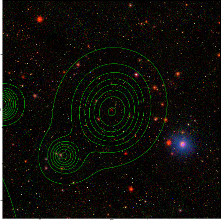  |

