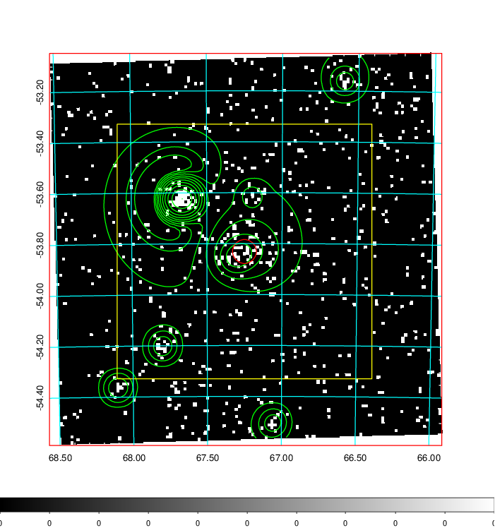
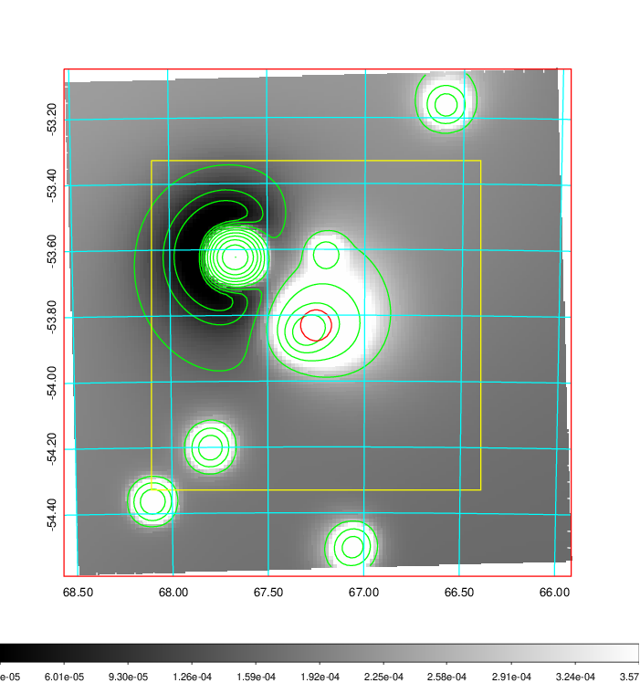
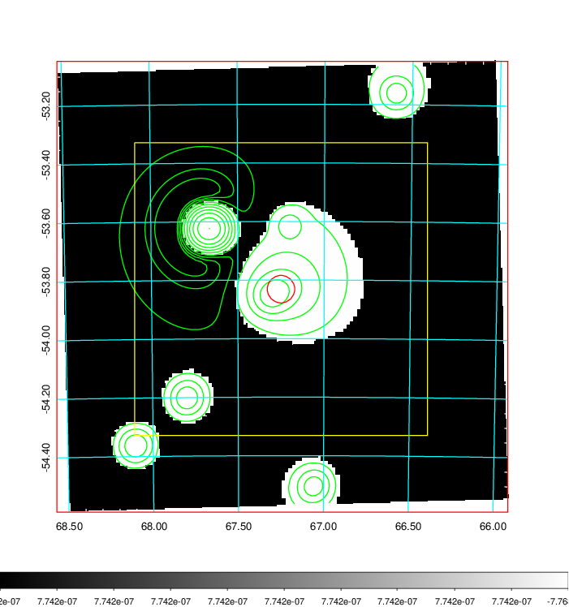
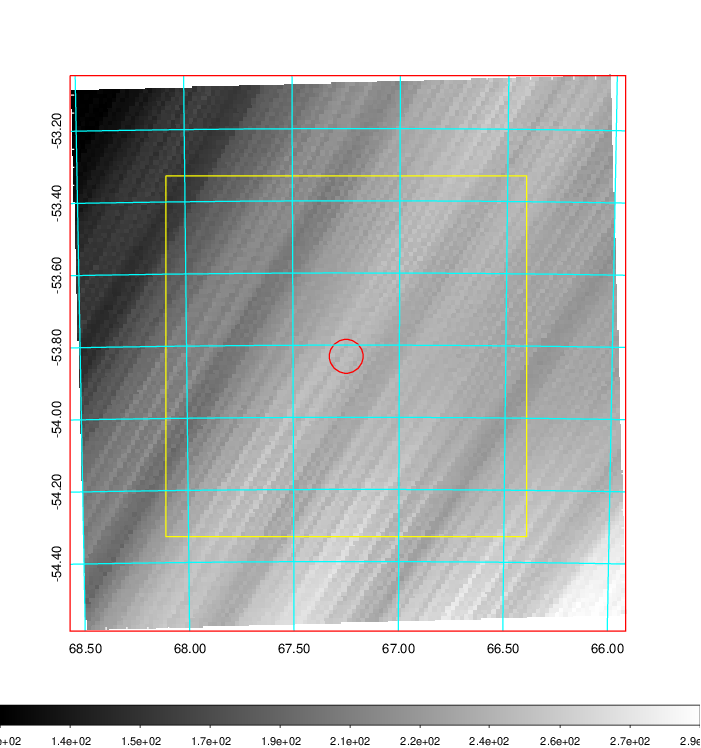
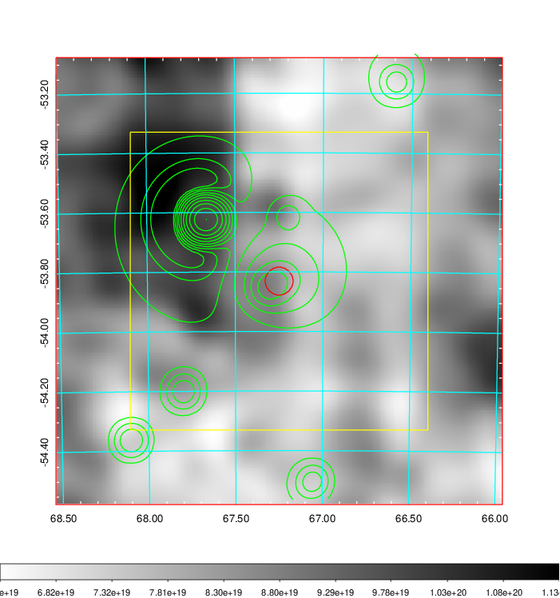
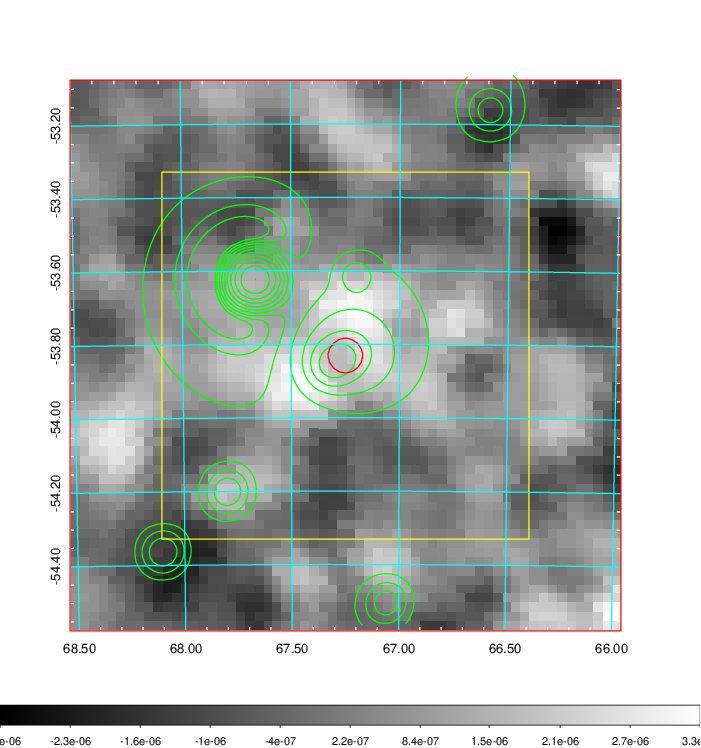
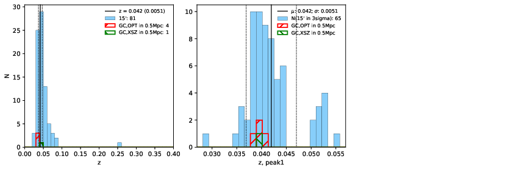
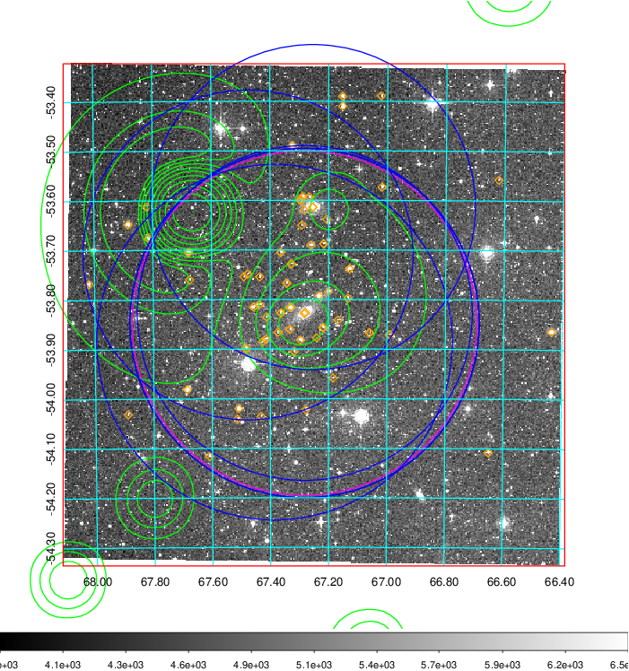
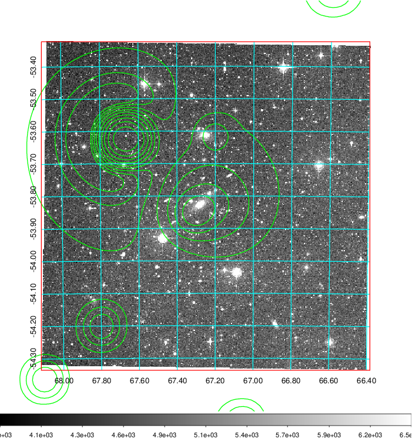
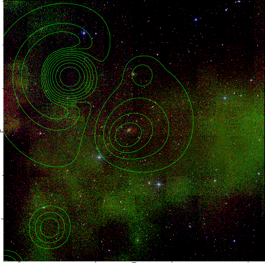

### 173

|Name|RAJ2000[deg]|DEJ2000[deg] |Ext[arcmin]| Ext,ml | z | z_src| C|GC(XSZ,Delta_z<0.01)| GC(OPT,Delta_z<0.01)|GC| R_sig[arcmin] | R500[arcmin] | R500[Mpc]| CRsig[c/s] | CR500[c/s] |L500[1E44 erg/s]|F500[1E-12 erg/s/cm^2]| M500[1E14 Msun]|Tx[keV]|Cnt_sig|Beta|Rc[arcmin]|Comment|Alias|
|---|---|---|---|---|---|------|---|--------|---------|----------|---|---|---|---|---|---|---|---|---|---|---|---|---|---|
|173| 67.250| -53.831| 2.82| 38.74| 0.0420(0.005)| z1, z_xsz| B| MCXC| A, N| A, MCXC, N, W| 21.244| 14.705| 0.731| 0.445(0.091)| 0.423(0.087)| 0.339(0.058)| 8.216(1.415)| 1.16(0.10)| 2.37(0.13)| 143.6| 0.550(-0.032+0.048)| 3.913(-0.656+0.892)| -| k358|

|[RASS image](../image/173/173_img.pdf)|[filtered image](../image/173/173_fil.pdf)|[Segment image](../image/173/173_seg.pdf)|
|-------------------|--------------------|-------------------|
|   |    |   |

|[Exposure image](../image/173/173_mex.pdf)| [nH image](../image/173/173_nh.pdf)| [Planck image](../image/173/173_p.pdf)|
|-------------------|--------------------|-------------------|
|   |     |  |

|[Redshift Histogram](../image/173/173_zg.pdf) | [DSS image(z1)](../image/173/173_dss_z1.pdf)      |  [DSS image(z2)](../image/173/173_dss_z2.pdf)    |
|-------------------|--------------------|-------------------|
| |  Blue circle for optical clusters;  Magenta circle for XSZ clusters;  all with r=1Mpc;  Only GC with Delta_z<0.01 are shown. |  Blue circle for optical clusters;  Magenta circle for XSZ clusters;  all with r=1Mpc;  Only GC with Delta_z<0.01 are shown.  |

|[known Abell/XSZ clusters](../image/173/173_gc.pdf) | [2MASS image](../image/173/173_2mass.pdf)      |
|-------------------|-------------------|
|  Magenta, blue and green circles  for optical, X-ray and SZ clusters  respectively, with redshift of clusters  labelled. The radius of circles  are 1Mpc.|  |

|[DES image](../image/173/173_des.pdf)   |
|-------------------|
|   |
