

### 175

|Name|RAJ2000[deg]|DEJ2000[deg] |Ext[arcmin]| Ext,ml | z | z_src| C|GC(XSZ,Delta_z<0.01)| GC(OPT,Delta_z<0.01)|GC| R_sig[arcmin] | R500[arcmin] | R500[Mpc]| CRsig[c/s] | CR500[c/s] |L500[1E44 erg/s]|F500[1E-12 erg/s/cm^2]| M500[1E14 Msun]|Tx[keV]|Cnt_sig|Beta|Rc[arcmin]|Comment|Alias|
|---|---|---|---|---|---|------|---|--------|---------|----------|---|---|---|---|---|---|---|---|---|---|---|---|---|---|
|175| 67.853| -61.418| 4.60| 8537.98| 0.0580(0.005)| z1, z_xsz| B| B15, MCXC, PSZ2, Tar, XB| A, N, W| A, B15, MCXC, N, PSZ2, Tar, W, XB| 26.181| 18.251| 1.230| 2.729(0.055)| 2.599(0.053)| 4.083(0.034)| 50.740(0.416)| 5.59(0.02)| 6.31(0.02)| 4208.2| 0.995(-0.008+0.004)| 8.987(-0.089+0.070)| -| k508|

|[RASS image](../image/175/175_img.pdf)|[filtered image](../image/175/175_fil.pdf)|[Segment image](../image/175/175_seg.pdf)|
|-------------------|--------------------|-------------------|
| 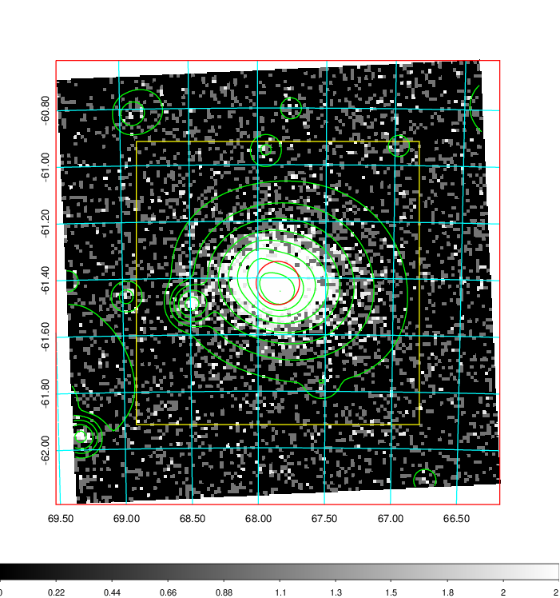  | 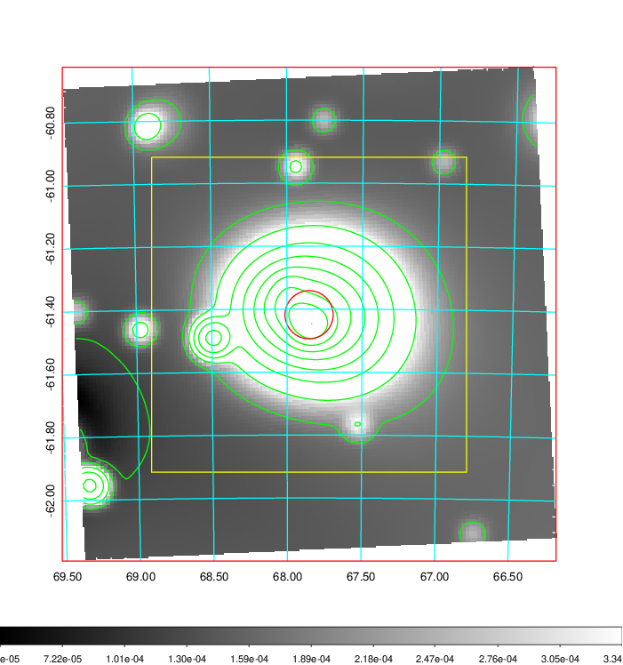   | 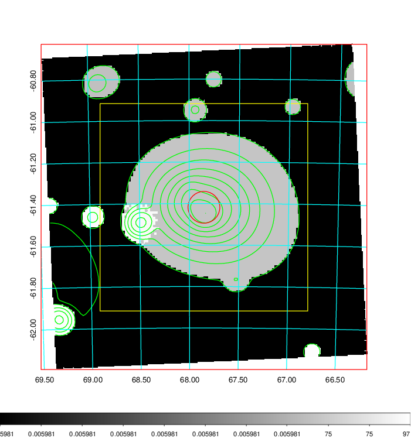  |

|[Exposure image](../image/175/175_mex.pdf)| [nH image](../image/175/175_nh.pdf)| [Planck image](../image/175/175_p.pdf)|
|-------------------|--------------------|-------------------|
|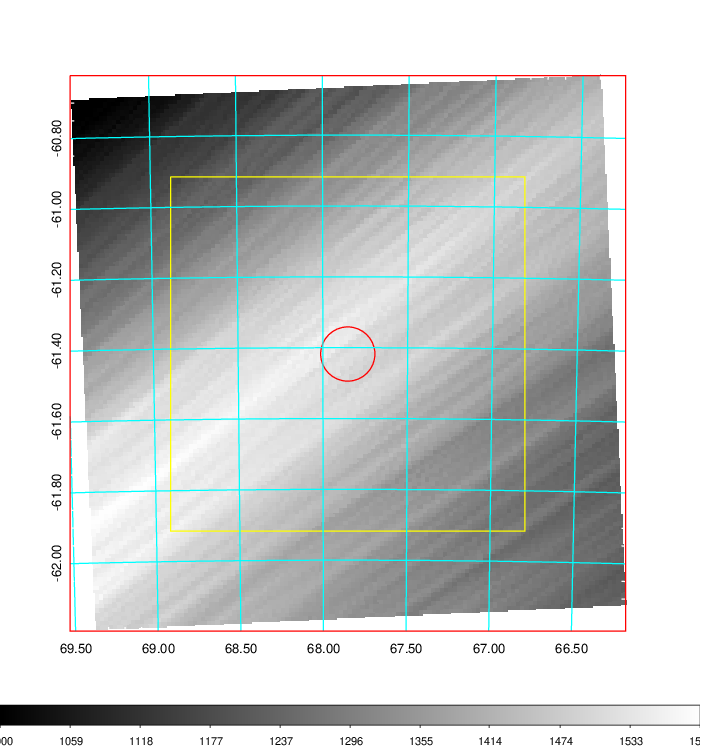   | 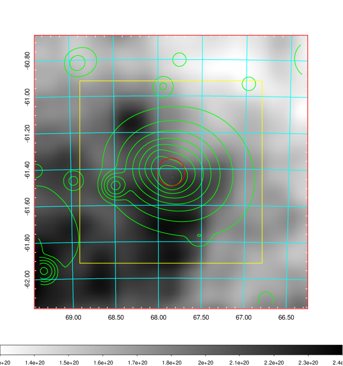    | 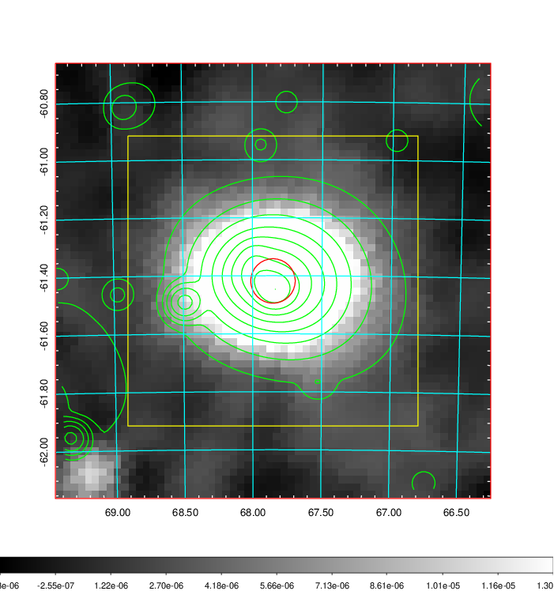 |

|[Redshift Histogram](../image/175/175_zg.pdf) | [DSS image(z1)](../image/175/175_dss_z1.pdf)      |  [DSS image(z2)](../image/175/175_dss_z2.pdf)    |
|-------------------|--------------------|-------------------|
|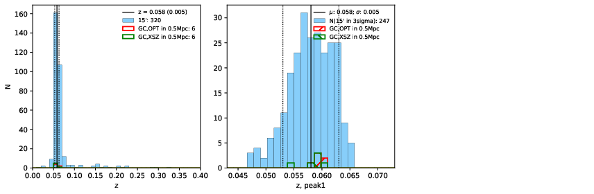 |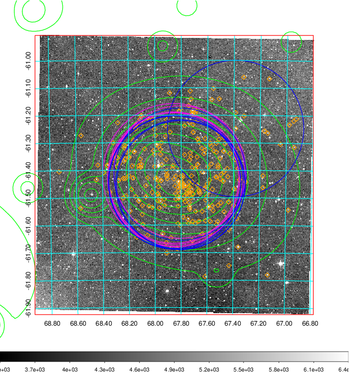  Blue circle for optical clusters;  Magenta circle for XSZ clusters;  all with r=1Mpc;  Only GC with Delta_z<0.01 are shown. | 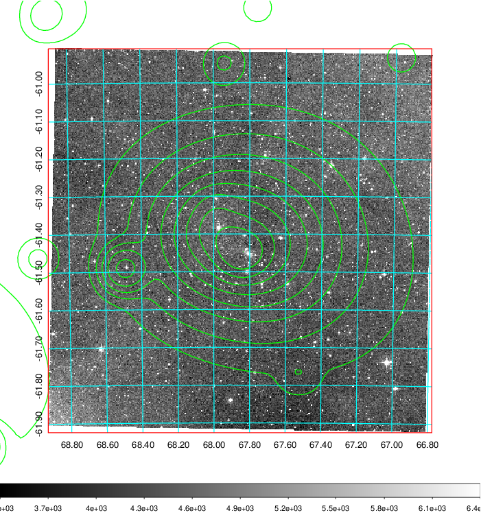 Blue circle for optical clusters;  Magenta circle for XSZ clusters;  all with r=1Mpc;  Only GC with Delta_z<0.01 are shown.  |

|[Previous-identified clusters](../image/175/175_gc.pdf) | [2MASS image](../image/175/175_2mass.pdf)      |
|-------------------|-------------------|
|  Green, magenta, and blue circles  for optical, X-ray and SZ clusters  respectively, with redshift of clusters  labelled. The radius of circles  are 1Mpc.|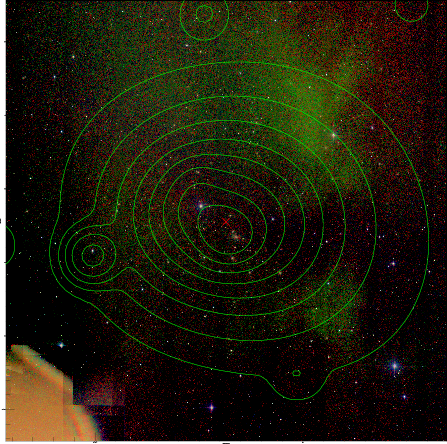  |

|[DES image](../image/175/175_des.pdf)   |
|-------------------|
| 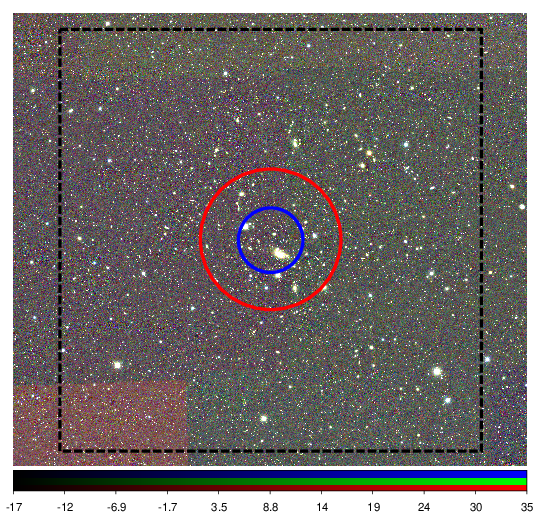  |
