

### 176

|Name|RAJ2000[deg]|DEJ2000[deg] |Ext[arcmin]| Ext,ml | z | z_src| C|GC(XSZ,Delta_z<0.01)| GC(OPT,Delta_z<0.01)|GC| R_sig[arcmin] | R500[arcmin] | R500[Mpc]| CRsig[c/s] | CR500[c/s] |L500[1E44 erg/s]|F500[1E-12 erg/s/cm^2]| M500[1E14 Msun]|Tx[keV]|Cnt_sig|Beta|Rc[arcmin]|Comment|Alias|
|---|---|---|---|---|---|------|---|--------|---------|----------|---|---|---|---|---|---|---|---|---|---|---|---|---|---|
|176| 68.402| -13.241| 2.66| 1232.57| 0.0327(0.005)| z1, z_xsz| B| L03, MCXC, PSZ2, Tar, XB| A, N| A, L03, MCXC, N, PSZ2, Tar, XB| 25.688| 26.581| 1.041| 3.452(0.140)| 3.471(0.141)| 1.555(0.027)| 63.072(1.080)| 3.31(0.03)| 4.53(0.02)| 859.4| 0.761(-0.026+0.030)| 4.382(-0.272+0.297)| -| k330|

|[RASS image](../image/176/176_img.pdf)|[filtered image](../image/176/176_fil.pdf)|[Segment image](../image/176/176_seg.pdf)|
|-------------------|--------------------|-------------------|
| 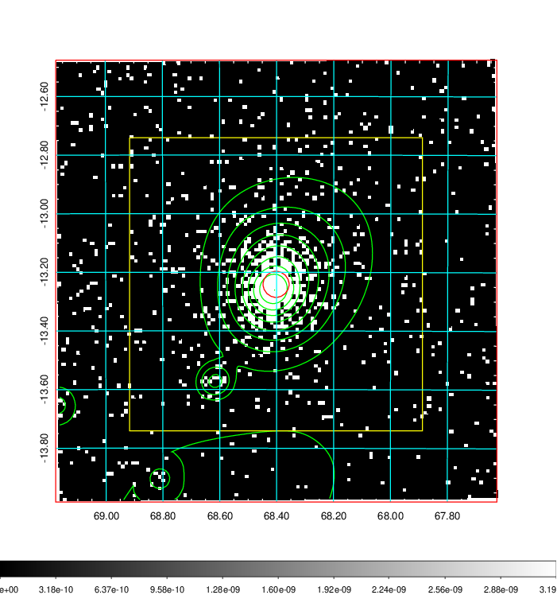  | 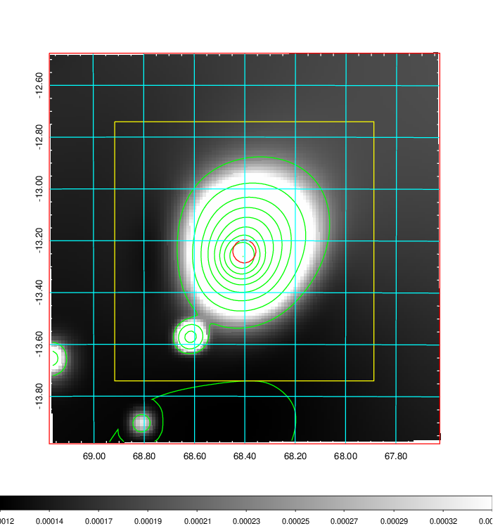   | 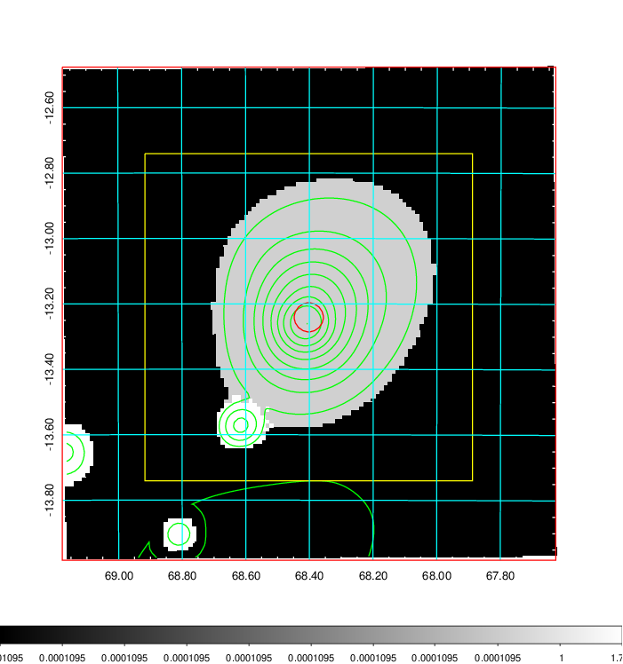  |

|[Exposure image](../image/176/176_mex.pdf)| [nH image](../image/176/176_nh.pdf)| [Planck image](../image/176/176_p.pdf)|
|-------------------|--------------------|-------------------|
|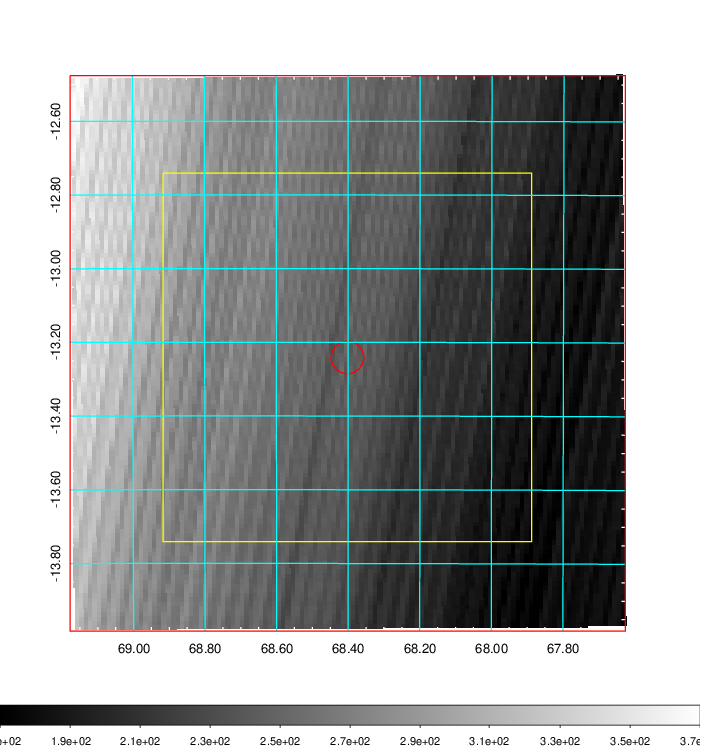   | 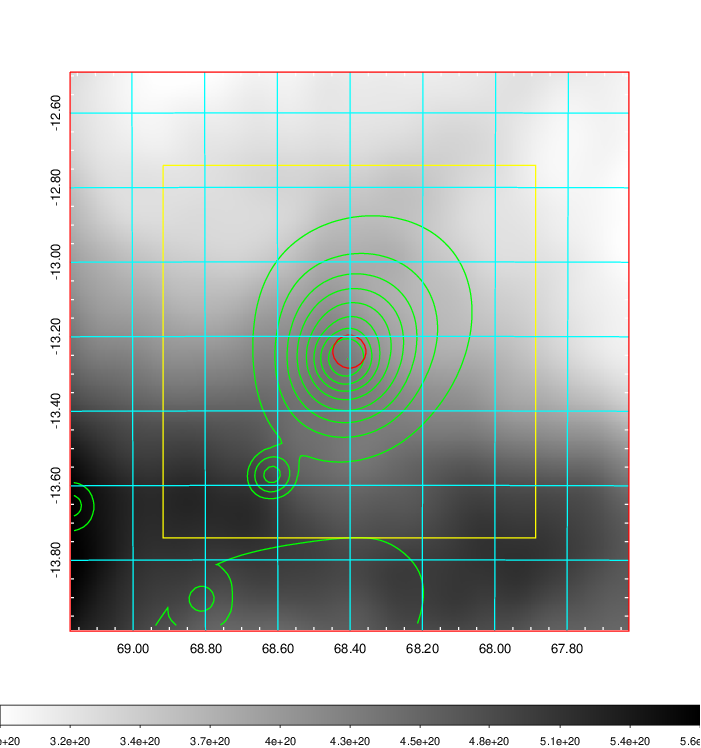    | 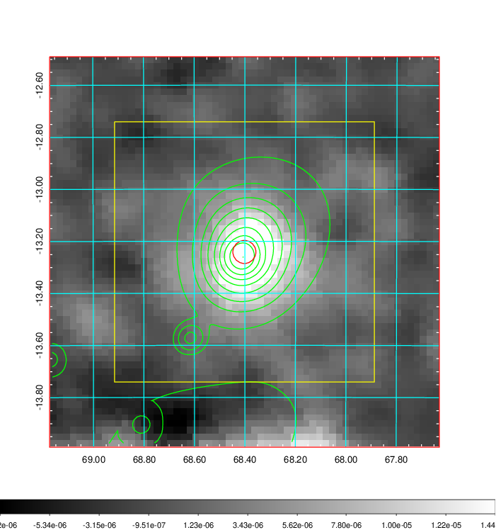 |

|[Redshift Histogram](../image/176/176_zg.pdf) | [DSS image(z1)](../image/176/176_dss_z1.pdf)      |  [DSS image(z2)](../image/176/176_dss_z2.pdf)    |
|-------------------|--------------------|-------------------|
|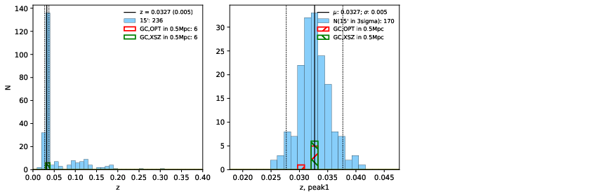 |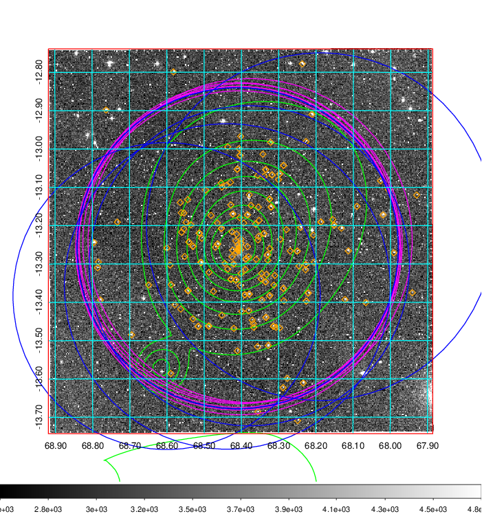  Blue circle for optical clusters;  Magenta circle for XSZ clusters;  all with r=1Mpc;  Only GC with Delta_z<0.01 are shown. | 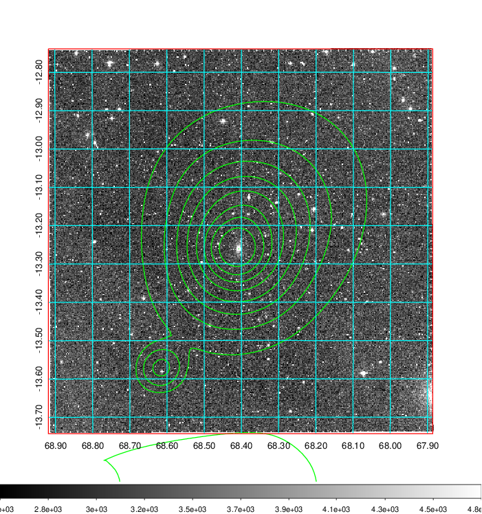 Blue circle for optical clusters;  Magenta circle for XSZ clusters;  all with r=1Mpc;  Only GC with Delta_z<0.01 are shown.  |

|[Previous-identified clusters](../image/176/176_gc.pdf) | [2MASS image](../image/176/176_2mass.pdf)      |
|-------------------|-------------------|
|  Green, magenta, and blue circles  for optical, X-ray and SZ clusters  respectively, with redshift of clusters  labelled. The radius of circles  are 1Mpc.|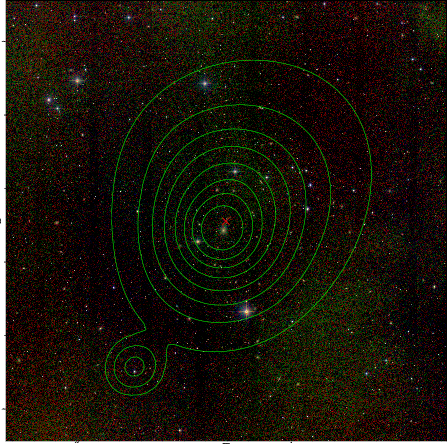  |

|[PS1 image](../image/176/176_ps1.pdf)            |
|-------------------|
| 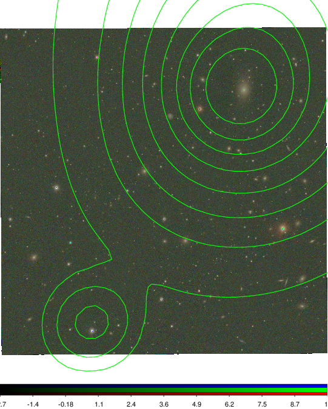  |
