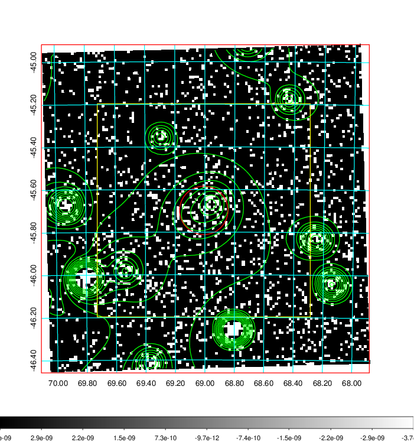
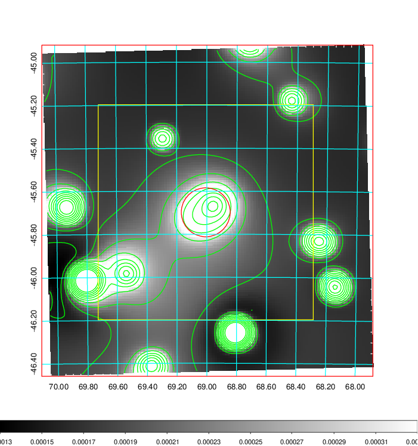
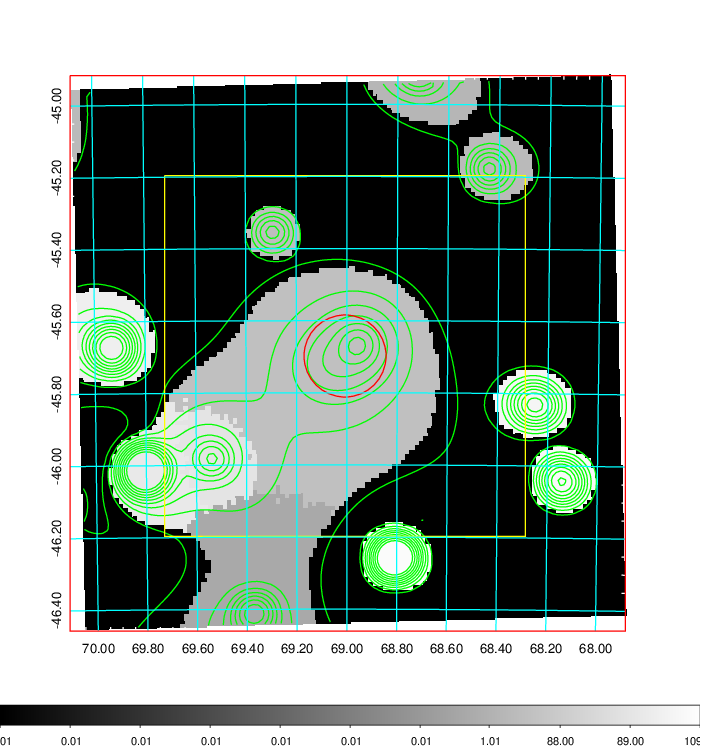
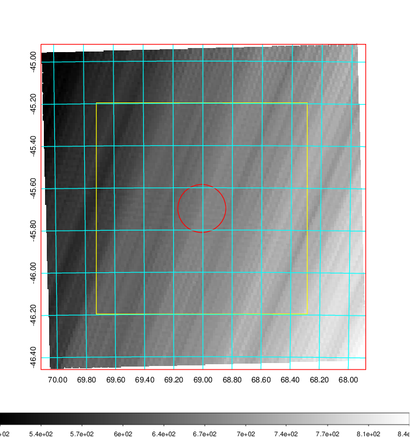
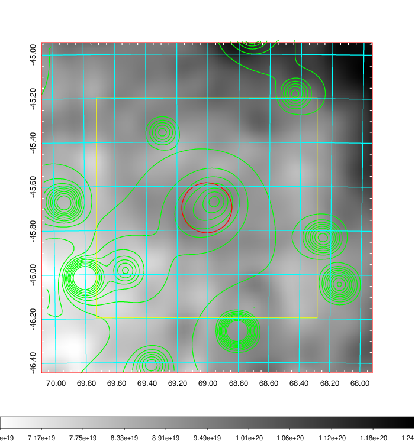
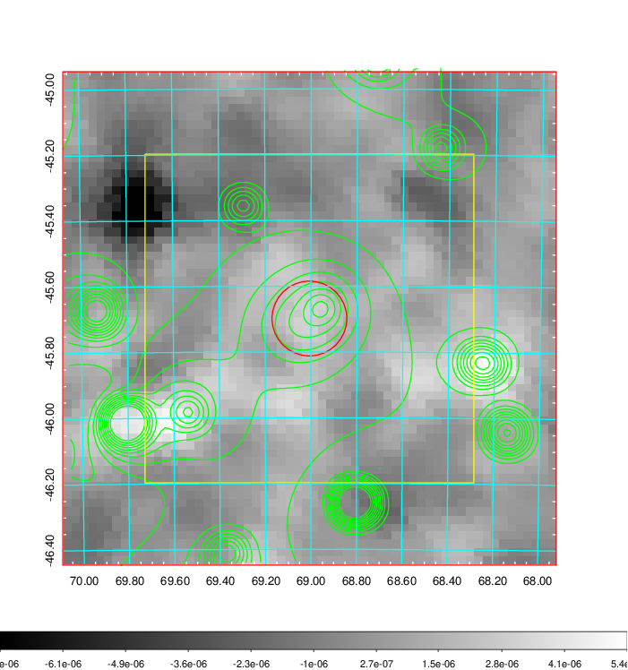
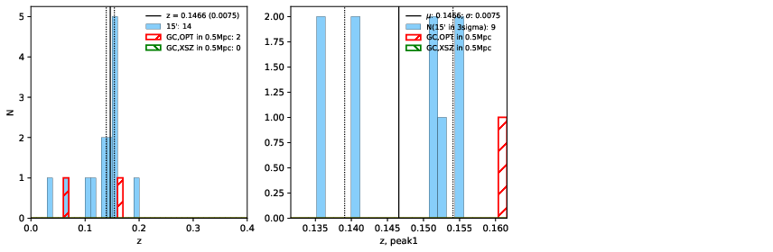
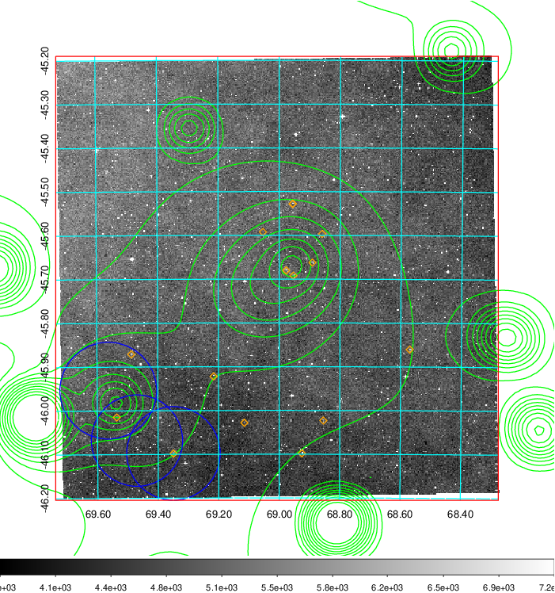
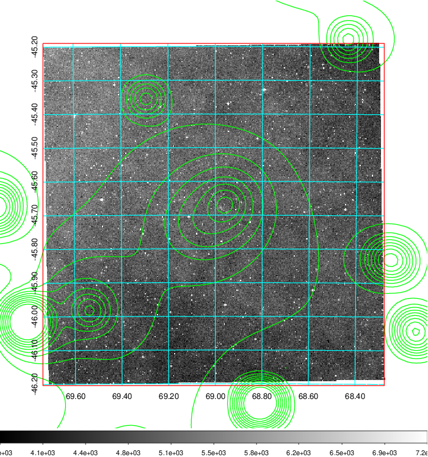
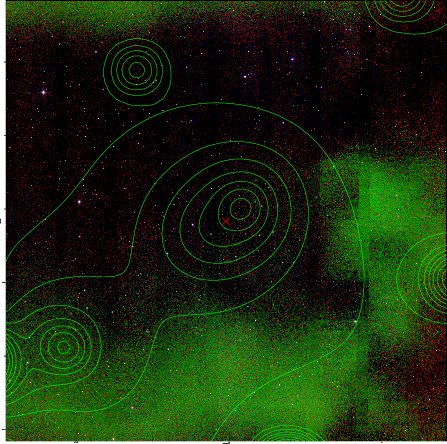

### 177

|Name|RAJ2000[deg]|DEJ2000[deg] |Ext[arcmin]| Ext,ml | z | z_src| C|GC(XSZ,Delta_z<0.01)| GC(OPT,Delta_z<0.01)|GC| R_sig[arcmin] | R500[arcmin] | R500[Mpc]| CRsig[c/s] | CR500[c/s] |L500[1E44 erg/s]|F500[1E-12 erg/s/cm^2]| M500[1E14 Msun]|Tx[keV]|Cnt_sig|Beta|Rc[arcmin]|Comment|Alias|
|---|---|---|---|---|---|------|---|--------|---------|----------|---|---|---|---|---|---|---|---|---|---|---|---|---|---|
|177| 69.007| -45.698| 6.83| 56.43| 0.1466(0.007)| z1,| G| -| -| N, W| 10.262| 5.846| 0.900| 0.113(0.028)| 0.105(0.026)| 1.253(0.286)| 2.165(0.493)| 2.39(0.27)| 3.84(0.27)| 78.9| 0.879(-0.138+0.087)| 7.059(-1.229+0.948)| -| t339|

|[RASS image](../image/177/177_img.pdf)|[filtered image](../image/177/177_fil.pdf)|[Segment image](../image/177/177_seg.pdf)|
|-------------------|--------------------|-------------------|
|   |    |   |

|[Exposure image](../image/177/177_mex.pdf)| [nH image](../image/177/177_nh.pdf)| [Planck image](../image/177/177_p.pdf)|
|-------------------|--------------------|-------------------|
|   |     |  |

|[Redshift Histogram](../image/177/177_zg.pdf) | [DSS image(z1)](../image/177/177_dss_z1.pdf)      |  [DSS image(z2)](../image/177/177_dss_z2.pdf)    |
|-------------------|--------------------|-------------------|
| |  Blue circle for optical clusters;  Magenta circle for XSZ clusters;  all with r=1Mpc;  Only GC with Delta_z<0.01 are shown. |  Blue circle for optical clusters;  Magenta circle for XSZ clusters;  all with r=1Mpc;  Only GC with Delta_z<0.01 are shown.  |

|[known Abell/XSZ clusters](../image/177/177_gc.pdf) | [2MASS image](../image/177/177_2mass.pdf)      |
|-------------------|-------------------|
|  Magenta, blue and green circles  for optical, X-ray and SZ clusters  respectively, with redshift of clusters  labelled. The radius of circles  are 1Mpc.|  |

|[DES image](../image/177/177_des.pdf)   |
|-------------------|
|   |
