

### 178

|Name|RAJ2000[deg]|DEJ2000[deg] |Ext[arcmin]| Ext,ml | z | z_src| C|GC(XSZ,Delta_z<0.01)| GC(OPT,Delta_z<0.01)|GC| R_sig[arcmin] | R500[arcmin] | R500[Mpc]| CRsig[c/s] | CR500[c/s] |L500[1E44 erg/s]|F500[1E-12 erg/s/cm^2]| M500[1E14 Msun]|Tx[keV]|Cnt_sig|Beta|Rc[arcmin]|Comment|Alias|
|---|---|---|---|---|---|------|---|--------|---------|----------|---|---|---|---|---|---|---|---|---|---|---|---|---|---|
|178| 69.103| 10.658| 1.97| 60.74| 0.1039(0.000)| z_xsz| B| Tar| N, W| A, N, Tar, W| 6.850| 8.340| 0.955| 0.196(0.032)| 0.203(0.033)| 0.954(0.054)| 3.468(0.197)| 2.73(0.08)| 4.11(0.07)| 77.0| 0.923(-0.093+0.056)| 3.801(-0.494+0.395)| -| t060|

|[RASS image](../image/178/178_img.pdf)|[filtered image](../image/178/178_fil.pdf)|[Segment image](../image/178/178_seg.pdf)|
|-------------------|--------------------|-------------------|
| 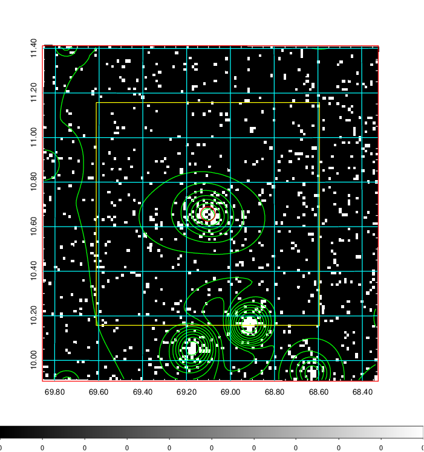  | 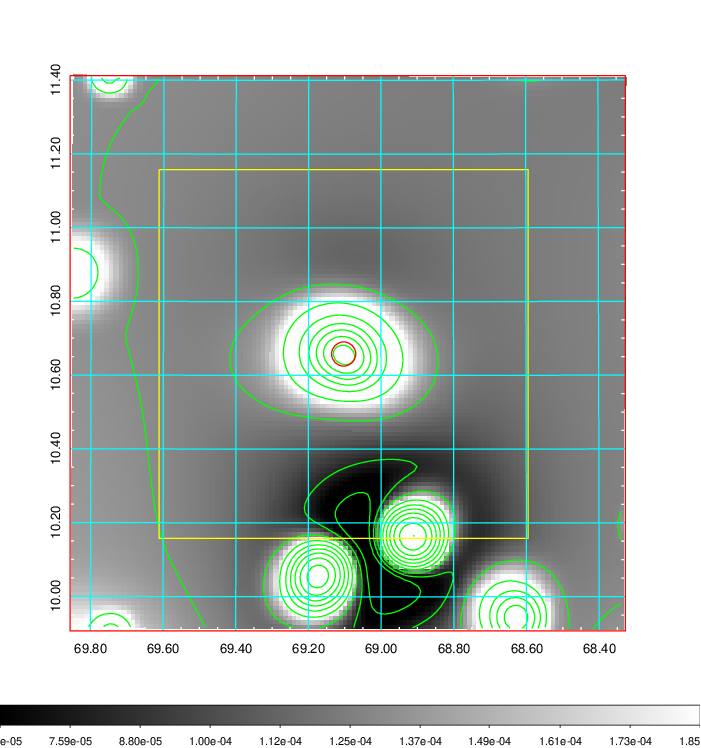   | 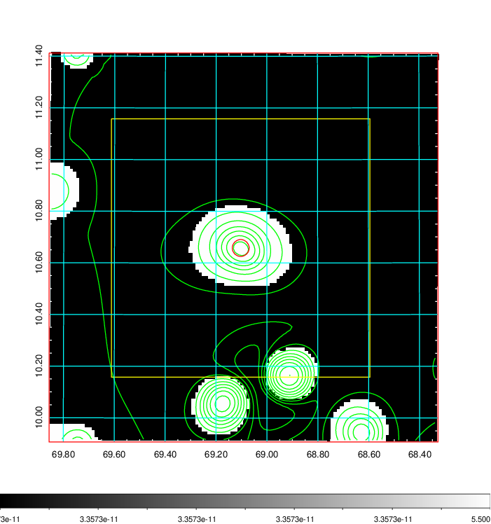  |

|[Exposure image](../image/178/178_mex.pdf)| [nH image](../image/178/178_nh.pdf)| [Planck image](../image/178/178_p.pdf)|
|-------------------|--------------------|-------------------|
|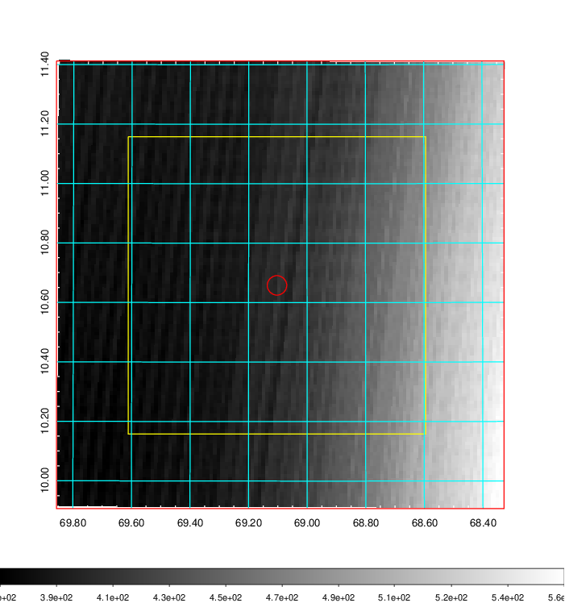   | 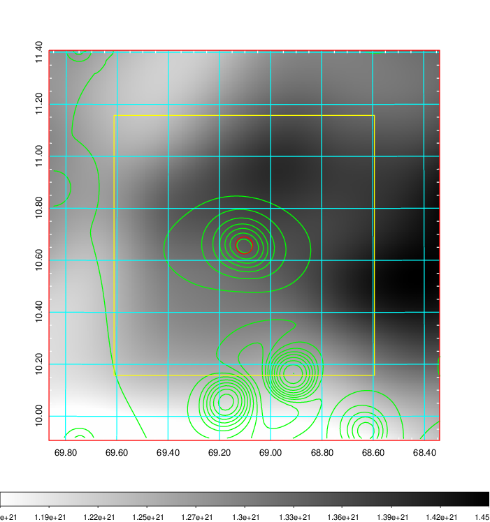    | 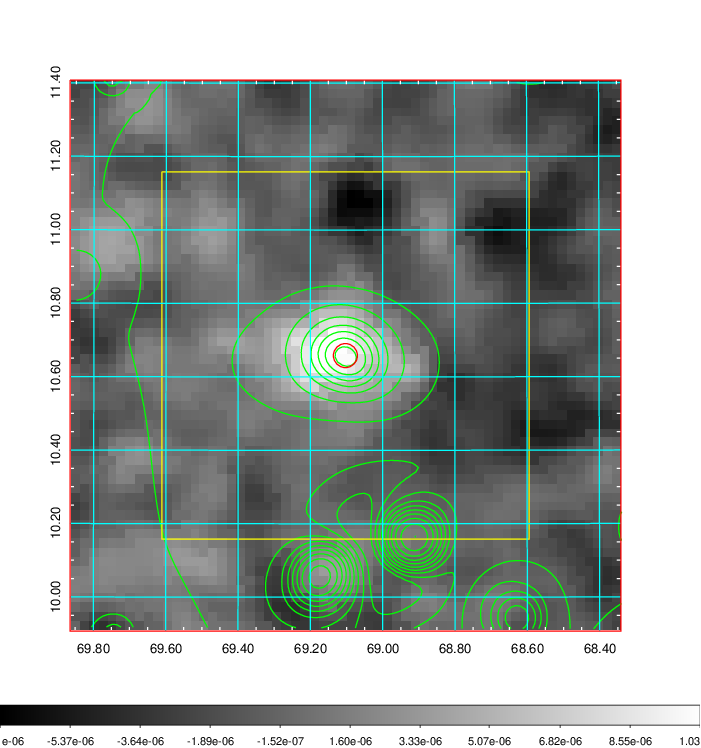 |

|[Redshift Histogram](../image/178/178_zg.pdf) | [DSS image(z1)](../image/178/178_dss_z1.pdf)      |  [DSS image(z2)](../image/178/178_dss_z2.pdf)    |
|-------------------|--------------------|-------------------|
|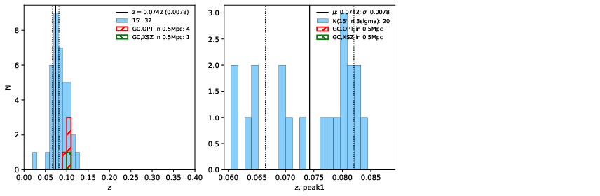 |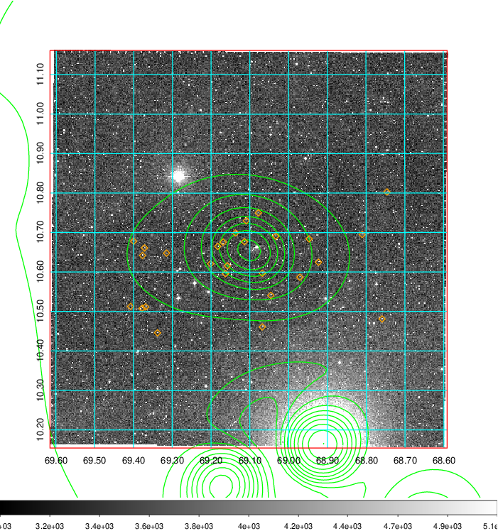  Blue circle for optical clusters;  Magenta circle for XSZ clusters;  all with r=1Mpc;  Only GC with Delta_z<0.01 are shown. | 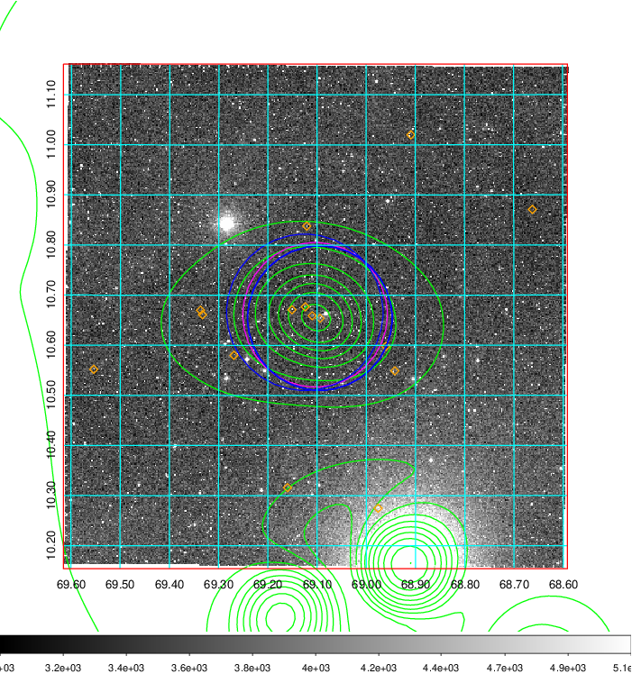 Blue circle for optical clusters;  Magenta circle for XSZ clusters;  all with r=1Mpc;  Only GC with Delta_z<0.01 are shown.  |

|[Previous-identified clusters](../image/178/178_gc.pdf) | [2MASS image](../image/178/178_2mass.pdf)      |[SDSS image](../image/178/178_sdss.pdf)   |
|-------------------|-------------------|-------------------|
|  Green, magenta, and blue circles  for optical, X-ray and SZ clusters  respectively, with redshift of clusters  labelled. The radius of circles  are 1Mpc.|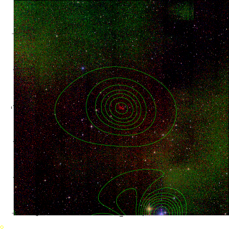  | 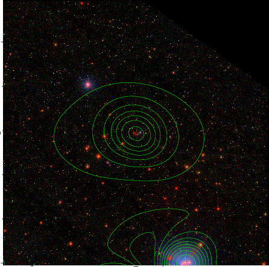  |

