

### 179

|Name|RAJ2000[deg]|DEJ2000[deg] |Ext[arcmin]| Ext,ml | z | z_src| C|GC(XSZ,Delta_z<0.01)| GC(OPT,Delta_z<0.01)|GC| R_sig[arcmin] | R500[arcmin] | R500[Mpc]| CRsig[c/s] | CR500[c/s] |L500[1E44 erg/s]|F500[1E-12 erg/s/cm^2]| M500[1E14 Msun]|Tx[keV]|Cnt_sig|Beta|Rc[arcmin]|Comment|Alias|
|---|---|---|---|---|---|------|---|--------|---------|----------|---|---|---|---|---|---|---|---|---|---|---|---|---|---|
|179| 71.294| -15.856| 4.69| 229.07| 0.0364(0.005)| z1, z_xsz| B| MCXC| N| MCXC, N, W| 18.775| 16.809| 0.729| 0.519(0.060)| 0.511(0.059)| 0.272(0.019)| 8.846(0.611)| 1.14(0.04)| 2.35(0.05)| 265.9| 0.706(-0.051+0.065)| 5.448(-0.718+0.855)| -| k513|

|[RASS image](../image/179/179_img.pdf)|[filtered image](../image/179/179_fil.pdf)|[Segment image](../image/179/179_seg.pdf)|
|-------------------|--------------------|-------------------|
| 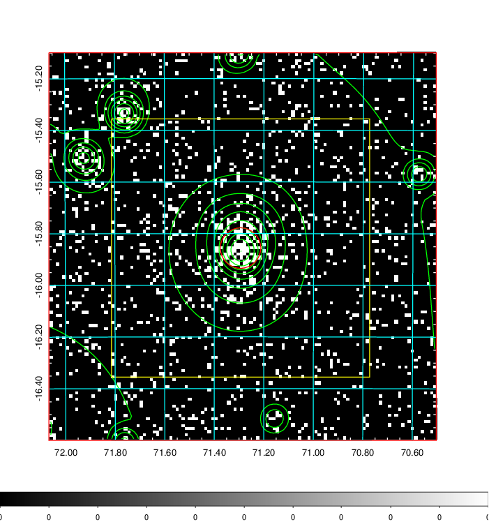  | 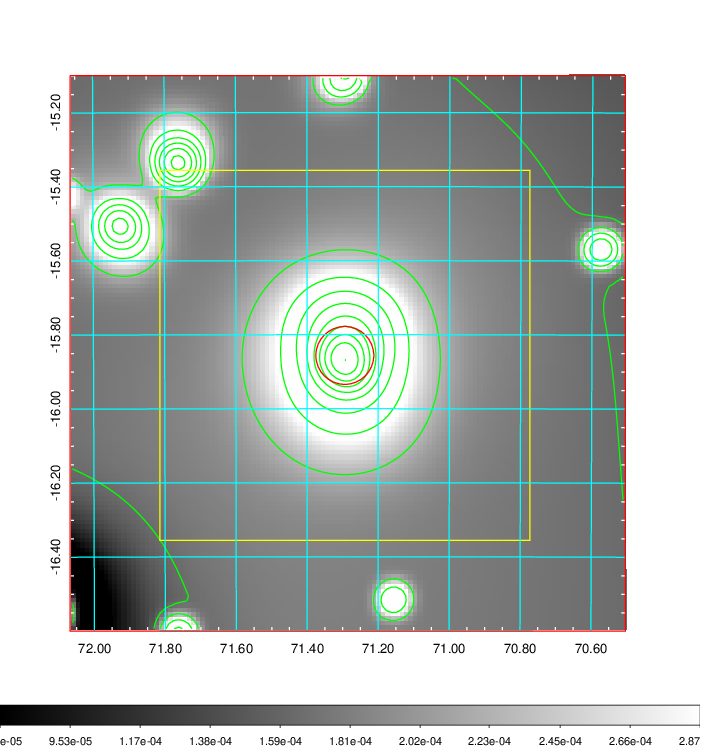   | 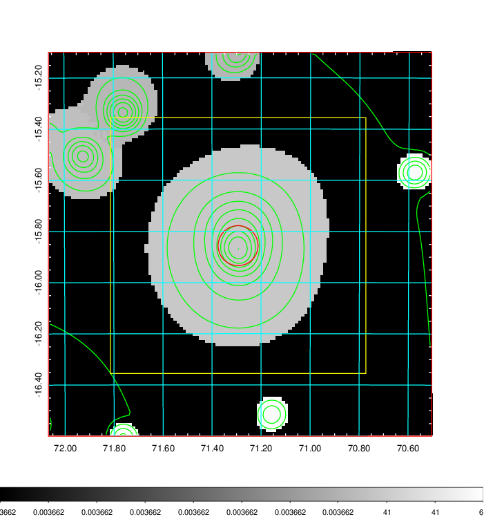  |

|[Exposure image](../image/179/179_mex.pdf)| [nH image](../image/179/179_nh.pdf)| [Planck image](../image/179/179_p.pdf)|
|-------------------|--------------------|-------------------|
|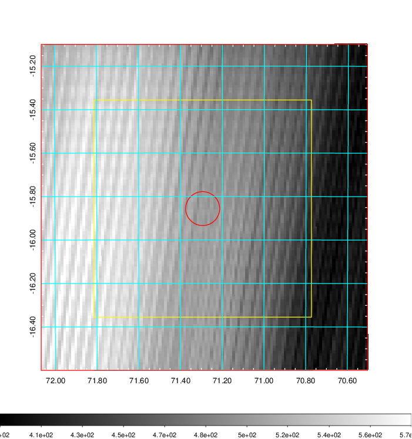   | 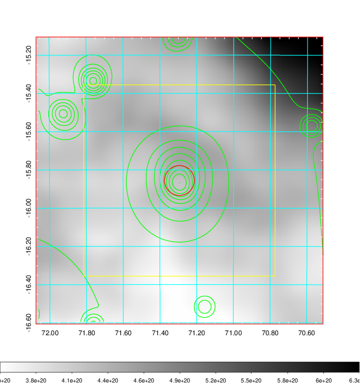    | 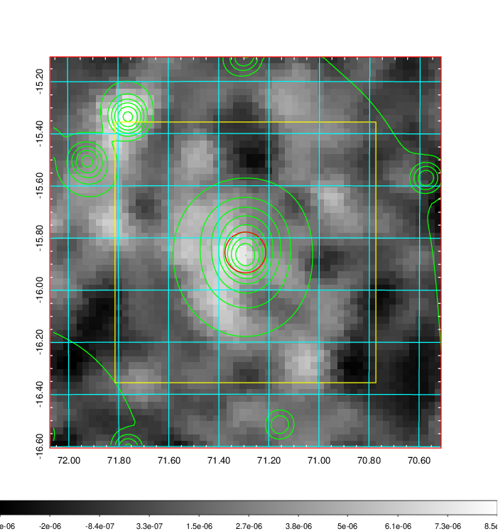 |

|[Redshift Histogram](../image/179/179_zg.pdf) | [DSS image(z1)](../image/179/179_dss_z1.pdf)      |  [DSS image(z2)](../image/179/179_dss_z2.pdf)    |
|-------------------|--------------------|-------------------|
|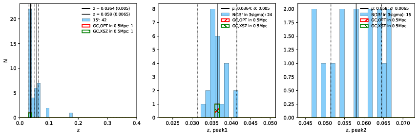 |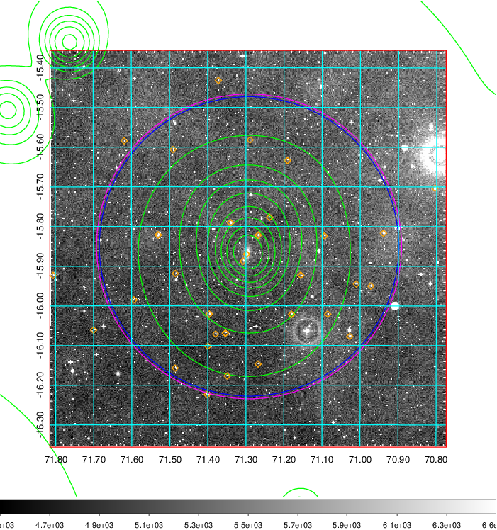  Blue circle for optical clusters;  Magenta circle for XSZ clusters;  all with r=1Mpc;  Only GC with Delta_z<0.01 are shown. | 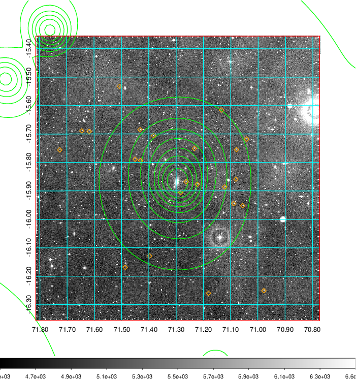 Blue circle for optical clusters;  Magenta circle for XSZ clusters;  all with r=1Mpc;  Only GC with Delta_z<0.01 are shown.  |

|[Previous-identified clusters](../image/179/179_gc.pdf) | [2MASS image](../image/179/179_2mass.pdf)      |
|-------------------|-------------------|
|  Green, magenta, and blue circles  for optical, X-ray and SZ clusters  respectively, with redshift of clusters  labelled. The radius of circles  are 1Mpc.|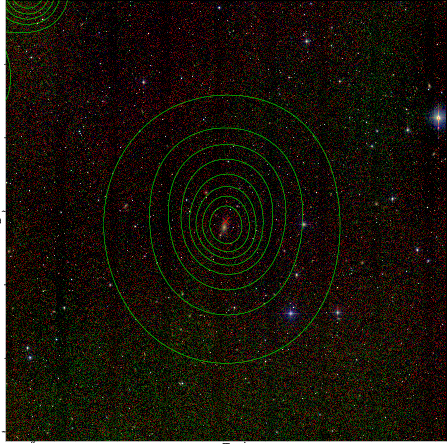  |

|[PS1 image](../image/179/179_ps1.pdf)            |
|-------------------|
| 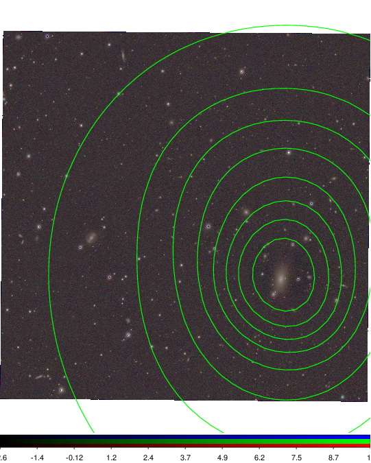  |
