

### 18

|Name|RAJ2000[deg]|DEJ2000[deg] |Ext[arcmin]| Ext,ml | z | z_src| C|GC(XSZ,Delta_z<0.01)| GC(OPT,Delta_z<0.01)|GC| R_sig[arcmin] | R500[arcmin] | R500[Mpc]| CRsig[c/s] | CR500[c/s] |L500[1E44 erg/s]|F500[1E-12 erg/s/cm^2]| M500[1E14 Msun]|Tx[keV]|Cnt_sig|Beta|Rc[arcmin]|Comment|Alias|
|---|---|---|---|---|---|------|---|--------|---------|----------|---|---|---|---|---|---|---|---|---|---|---|---|---|---|
|18| 4.410| -35.166| 2.51| 31.93| 0.0955(0.005)| z1, z_xsz| B| MCXC, Tar| A, N, W| A, MCXC, N, Tar, W| 8.312| 7.901| 0.839| 0.167(0.036)| 0.166(0.036)| 0.736(0.103)| 3.202(0.450)| 1.84(0.13)| 3.22(0.14)| 51.0| 0.910(-0.110+0.065)| 5.603(-0.823+0.656)| -| k298|

|[RASS image](../image/18/18_img.pdf)|[filtered image](../image/18/18_fil.pdf)|[Segment image](../image/18/18_seg.pdf)|
|-------------------|--------------------|-------------------|
| 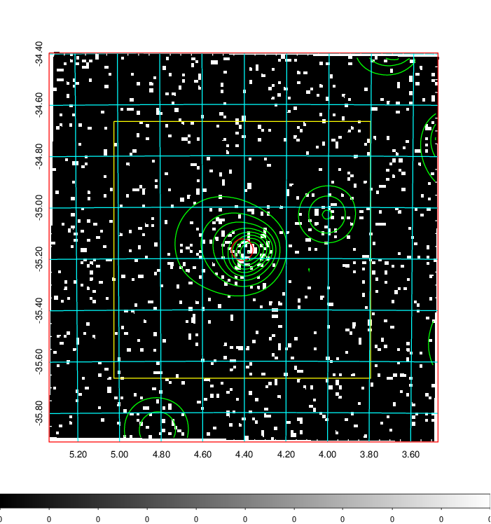  | 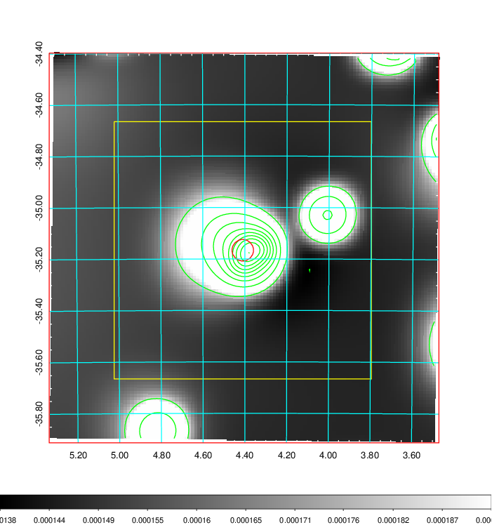   | 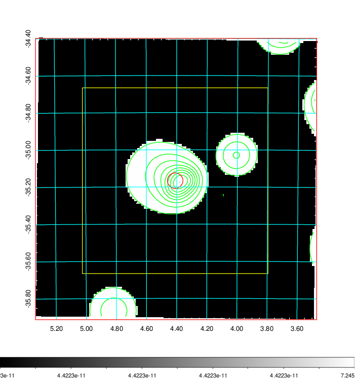  |

|[Exposure image](../image/18/18_mex.pdf)| [nH image](../image/18/18_nh.pdf)| [Planck image](../image/18/18_p.pdf)|
|-------------------|--------------------|-------------------|
|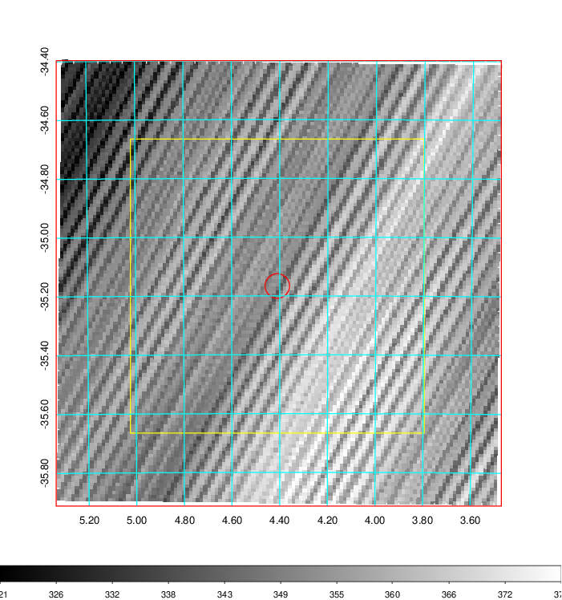   | 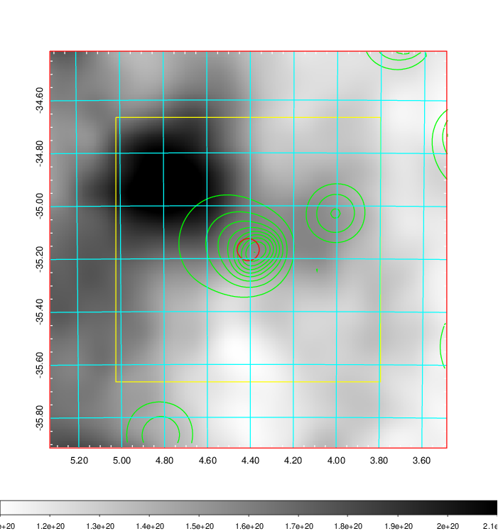    | 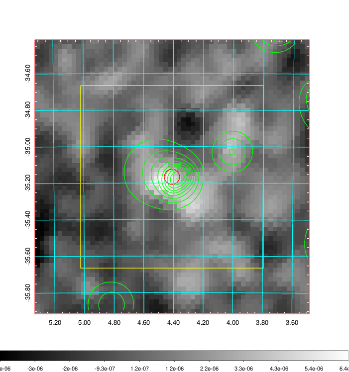 |

|[Redshift Histogram](../image/18/18_zg.pdf) | [DSS image(z1)](../image/18/18_dss_z1.pdf)      |  [DSS image(z2)](../image/18/18_dss_z2.pdf)    |
|-------------------|--------------------|-------------------|
|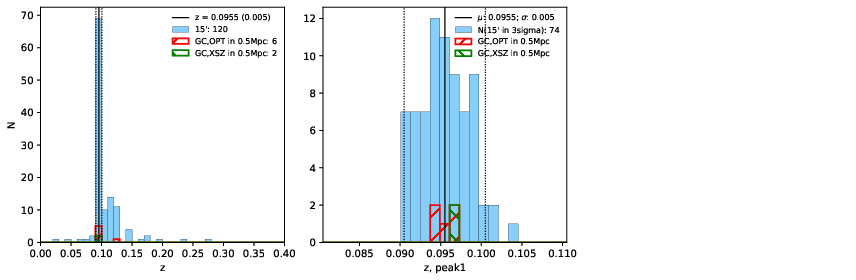 |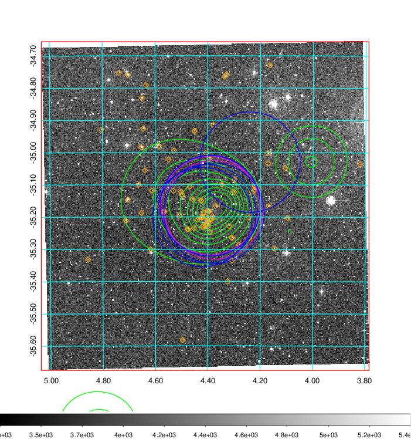  Blue circle for optical clusters;  Magenta circle for XSZ clusters;  all with r=1Mpc;  Only GC with Delta_z<0.01 are shown. | 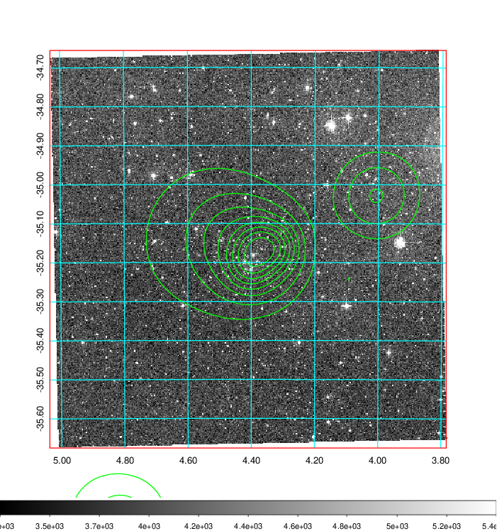 Blue circle for optical clusters;  Magenta circle for XSZ clusters;  all with r=1Mpc;  Only GC with Delta_z<0.01 are shown.  |

|[Previous-identified clusters](../image/18/18_gc.pdf) | [2MASS image](../image/18/18_2mass.pdf)      |
|-------------------|-------------------|
|  Green, magenta, and blue circles  for optical, X-ray and SZ clusters  respectively, with redshift of clusters  labelled. The radius of circles  are 1Mpc.|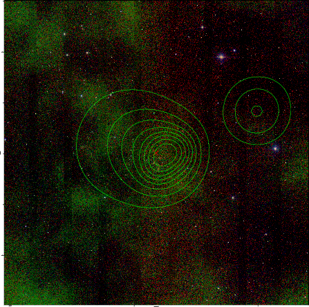  |

|[DES image](../image/18/18_des.pdf)   |[ATLAS image](../image/18/18_s.pdf)        |
|-------------------|-------------------|
| 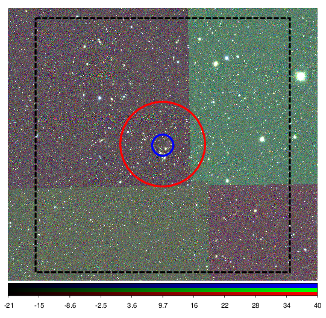  | 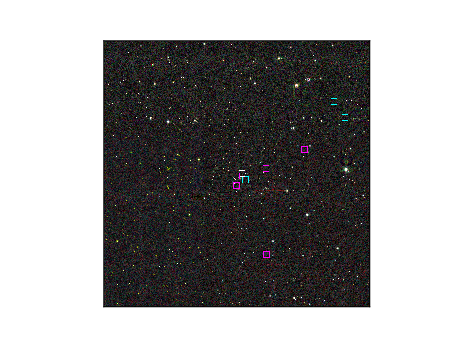  |
