

### 181

|Name|RAJ2000[deg]|DEJ2000[deg] |Ext[arcmin]| Ext,ml | z | z_src| C|GC(XSZ,Delta_z<0.01)| GC(OPT,Delta_z<0.01)|GC| R_sig[arcmin] | R500[arcmin] | R500[Mpc]| CRsig[c/s] | CR500[c/s] |L500[1E44 erg/s]|F500[1E-12 erg/s/cm^2]| M500[1E14 Msun]|Tx[keV]|Cnt_sig|Beta|Rc[arcmin]|Comment|Alias|
|---|---|---|---|---|---|------|---|--------|---------|----------|---|---|---|---|---|---|---|---|---|---|---|---|---|---|
|181| 72.076| -20.478| 5.07| 311.46| 0.0722(0.005)| z1, z_xsz| B| L03, MCXC, PSZ2, Tar, XB| A, N, W| A, L03, MCXC, N, PSZ2, Tar, W, XB, XCS| 11.238| 10.805| 0.892| 0.363(0.038)| 0.361(0.038)| 0.833(0.043)| 6.551(0.339)| 2.16(0.06)| 3.52(0.06)| 199.2| 0.967(-0.049+0.025)| 8.755(-0.468+0.401)| -| k522|

|[RASS image](../image/181/181_img.pdf)|[filtered image](../image/181/181_fil.pdf)|[Segment image](../image/181/181_seg.pdf)|
|-------------------|--------------------|-------------------|
| 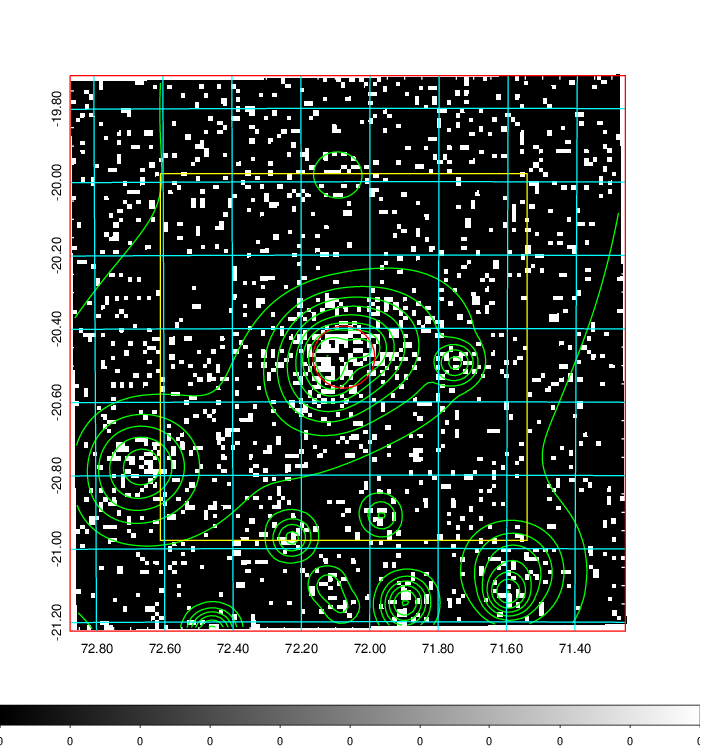  | 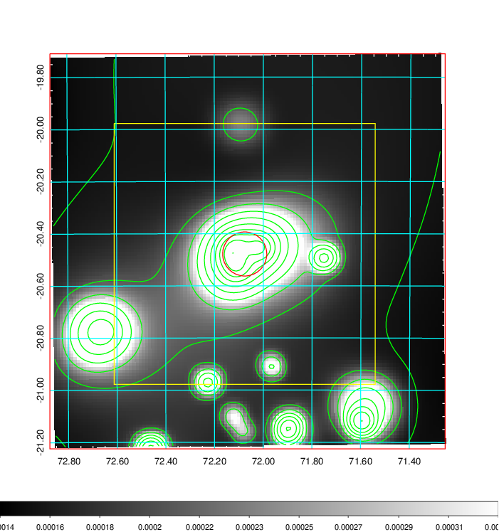   | 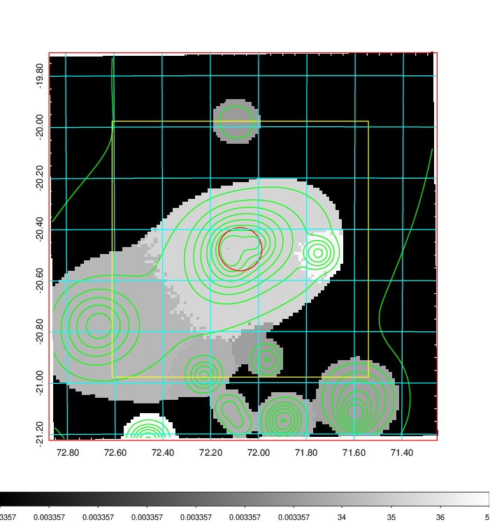  |

|[Exposure image](../image/181/181_mex.pdf)| [nH image](../image/181/181_nh.pdf)| [Planck image](../image/181/181_p.pdf)|
|-------------------|--------------------|-------------------|
|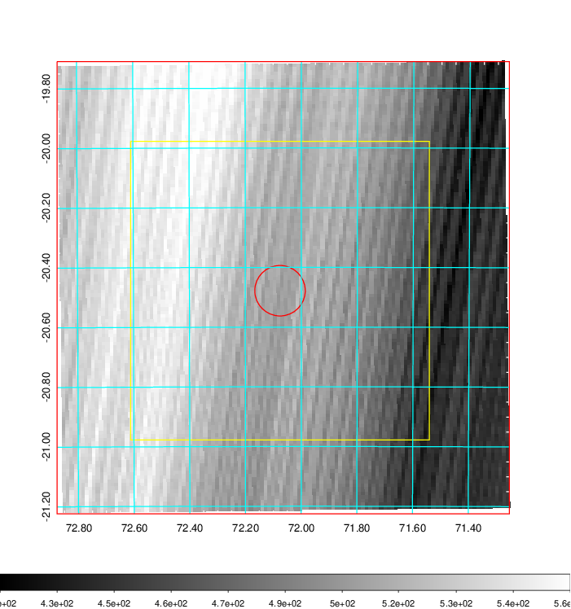   | 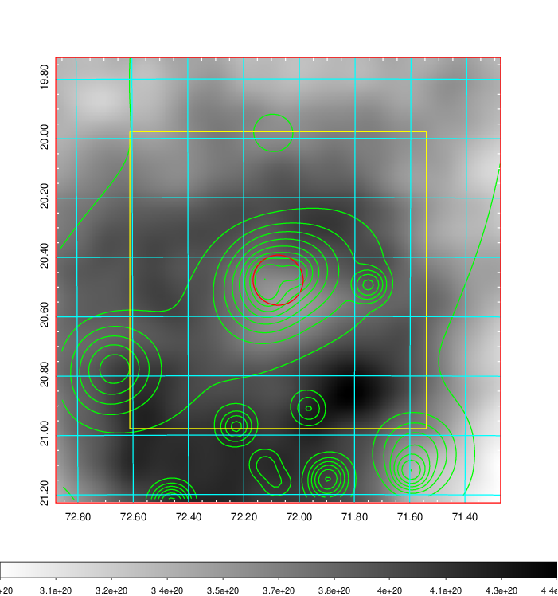    | 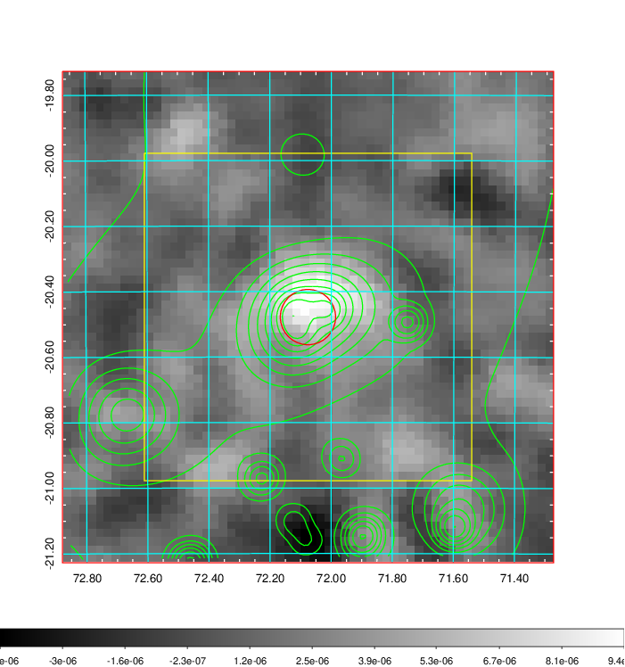 |

|[Redshift Histogram](../image/181/181_zg.pdf) | [DSS image(z1)](../image/181/181_dss_z1.pdf)      |  [DSS image(z2)](../image/181/181_dss_z2.pdf)    |
|-------------------|--------------------|-------------------|
|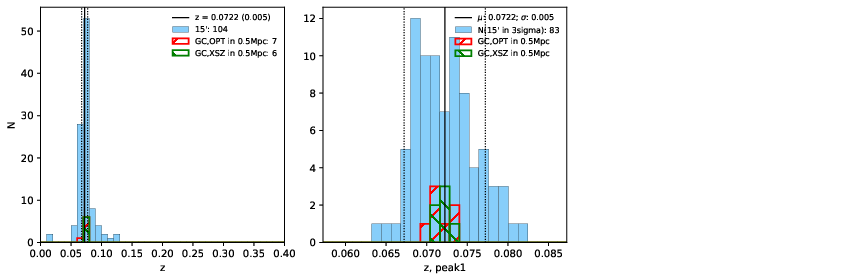 |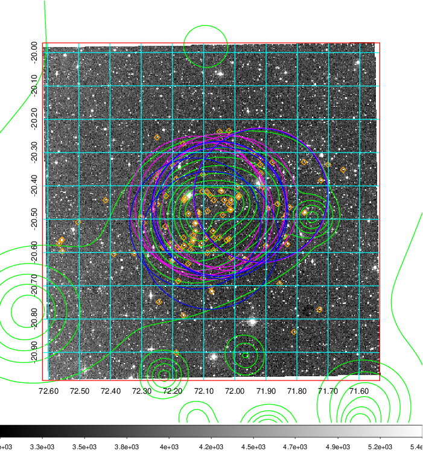  Blue circle for optical clusters;  Magenta circle for XSZ clusters;  all with r=1Mpc;  Only GC with Delta_z<0.01 are shown. | 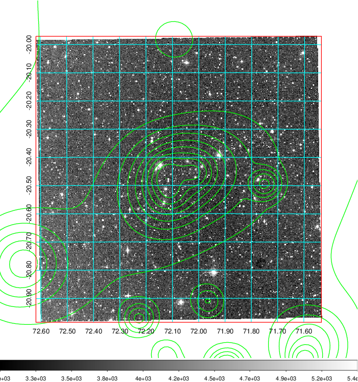 Blue circle for optical clusters;  Magenta circle for XSZ clusters;  all with r=1Mpc;  Only GC with Delta_z<0.01 are shown.  |

|[Previous-identified clusters](../image/181/181_gc.pdf) | [2MASS image](../image/181/181_2mass.pdf)      |
|-------------------|-------------------|
|  Green, magenta, and blue circles  for optical, X-ray and SZ clusters  respectively, with redshift of clusters  labelled. The radius of circles  are 1Mpc.|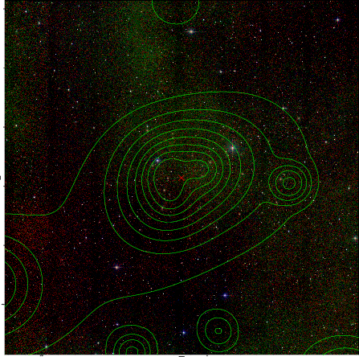  |

|[DES image](../image/181/181_des.pdf)   |[PS1 image](../image/181/181_ps1.pdf)            |
|-------------------|-------------------|
| 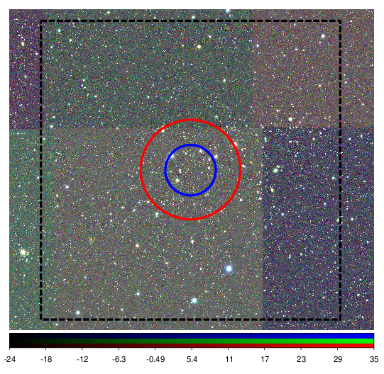  | 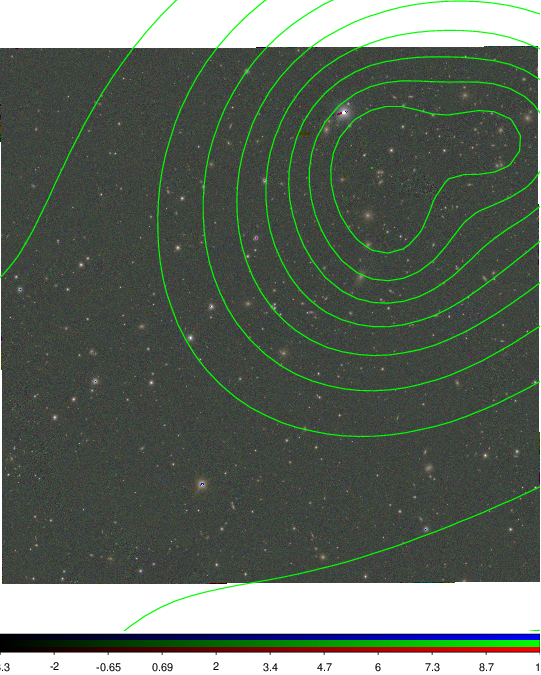  |
