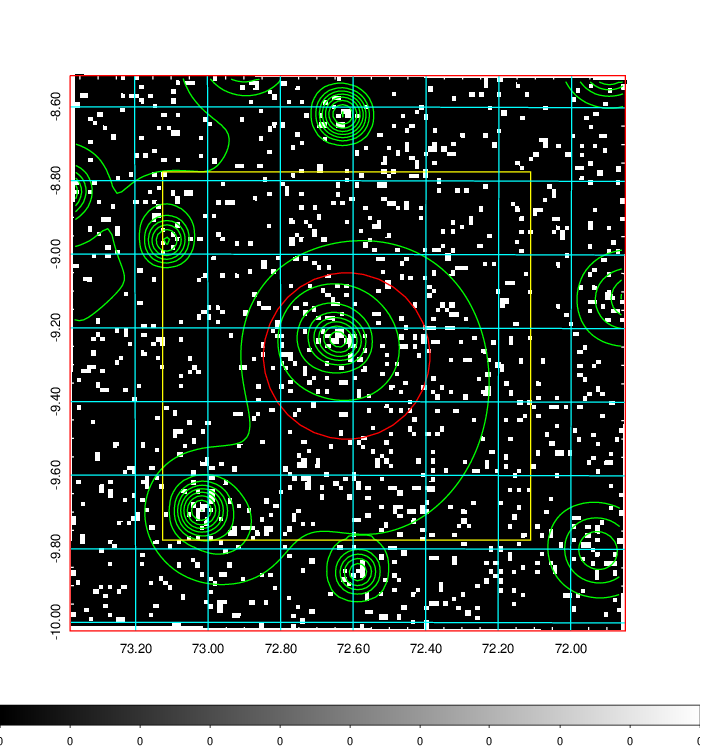
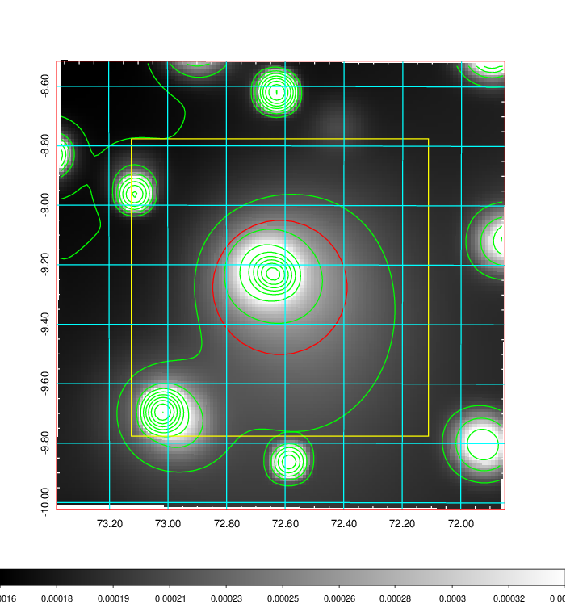
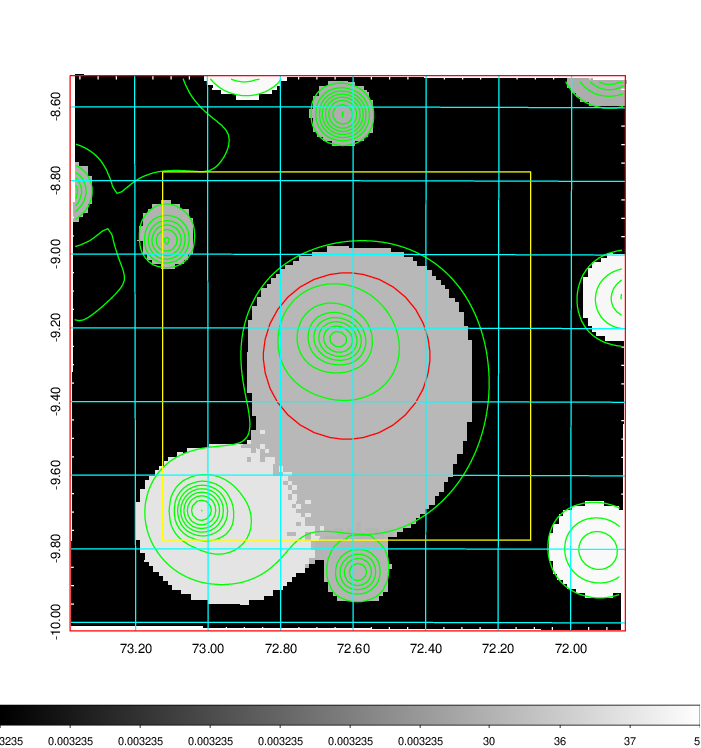
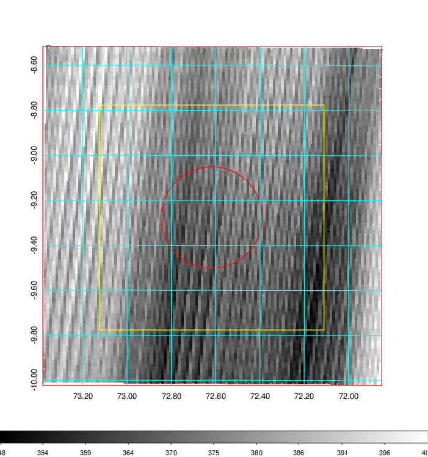
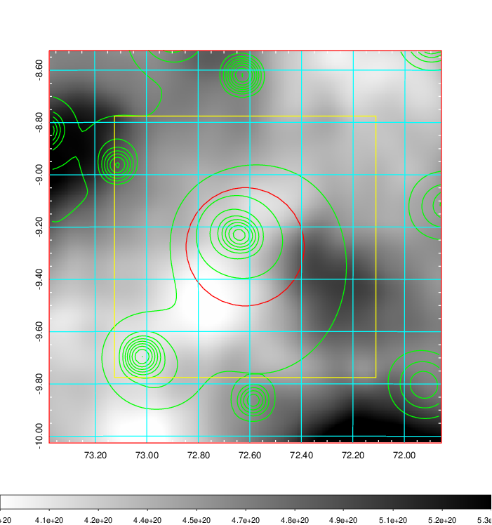
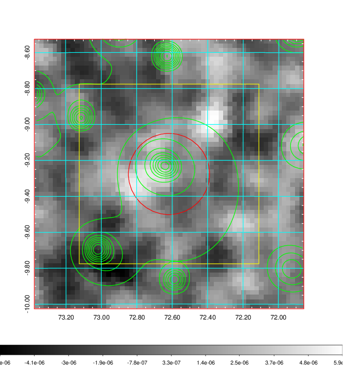
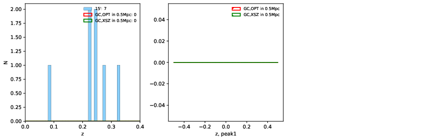
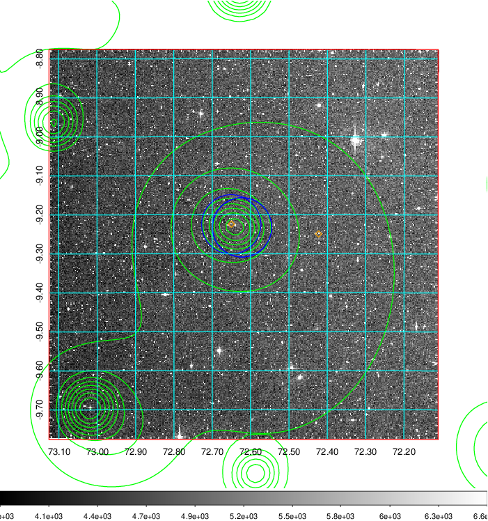
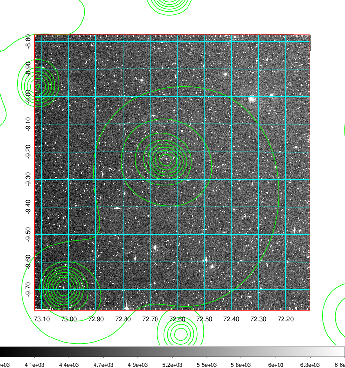
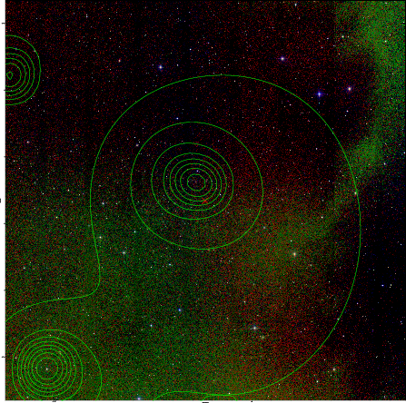

### 182

|Name|RAJ2000[deg]|DEJ2000[deg] |Ext[arcmin]| Ext,ml | z | z_src| C|GC(XSZ,Delta_z<0.01)| GC(OPT,Delta_z<0.01)|GC| R_sig[arcmin] | R500[arcmin] | R500[Mpc]| CRsig[c/s] | CR500[c/s] |L500[1E44 erg/s]|F500[1E-12 erg/s/cm^2]| M500[1E14 Msun]|Tx[keV]|Cnt_sig|Beta|Rc[arcmin]|Comment|Alias|
|---|---|---|---|---|---|------|---|--------|---------|----------|---|---|---|---|---|---|---|---|---|---|---|---|---|---|
|182| 72.618| -9.276| 13.56| 29.55| 0.2252(0.000)| -| G| -| -| A, W| 21.244| 5.456| 1.184| 0.194(0.067)| 0.173(0.060)| 4.964(2.237)| 3.310(1.491)| 5.91(1.25)| 6.90(0.93)| 99.9| 0.724(-0.132+0.164)| 8.654(-2.391+2.453)| An Abell cluster with $z$ = 0.2244 and offset = 0.58 Mpc| t515|

|[RASS image](../image/182/182_img.pdf)|[filtered image](../image/182/182_fil.pdf)|[Segment image](../image/182/182_seg.pdf)|
|-------------------|--------------------|-------------------|
|   |    |   |

|[Exposure image](../image/182/182_mex.pdf)| [nH image](../image/182/182_nh.pdf)| [Planck image](../image/182/182_p.pdf)|
|-------------------|--------------------|-------------------|
|   |     |  |

|[Redshift Histogram](../image/182/182_zg.pdf) | [DSS image(z1)](../image/182/182_dss_z1.pdf)      |  [DSS image(z2)](../image/182/182_dss_z2.pdf)    |
|-------------------|--------------------|-------------------|
| |  Blue circle for optical clusters;  Magenta circle for XSZ clusters;  all with r=1Mpc;  Only GC with Delta_z<0.01 are shown. |  Blue circle for optical clusters;  Magenta circle for XSZ clusters;  all with r=1Mpc;  Only GC with Delta_z<0.01 are shown.  |

|[known Abell/XSZ clusters](../image/182/182_gc.pdf) | [2MASS image](../image/182/182_2mass.pdf)      |
|-------------------|-------------------|
|  Magenta, blue and green circles  for optical, X-ray and SZ clusters  respectively, with redshift of clusters  labelled. The radius of circles  are 1Mpc.|  |

|[PS1 image](../image/182/182_ps1.pdf)            |
|-------------------|
|   |
