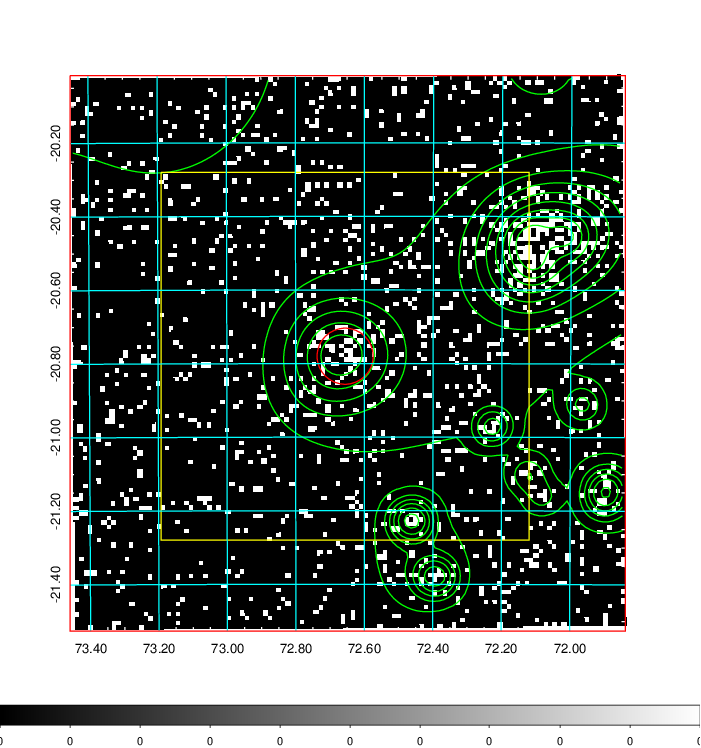
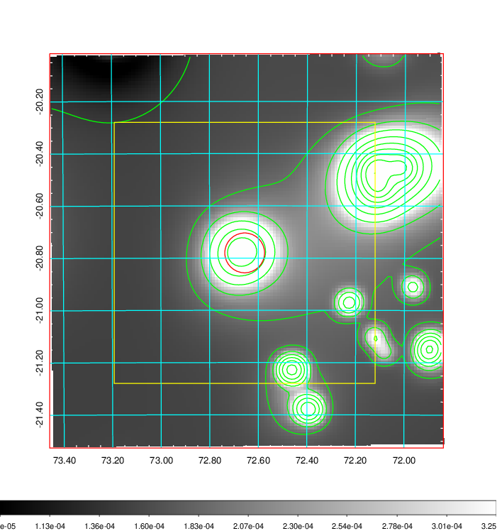
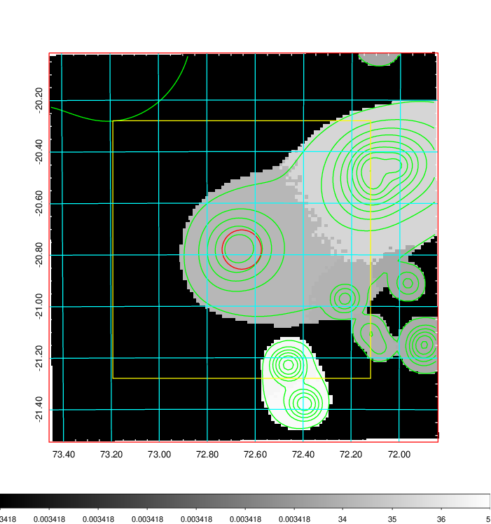
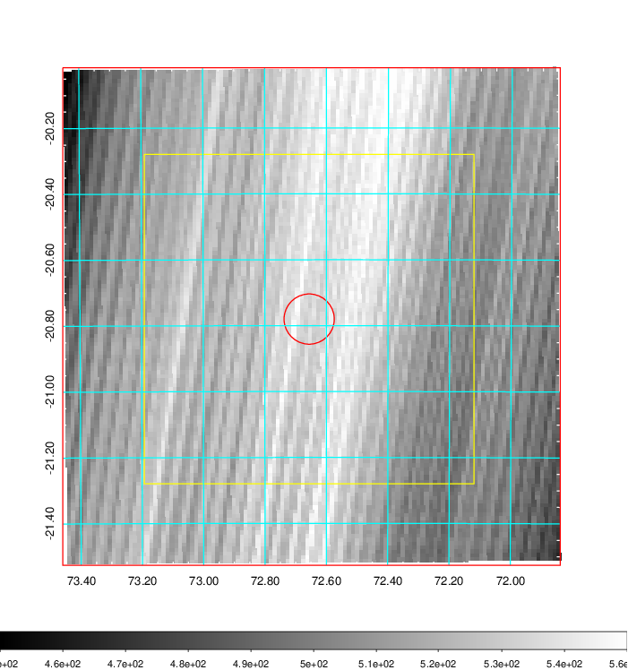
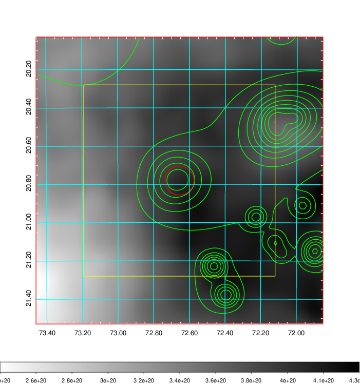
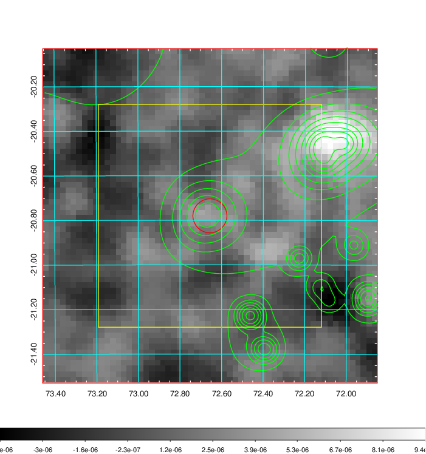
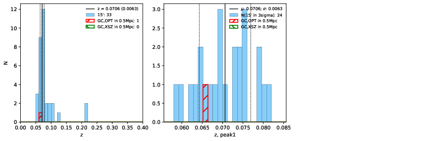
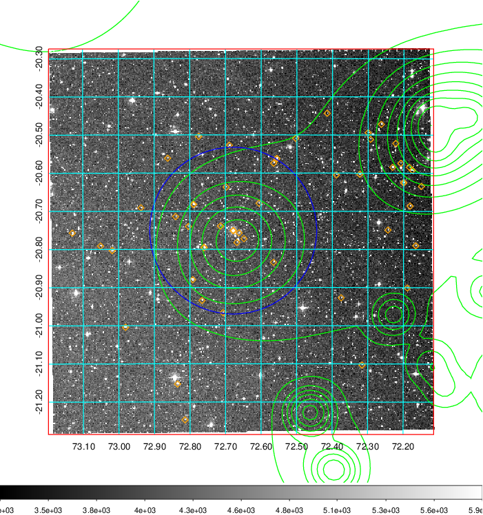
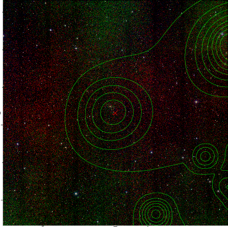

### 183

|Name|RAJ2000[deg]|DEJ2000[deg] |Ext[arcmin]| Ext,ml | z | z_src| C|GC(XSZ,Delta_z<0.01)| GC(OPT,Delta_z<0.01)|GC| R_sig[arcmin] | R500[arcmin] | R500[Mpc]| CRsig[c/s] | CR500[c/s] |L500[1E44 erg/s]|F500[1E-12 erg/s/cm^2]| M500[1E14 Msun]|Tx[keV]|Cnt_sig|Beta|Rc[arcmin]|Comment|Alias|
|---|---|---|---|---|---|------|---|--------|---------|----------|---|---|---|---|---|---|---|---|---|---|---|---|---|---|
|183| 72.656| -20.780| 4.57| 48.95| 0.0706(0.006)| z1, z_opt| S| -| W| N, W| 23.219| 9.072| 0.733| 0.158(0.054)| 0.144(0.049)| 0.307(0.079)| 2.526(0.648)| 1.20(0.16)| 2.45(0.20)| 128.2| 0.638(-0.077+0.120)| 4.600(-1.163+1.574)| -| t233|

|[RASS image](../image/183/183_img.pdf)|[filtered image](../image/183/183_fil.pdf)|[Segment image](../image/183/183_seg.pdf)|
|-------------------|--------------------|-------------------|
|   |    |   |

|[Exposure image](../image/183/183_mex.pdf)| [nH image](../image/183/183_nh.pdf)| [Planck image](../image/183/183_p.pdf)|
|-------------------|--------------------|-------------------|
|   |     |  |

|[Redshift Histogram](../image/183/183_zg.pdf) | [DSS image(z1)](../image/183/183_dss_z1.pdf)      |  [DSS image(z2)](../image/183/183_dss_z2.pdf)    |
|-------------------|--------------------|-------------------|
| |  Blue circle for optical clusters;  Magenta circle for XSZ clusters;  all with r=1Mpc;  Only GC with Delta_z<0.01 are shown. |  Blue circle for optical clusters;  Magenta circle for XSZ clusters;  all with r=1Mpc;  Only GC with Delta_z<0.01 are shown.  |

|[known Abell/XSZ clusters](../image/183/183_gc.pdf) | [2MASS image](../image/183/183_2mass.pdf)      |
|-------------------|-------------------|
|  Magenta, blue and green circles  for optical, X-ray and SZ clusters  respectively, with redshift of clusters  labelled. The radius of circles  are 1Mpc.|  |

|[DES image](../image/183/183_des.pdf)   |[PS1 image](../image/183/183_ps1.pdf)            |
|-------------------|-------------------|
|   |   |
