

### 184

|Name|RAJ2000[deg]|DEJ2000[deg] |Ext[arcmin]| Ext,ml | z | z_src| C|GC(XSZ,Delta_z<0.01)| GC(OPT,Delta_z<0.01)|GC| R_sig[arcmin] | R500[arcmin] | R500[Mpc]| CRsig[c/s] | CR500[c/s] |L500[1E44 erg/s]|F500[1E-12 erg/s/cm^2]| M500[1E14 Msun]|Tx[keV]|Cnt_sig|Beta|Rc[arcmin]|Comment|Alias|
|---|---|---|---|---|---|------|---|--------|---------|----------|---|---|---|---|---|---|---|---|---|---|---|---|---|---|
|184| 73.214| 1.297| 2.70| 30.31| 0.0298(0.005)| z1, z_opt| S| -| N| N| 32.680| 14.196| 0.508| 0.147(0.077)| 0.135(0.070)| 0.037(0.019)| 1.797(0.915)| 0.38(0.10)| 1.20(0.20)| 62.7| 0.583(-0.056+0.094)| 2.830(-0.880+1.183)| -| t113|

|[RASS image](../image/184/184_img.pdf)|[filtered image](../image/184/184_fil.pdf)|[Segment image](../image/184/184_seg.pdf)|
|-------------------|--------------------|-------------------|
| 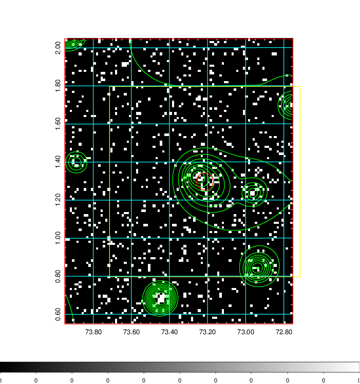  | 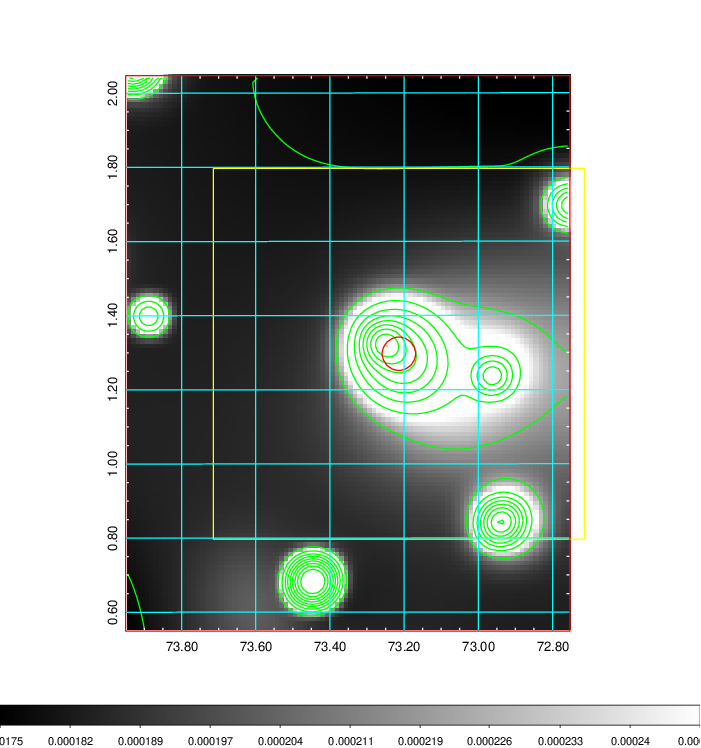   | 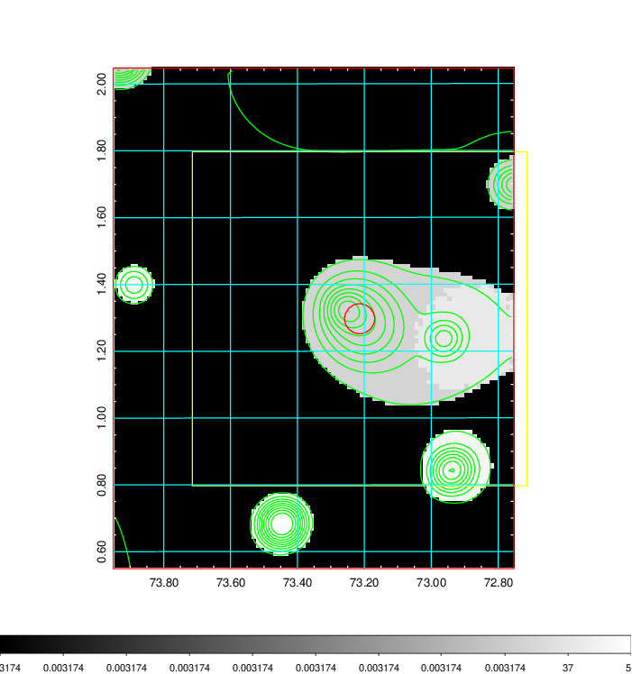  |

|[Exposure image](../image/184/184_mex.pdf)| [nH image](../image/184/184_nh.pdf)| [Planck image](../image/184/184_p.pdf)|
|-------------------|--------------------|-------------------|
|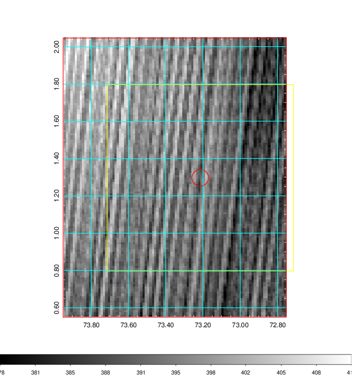   | 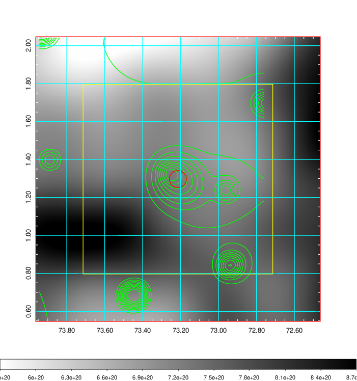    | 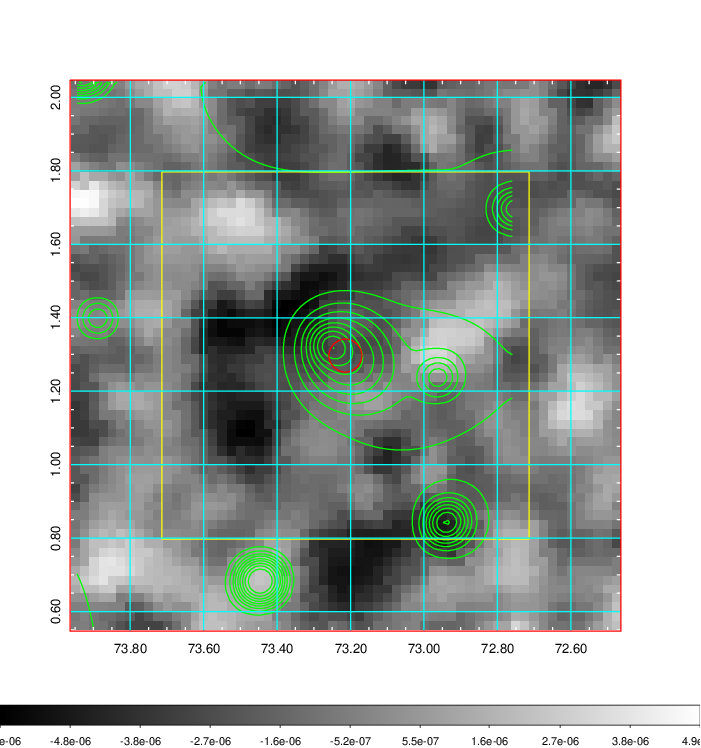 |

|[Redshift Histogram](../image/184/184_zg.pdf) | [DSS image(z1)](../image/184/184_dss_z1.pdf)      |  [DSS image(z2)](../image/184/184_dss_z2.pdf)    |
|-------------------|--------------------|-------------------|
|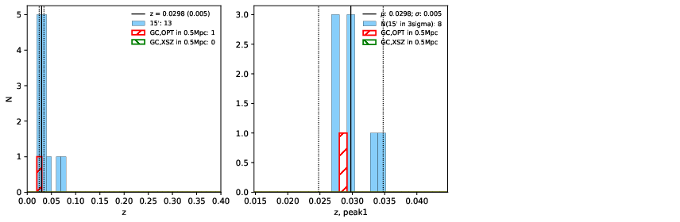 |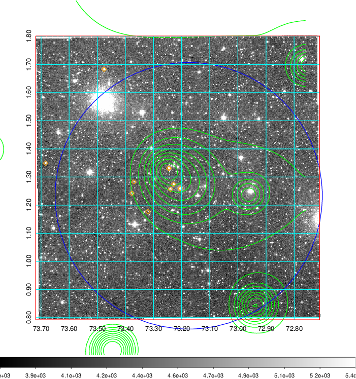  Blue circle for optical clusters;  Magenta circle for XSZ clusters;  all with r=1Mpc;  Only GC with Delta_z<0.01 are shown. | 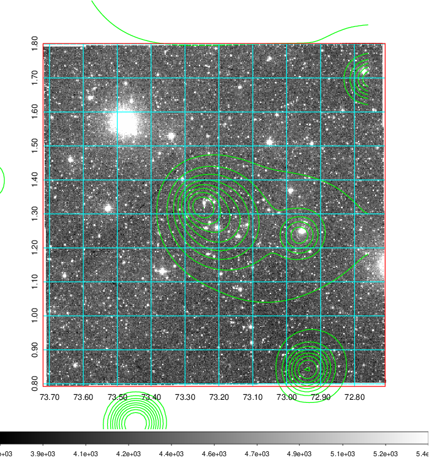 Blue circle for optical clusters;  Magenta circle for XSZ clusters;  all with r=1Mpc;  Only GC with Delta_z<0.01 are shown.  |

|[Previous-identified clusters](../image/184/184_gc.pdf) | [2MASS image](../image/184/184_2mass.pdf)      |[SDSS image](../image/184/184_sdss.pdf)   |
|-------------------|-------------------|-------------------|
|  Green, magenta, and blue circles  for optical, X-ray and SZ clusters  respectively, with redshift of clusters  labelled. The radius of circles  are 1Mpc.|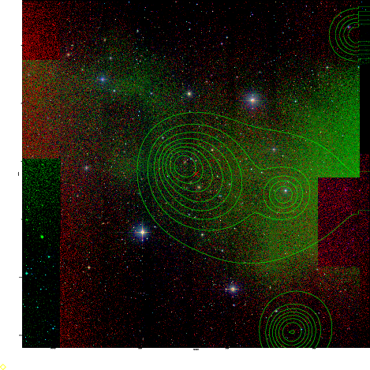  | 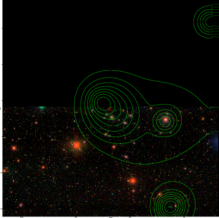  |

