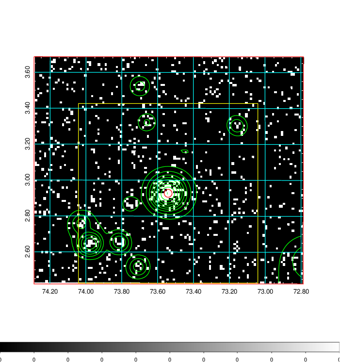
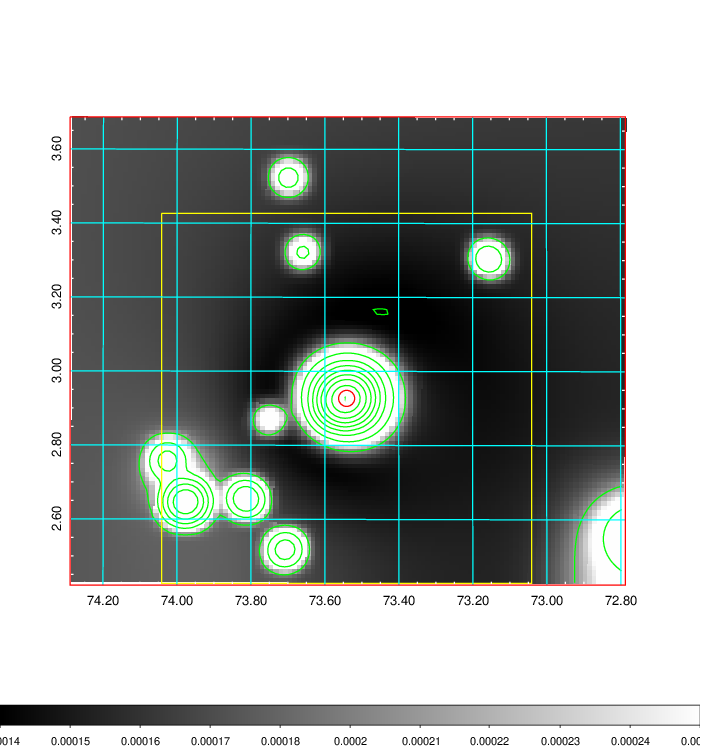
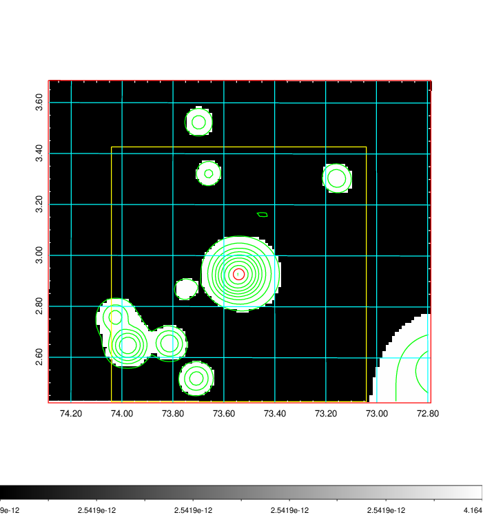
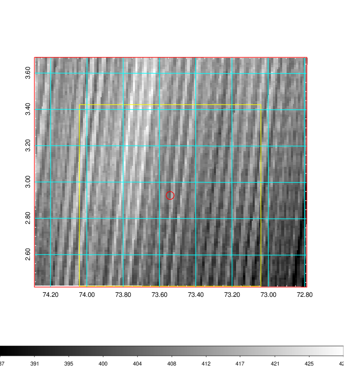
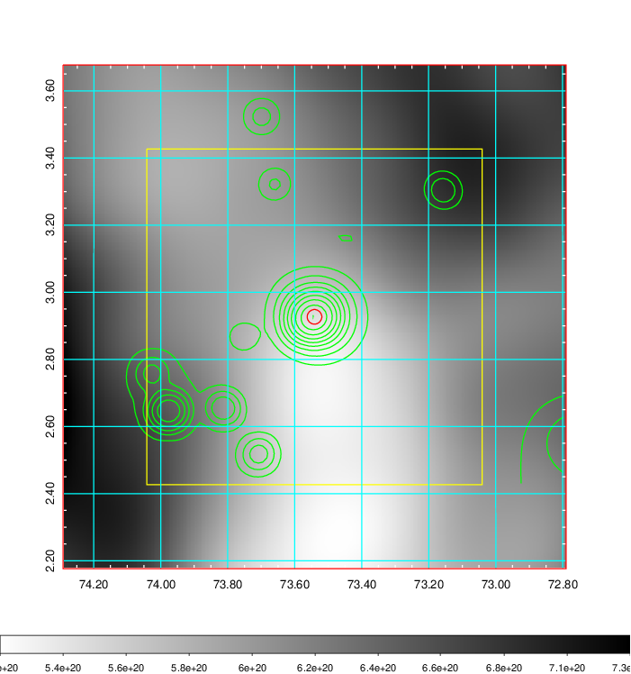
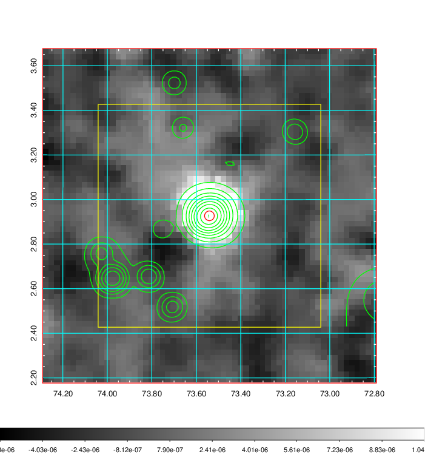
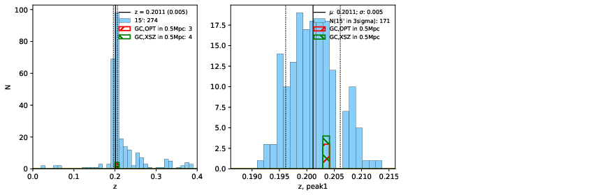
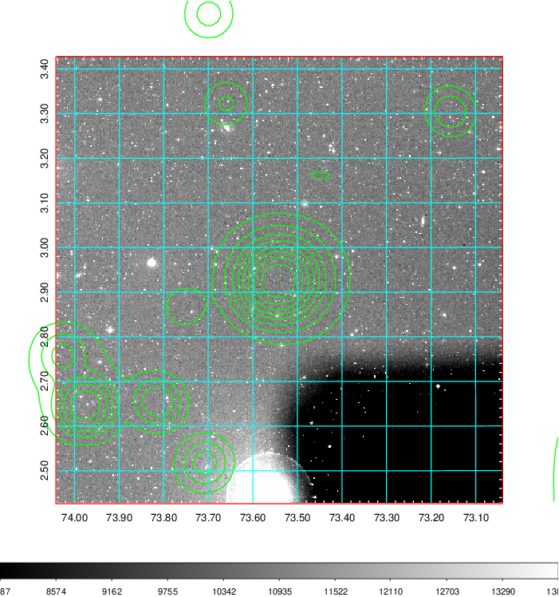
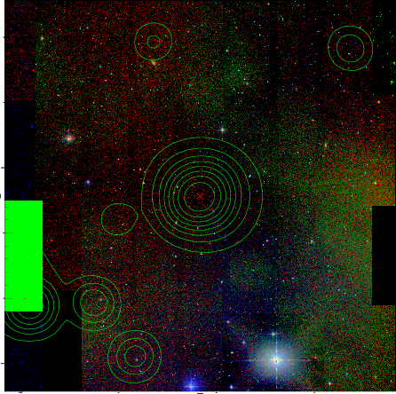
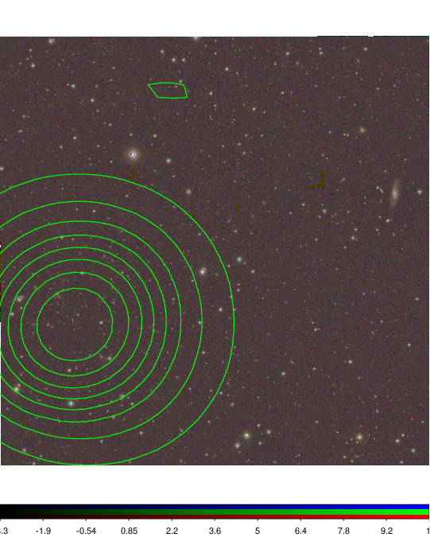

### 185

|Name|RAJ2000[deg]|DEJ2000[deg] |Ext[arcmin]| Ext,ml | z | z_src| C|GC(XSZ,Delta_z<0.01)| GC(OPT,Delta_z<0.01)|GC| R_sig[arcmin] | R500[arcmin] | R500[Mpc]| CRsig[c/s] | CR500[c/s] |L500[1E44 erg/s]|F500[1E-12 erg/s/cm^2]| M500[1E14 Msun]|Tx[keV]|Cnt_sig|Beta|Rc[arcmin]|Comment|Alias|
|---|---|---|---|---|---|------|---|--------|---------|----------|---|---|---|---|---|---|---|---|---|---|---|---|---|---|
|185| 73.541| 2.927| 1.31| 55.04| 0.2011(0.005)| z1, z_xsz| B| MCXC, PSZ2, Tar, XB| N| A, MCXC, N, PSZ2, Tar, W, XB| 8.800| 6.623| 1.317| 0.351(0.040)| 0.337(0.039)| 7.389(0.302)| 6.351(0.259)| 7.93(0.15)| 8.20(0.10)| 130.0| 0.874(-0.112+0.087)| 3.418(-0.636+0.468)| -| k078|

|[RASS image](../image/185/185_img.pdf)|[filtered image](../image/185/185_fil.pdf)|[Segment image](../image/185/185_seg.pdf)|
|-------------------|--------------------|-------------------|
|   |    |   |

|[Exposure image](../image/185/185_mex.pdf)| [nH image](../image/185/185_nh.pdf)| [Planck image](../image/185/185_p.pdf)|
|-------------------|--------------------|-------------------|
|   |     |  |

|[Redshift Histogram](../image/185/185_zg.pdf) | [DSS image(z1)](../image/185/185_dss_z1.pdf)      |  [DSS image(z2)](../image/185/185_dss_z2.pdf)    |
|-------------------|--------------------|-------------------|
| |  Blue circle for optical clusters;  Magenta circle for XSZ clusters;  all with r=1Mpc;  Only GC with Delta_z<0.01 are shown. |  Blue circle for optical clusters;  Magenta circle for XSZ clusters;  all with r=1Mpc;  Only GC with Delta_z<0.01 are shown.  |

|[Previous-identified clusters](../image/185/185_gc.pdf) | [2MASS image](../image/185/185_2mass.pdf)      |
|-------------------|-------------------|
|  Green, magenta, and blue circles  for optical, X-ray and SZ clusters  respectively, with redshift of clusters  labelled. The radius of circles  are 1Mpc.|  |

|[PS1 image](../image/185/185_ps1.pdf)            |
|-------------------|
|   |
