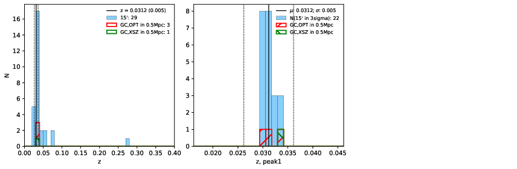

### 186

|Name|RAJ2000[deg]|DEJ2000[deg] |Ext[arcmin]| Ext,ml | z | z_src| C|GC(XSZ,Delta_z<0.01)| GC(OPT,Delta_z<0.01)|GC| R_sig[arcmin] | R500[arcmin] | R500[Mpc]| CRsig[c/s] | CR500[c/s] |L500[1E44 erg/s]|F500[1E-12 erg/s/cm^2]| M500[1E14 Msun]|Tx[keV]|Cnt_sig|Beta|Rc[arcmin]|Comment|Alias|
|---|---|---|---|---|---|------|---|--------|---------|----------|---|---|---|---|---|---|---|---|---|---|---|---|---|---|
|186| 73.713| -18.095| 2.27| 65.40| 0.0312(0.005)| z1, z_xsz| B| MCXC| N| MCXC, N| 28.156| 17.558| 0.657| 0.451(0.065)| 0.424(0.061)| 0.156(0.016)| 6.951(0.710)| 0.83(0.04)| 1.93(0.06)| 183.4| 0.513(-0.009+0.018)| 2.042(-0.224+0.315)| -| k263|

|[RASS image](../image/186/186_img.pdf)|[filtered image](../image/186/186_fil.pdf)|[Segment image](../image/186/186_seg.pdf)|
|-------------------|--------------------|-------------------|
|   |    |   |

|[Exposure image](../image/186/186_mex.pdf)| [nH image](../image/186/186_nh.pdf)| [Planck image](../image/186/186_p.pdf)|
|-------------------|--------------------|-------------------|
|   |     |  |

|[Redshift Histogram](../image/186/186_zg.pdf) | [DSS image(z1)](../image/186/186_dss_z1.pdf)      |  [DSS image(z2)](../image/186/186_dss_z2.pdf)    |
|-------------------|--------------------|-------------------|
| |  Blue circle for optical clusters;  Magenta circle for XSZ clusters;  all with r=1Mpc;  Only GC with Delta_z<0.01 are shown. |  Blue circle for optical clusters;  Magenta circle for XSZ clusters;  all with r=1Mpc;  Only GC with Delta_z<0.01 are shown.  |

|[known Abell/XSZ clusters](../image/186/186_gc.pdf) | [2MASS image](../image/186/186_2mass.pdf)      |
|-------------------|-------------------|
|  Magenta, blue and green circles  for optical, X-ray and SZ clusters  respectively, with redshift of clusters  labelled. The radius of circles  are 1Mpc.|  |

|[DES image](../image/186/186_des.pdf)   |[PS1 image](../image/186/186_ps1.pdf)            |
|-------------------|-------------------|
|   |   |
