

### 187

|Name|RAJ2000[deg]|DEJ2000[deg] |Ext[arcmin]| Ext,ml | z | z_src| C|GC(XSZ,Delta_z<0.01)| GC(OPT,Delta_z<0.01)|GC| R_sig[arcmin] | R500[arcmin] | R500[Mpc]| CRsig[c/s] | CR500[c/s] |L500[1E44 erg/s]|F500[1E-12 erg/s/cm^2]| M500[1E14 Msun]|Tx[keV]|Cnt_sig|Beta|Rc[arcmin]|Comment|Alias|
|---|---|---|---|---|---|------|---|--------|---------|----------|---|---|---|---|---|---|---|---|---|---|---|---|---|---|
|187| 74.549| -30.110| 2.77| 26.95| 0.1019(0.006)| z1, z_opt| S| -| A, W| A, N, W| 14.650| 6.683| 0.752| 0.094(0.026)| 0.086(0.024)| 0.453(0.098)| 1.715(0.370)| 1.33(0.15)| 2.64(0.18)| 55.4| 0.836(-0.157+0.115)| 4.665(-1.161+0.904)| -| t119|

|[RASS image](../image/187/187_img.pdf)|[filtered image](../image/187/187_fil.pdf)|[Segment image](../image/187/187_seg.pdf)|
|-------------------|--------------------|-------------------|
| 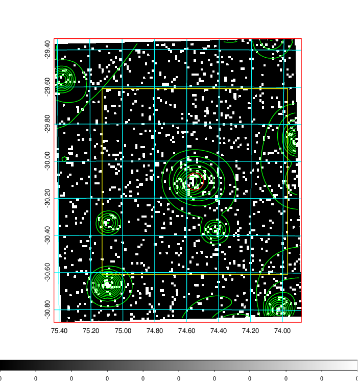  | 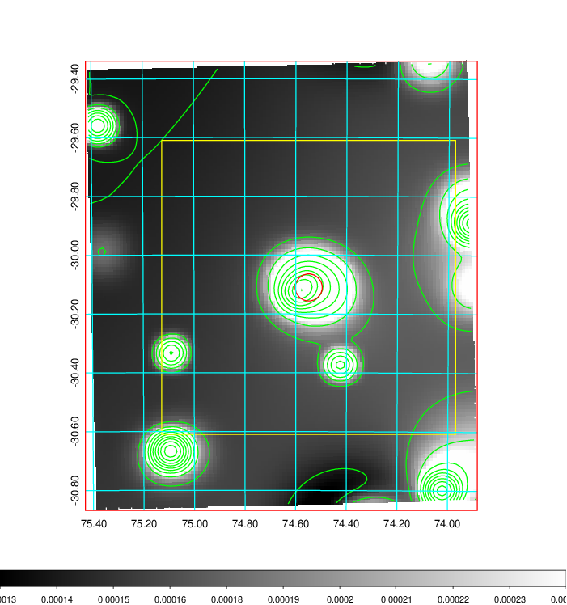   | 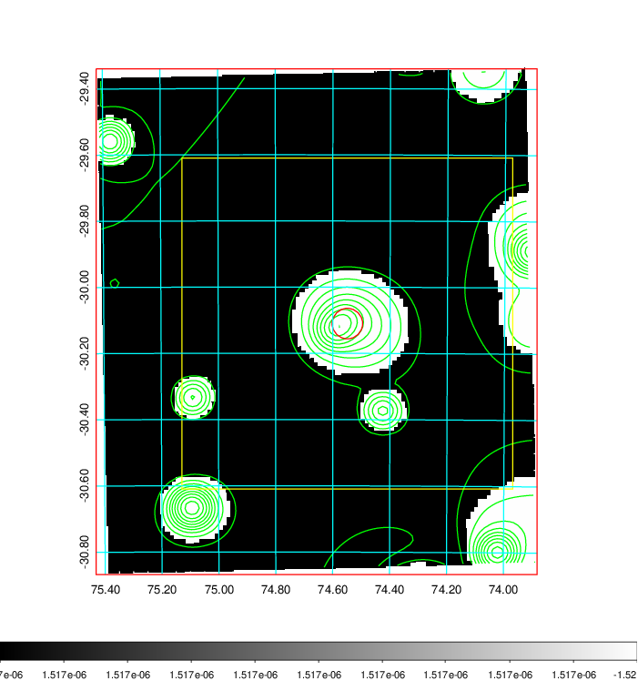  |

|[Exposure image](../image/187/187_mex.pdf)| [nH image](../image/187/187_nh.pdf)| [Planck image](../image/187/187_p.pdf)|
|-------------------|--------------------|-------------------|
|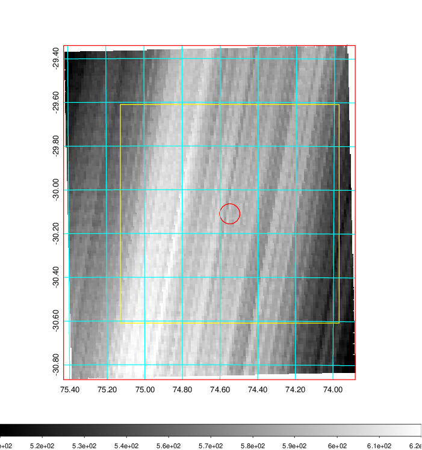   | 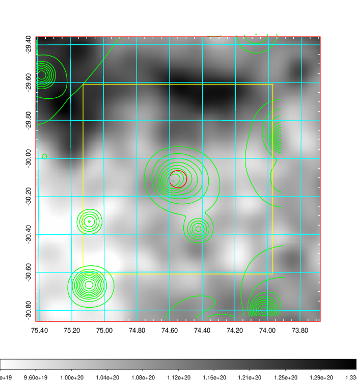    | 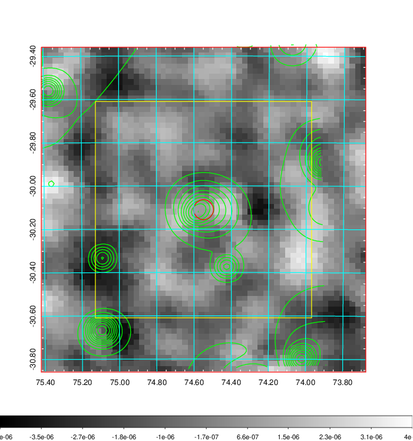 |

|[Redshift Histogram](../image/187/187_zg.pdf) | [DSS image(z1)](../image/187/187_dss_z1.pdf)      |  [DSS image(z2)](../image/187/187_dss_z2.pdf)    |
|-------------------|--------------------|-------------------|
|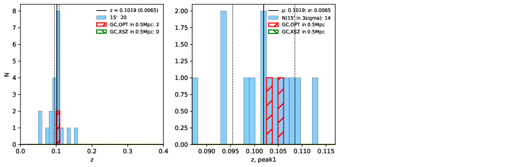 |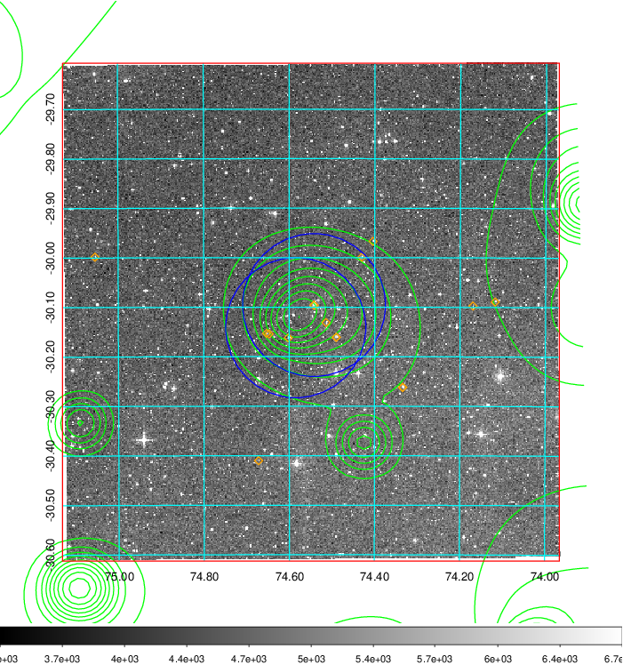  Blue circle for optical clusters;  Magenta circle for XSZ clusters;  all with r=1Mpc;  Only GC with Delta_z<0.01 are shown. | 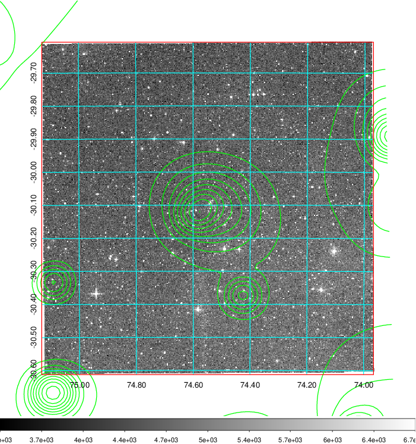 Blue circle for optical clusters;  Magenta circle for XSZ clusters;  all with r=1Mpc;  Only GC with Delta_z<0.01 are shown.  |

|[Previous-identified clusters](../image/187/187_gc.pdf) | [2MASS image](../image/187/187_2mass.pdf)      |
|-------------------|-------------------|
|  Green, magenta, and blue circles  for optical, X-ray and SZ clusters  respectively, with redshift of clusters  labelled. The radius of circles  are 1Mpc.|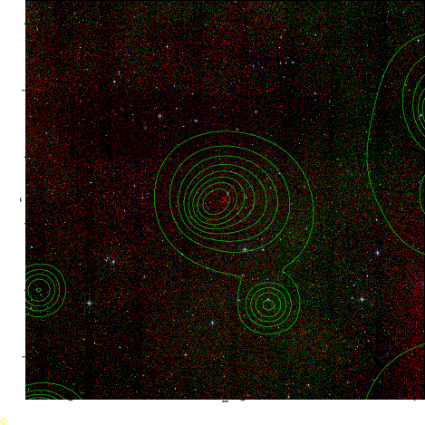  |

|[DES image](../image/187/187_des.pdf)   |[PS1 image](../image/187/187_ps1.pdf)            |
|-------------------|-------------------|
| 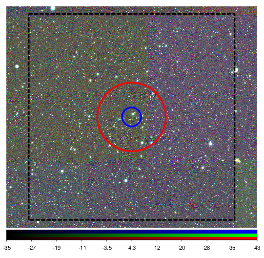  | 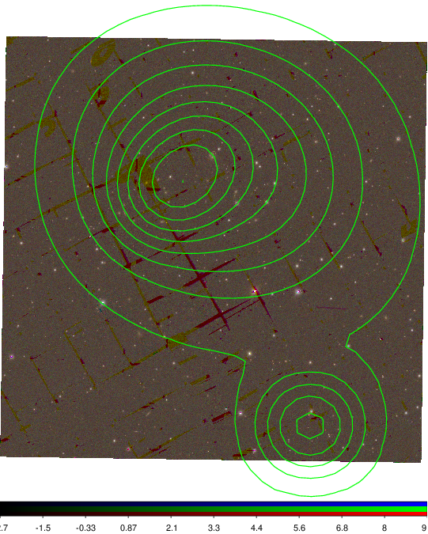  |
