

### 188

|Name|RAJ2000[deg]|DEJ2000[deg] |Ext[arcmin]| Ext,ml | z | z_src| C|GC(XSZ,Delta_z<0.01)| GC(OPT,Delta_z<0.01)|GC| R_sig[arcmin] | R500[arcmin] | R500[Mpc]| CRsig[c/s] | CR500[c/s] |L500[1E44 erg/s]|F500[1E-12 erg/s/cm^2]| M500[1E14 Msun]|Tx[keV]|Cnt_sig|Beta|Rc[arcmin]|Comment|Alias|
|---|---|---|---|---|---|------|---|--------|---------|----------|---|---|---|---|---|---|---|---|---|---|---|---|---|---|
|188| 74.794| 8.779| 2.59| 43.94| 0.1038(0.009)| z1, z_xsz| B| MCXC, Tar| A, W| A, MCXC, Tar, W| 14.162| 6.918| 0.791| 0.094(0.036)| 0.086(0.033)| 0.395(0.043)| 1.439(0.158)| 1.56(0.09)| 2.91(0.10)| 105.4| 0.933(-0.088+0.049)| 4.235(-0.523+0.466)| -| k315|

|[RASS image](../image/188/188_img.pdf)|[filtered image](../image/188/188_fil.pdf)|[Segment image](../image/188/188_seg.pdf)|
|-------------------|--------------------|-------------------|
| 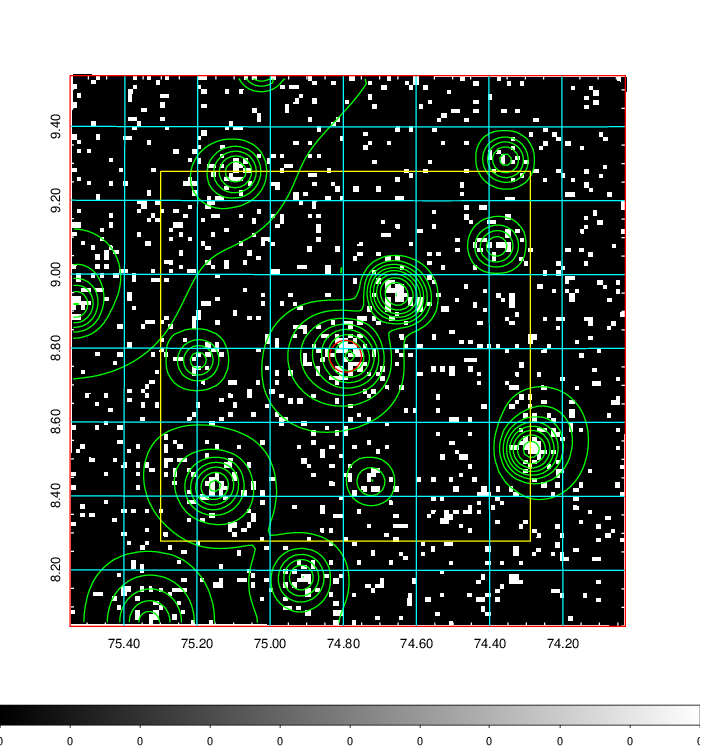  | 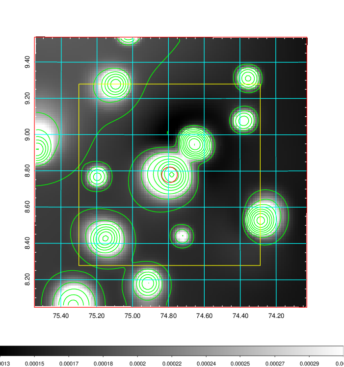   | 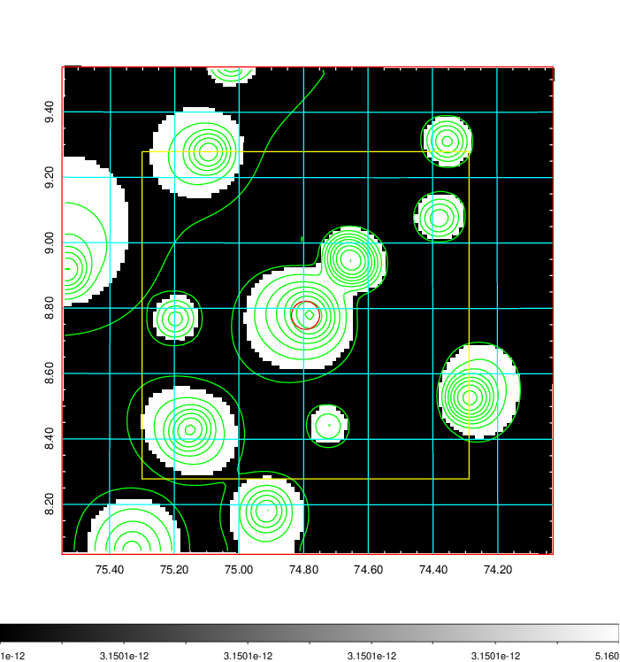  |

|[Exposure image](../image/188/188_mex.pdf)| [nH image](../image/188/188_nh.pdf)| [Planck image](../image/188/188_p.pdf)|
|-------------------|--------------------|-------------------|
|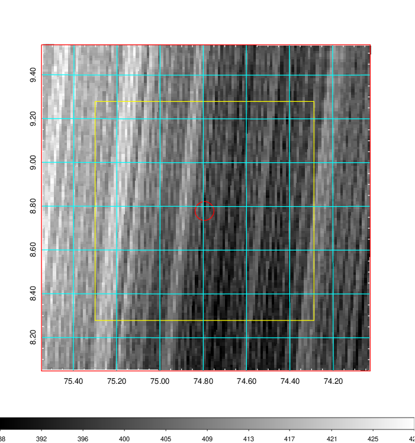   | 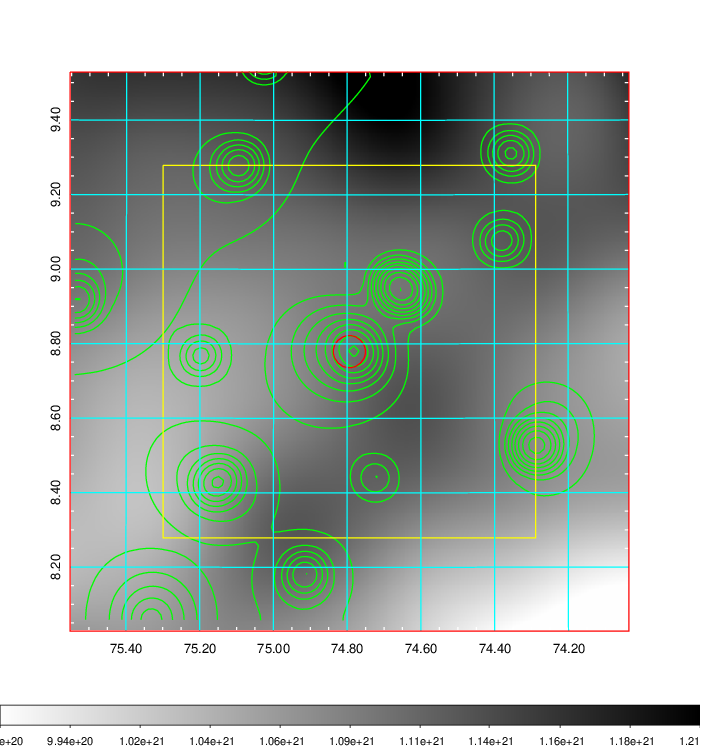    | 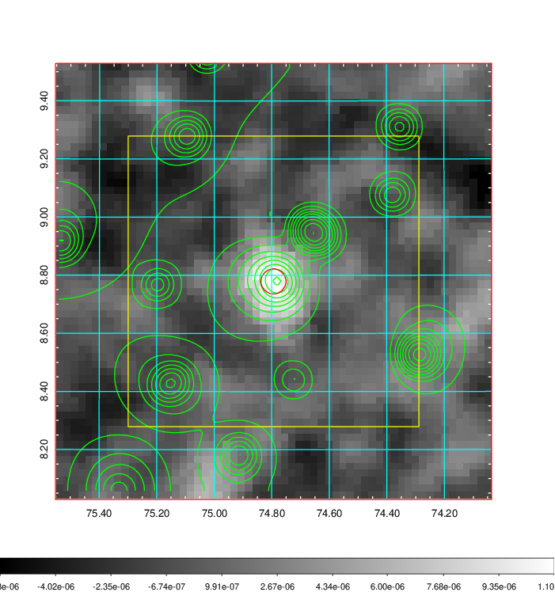 |

|[Redshift Histogram](../image/188/188_zg.pdf) | [DSS image(z1)](../image/188/188_dss_z1.pdf)      |  [DSS image(z2)](../image/188/188_dss_z2.pdf)    |
|-------------------|--------------------|-------------------|
|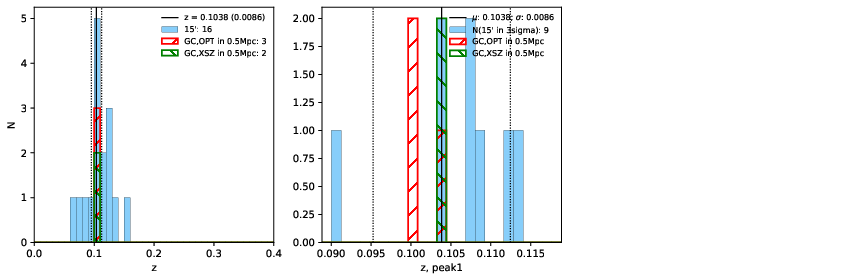 |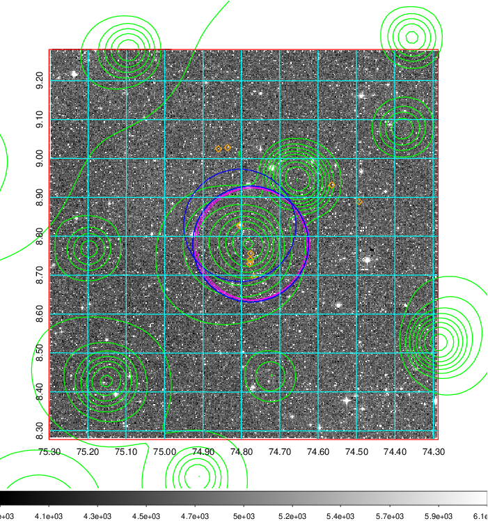  Blue circle for optical clusters;  Magenta circle for XSZ clusters;  all with r=1Mpc;  Only GC with Delta_z<0.01 are shown. | 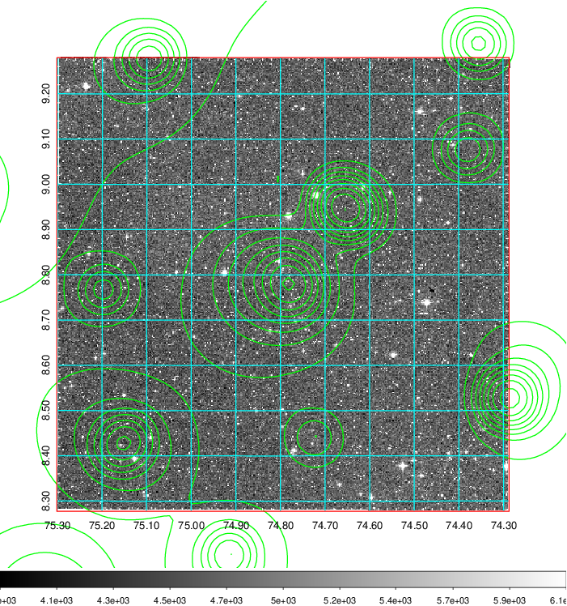 Blue circle for optical clusters;  Magenta circle for XSZ clusters;  all with r=1Mpc;  Only GC with Delta_z<0.01 are shown.  |

|[Previous-identified clusters](../image/188/188_gc.pdf) | [2MASS image](../image/188/188_2mass.pdf)      |
|-------------------|-------------------|
|  Green, magenta, and blue circles  for optical, X-ray and SZ clusters  respectively, with redshift of clusters  labelled. The radius of circles  are 1Mpc.|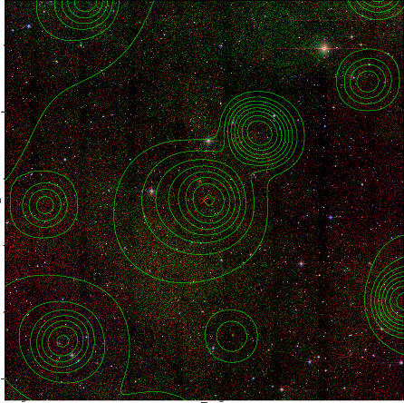  |

|[PS1 image](../image/188/188_ps1.pdf)            |
|-------------------|
| 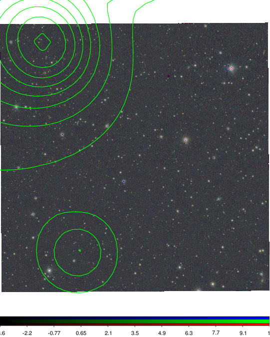  |
