

### 189

|Name|RAJ2000[deg]|DEJ2000[deg] |Ext[arcmin]| Ext,ml | z | z_src| C|GC(XSZ,Delta_z<0.01)| GC(OPT,Delta_z<0.01)|GC| R_sig[arcmin] | R500[arcmin] | R500[Mpc]| CRsig[c/s] | CR500[c/s] |L500[1E44 erg/s]|F500[1E-12 erg/s/cm^2]| M500[1E14 Msun]|Tx[keV]|Cnt_sig|Beta|Rc[arcmin]|Comment|Alias|
|---|---|---|---|---|---|------|---|--------|---------|----------|---|---|---|---|---|---|---|---|---|---|---|---|---|---|
|189| 74.964| 80.132| 4.27| 76.45| 0.0602(0.007)| z1, z_opt| S| -| A, W| A, W| 14.162| 10.646| 0.743| 0.205(0.032)| 0.197(0.030)| 0.284(0.026)| 3.263(0.295)| 1.23(0.06)| 2.48(0.07)| 111.4| 0.796(-0.148+0.136)| 6.280(-1.503+1.228)| -| t215|

|[RASS image](../image/189/189_img.pdf)|[filtered image](../image/189/189_fil.pdf)|[Segment image](../image/189/189_seg.pdf)|
|-------------------|--------------------|-------------------|
| 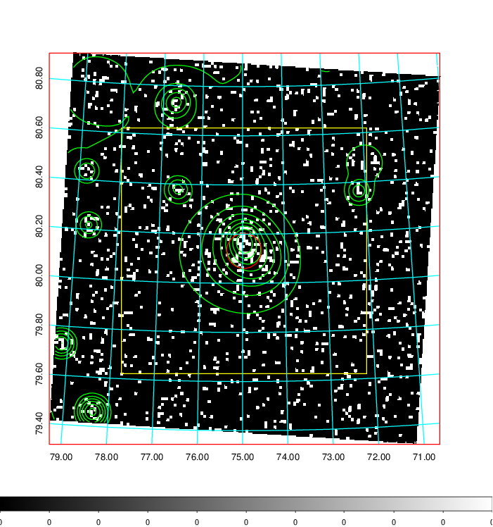  | 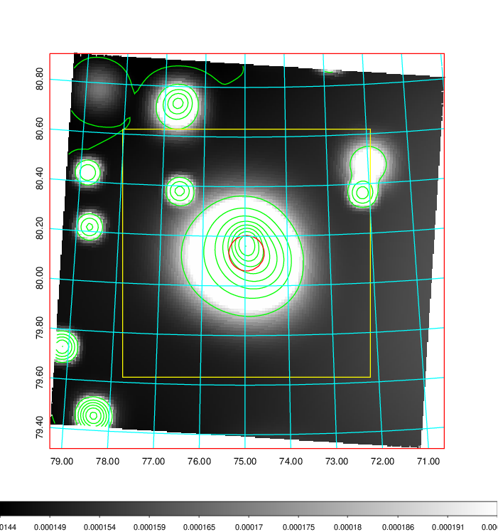   | 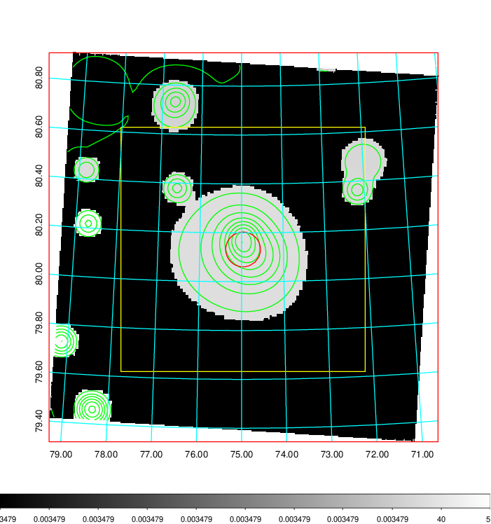  |

|[Exposure image](../image/189/189_mex.pdf)| [nH image](../image/189/189_nh.pdf)| [Planck image](../image/189/189_p.pdf)|
|-------------------|--------------------|-------------------|
|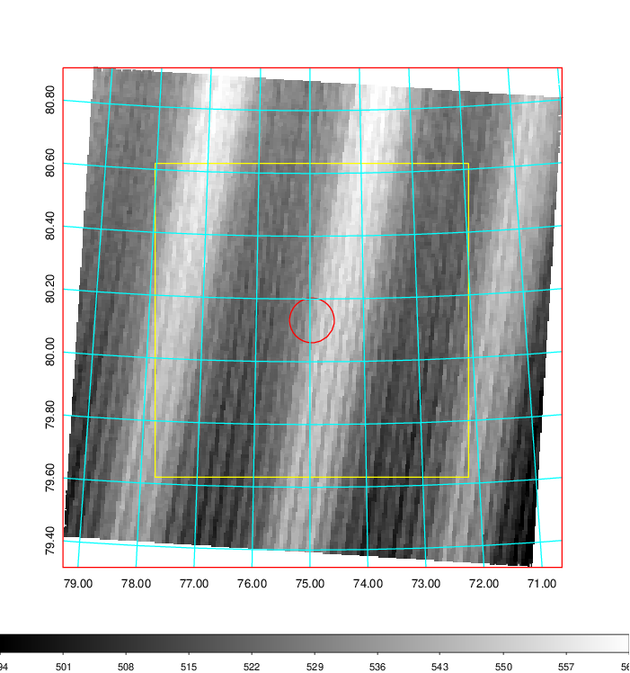   | 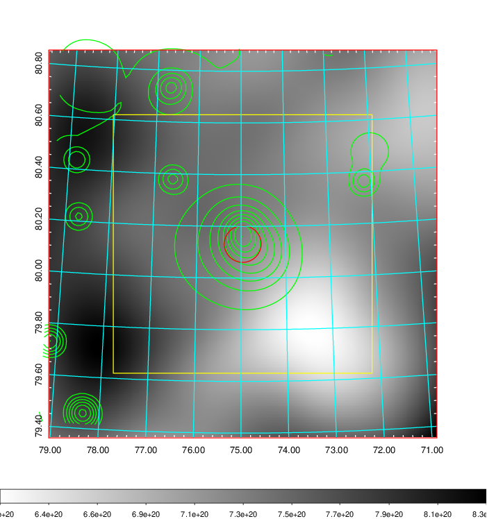    | 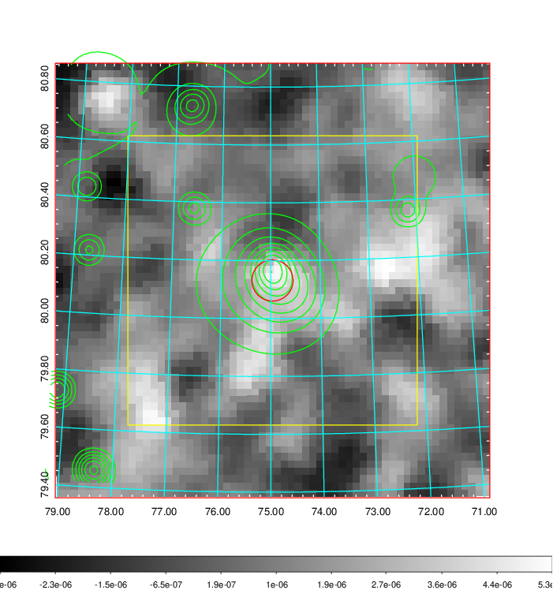 |

|[Redshift Histogram](../image/189/189_zg.pdf) | [DSS image(z1)](../image/189/189_dss_z1.pdf)      |  [DSS image(z2)](../image/189/189_dss_z2.pdf)    |
|-------------------|--------------------|-------------------|
|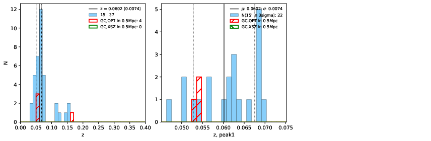 |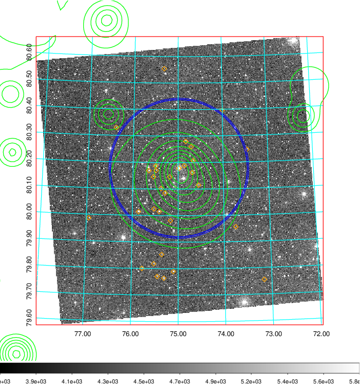  Blue circle for optical clusters;  Magenta circle for XSZ clusters;  all with r=1Mpc;  Only GC with Delta_z<0.01 are shown. | 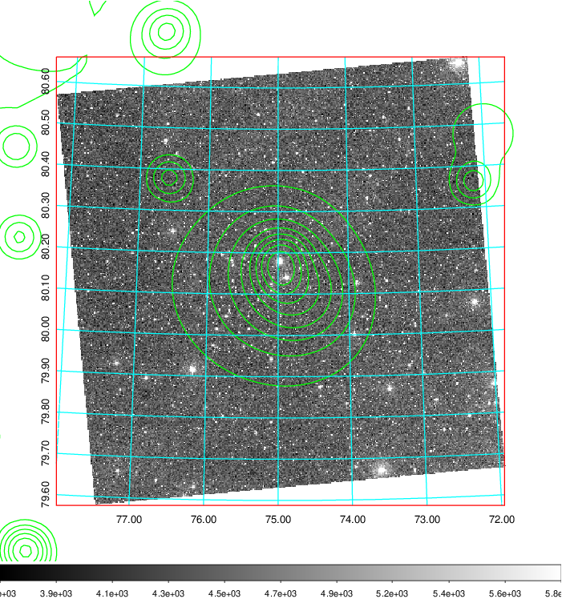 Blue circle for optical clusters;  Magenta circle for XSZ clusters;  all with r=1Mpc;  Only GC with Delta_z<0.01 are shown.  |

|[Previous-identified clusters](../image/189/189_gc.pdf) | [2MASS image](../image/189/189_2mass.pdf)      |
|-------------------|-------------------|
|  Green, magenta, and blue circles  for optical, X-ray and SZ clusters  respectively, with redshift of clusters  labelled. The radius of circles  are 1Mpc.|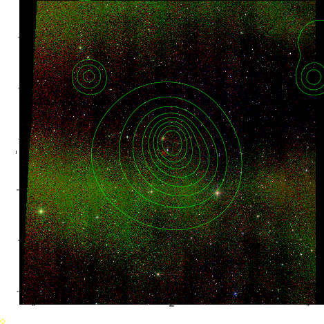  |

|[PS1 image](../image/189/189_ps1.pdf)            |
|-------------------|
| 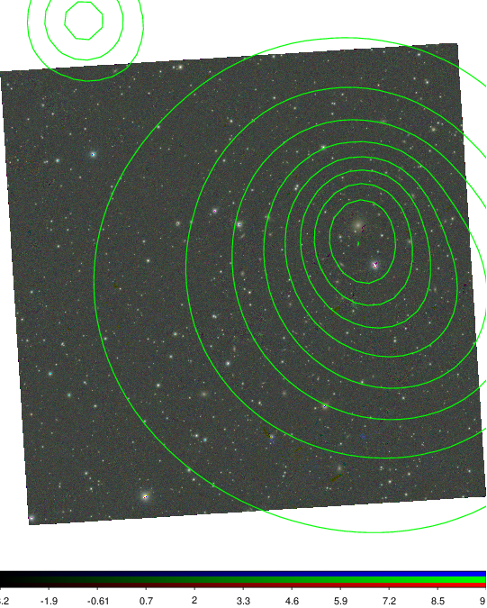  |
