

### 19

|Name|RAJ2000[deg]|DEJ2000[deg] |Ext[arcmin]| Ext,ml | z | z_src| C|GC(XSZ,Delta_z<0.01)| GC(OPT,Delta_z<0.01)|GC| R_sig[arcmin] | R500[arcmin] | R500[Mpc]| CRsig[c/s] | CR500[c/s] |L500[1E44 erg/s]|F500[1E-12 erg/s/cm^2]| M500[1E14 Msun]|Tx[keV]|Cnt_sig|Beta|Rc[arcmin]|Comment|Alias|
|---|---|---|---|---|---|------|---|--------|---------|----------|---|---|---|---|---|---|---|---|---|---|---|---|---|---|
|19| 5.161| 28.661| 2.94| 131.15| 0.0945(0.005)| z1, z_xsz| B| F20, MCXC, PSZ2, SPI, Tar, XB| A, N, RM, W| A, C, F20, MCXC, N, PSZ2, SPI, Tar, W, XB| 13.675| 9.469| 0.996| 0.382(0.044)| 0.364(0.042)| 1.520(0.087)| 6.762(0.387)| 3.08(0.09)| 4.42(0.08)| 146.4| 0.847(-0.119+0.103)| 5.204(-0.944+0.751)| -| k368|

|[RASS image](../image/19/19_img.pdf)|[filtered image](../image/19/19_fil.pdf)|[Segment image](../image/19/19_seg.pdf)|
|-------------------|--------------------|-------------------|
| 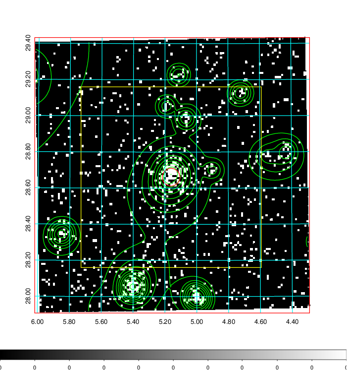  | 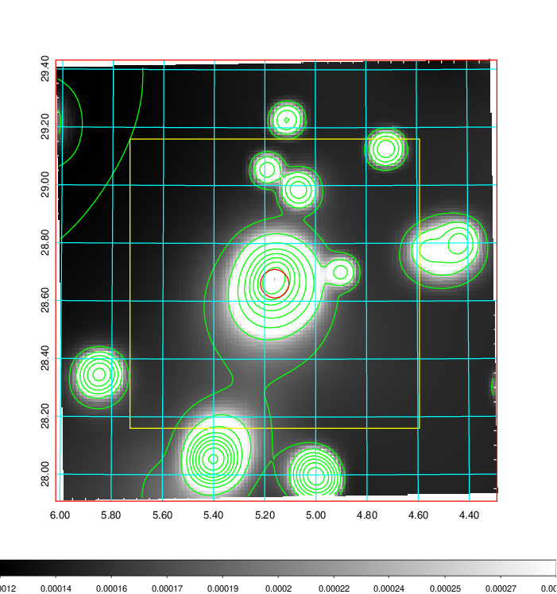   | 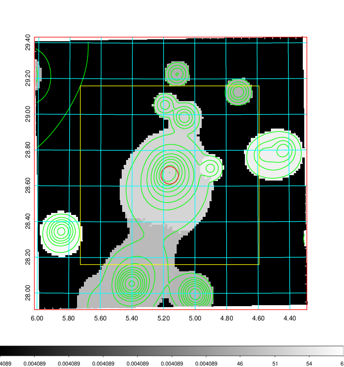  |

|[Exposure image](../image/19/19_mex.pdf)| [nH image](../image/19/19_nh.pdf)| [Planck image](../image/19/19_p.pdf)|
|-------------------|--------------------|-------------------|
|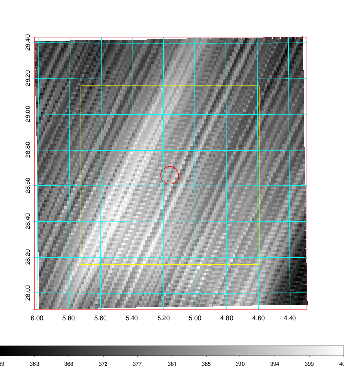   | 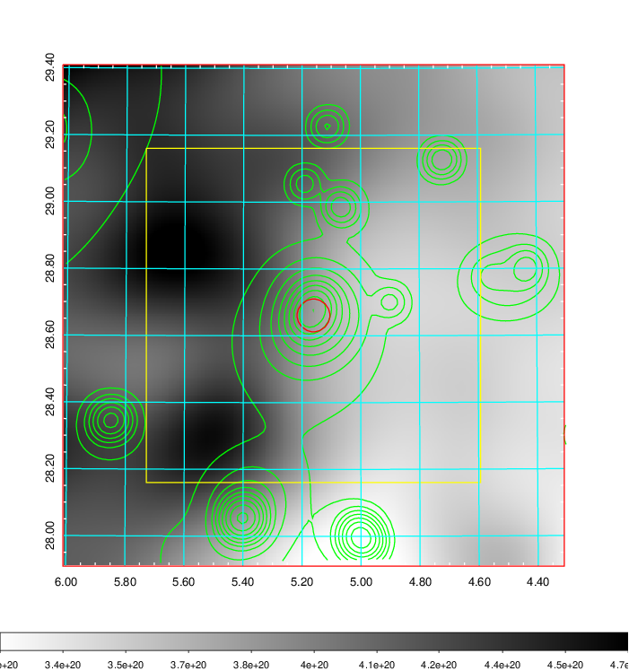    | 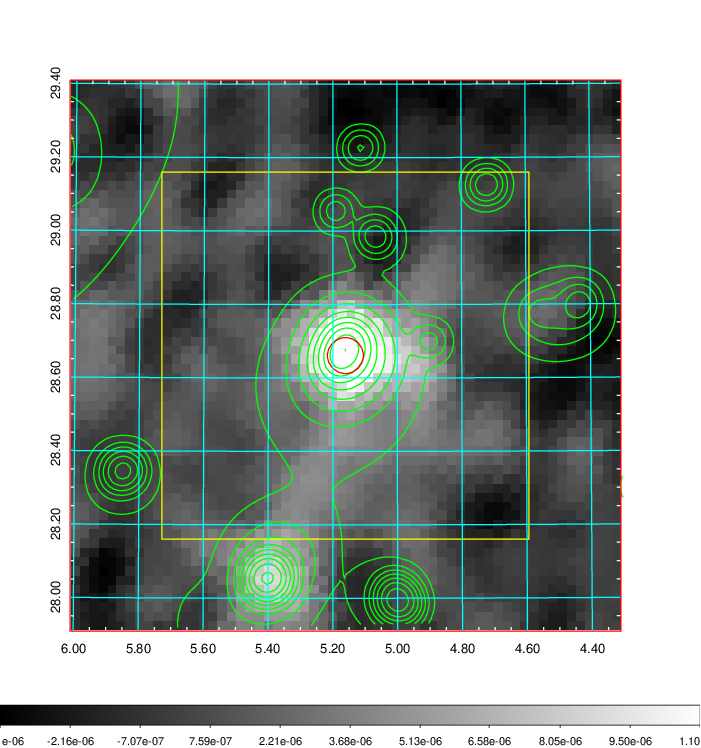 |

|[Redshift Histogram](../image/19/19_zg.pdf) | [DSS image(z1)](../image/19/19_dss_z1.pdf)      |  [DSS image(z2)](../image/19/19_dss_z2.pdf)    |
|-------------------|--------------------|-------------------|
|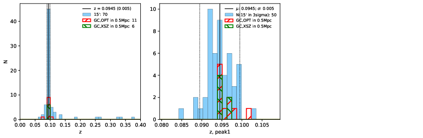 |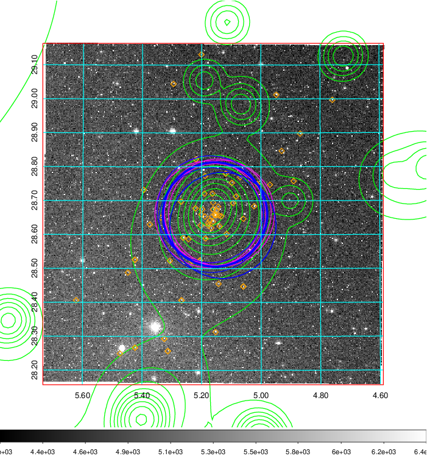  Blue circle for optical clusters;  Magenta circle for XSZ clusters;  all with r=1Mpc;  Only GC with Delta_z<0.01 are shown. | 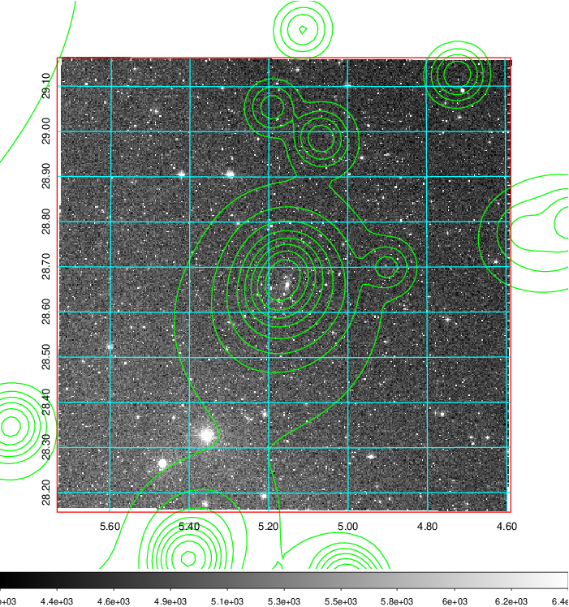 Blue circle for optical clusters;  Magenta circle for XSZ clusters;  all with r=1Mpc;  Only GC with Delta_z<0.01 are shown.  |

|[Previous-identified clusters](../image/19/19_gc.pdf) | [2MASS image](../image/19/19_2mass.pdf)      |[SDSS image](../image/19/19_sdss.pdf)   |
|-------------------|-------------------|-------------------|
|  Green, magenta, and blue circles  for optical, X-ray and SZ clusters  respectively, with redshift of clusters  labelled. The radius of circles  are 1Mpc.|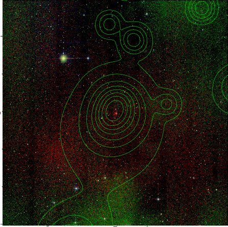  | 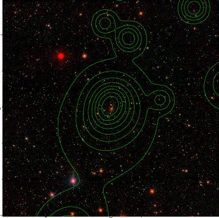  |

