

### 190

|Name|RAJ2000[deg]|DEJ2000[deg] |Ext[arcmin]| Ext,ml | z | z_src| C|GC(XSZ,Delta_z<0.01)| GC(OPT,Delta_z<0.01)|GC| R_sig[arcmin] | R500[arcmin] | R500[Mpc]| CRsig[c/s] | CR500[c/s] |L500[1E44 erg/s]|F500[1E-12 erg/s/cm^2]| M500[1E14 Msun]|Tx[keV]|Cnt_sig|Beta|Rc[arcmin]|Comment|Alias|
|---|---|---|---|---|---|------|---|--------|---------|----------|---|---|---|---|---|---|---|---|---|---|---|---|---|---|
|190| 75.182| -38.683| 3.95| 194.79| 0.0563(0.005)| z1, z_xsz| B| MCXC, PSZ2, Tar| A, N, W| A, MCXC, N, PSZ2, Tar, W| 11.725| 12.134| 0.795| 0.343(0.041)| 0.345(0.041)| 0.485(0.032)| 6.418(0.420)| 1.51(0.05)| 2.81(0.06)| 166.3| 0.915(-0.098+0.061)| 6.276(-0.767+0.543)| -| k473|

|[RASS image](../image/190/190_img.pdf)|[filtered image](../image/190/190_fil.pdf)|[Segment image](../image/190/190_seg.pdf)|
|-------------------|--------------------|-------------------|
| 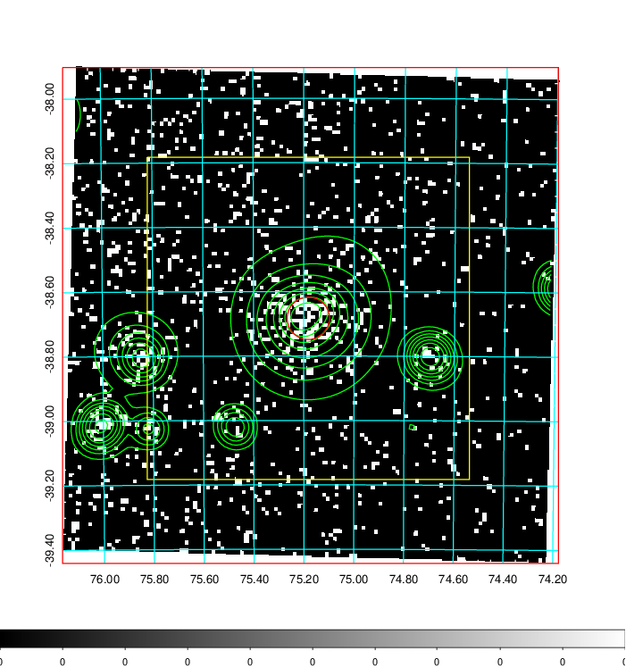  | 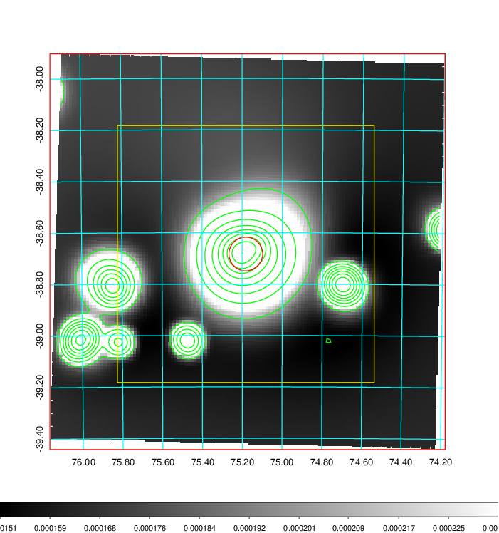   | 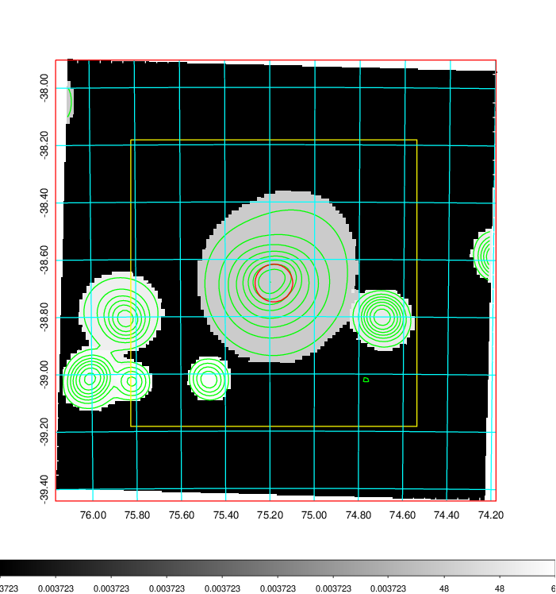  |

|[Exposure image](../image/190/190_mex.pdf)| [nH image](../image/190/190_nh.pdf)| [Planck image](../image/190/190_p.pdf)|
|-------------------|--------------------|-------------------|
|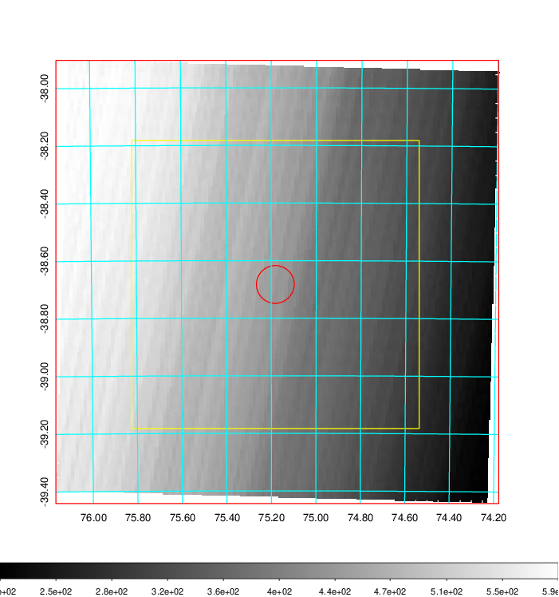   | 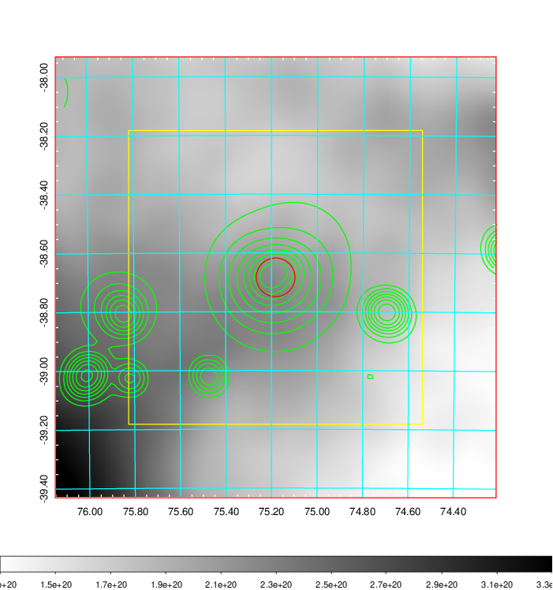    | 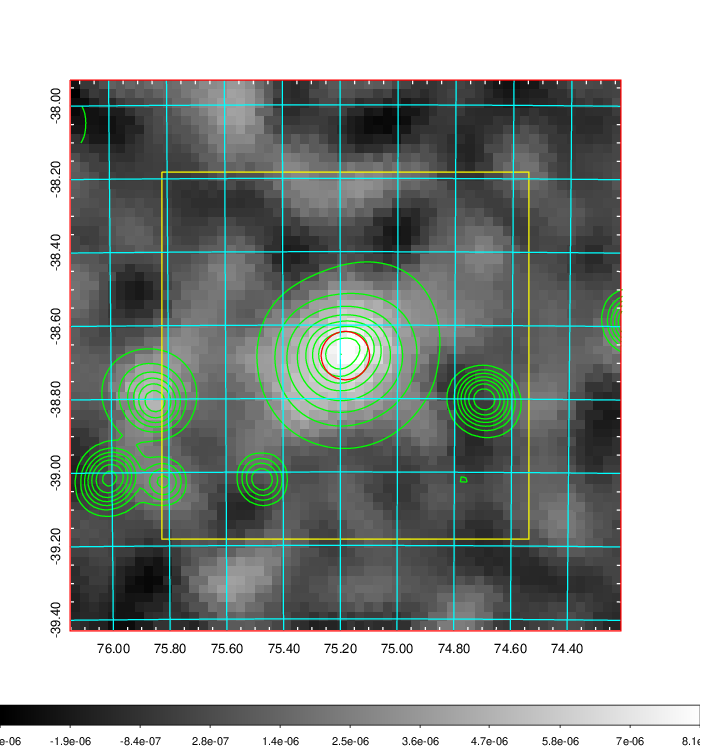 |

|[Redshift Histogram](../image/190/190_zg.pdf) | [DSS image(z1)](../image/190/190_dss_z1.pdf)      |  [DSS image(z2)](../image/190/190_dss_z2.pdf)    |
|-------------------|--------------------|-------------------|
|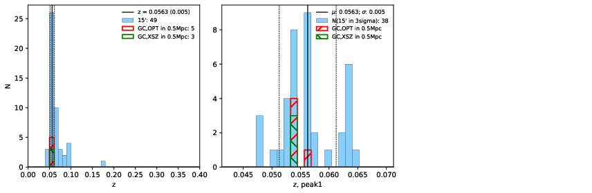 |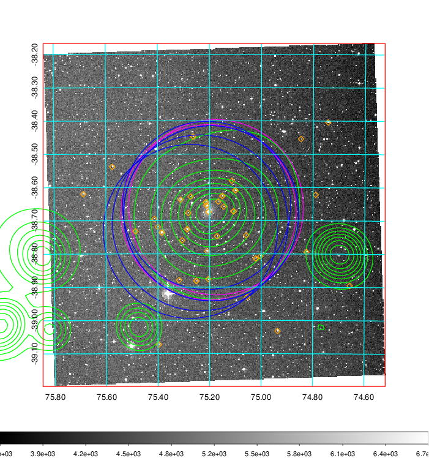  Blue circle for optical clusters;  Magenta circle for XSZ clusters;  all with r=1Mpc;  Only GC with Delta_z<0.01 are shown. | 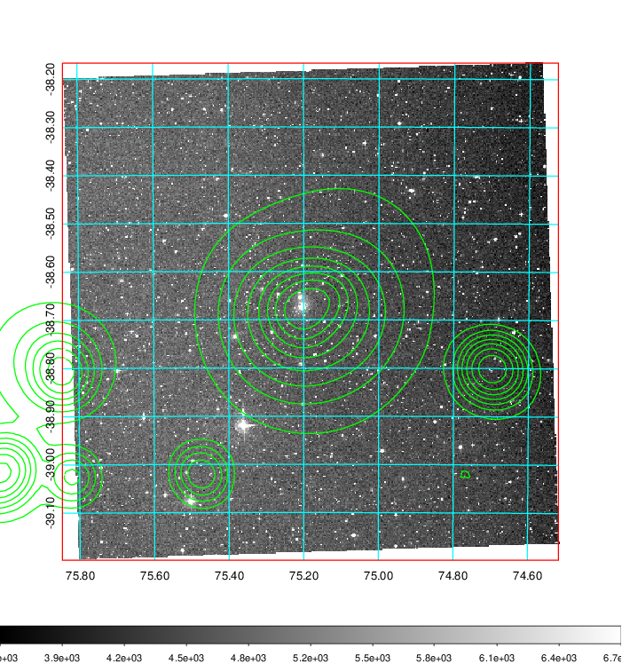 Blue circle for optical clusters;  Magenta circle for XSZ clusters;  all with r=1Mpc;  Only GC with Delta_z<0.01 are shown.  |

|[Previous-identified clusters](../image/190/190_gc.pdf) | [2MASS image](../image/190/190_2mass.pdf)      |
|-------------------|-------------------|
|  Green, magenta, and blue circles  for optical, X-ray and SZ clusters  respectively, with redshift of clusters  labelled. The radius of circles  are 1Mpc.|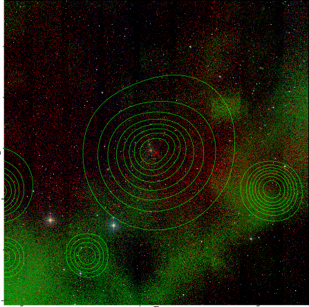  |

|[DES image](../image/190/190_des.pdf)   |
|-------------------|
| 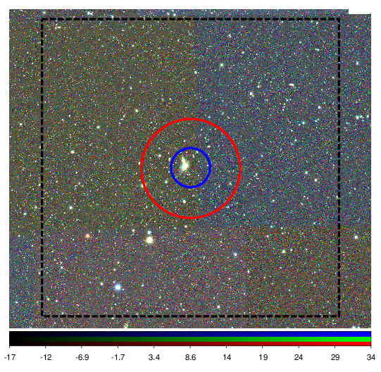  |
