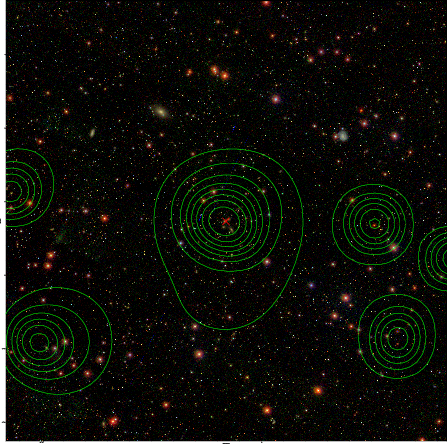

### 191

|Name|RAJ2000[deg]|DEJ2000[deg] |Ext[arcmin]| Ext,ml | z | z_src| C|GC(XSZ,Delta_z<0.01)| GC(OPT,Delta_z<0.01)|GC| R_sig[arcmin] | R500[arcmin] | R500[Mpc]| CRsig[c/s] | CR500[c/s] |L500[1E44 erg/s]|F500[1E-12 erg/s/cm^2]| M500[1E14 Msun]|Tx[keV]|Cnt_sig|Beta|Rc[arcmin]|Comment|Alias|
|---|---|---|---|---|---|------|---|--------|---------|----------|---|---|---|---|---|---|---|---|---|---|---|---|---|---|
|191| 75.331| -3.544| 1.91| 33.56| 0.0907(0.006)| z1, z_xsz| B| MCXC, Tar| A, N, W| A, MCXC, N, Tar, W| 30.205| 9.293| 0.943| 0.322(0.093)| 0.289(0.084)| 1.083(0.214)| 5.257(1.038)| 2.60(0.26)| 3.97(0.25)| 140.3| 0.521(-0.015+0.022)| 1.934(-0.283+0.381)| -| k197|

|[RASS image](../image/191/191_img.pdf)|[filtered image](../image/191/191_fil.pdf)|[Segment image](../image/191/191_seg.pdf)|
|-------------------|--------------------|-------------------|
|   |    |   |

|[Exposure image](../image/191/191_mex.pdf)| [nH image](../image/191/191_nh.pdf)| [Planck image](../image/191/191_p.pdf)|
|-------------------|--------------------|-------------------|
|   |     |  |

|[Redshift Histogram](../image/191/191_zg.pdf) | [DSS image(z1)](../image/191/191_dss_z1.pdf)      |  [DSS image(z2)](../image/191/191_dss_z2.pdf)    |
|-------------------|--------------------|-------------------|
| |  Blue circle for optical clusters;  Magenta circle for XSZ clusters;  all with r=1Mpc;  Only GC with Delta_z<0.01 are shown. |  Blue circle for optical clusters;  Magenta circle for XSZ clusters;  all with r=1Mpc;  Only GC with Delta_z<0.01 are shown.  |

|[Previous-identified clusters](../image/191/191_gc.pdf) | [2MASS image](../image/191/191_2mass.pdf)      |[SDSS image](../image/191/191_sdss.pdf)   |
|-------------------|-------------------|-------------------|
|  Green, magenta, and blue circles  for optical, X-ray and SZ clusters  respectively, with redshift of clusters  labelled. The radius of circles  are 1Mpc.|  |   |

