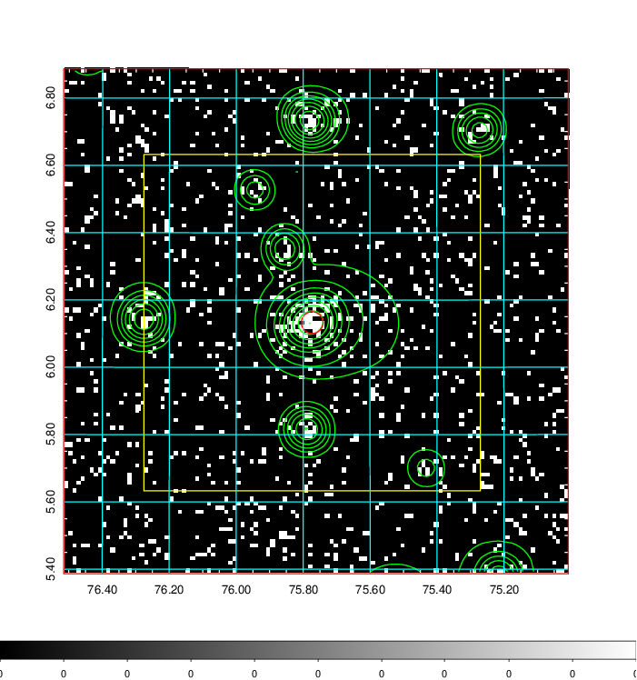
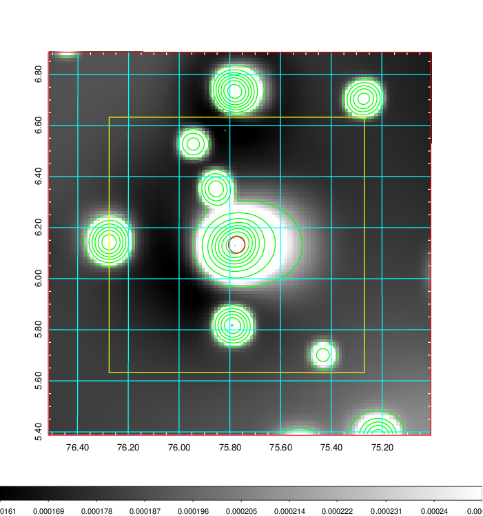
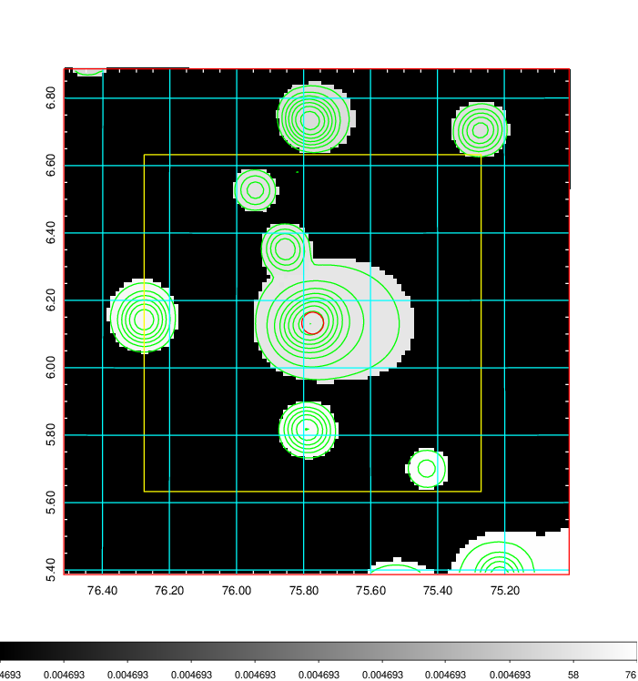
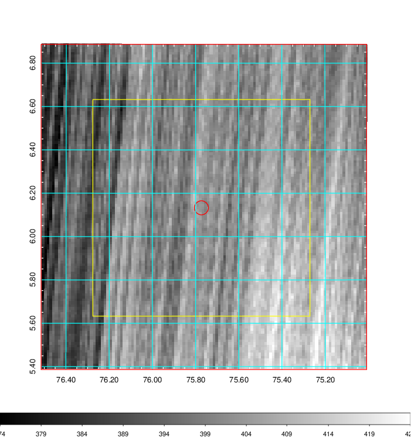
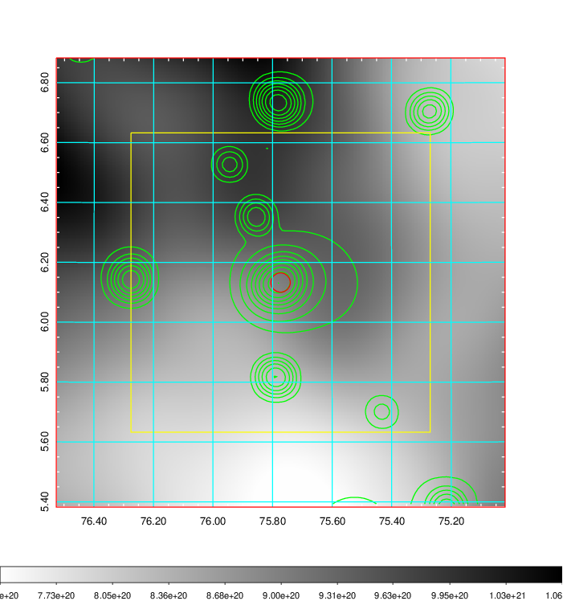
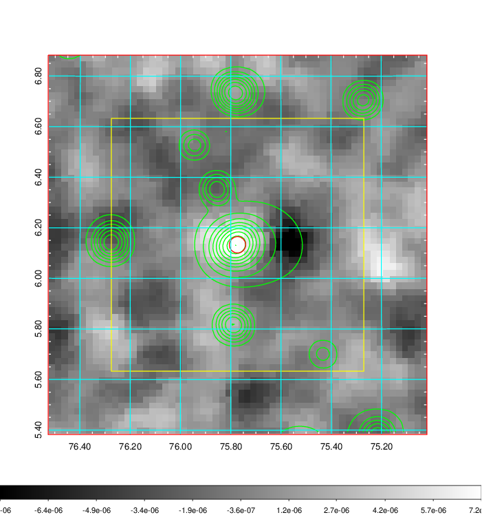
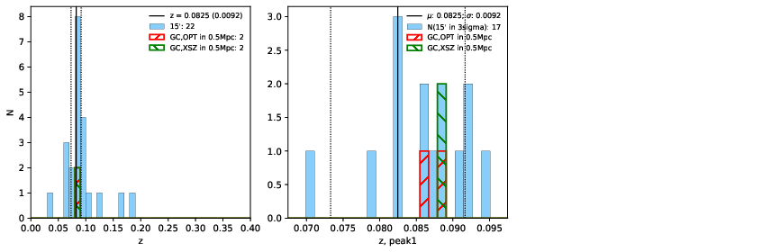
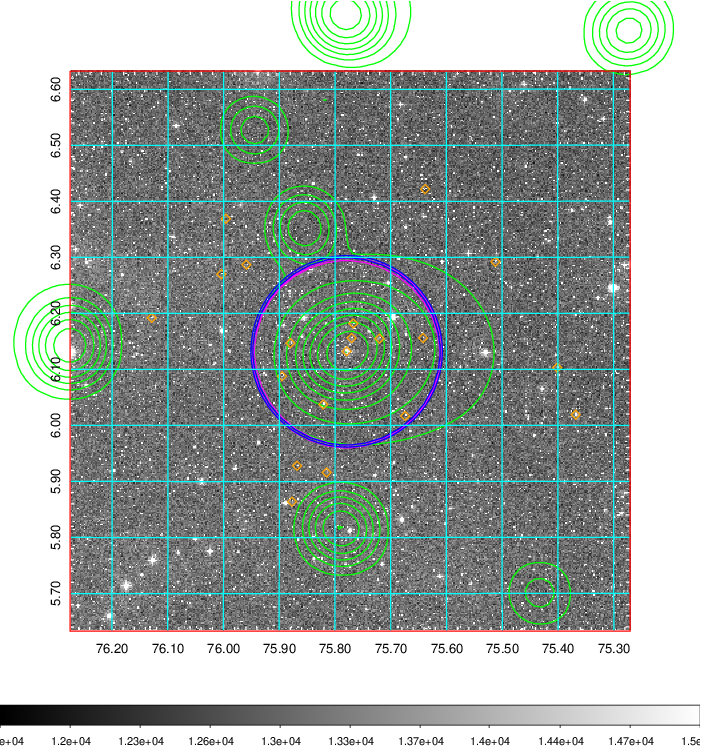
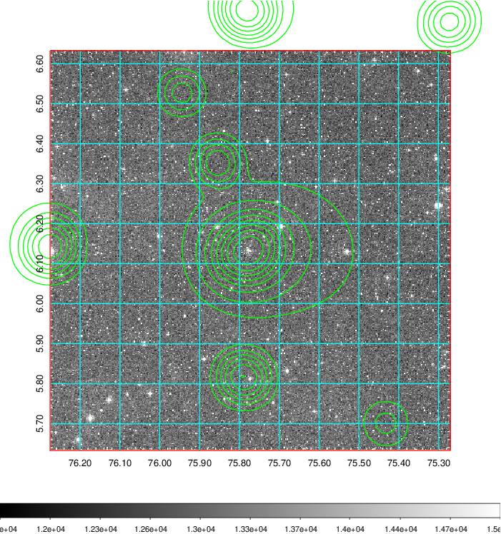
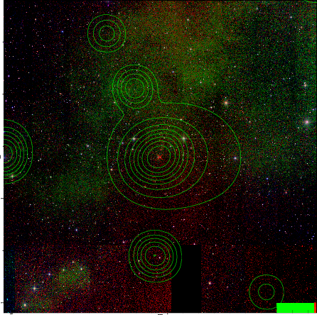

### 192

|Name|RAJ2000[deg]|DEJ2000[deg] |Ext[arcmin]| Ext,ml | z | z_src| C|GC(XSZ,Delta_z<0.01)| GC(OPT,Delta_z<0.01)|GC| R_sig[arcmin] | R500[arcmin] | R500[Mpc]| CRsig[c/s] | CR500[c/s] |L500[1E44 erg/s]|F500[1E-12 erg/s/cm^2]| M500[1E14 Msun]|Tx[keV]|Cnt_sig|Beta|Rc[arcmin]|Comment|Alias|
|---|---|---|---|---|---|------|---|--------|---------|----------|---|---|---|---|---|---|---|---|---|---|---|---|---|---|
|192| 75.773| 6.133| 1.95| 56.23| 0.0825(0.009)| z1, z_xsz| B| MCXC, Tar| N, W| MCXC, N, Tar, W| 44.560| 9.778| 0.911| 0.308(0.099)| 0.273(0.088)| 0.795(0.110)| 4.716(0.651)| 2.33(0.16)| 3.70(0.16)| 257.8| 0.891(-0.091+0.074)| 4.260(-0.661+0.520)| -| k207|

|[RASS image](../image/192/192_img.pdf)|[filtered image](../image/192/192_fil.pdf)|[Segment image](../image/192/192_seg.pdf)|
|-------------------|--------------------|-------------------|
|   |    |   |

|[Exposure image](../image/192/192_mex.pdf)| [nH image](../image/192/192_nh.pdf)| [Planck image](../image/192/192_p.pdf)|
|-------------------|--------------------|-------------------|
|   |     |  |

|[Redshift Histogram](../image/192/192_zg.pdf) | [DSS image(z1)](../image/192/192_dss_z1.pdf)      |  [DSS image(z2)](../image/192/192_dss_z2.pdf)    |
|-------------------|--------------------|-------------------|
| |  Blue circle for optical clusters;  Magenta circle for XSZ clusters;  all with r=1Mpc;  Only GC with Delta_z<0.01 are shown. |  Blue circle for optical clusters;  Magenta circle for XSZ clusters;  all with r=1Mpc;  Only GC with Delta_z<0.01 are shown.  |

|[known Abell/XSZ clusters](../image/192/192_gc.pdf) | [2MASS image](../image/192/192_2mass.pdf)      |
|-------------------|-------------------|
|  Magenta, blue and green circles  for optical, X-ray and SZ clusters  respectively, with redshift of clusters  labelled. The radius of circles  are 1Mpc.|  |

|[PS1 image](../image/192/192_ps1.pdf)            |
|-------------------|
|   |
