

### 193

|Name|RAJ2000[deg]|DEJ2000[deg] |Ext[arcmin]| Ext,ml | z | z_src| C|GC(XSZ,Delta_z<0.01)| GC(OPT,Delta_z<0.01)|GC| R_sig[arcmin] | R500[arcmin] | R500[Mpc]| CRsig[c/s] | CR500[c/s] |L500[1E44 erg/s]|F500[1E-12 erg/s/cm^2]| M500[1E14 Msun]|Tx[keV]|Cnt_sig|Beta|Rc[arcmin]|Comment|Alias|
|---|---|---|---|---|---|------|---|--------|---------|----------|---|---|---|---|---|---|---|---|---|---|---|---|---|---|
|193| 75.895| -58.099| 3.23| 33.34| 0.0933(0.007)| z1, z_opt| S| -| W| N, W| 13.188| 6.687| 0.696| 0.075(0.027)| 0.070(0.025)| 0.281(0.074)| 1.284(0.338)| 1.05(0.14)| 2.27(0.19)| 94.5| 0.848(-0.156+0.109)| 3.865(-0.995+0.779)| -| t144|

|[RASS image](../image/193/193_img.pdf)|[filtered image](../image/193/193_fil.pdf)|[Segment image](../image/193/193_seg.pdf)|
|-------------------|--------------------|-------------------|
| 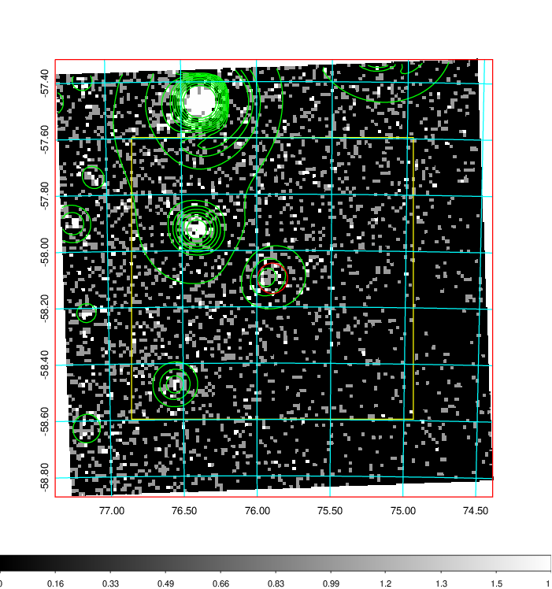  | 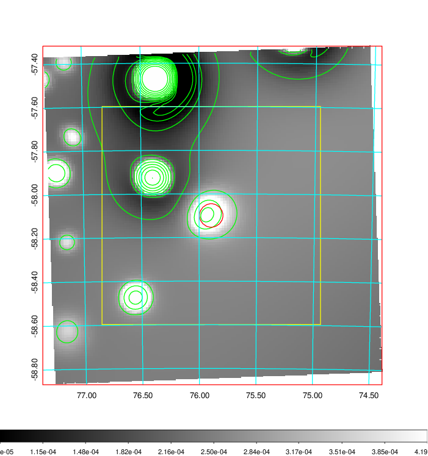   | 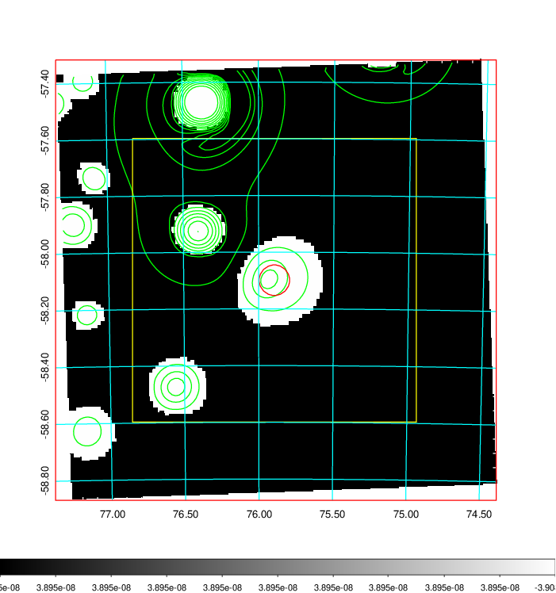  |

|[Exposure image](../image/193/193_mex.pdf)| [nH image](../image/193/193_nh.pdf)| [Planck image](../image/193/193_p.pdf)|
|-------------------|--------------------|-------------------|
|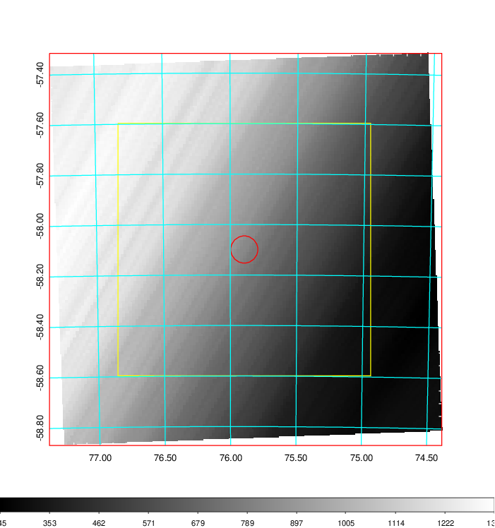   | 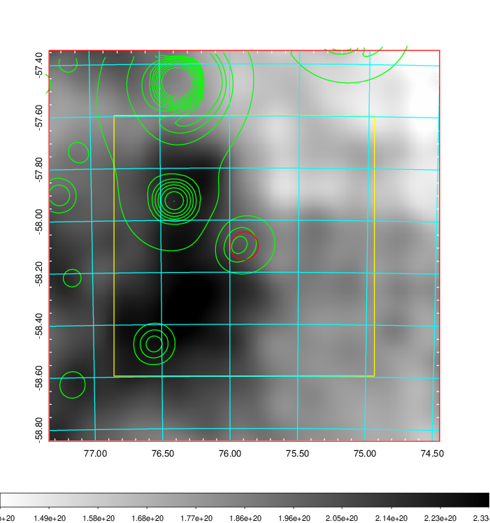    | 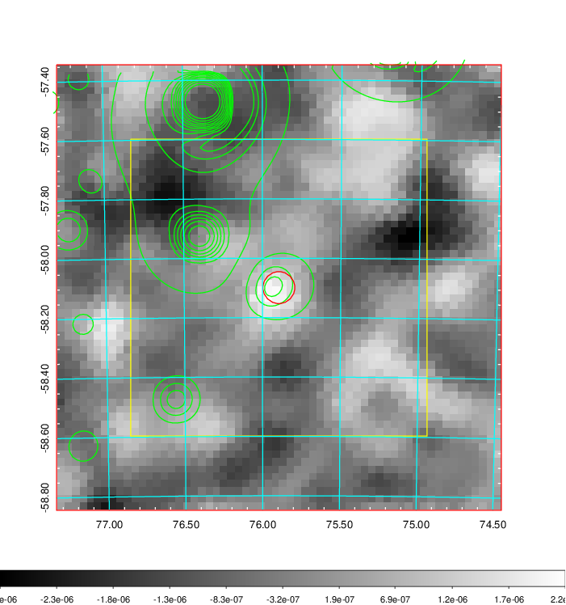 |

|[Redshift Histogram](../image/193/193_zg.pdf) | [DSS image(z1)](../image/193/193_dss_z1.pdf)      |  [DSS image(z2)](../image/193/193_dss_z2.pdf)    |
|-------------------|--------------------|-------------------|
|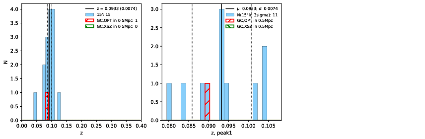 |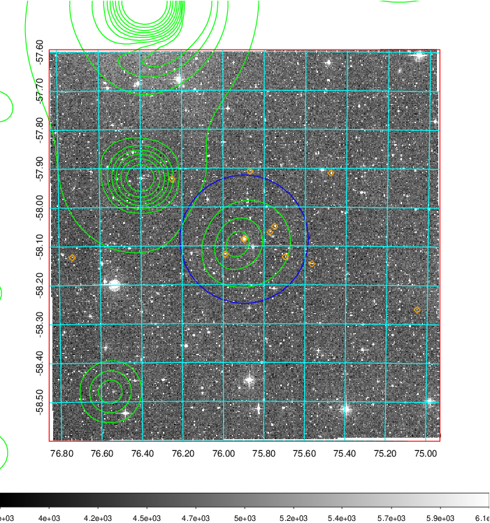  Blue circle for optical clusters;  Magenta circle for XSZ clusters;  all with r=1Mpc;  Only GC with Delta_z<0.01 are shown. | 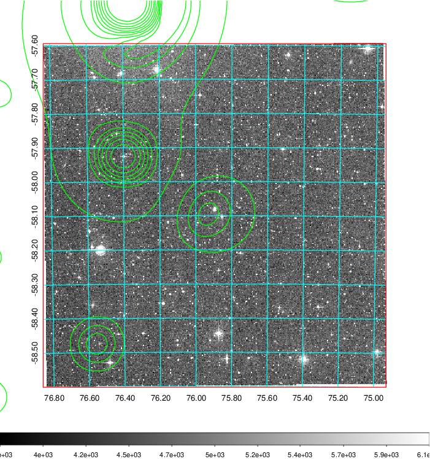 Blue circle for optical clusters;  Magenta circle for XSZ clusters;  all with r=1Mpc;  Only GC with Delta_z<0.01 are shown.  |

|[Previous-identified clusters](../image/193/193_gc.pdf) | [2MASS image](../image/193/193_2mass.pdf)      |
|-------------------|-------------------|
|  Green, magenta, and blue circles  for optical, X-ray and SZ clusters  respectively, with redshift of clusters  labelled. The radius of circles  are 1Mpc.|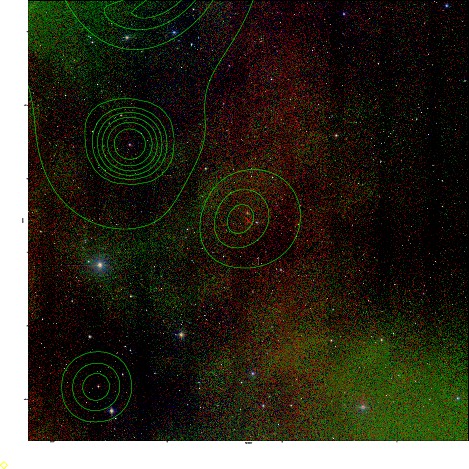  |

|[DES image](../image/193/193_des.pdf)   |
|-------------------|
| 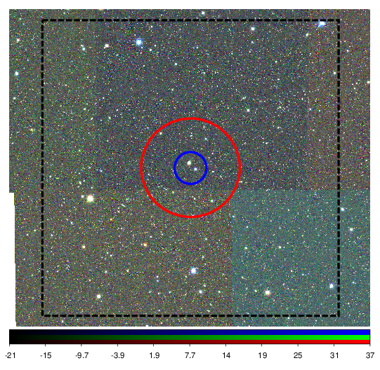  |
