

### 194

|Name|RAJ2000[deg]|DEJ2000[deg] |Ext[arcmin]| Ext,ml | z | z_src| C|GC(XSZ,Delta_z<0.01)| GC(OPT,Delta_z<0.01)|GC| R_sig[arcmin] | R500[arcmin] | R500[Mpc]| CRsig[c/s] | CR500[c/s] |L500[1E44 erg/s]|F500[1E-12 erg/s/cm^2]| M500[1E14 Msun]|Tx[keV]|Cnt_sig|Beta|Rc[arcmin]|Comment|Alias|
|---|---|---|---|---|---|------|---|--------|---------|----------|---|---|---|---|---|---|---|---|---|---|---|---|---|---|
|194| 76.000| -24.004| 4.46| 30.82| 0.0426(0.005)| z1, z_opt| S| -| A, N| A, N, PSZ2, W| 13.188| 12.197| 0.615| 0.177(0.036)| 0.175(0.035)| 0.124(0.020)| 2.914(0.464)| 0.69(0.06)| 1.72(0.09)| 72.4| 0.566(-0.050+0.139)| 3.974(-0.901+1.779)| -| t231|

|[RASS image](../image/194/194_img.pdf)|[filtered image](../image/194/194_fil.pdf)|[Segment image](../image/194/194_seg.pdf)|
|-------------------|--------------------|-------------------|
| 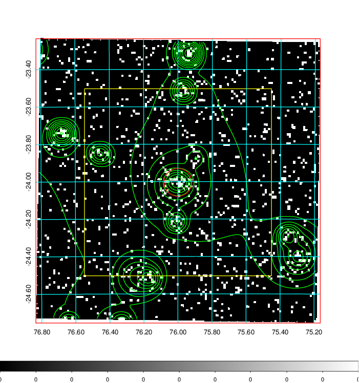  | 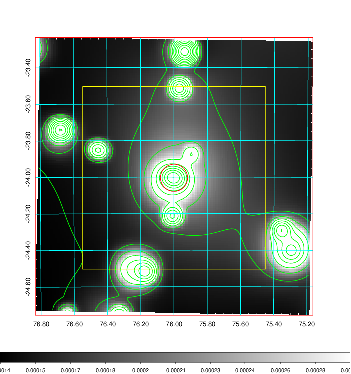   | 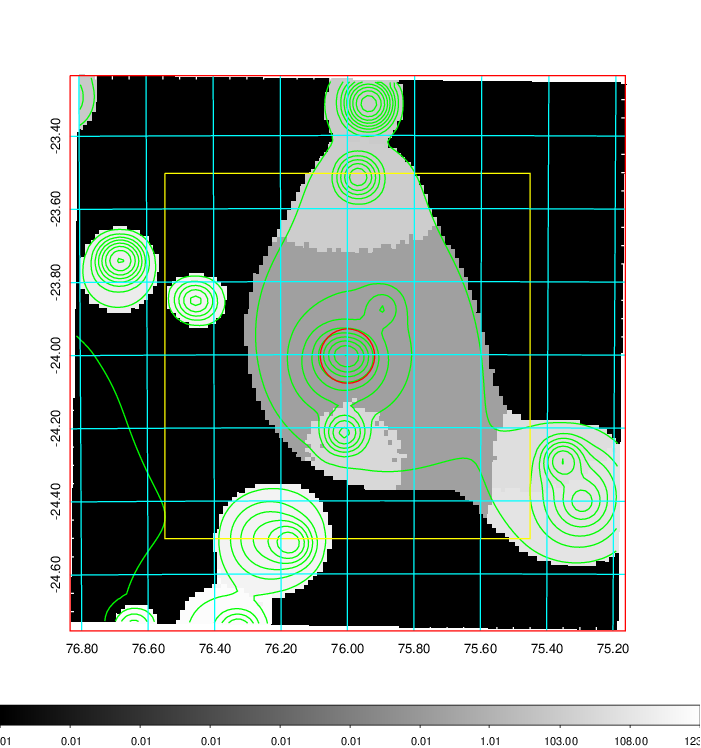  |

|[Exposure image](../image/194/194_mex.pdf)| [nH image](../image/194/194_nh.pdf)| [Planck image](../image/194/194_p.pdf)|
|-------------------|--------------------|-------------------|
|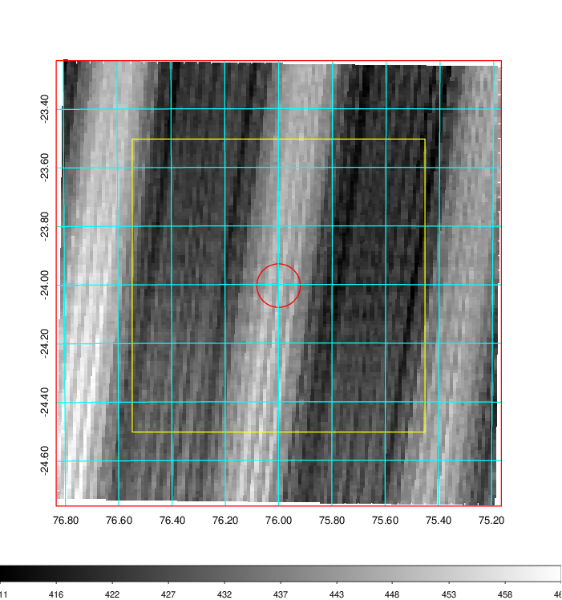   | 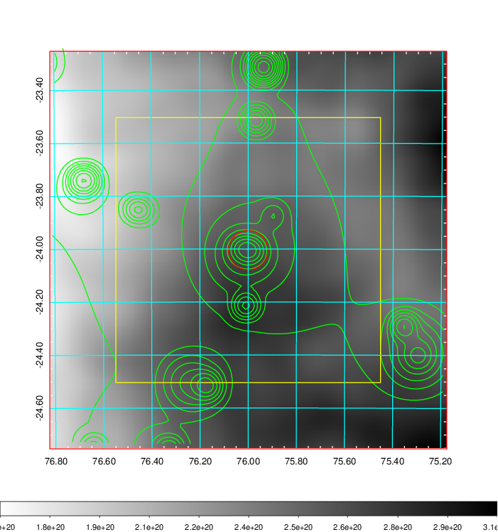    | 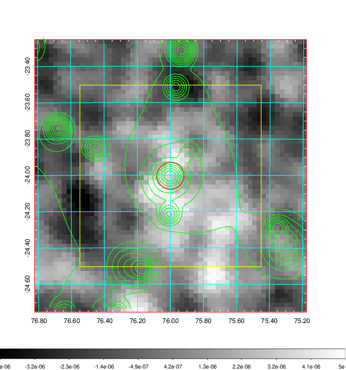 |

|[Redshift Histogram](../image/194/194_zg.pdf) | [DSS image(z1)](../image/194/194_dss_z1.pdf)      |  [DSS image(z2)](../image/194/194_dss_z2.pdf)    |
|-------------------|--------------------|-------------------|
|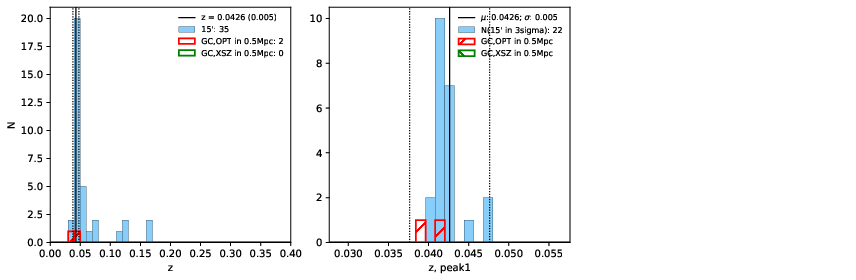 |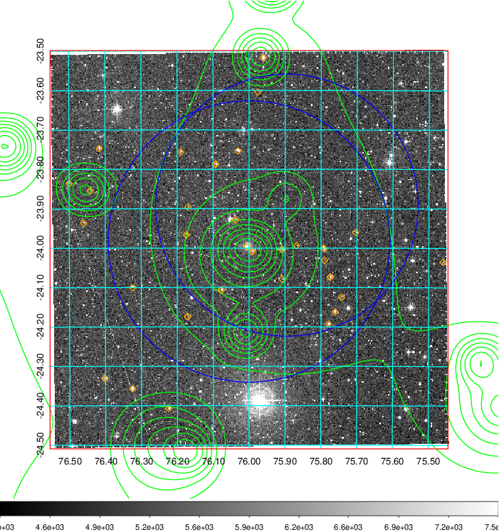  Blue circle for optical clusters;  Magenta circle for XSZ clusters;  all with r=1Mpc;  Only GC with Delta_z<0.01 are shown. | 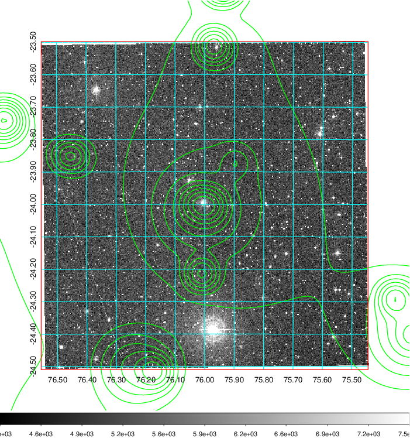 Blue circle for optical clusters;  Magenta circle for XSZ clusters;  all with r=1Mpc;  Only GC with Delta_z<0.01 are shown.  |

|[Previous-identified clusters](../image/194/194_gc.pdf) | [2MASS image](../image/194/194_2mass.pdf)      |
|-------------------|-------------------|
|  Green, magenta, and blue circles  for optical, X-ray and SZ clusters  respectively, with redshift of clusters  labelled. The radius of circles  are 1Mpc.|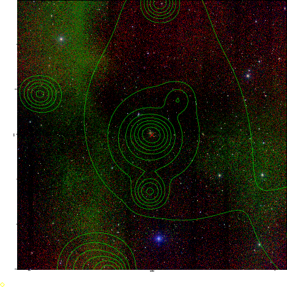  |

|[DES image](../image/194/194_des.pdf)   |[PS1 image](../image/194/194_ps1.pdf)            |
|-------------------|-------------------|
| 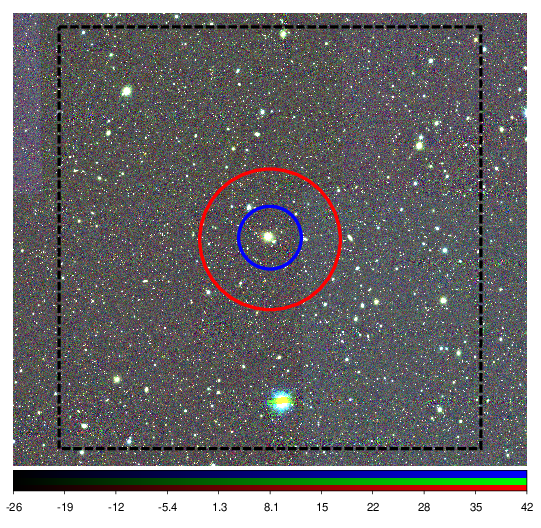  | 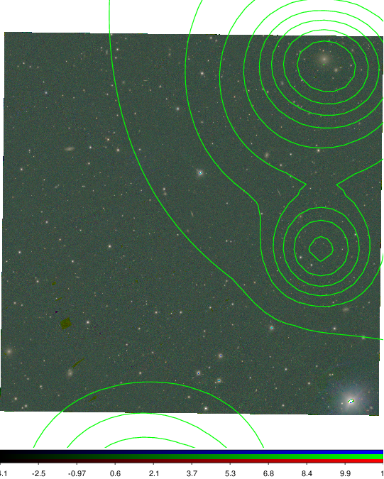  |
