

### 195

|Name|RAJ2000[deg]|DEJ2000[deg] |Ext[arcmin]| Ext,ml | z | z_src| C|GC(XSZ,Delta_z<0.01)| GC(OPT,Delta_z<0.01)|GC| R_sig[arcmin] | R500[arcmin] | R500[Mpc]| CRsig[c/s] | CR500[c/s] |L500[1E44 erg/s]|F500[1E-12 erg/s/cm^2]| M500[1E14 Msun]|Tx[keV]|Cnt_sig|Beta|Rc[arcmin]|Comment|Alias|
|---|---|---|---|---|---|------|---|--------|---------|----------|---|---|---|---|---|---|---|---|---|---|---|---|---|---|
|195| 76.901| -2.694| 7.08| 28.84| 0.1210(0.006)| z1, z_xsz| B| MCXC| A| A, MCXC, N, W| 27.662| 7.282| 0.952| 0.187(0.060)| 0.167(0.054)| 1.129(0.299)| 2.959(0.783)| 2.76(0.36)| 4.16(0.35)| 135.7| 0.823(-0.134+0.121)| 6.951(-1.646+1.332)| -| k558|

|[RASS image](../image/195/195_img.pdf)|[filtered image](../image/195/195_fil.pdf)|[Segment image](../image/195/195_seg.pdf)|
|-------------------|--------------------|-------------------|
| 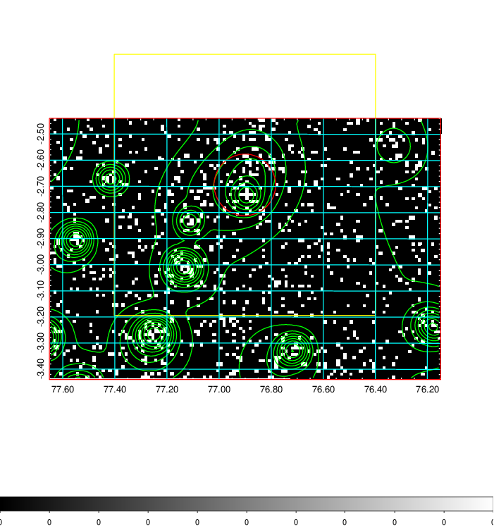  | 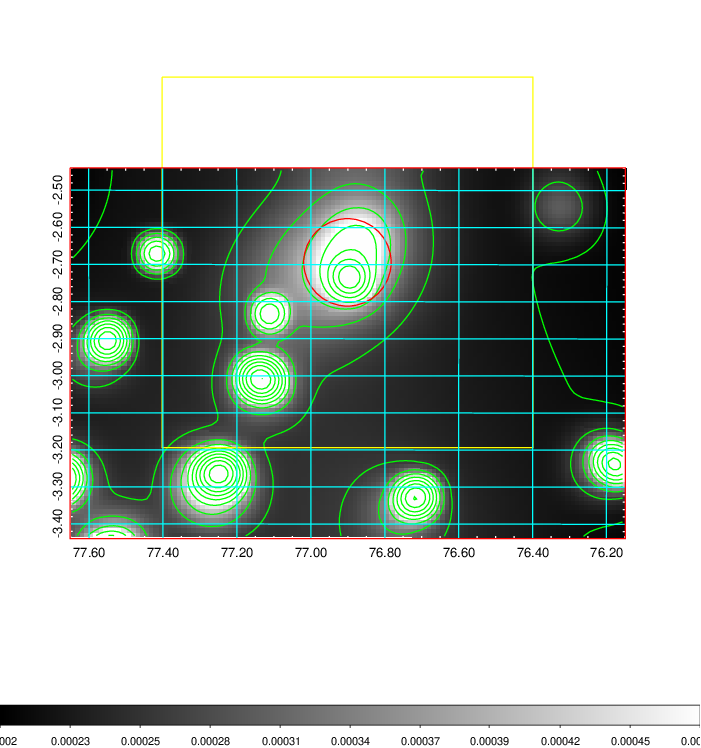   | 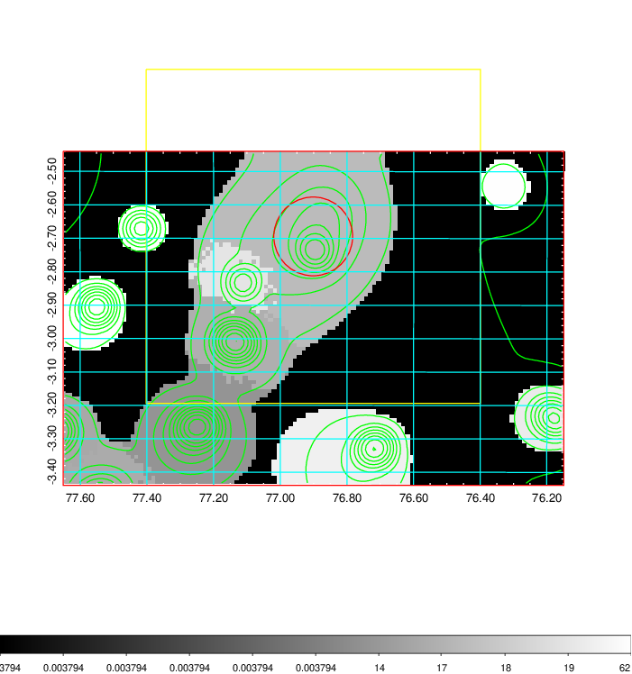  |

|[Exposure image](../image/195/195_mex.pdf)| [nH image](../image/195/195_nh.pdf)| [Planck image](../image/195/195_p.pdf)|
|-------------------|--------------------|-------------------|
|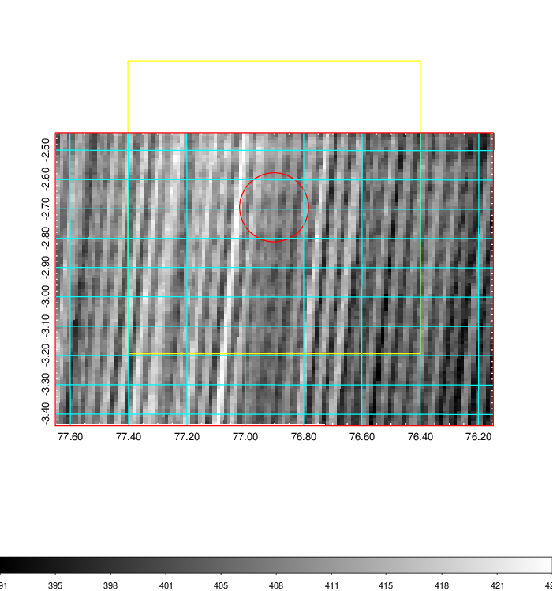   | 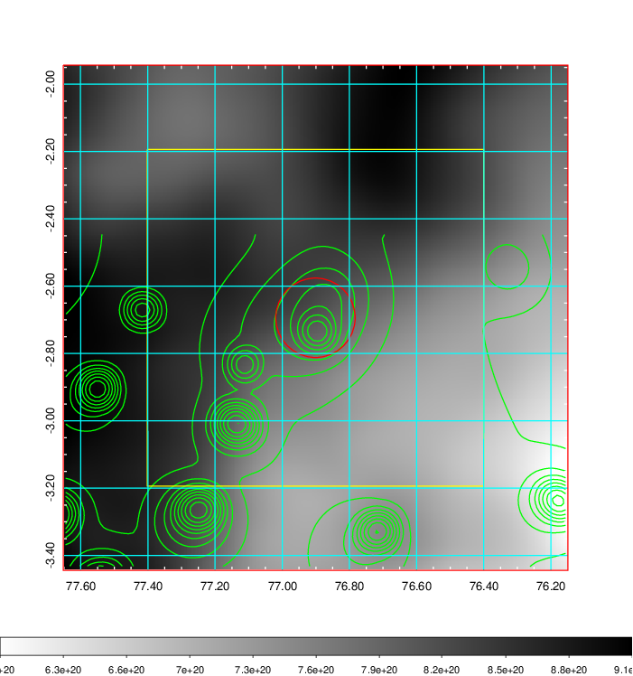    | 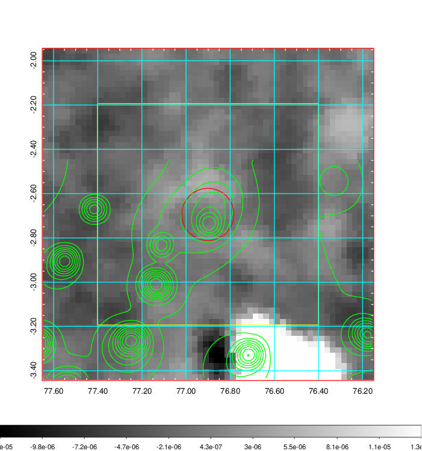 |

|[Redshift Histogram](../image/195/195_zg.pdf) | [DSS image(z1)](../image/195/195_dss_z1.pdf)      |  [DSS image(z2)](../image/195/195_dss_z2.pdf)    |
|-------------------|--------------------|-------------------|
|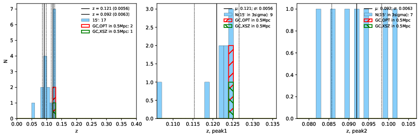 |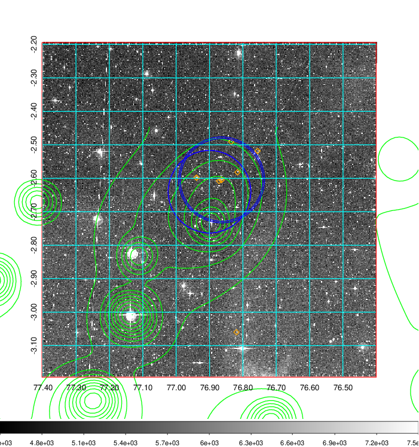  Blue circle for optical clusters;  Magenta circle for XSZ clusters;  all with r=1Mpc;  Only GC with Delta_z<0.01 are shown. | 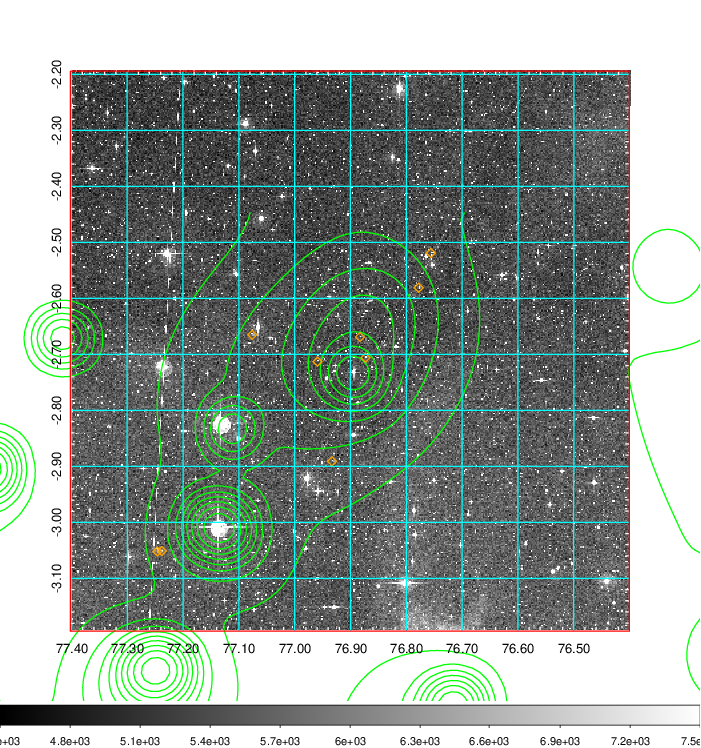 Blue circle for optical clusters;  Magenta circle for XSZ clusters;  all with r=1Mpc;  Only GC with Delta_z<0.01 are shown.  |

|[Previous-identified clusters](../image/195/195_gc.pdf) | [2MASS image](../image/195/195_2mass.pdf)      |[SDSS image](../image/195/195_sdss.pdf)   |
|-------------------|-------------------|-------------------|
|  Green, magenta, and blue circles  for optical, X-ray and SZ clusters  respectively, with redshift of clusters  labelled. The radius of circles  are 1Mpc.|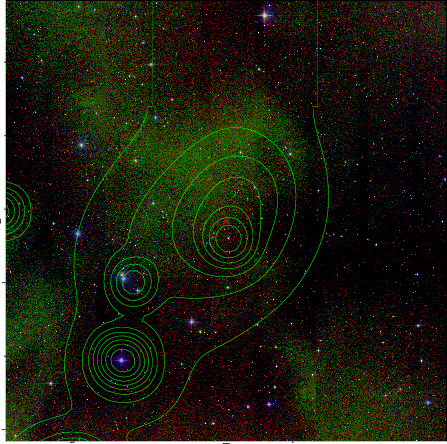  | 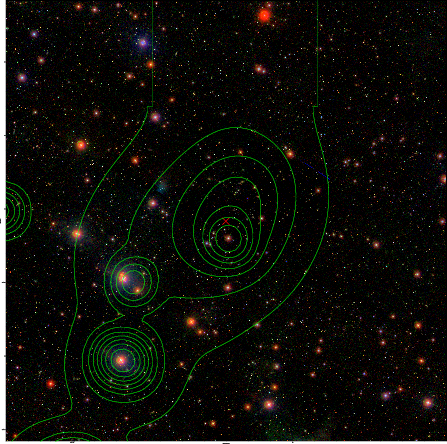  |

