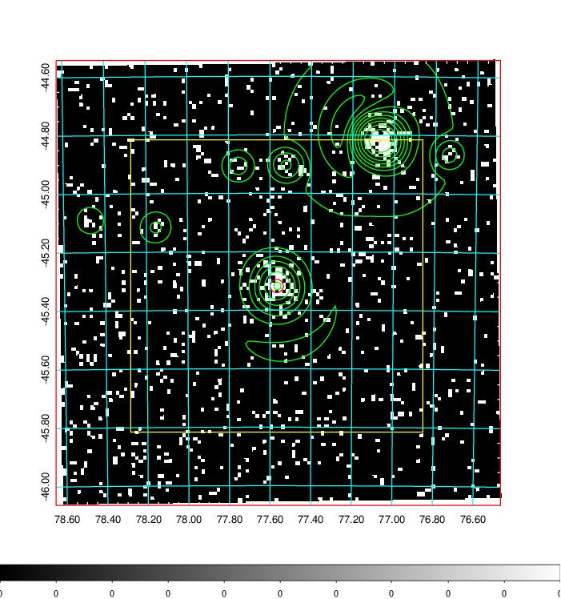
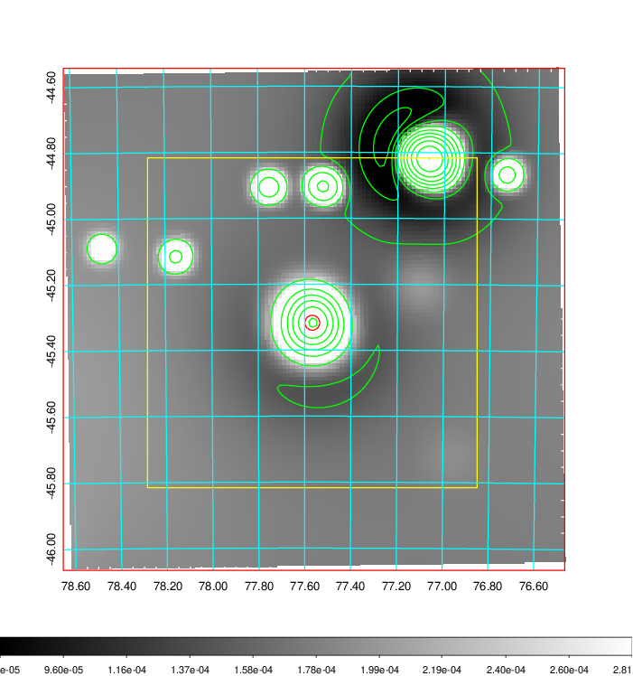
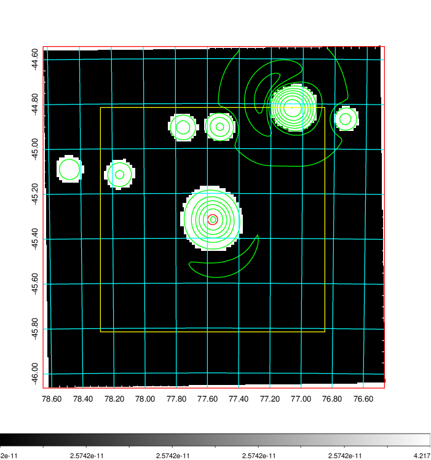
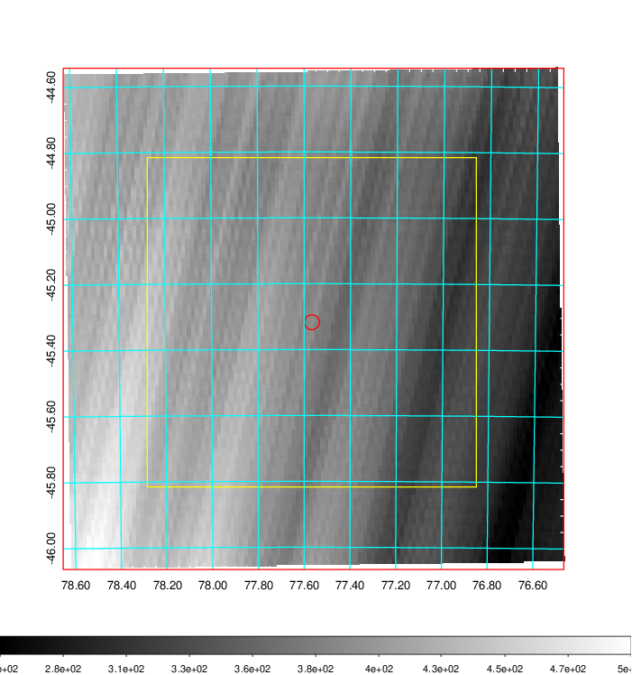
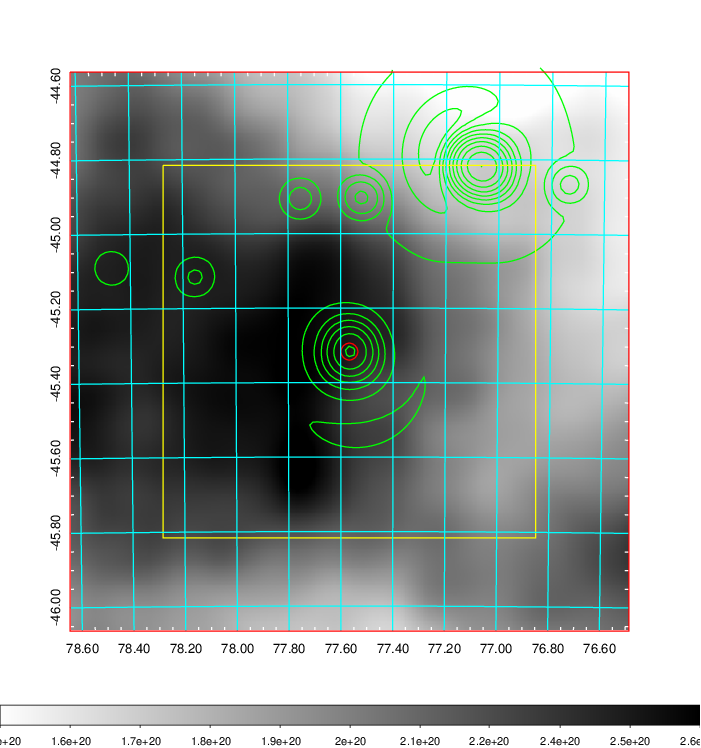
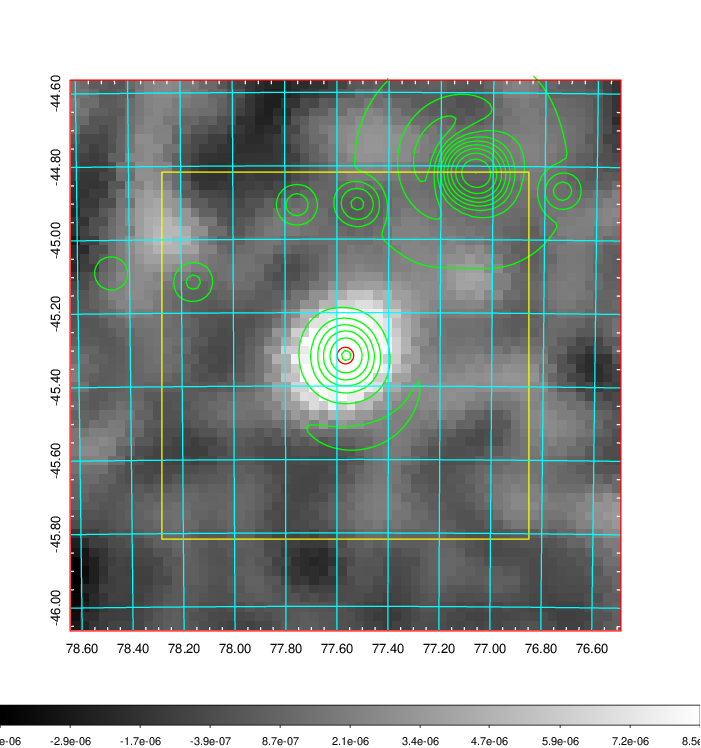
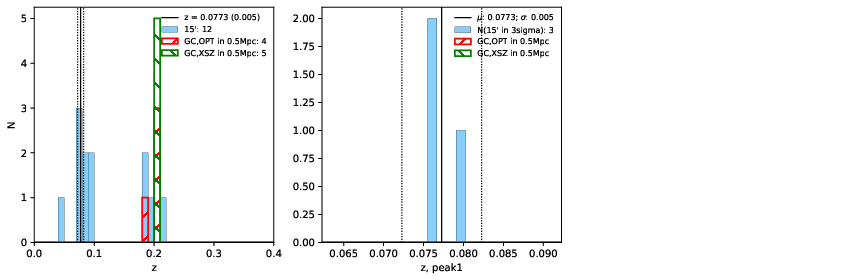
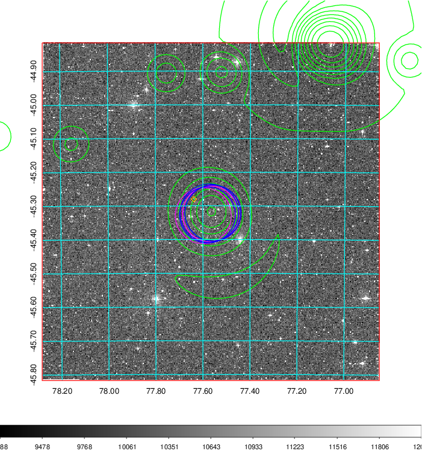
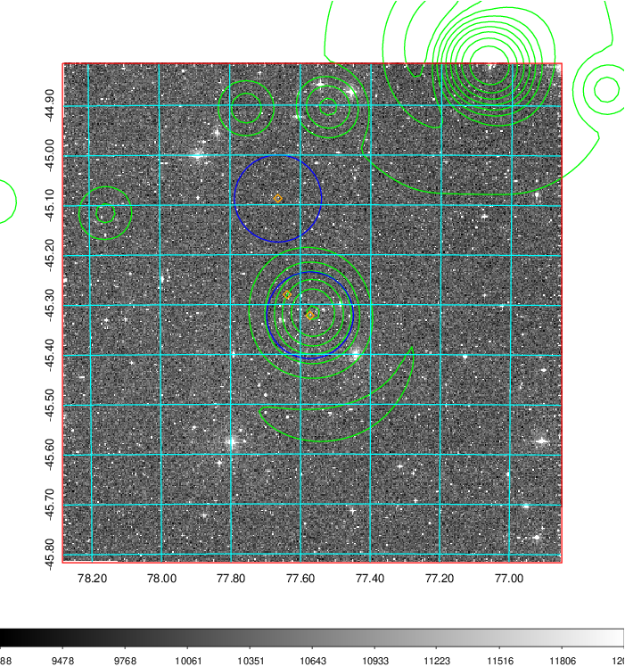
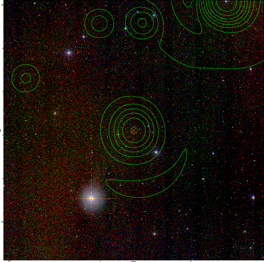

### 197

|Name|RAJ2000[deg]|DEJ2000[deg] |Ext[arcmin]| Ext,ml | z | z_src| C|GC(XSZ,Delta_z<0.01)| GC(OPT,Delta_z<0.01)|GC| R_sig[arcmin] | R500[arcmin] | R500[Mpc]| CRsig[c/s] | CR500[c/s] |L500[1E44 erg/s]|F500[1E-12 erg/s/cm^2]| M500[1E14 Msun]|Tx[keV]|Cnt_sig|Beta|Rc[arcmin]|Comment|Alias|
|---|---|---|---|---|---|------|---|--------|---------|----------|---|---|---|---|---|---|---|---|---|---|---|---|---|---|
|197| 77.567| -45.317| 1.36| 33.62| 0.2000(0.000)| z_xsz| B| B15, MCXC, PSZ2, Tar| A, N| A, B15, MCXC, N, PSZ2, Tar, W| 7.338| 5.940| 1.176| 0.218(0.037)| 0.212(0.036)| 4.811(0.338)| 4.186(0.294)| 5.64(0.19)| 6.64(0.14)| 85.9| 0.916(-0.099+0.060)| 3.296(-0.517+0.385)| -| k087|

|[RASS image](../image/197/197_img.pdf)|[filtered image](../image/197/197_fil.pdf)|[Segment image](../image/197/197_seg.pdf)|
|-------------------|--------------------|-------------------|
|   |    |   |

|[Exposure image](../image/197/197_mex.pdf)| [nH image](../image/197/197_nh.pdf)| [Planck image](../image/197/197_p.pdf)|
|-------------------|--------------------|-------------------|
|   |     |  |

|[Redshift Histogram](../image/197/197_zg.pdf) | [DSS image(z1)](../image/197/197_dss_z1.pdf)      |  [DSS image(z2)](../image/197/197_dss_z2.pdf)    |
|-------------------|--------------------|-------------------|
| |  Blue circle for optical clusters;  Magenta circle for XSZ clusters;  all with r=1Mpc;  Only GC with Delta_z<0.01 are shown. |  Blue circle for optical clusters;  Magenta circle for XSZ clusters;  all with r=1Mpc;  Only GC with Delta_z<0.01 are shown.  |

|[known Abell/XSZ clusters](../image/197/197_gc.pdf) | [2MASS image](../image/197/197_2mass.pdf)      |
|-------------------|-------------------|
|  Magenta, blue and green circles  for optical, X-ray and SZ clusters  respectively, with redshift of clusters  labelled. The radius of circles  are 1Mpc.|  |

|[DES image](../image/197/197_des.pdf)   |
|-------------------|
|   |
