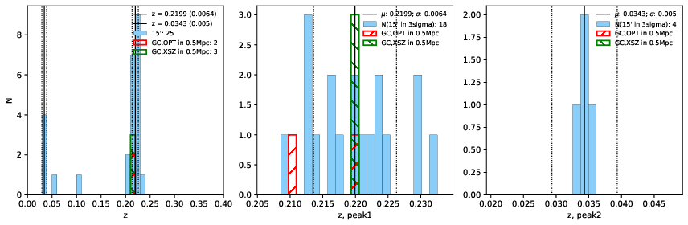

### 198

|Name|RAJ2000[deg]|DEJ2000[deg] |Ext[arcmin]| Ext,ml | z | z_src| C|GC(XSZ,Delta_z<0.01)| GC(OPT,Delta_z<0.01)|GC| R_sig[arcmin] | R500[arcmin] | R500[Mpc]| CRsig[c/s] | CR500[c/s] |L500[1E44 erg/s]|F500[1E-12 erg/s/cm^2]| M500[1E14 Msun]|Tx[keV]|Cnt_sig|Beta|Rc[arcmin]|Comment|Alias|
|---|---|---|---|---|---|------|---|--------|---------|----------|---|---|---|---|---|---|---|---|---|---|---|---|---|---|
|198| 77.679| -8.013| 1.23| 36.08| 0.2199(0.006)| z1, z_xsz| B| MCXC, PSZ2, Tar| N, W| MCXC, N, PSZ2, Tar, W| 16.600| 6.342| 1.351| 0.351(0.045)| 0.319(0.041)| 8.380(0.394)| 5.895(0.277)| 8.74(0.19)| 8.76(0.12)| 114.2| 0.698(-0.101+0.145)| 2.399(-0.765+0.888)| -| k065|

|[RASS image](../image/198/198_img.pdf)|[filtered image](../image/198/198_fil.pdf)|[Segment image](../image/198/198_seg.pdf)|
|-------------------|--------------------|-------------------|
|   |    |   |

|[Exposure image](../image/198/198_mex.pdf)| [nH image](../image/198/198_nh.pdf)| [Planck image](../image/198/198_p.pdf)|
|-------------------|--------------------|-------------------|
|   |     |  |

|[Redshift Histogram](../image/198/198_zg.pdf) | [DSS image(z1)](../image/198/198_dss_z1.pdf)      |  [DSS image(z2)](../image/198/198_dss_z2.pdf)    |
|-------------------|--------------------|-------------------|
| |  Blue circle for optical clusters;  Magenta circle for XSZ clusters;  all with r=1Mpc;  Only GC with Delta_z<0.01 are shown. |  Blue circle for optical clusters;  Magenta circle for XSZ clusters;  all with r=1Mpc;  Only GC with Delta_z<0.01 are shown.  |

|[known Abell/XSZ clusters](../image/198/198_gc.pdf) | [2MASS image](../image/198/198_2mass.pdf)      |
|-------------------|-------------------|
|  Magenta, blue and green circles  for optical, X-ray and SZ clusters  respectively, with redshift of clusters  labelled. The radius of circles  are 1Mpc.|  |

|[PS1 image](../image/198/198_ps1.pdf)            |
|-------------------|
|   |
