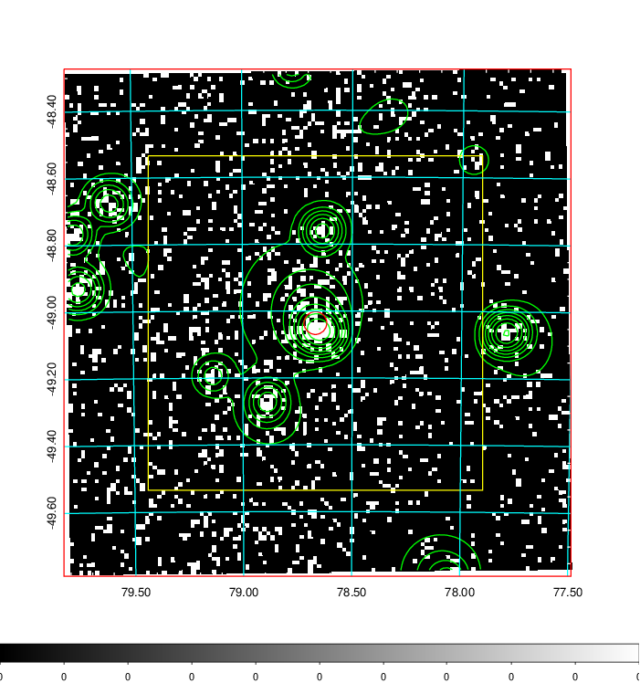
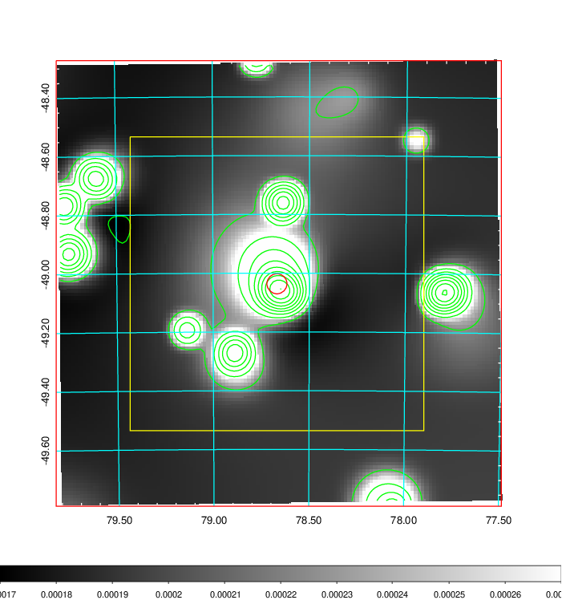
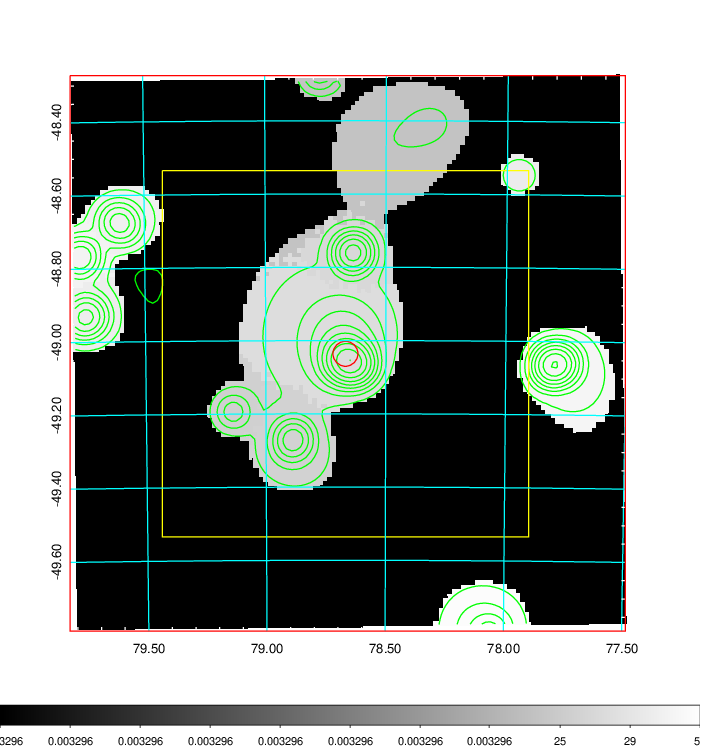
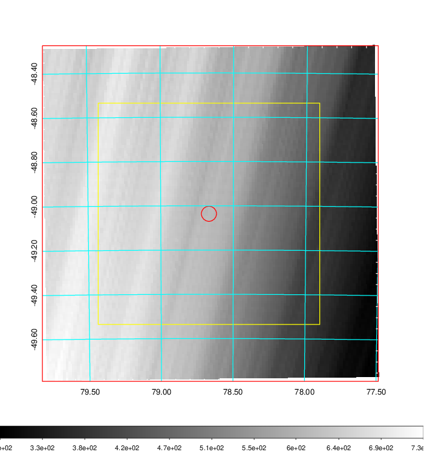
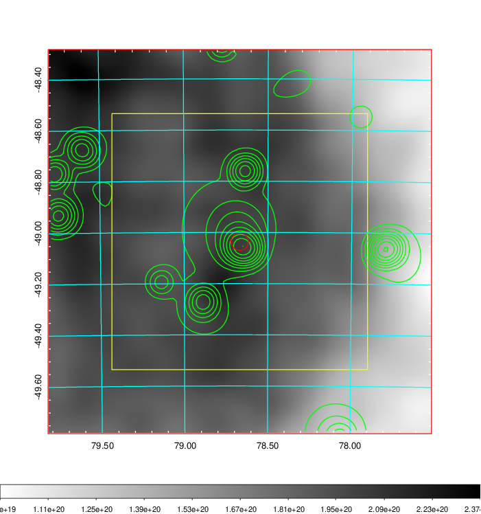
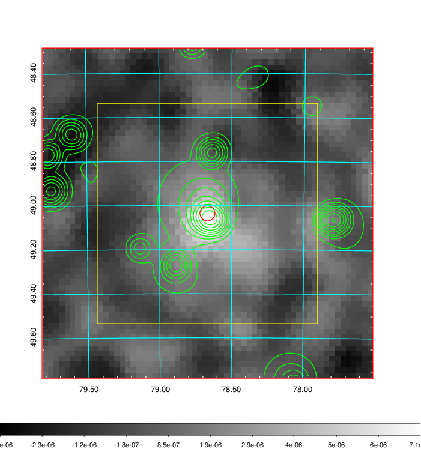
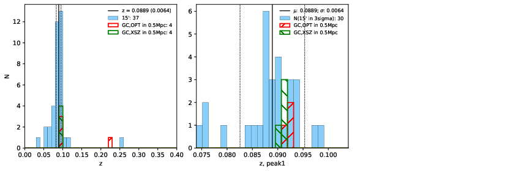
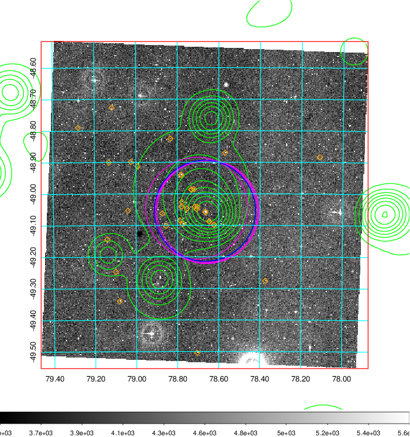
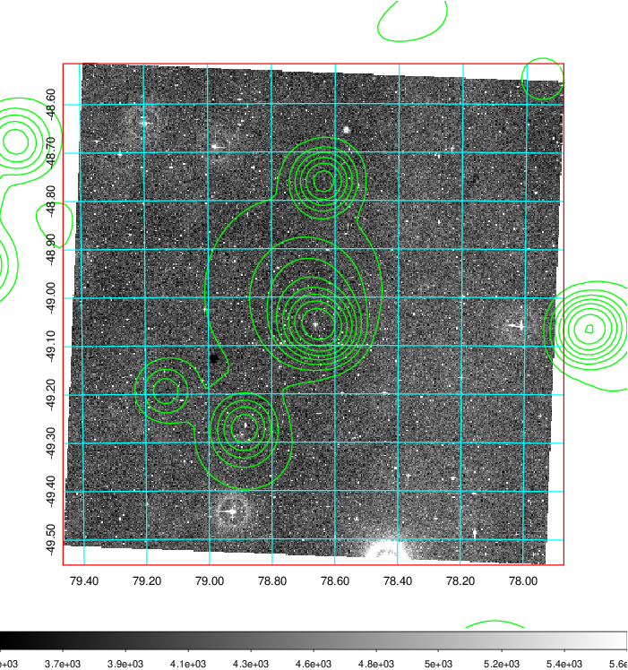
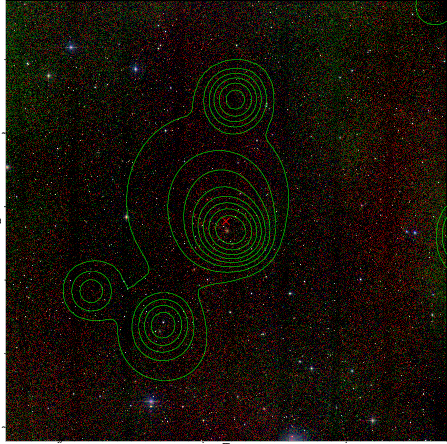

### 199

|Name|RAJ2000[deg]|DEJ2000[deg] |Ext[arcmin]| Ext,ml | z | z_src| C|GC(XSZ,Delta_z<0.01)| GC(OPT,Delta_z<0.01)|GC| R_sig[arcmin] | R500[arcmin] | R500[Mpc]| CRsig[c/s] | CR500[c/s] |L500[1E44 erg/s]|F500[1E-12 erg/s/cm^2]| M500[1E14 Msun]|Tx[keV]|Cnt_sig|Beta|Rc[arcmin]|Comment|Alias|
|---|---|---|---|---|---|------|---|--------|---------|----------|---|---|---|---|---|---|---|---|---|---|---|---|---|---|
|199| 78.668| -49.036| 2.05| 48.20| 0.0889(0.006)| z1, z_xsz| B| MCXC, PSZ2, Tar| A, N| A, MCXC, N, PSZ2, Tar| 22.231| 9.035| 0.900| 0.286(0.056)| 0.264(0.051)| 0.987(0.147)| 5.001(0.747)| 2.26(0.17)| 3.64(0.17)| 212.3| 0.538(-0.023+0.033)| 2.416(-0.364+0.488)| -| k225|

|[RASS image](../image/199/199_img.pdf)|[filtered image](../image/199/199_fil.pdf)|[Segment image](../image/199/199_seg.pdf)|
|-------------------|--------------------|-------------------|
|   |    |   |

|[Exposure image](../image/199/199_mex.pdf)| [nH image](../image/199/199_nh.pdf)| [Planck image](../image/199/199_p.pdf)|
|-------------------|--------------------|-------------------|
|   |     |  |

|[Redshift Histogram](../image/199/199_zg.pdf) | [DSS image(z1)](../image/199/199_dss_z1.pdf)      |  [DSS image(z2)](../image/199/199_dss_z2.pdf)    |
|-------------------|--------------------|-------------------|
| |  Blue circle for optical clusters;  Magenta circle for XSZ clusters;  all with r=1Mpc;  Only GC with Delta_z<0.01 are shown. |  Blue circle for optical clusters;  Magenta circle for XSZ clusters;  all with r=1Mpc;  Only GC with Delta_z<0.01 are shown.  |

|[known Abell/XSZ clusters](../image/199/199_gc.pdf) | [2MASS image](../image/199/199_2mass.pdf)      |
|-------------------|-------------------|
|  Magenta, blue and green circles  for optical, X-ray and SZ clusters  respectively, with redshift of clusters  labelled. The radius of circles  are 1Mpc.|  |

|[DES image](../image/199/199_des.pdf)   |
|-------------------|
|   |
