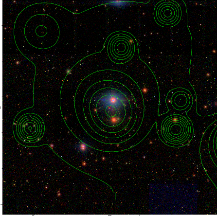

### 2

|Name|RAJ2000[deg]|DEJ2000[deg] |Ext[arcmin]| Ext,ml | z | z_src| C|GC(XSZ,Delta_z<0.01)| GC(OPT,Delta_z<0.01)|GC| R_sig[arcmin] | R500[arcmin] | R500[Mpc]| CRsig[c/s] | CR500[c/s] |L500[1E44 erg/s]|F500[1E-12 erg/s/cm^2]| M500[1E14 Msun]|Tx[keV]|Cnt_sig|Beta|Rc[arcmin]|Comment|Alias|
|---|---|---|---|---|---|------|---|--------|---------|----------|---|---|---|---|---|---|---|---|---|---|---|---|---|---|
|2| 0.641| 8.451| 6.41| 42.14| 0.0961(0.005)| z1, z_xsz| B| F20, SPI| A, W| A, C, F20, N, SPI, W| 40.600| 9.572| 1.023| 0.442(0.071)| 0.392(0.063)| 1.677(0.462)| 7.202(1.982)| 3.33(0.45)| 4.64(0.40)| 303.2| 0.502(-0.002+0.004)| 8.229(-0.200+0.308)| -| t323|

|[RASS image](../image/2/2_img.pdf)|[filtered image](../image/2/2_fil.pdf)|[Segment image](../image/2/2_seg.pdf)|
|-------------------|--------------------|-------------------|
|   |    |   |

|[Exposure image](../image/2/2_mex.pdf)| [nH image](../image/2/2_nh.pdf)| [Planck image](../image/2/2_p.pdf)|
|-------------------|--------------------|-------------------|
|   |     |  |

|[Redshift Histogram](../image/2/2_zg.pdf) | [DSS image(z1)](../image/2/2_dss_z1.pdf)      |  [DSS image(z2)](../image/2/2_dss_z2.pdf)    |
|-------------------|--------------------|-------------------|
| |  Blue circle for optical clusters;  Magenta circle for XSZ clusters;  all with r=1Mpc;  Only GC with Delta_z<0.01 are shown. |  Blue circle for optical clusters;  Magenta circle for XSZ clusters;  all with r=1Mpc;  Only GC with Delta_z<0.01 are shown.  |

|[Previous-identified clusters](../image/2/2_gc.pdf) | [2MASS image](../image/2/2_2mass.pdf)      |[SDSS image](../image/2/2_sdss.pdf)   |
|-------------------|-------------------|-------------------|
|  Green, magenta, and blue circles  for optical, X-ray and SZ clusters  respectively, with redshift of clusters  labelled. The radius of circles  are 1Mpc.|  |   |

