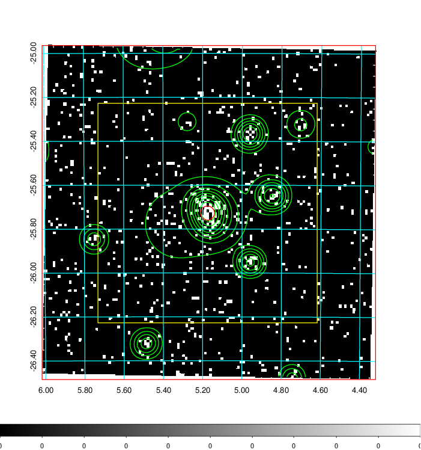
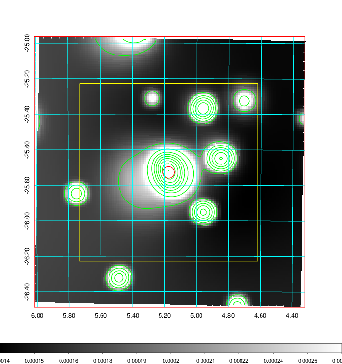
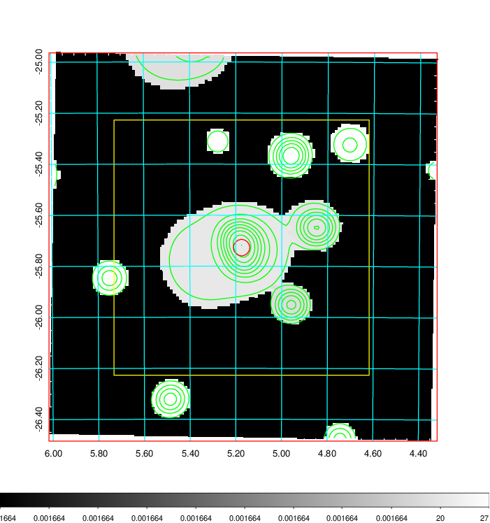
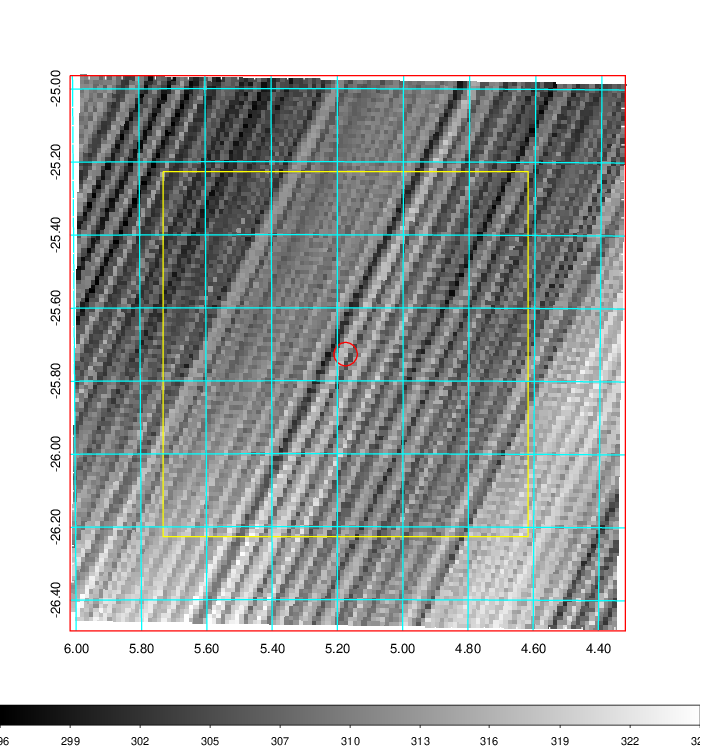
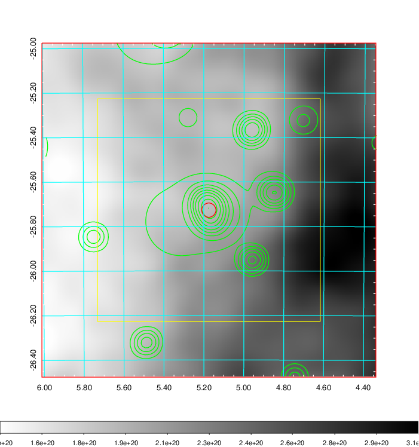
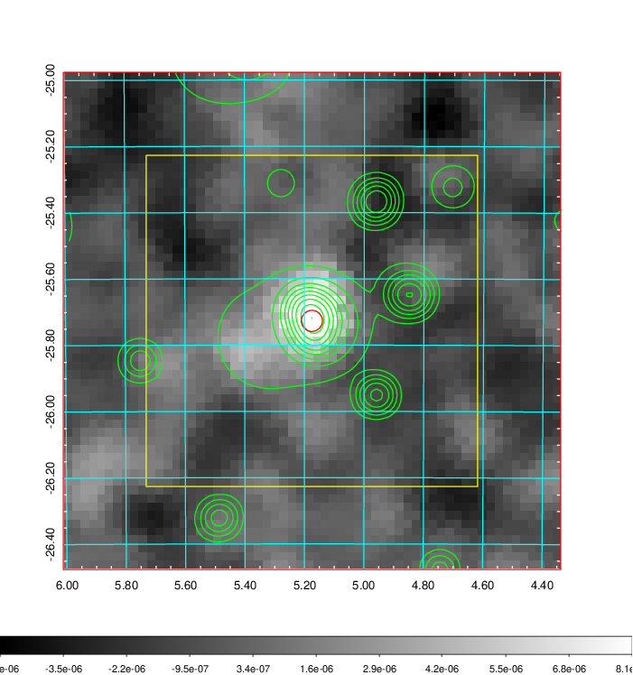
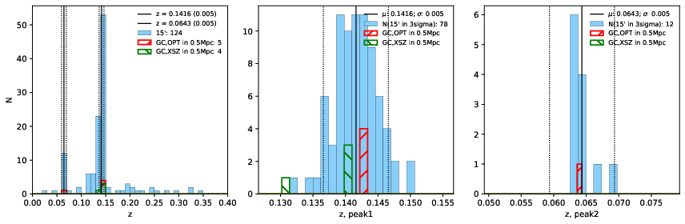
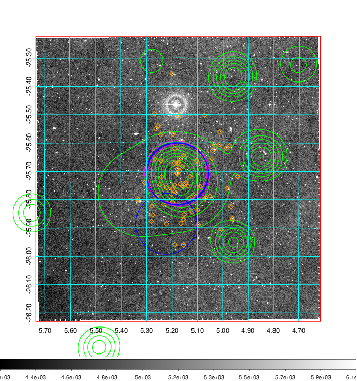
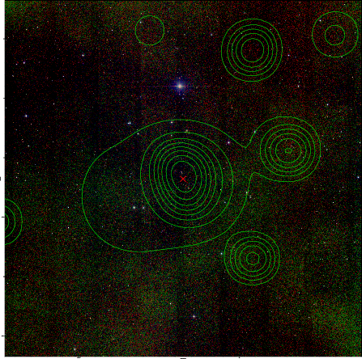

### 20

|Name|RAJ2000[deg]|DEJ2000[deg] |Ext[arcmin]| Ext,ml | z | z_src| C|GC(XSZ,Delta_z<0.01)| GC(OPT,Delta_z<0.01)|GC| R_sig[arcmin] | R500[arcmin] | R500[Mpc]| CRsig[c/s] | CR500[c/s] |L500[1E44 erg/s]|F500[1E-12 erg/s/cm^2]| M500[1E14 Msun]|Tx[keV]|Cnt_sig|Beta|Rc[arcmin]|Comment|Alias|
|---|---|---|---|---|---|------|---|--------|---------|----------|---|---|---|---|---|---|---|---|---|---|---|---|---|---|
|20| 5.175| -25.727| 1.92| 58.65| 0.1416(0.005)| z1, z_xsz| B| MCXC, PSZ2, Tar| A, W| A, MCXC, N, PSZ2, SWXCS, Tar, W, XB| 18.775| 7.987| 1.194| 0.462(0.075)| 0.422(0.069)| 4.511(0.441)| 8.407(0.821)| 5.55(0.26)| 6.45(0.19)| 145.8| 0.536(-0.022+0.030)| 2.120(-0.352+0.460)| -| k201|

|[RASS image](../image/20/20_img.pdf)|[filtered image](../image/20/20_fil.pdf)|[Segment image](../image/20/20_seg.pdf)|
|-------------------|--------------------|-------------------|
|   |    |   |

|[Exposure image](../image/20/20_mex.pdf)| [nH image](../image/20/20_nh.pdf)| [Planck image](../image/20/20_p.pdf)|
|-------------------|--------------------|-------------------|
|   |     |  |

|[Redshift Histogram](../image/20/20_zg.pdf) | [DSS image(z1)](../image/20/20_dss_z1.pdf)      |  [DSS image(z2)](../image/20/20_dss_z2.pdf)    |
|-------------------|--------------------|-------------------|
| |  Blue circle for optical clusters;  Magenta circle for XSZ clusters;  all with r=1Mpc;  Only GC with Delta_z<0.01 are shown. |  Blue circle for optical clusters;  Magenta circle for XSZ clusters;  all with r=1Mpc;  Only GC with Delta_z<0.01 are shown.  |

|[known Abell/XSZ clusters](../image/20/20_gc.pdf) | [2MASS image](../image/20/20_2mass.pdf)      |
|-------------------|-------------------|
|  Magenta, blue and green circles  for optical, X-ray and SZ clusters  respectively, with redshift of clusters  labelled. The radius of circles  are 1Mpc.|  |

|[DES image](../image/20/20_des.pdf)   |[ATLAS image](../image/20/20_s.pdf)        |
|-------------------|-------------------|
|   |   |
