

### 200

|Name|RAJ2000[deg]|DEJ2000[deg] |Ext[arcmin]| Ext,ml | z | z_src| C|GC(XSZ,Delta_z<0.01)| GC(OPT,Delta_z<0.01)|GC| R_sig[arcmin] | R500[arcmin] | R500[Mpc]| CRsig[c/s] | CR500[c/s] |L500[1E44 erg/s]|F500[1E-12 erg/s/cm^2]| M500[1E14 Msun]|Tx[keV]|Cnt_sig|Beta|Rc[arcmin]|Comment|Alias|
|---|---|---|---|---|---|------|---|--------|---------|----------|---|---|---|---|---|---|---|---|---|---|---|---|---|---|
|200| 79.172| -54.521| 1.91| 36.92| 0.2935(0.005)| z1, z_xsz| B| B15, H13, MCXC, PSZ2, Tar| A, N, W| A, B15, H13, MCXC, N, PSZ2, Tar, W| 21.738| 5.187| 1.365| 0.268(0.063)| 0.238(0.056)| 13.282(1.622)| 4.843(0.591)| 9.78(0.54)| 9.64(0.34)| 110.1| 0.651(-0.054+0.075)| 3.341(-0.650+0.822)| -| k199|

|[RASS image](../image/200/200_img.pdf)|[filtered image](../image/200/200_fil.pdf)|[Segment image](../image/200/200_seg.pdf)|
|-------------------|--------------------|-------------------|
| 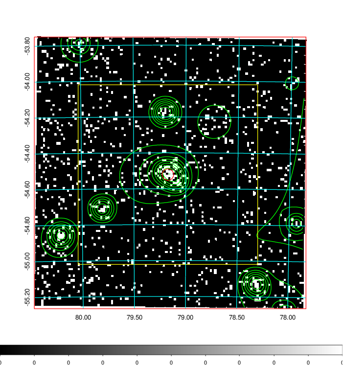  | 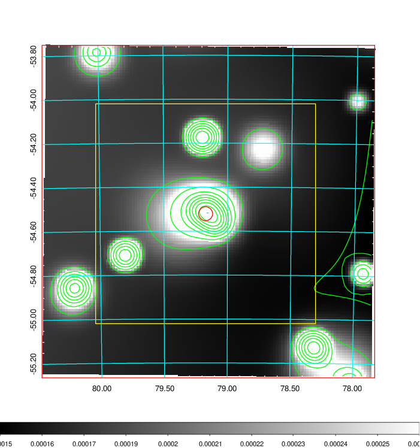   | 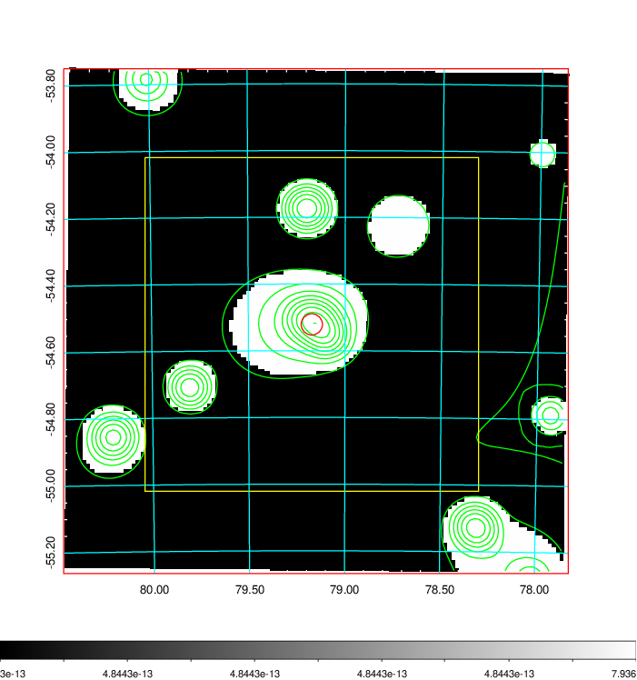  |

|[Exposure image](../image/200/200_mex.pdf)| [nH image](../image/200/200_nh.pdf)| [Planck image](../image/200/200_p.pdf)|
|-------------------|--------------------|-------------------|
|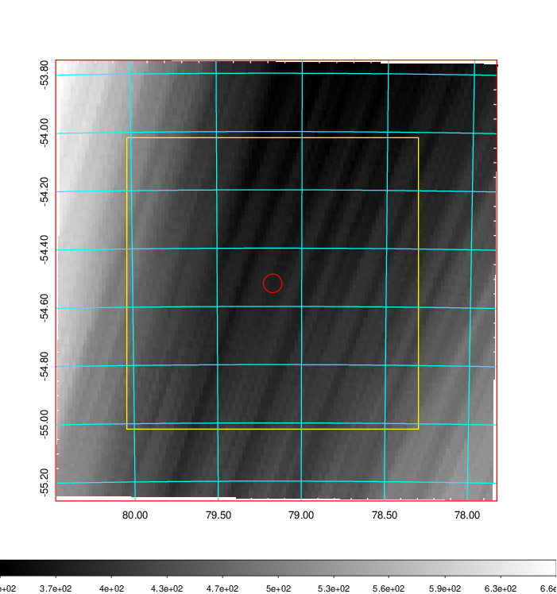   | 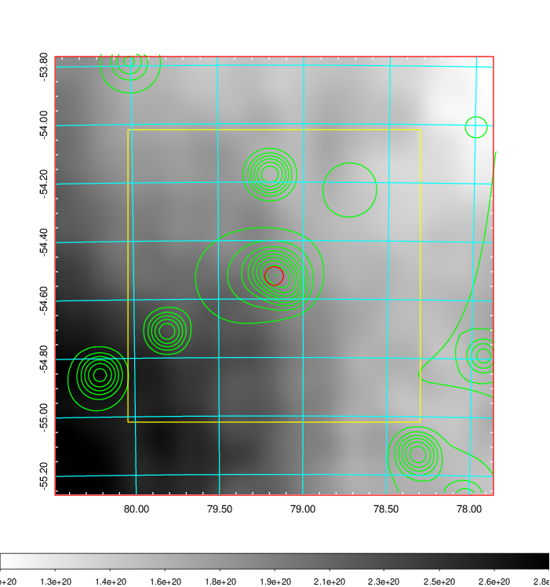    | 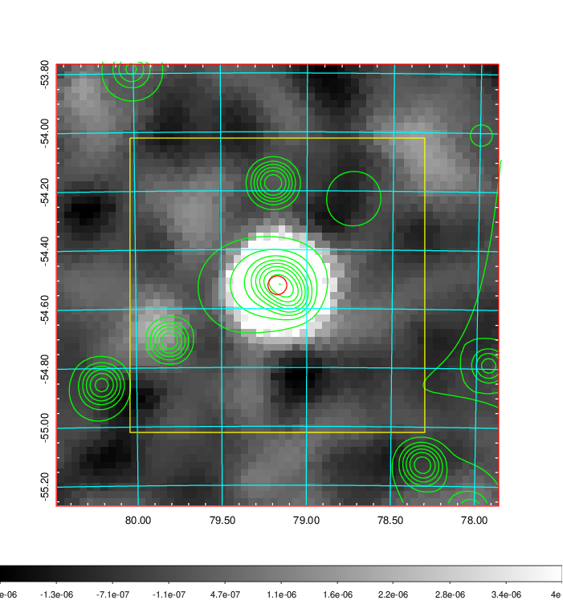 |

|[Redshift Histogram](../image/200/200_zg.pdf) | [DSS image(z1)](../image/200/200_dss_z1.pdf)      |  [DSS image(z2)](../image/200/200_dss_z2.pdf)    |
|-------------------|--------------------|-------------------|
|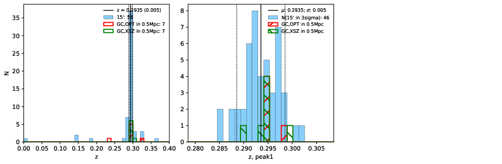 |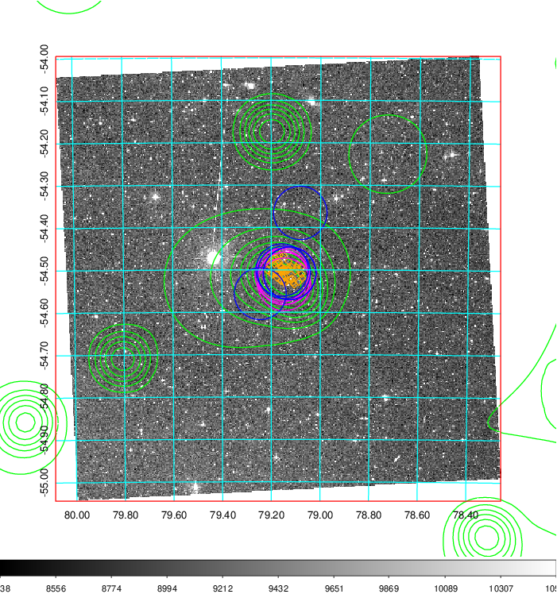  Blue circle for optical clusters;  Magenta circle for XSZ clusters;  all with r=1Mpc;  Only GC with Delta_z<0.01 are shown. | 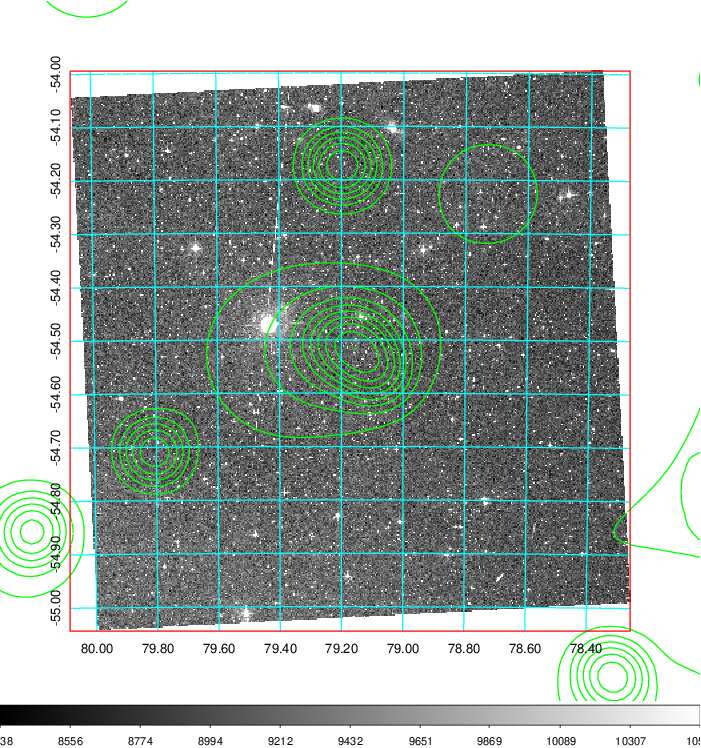 Blue circle for optical clusters;  Magenta circle for XSZ clusters;  all with r=1Mpc;  Only GC with Delta_z<0.01 are shown.  |

|[Previous-identified clusters](../image/200/200_gc.pdf) | [2MASS image](../image/200/200_2mass.pdf)      |
|-------------------|-------------------|
|  Green, magenta, and blue circles  for optical, X-ray and SZ clusters  respectively, with redshift of clusters  labelled. The radius of circles  are 1Mpc.|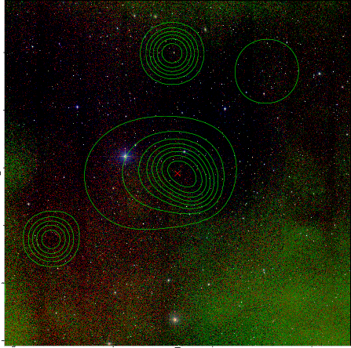  |

|[DES image](../image/200/200_des.pdf)   |
|-------------------|
| 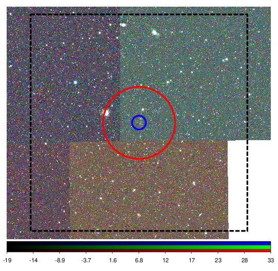  |
