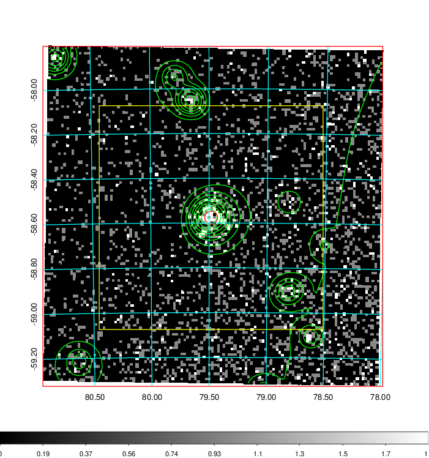
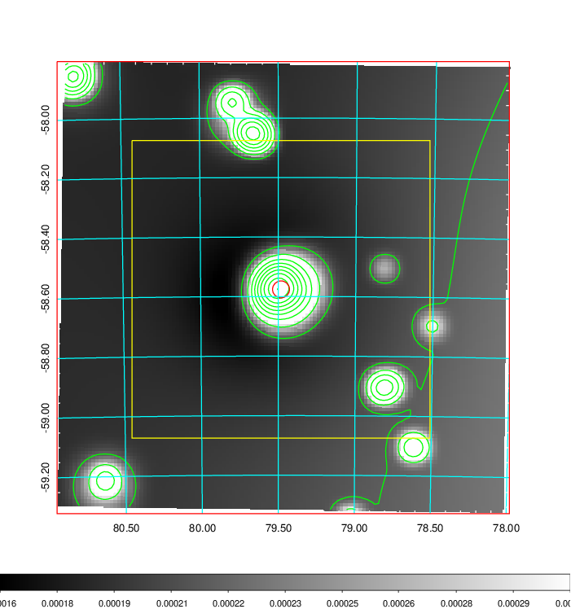
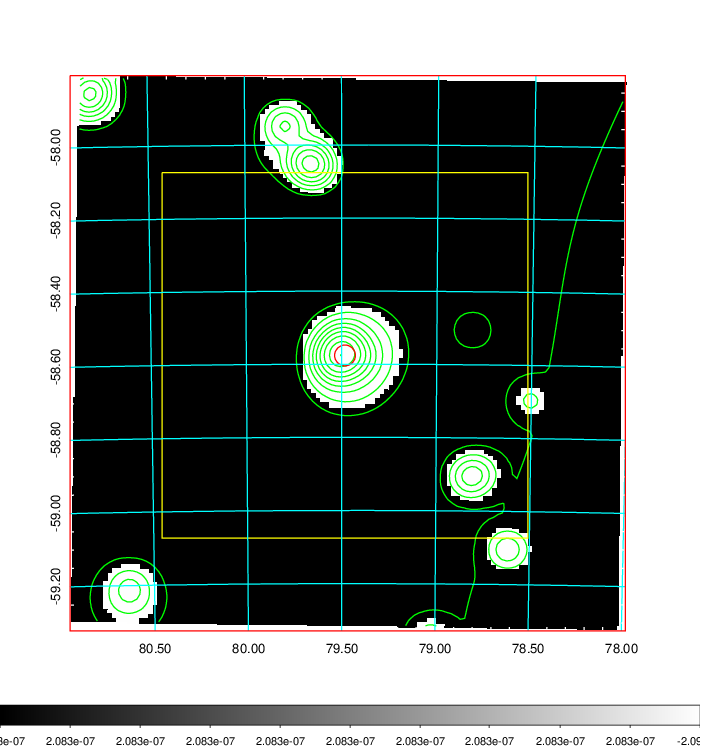
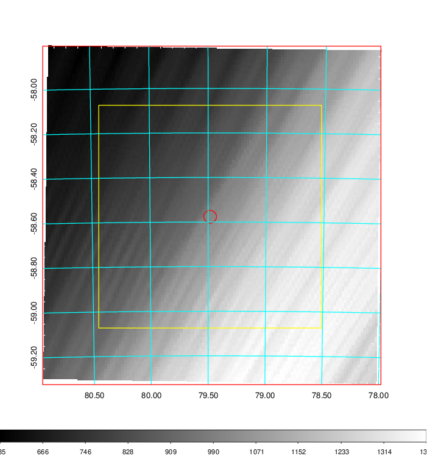
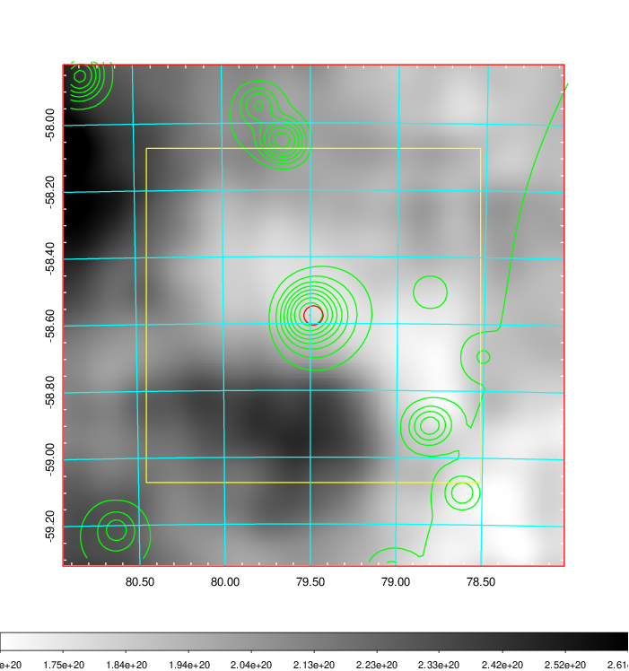
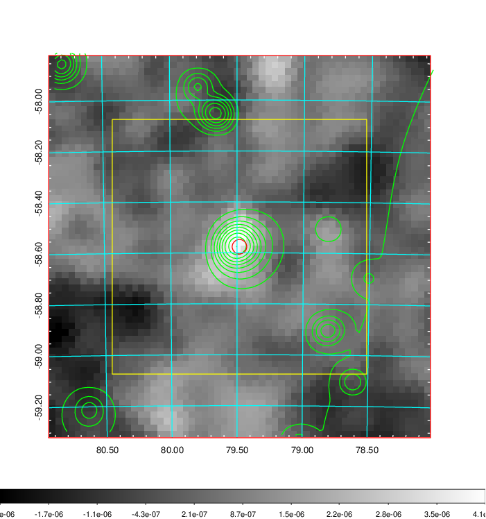
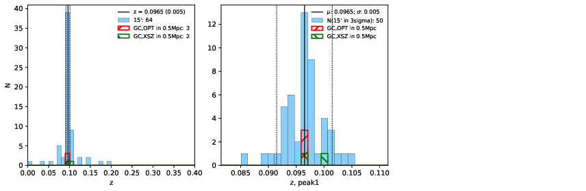
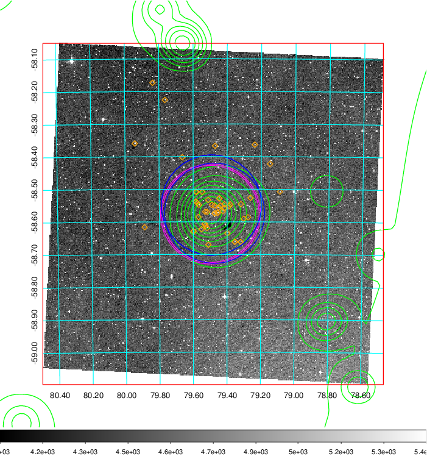
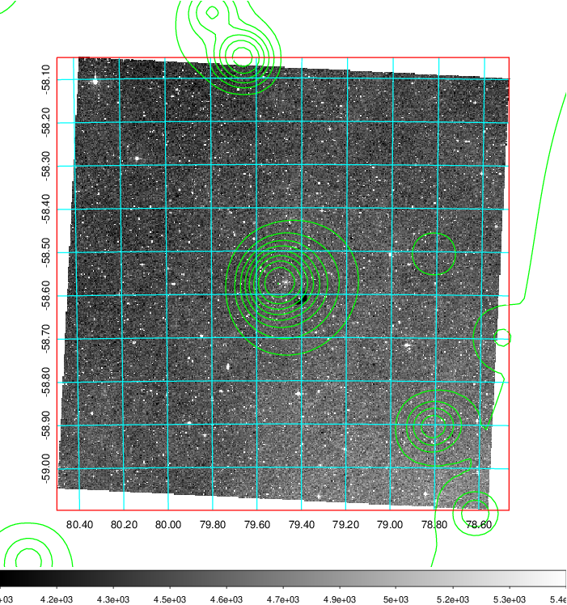
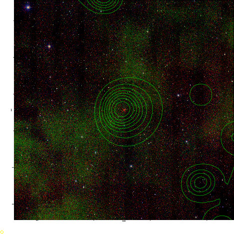

### 201

|Name|RAJ2000[deg]|DEJ2000[deg] |Ext[arcmin]| Ext,ml | z | z_src| C|GC(XSZ,Delta_z<0.01)| GC(OPT,Delta_z<0.01)|GC| R_sig[arcmin] | R500[arcmin] | R500[Mpc]| CRsig[c/s] | CR500[c/s] |L500[1E44 erg/s]|F500[1E-12 erg/s/cm^2]| M500[1E14 Msun]|Tx[keV]|Cnt_sig|Beta|Rc[arcmin]|Comment|Alias|
|---|---|---|---|---|---|------|---|--------|---------|----------|---|---|---|---|---|---|---|---|---|---|---|---|---|---|
|201| 79.482| -58.576| 1.71| 61.70| 0.0965(0.005)| z1, z_xsz| B| Tar| A, W| A, Tar, W| 6.362| 7.555| 0.810| 0.131(0.022)| 0.135(0.023)| 0.610(0.053)| 2.597(0.226)| 1.66(0.07)| 3.01(0.08)| 137.9| 0.958(-0.057+0.031)| 3.920(-0.324+0.271)| -| t041|

|[RASS image](../image/201/201_img.pdf)|[filtered image](../image/201/201_fil.pdf)|[Segment image](../image/201/201_seg.pdf)|
|-------------------|--------------------|-------------------|
|   |    |   |

|[Exposure image](../image/201/201_mex.pdf)| [nH image](../image/201/201_nh.pdf)| [Planck image](../image/201/201_p.pdf)|
|-------------------|--------------------|-------------------|
|   |     |  |

|[Redshift Histogram](../image/201/201_zg.pdf) | [DSS image(z1)](../image/201/201_dss_z1.pdf)      |  [DSS image(z2)](../image/201/201_dss_z2.pdf)    |
|-------------------|--------------------|-------------------|
| |  Blue circle for optical clusters;  Magenta circle for XSZ clusters;  all with r=1Mpc;  Only GC with Delta_z<0.01 are shown. |  Blue circle for optical clusters;  Magenta circle for XSZ clusters;  all with r=1Mpc;  Only GC with Delta_z<0.01 are shown.  |

|[known Abell/XSZ clusters](../image/201/201_gc.pdf) | [2MASS image](../image/201/201_2mass.pdf)      |
|-------------------|-------------------|
|  Magenta, blue and green circles  for optical, X-ray and SZ clusters  respectively, with redshift of clusters  labelled. The radius of circles  are 1Mpc.|  |

|[DES image](../image/201/201_des.pdf)   |
|-------------------|
|   |
