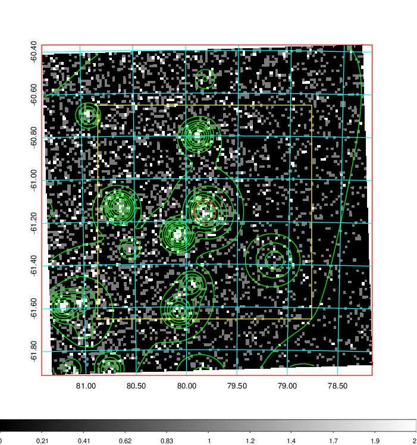
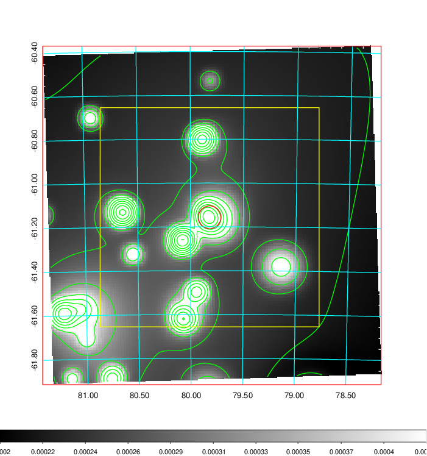
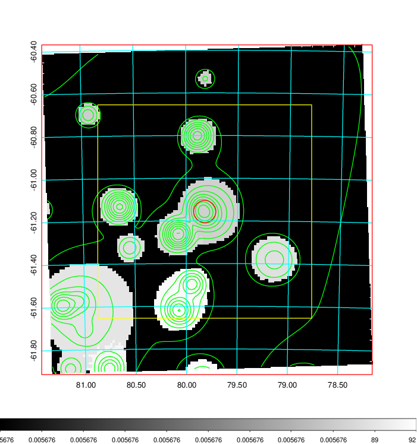
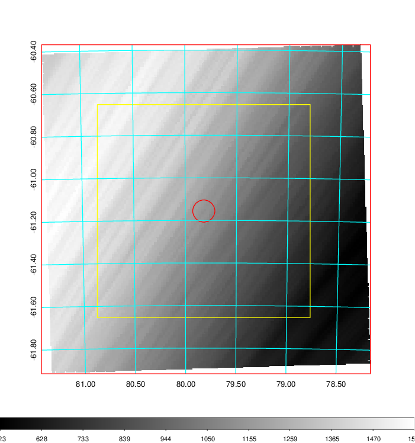
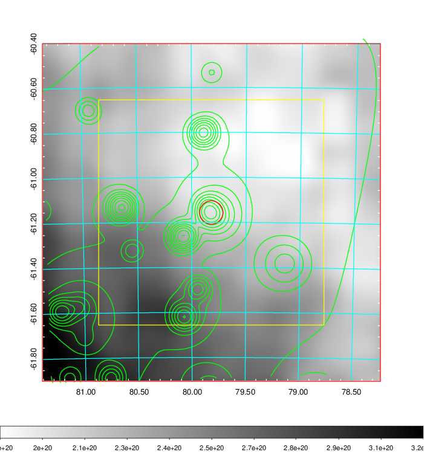
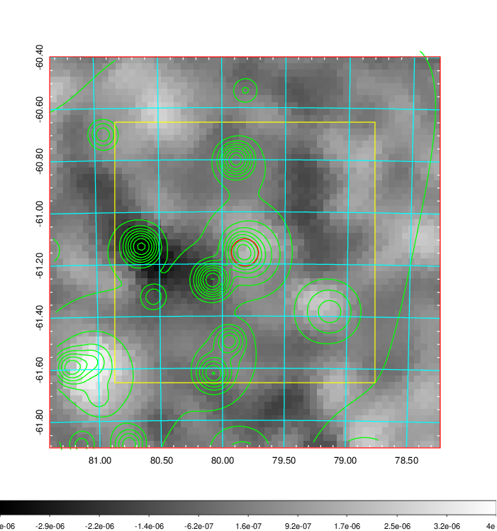
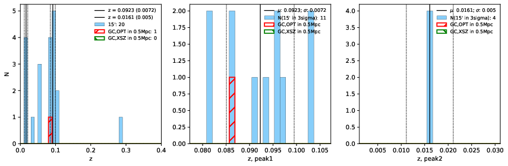
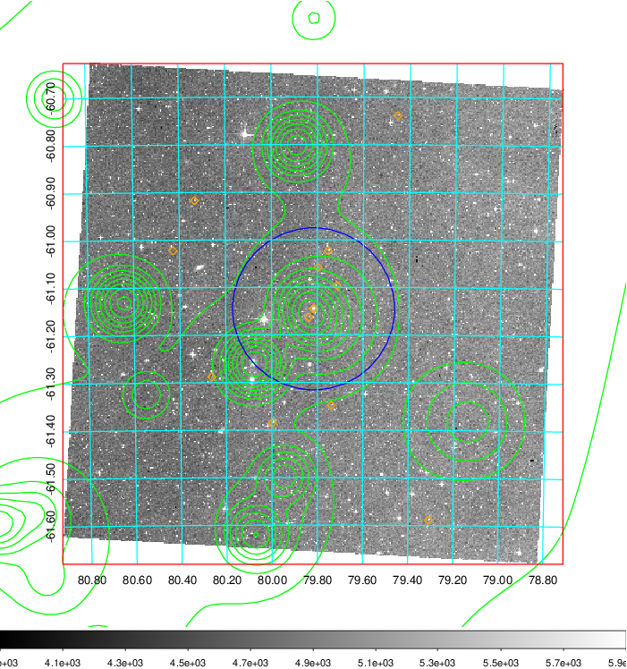
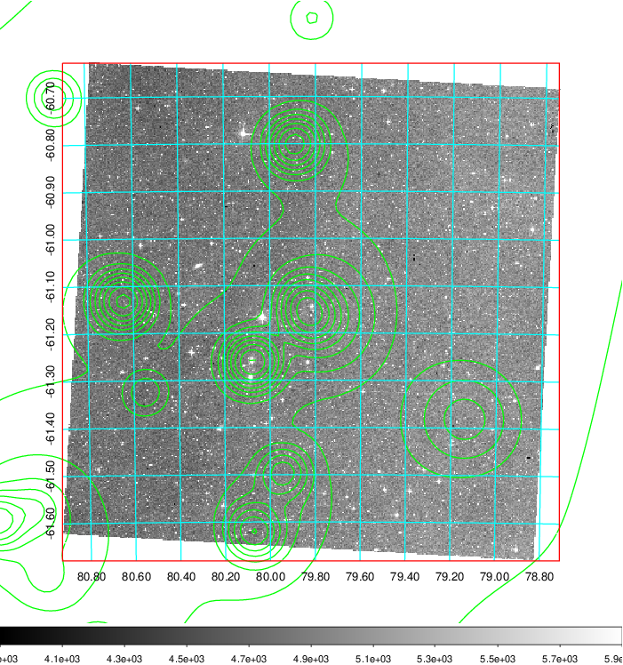
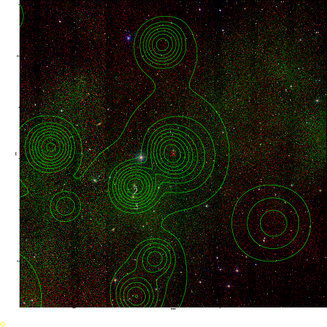

### 202

|Name|RAJ2000[deg]|DEJ2000[deg] |Ext[arcmin]| Ext,ml | z | z_src| C|GC(XSZ,Delta_z<0.01)| GC(OPT,Delta_z<0.01)|GC| R_sig[arcmin] | R500[arcmin] | R500[Mpc]| CRsig[c/s] | CR500[c/s] |L500[1E44 erg/s]|F500[1E-12 erg/s/cm^2]| M500[1E14 Msun]|Tx[keV]|Cnt_sig|Beta|Rc[arcmin]|Comment|Alias|
|---|---|---|---|---|---|------|---|--------|---------|----------|---|---|---|---|---|---|---|---|---|---|---|---|---|---|
|202| 79.819| -61.156| 3.12| 56.32| 0.0923(0.007)| z1, z_opt| S| -| W| A, N, W| 10.750| 7.192| 0.741| 0.100(0.024)| 0.095(0.022)| 0.381(0.059)| 1.780(0.275)| 1.26(0.10)| 2.55(0.13)| 151.2| 0.813(-0.140+0.126)| 4.364(-1.052+0.849)| -| t136|

|[RASS image](../image/202/202_img.pdf)|[filtered image](../image/202/202_fil.pdf)|[Segment image](../image/202/202_seg.pdf)|
|-------------------|--------------------|-------------------|
|   |    |   |

|[Exposure image](../image/202/202_mex.pdf)| [nH image](../image/202/202_nh.pdf)| [Planck image](../image/202/202_p.pdf)|
|-------------------|--------------------|-------------------|
|   |     |  |

|[Redshift Histogram](../image/202/202_zg.pdf) | [DSS image(z1)](../image/202/202_dss_z1.pdf)      |  [DSS image(z2)](../image/202/202_dss_z2.pdf)    |
|-------------------|--------------------|-------------------|
| |  Blue circle for optical clusters;  Magenta circle for XSZ clusters;  all with r=1Mpc;  Only GC with Delta_z<0.01 are shown. |  Blue circle for optical clusters;  Magenta circle for XSZ clusters;  all with r=1Mpc;  Only GC with Delta_z<0.01 are shown.  |

|[known Abell/XSZ clusters](../image/202/202_gc.pdf) | [2MASS image](../image/202/202_2mass.pdf)      |
|-------------------|-------------------|
|  Magenta, blue and green circles  for optical, X-ray and SZ clusters  respectively, with redshift of clusters  labelled. The radius of circles  are 1Mpc.|  |

|[DES image](../image/202/202_des.pdf)   |
|-------------------|
|   |
