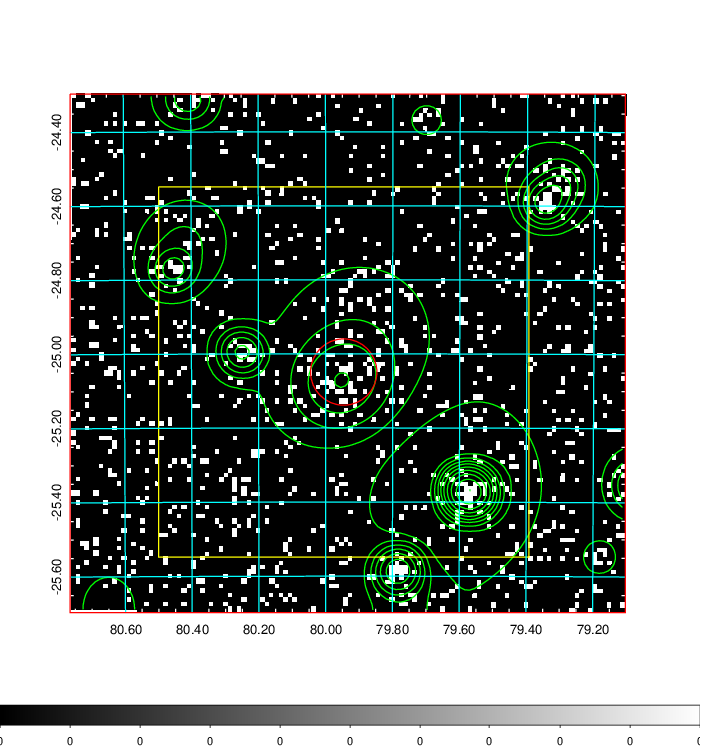
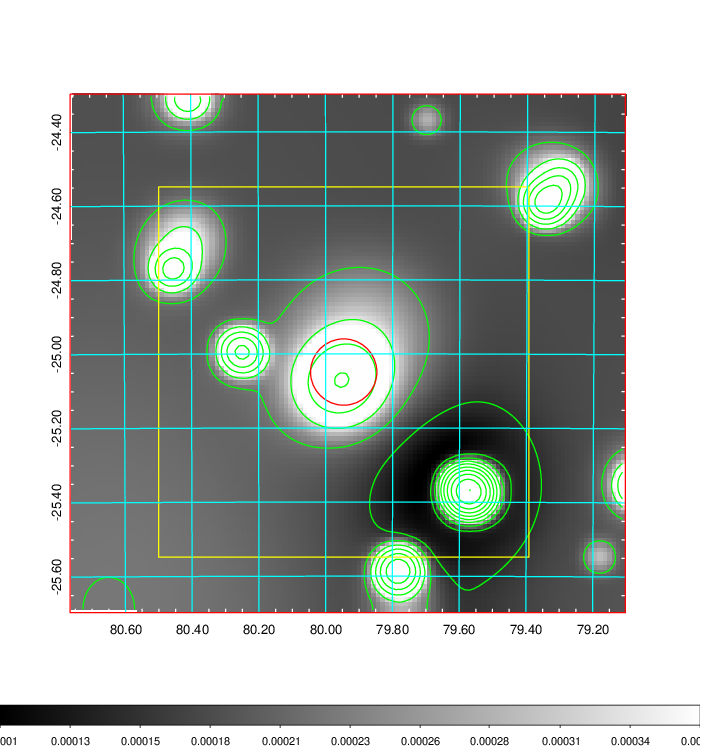
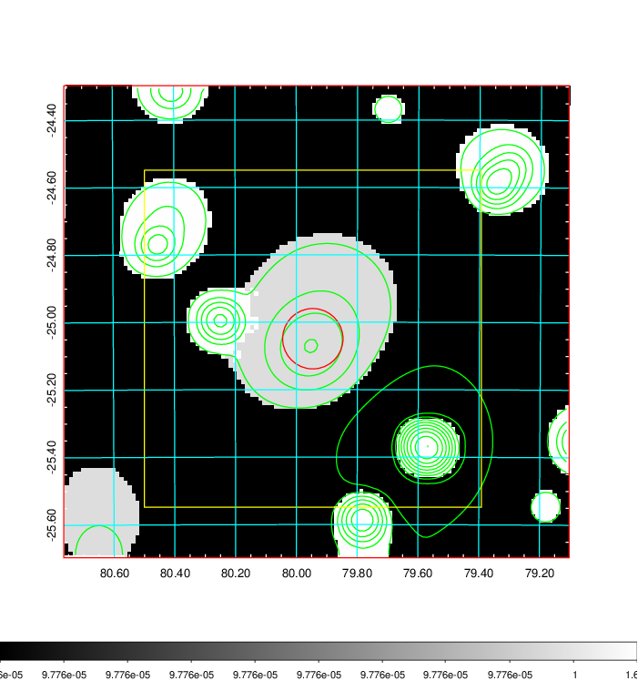
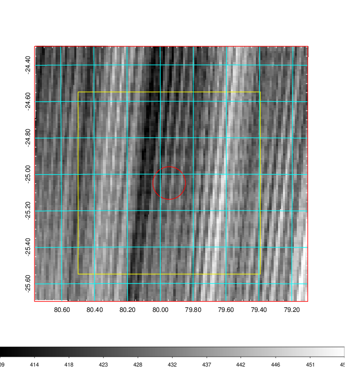
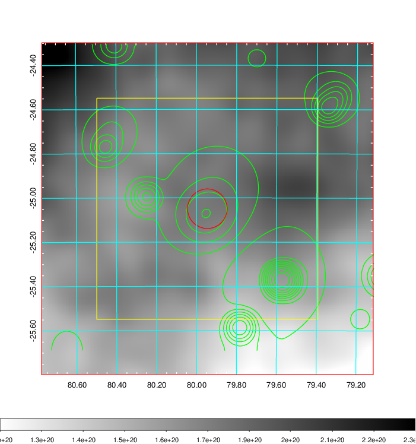
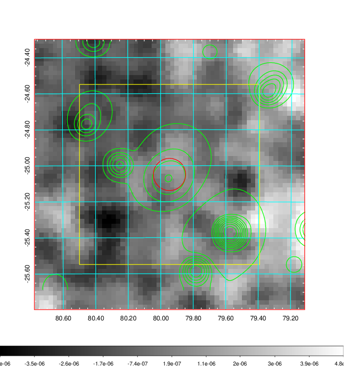
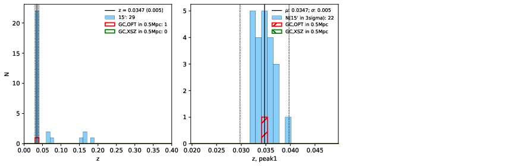
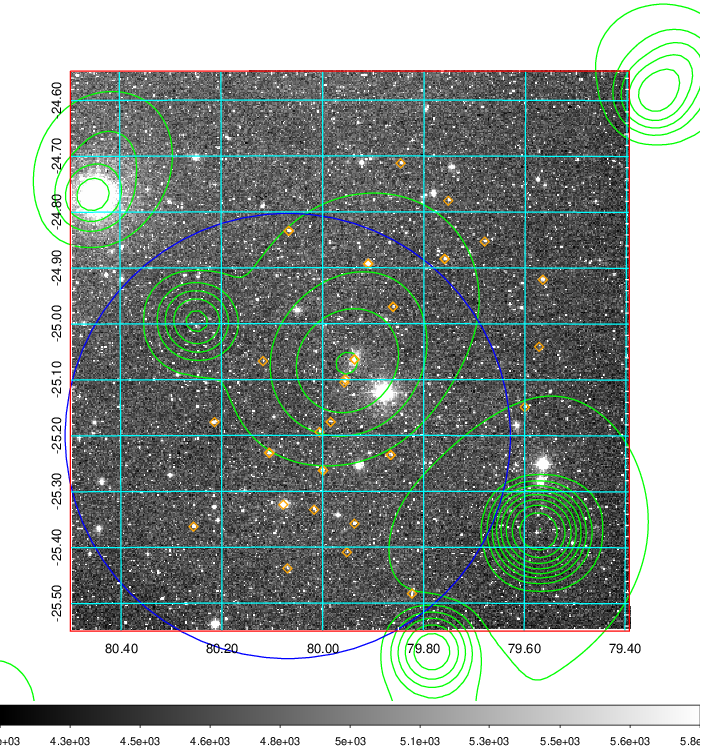
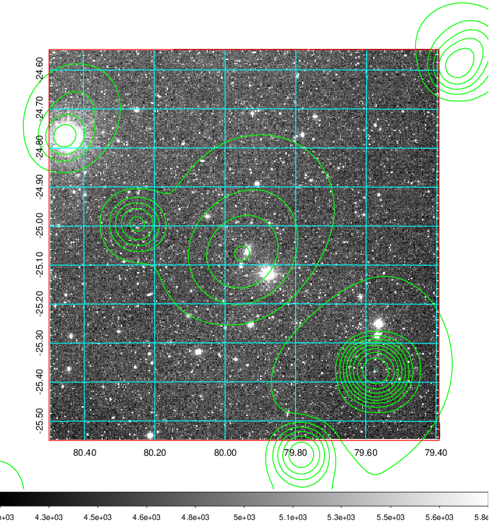
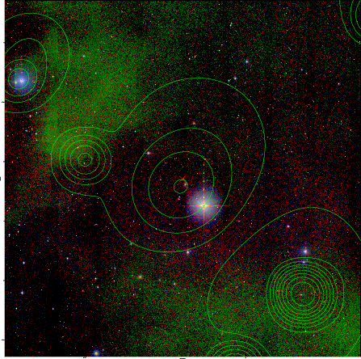

### 203

|Name|RAJ2000[deg]|DEJ2000[deg] |Ext[arcmin]| Ext,ml | z | z_src| C|GC(XSZ,Delta_z<0.01)| GC(OPT,Delta_z<0.01)|GC| R_sig[arcmin] | R500[arcmin] | R500[Mpc]| CRsig[c/s] | CR500[c/s] |L500[1E44 erg/s]|F500[1E-12 erg/s/cm^2]| M500[1E14 Msun]|Tx[keV]|Cnt_sig|Beta|Rc[arcmin]|Comment|Alias|
|---|---|---|---|---|---|------|---|--------|---------|----------|---|---|---|---|---|---|---|---|---|---|---|---|---|---|
|203| 79.946| -25.049| 5.38| 56.21| 0.0347(0.005)| z1, z_opt| S| -| N| N| 9.775| 12.952| 0.537| 0.135(0.034)| 0.142(0.036)| 0.063(0.012)| 2.254(0.441)| 0.45(0.05)| 1.33(0.08)| 63.0| 0.865(-0.144+0.096)| 7.178(-1.391+1.057)| -| t276|

|[RASS image](../image/203/203_img.pdf)|[filtered image](../image/203/203_fil.pdf)|[Segment image](../image/203/203_seg.pdf)|
|-------------------|--------------------|-------------------|
|   |    |   |

|[Exposure image](../image/203/203_mex.pdf)| [nH image](../image/203/203_nh.pdf)| [Planck image](../image/203/203_p.pdf)|
|-------------------|--------------------|-------------------|
|   |     |  |

|[Redshift Histogram](../image/203/203_zg.pdf) | [DSS image(z1)](../image/203/203_dss_z1.pdf)      |  [DSS image(z2)](../image/203/203_dss_z2.pdf)    |
|-------------------|--------------------|-------------------|
| |  Blue circle for optical clusters;  Magenta circle for XSZ clusters;  all with r=1Mpc;  Only GC with Delta_z<0.01 are shown. |  Blue circle for optical clusters;  Magenta circle for XSZ clusters;  all with r=1Mpc;  Only GC with Delta_z<0.01 are shown.  |

|[known Abell/XSZ clusters](../image/203/203_gc.pdf) | [2MASS image](../image/203/203_2mass.pdf)      |
|-------------------|-------------------|
|  Magenta, blue and green circles  for optical, X-ray and SZ clusters  respectively, with redshift of clusters  labelled. The radius of circles  are 1Mpc.|  |

|[DES image](../image/203/203_des.pdf)   |[PS1 image](../image/203/203_ps1.pdf)            |
|-------------------|-------------------|
|   |   |
