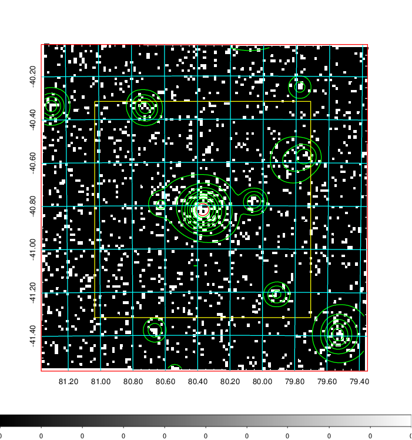
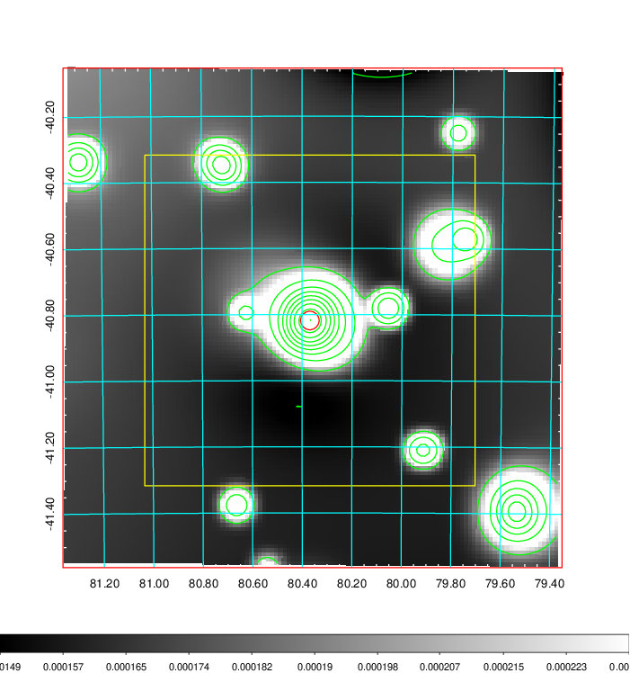
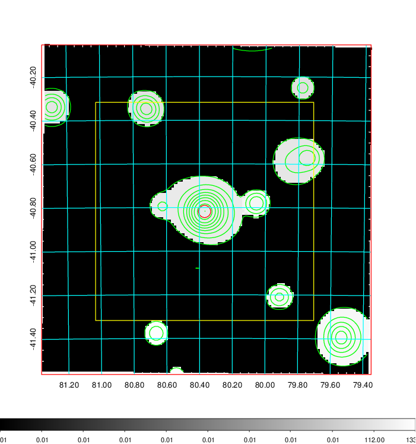
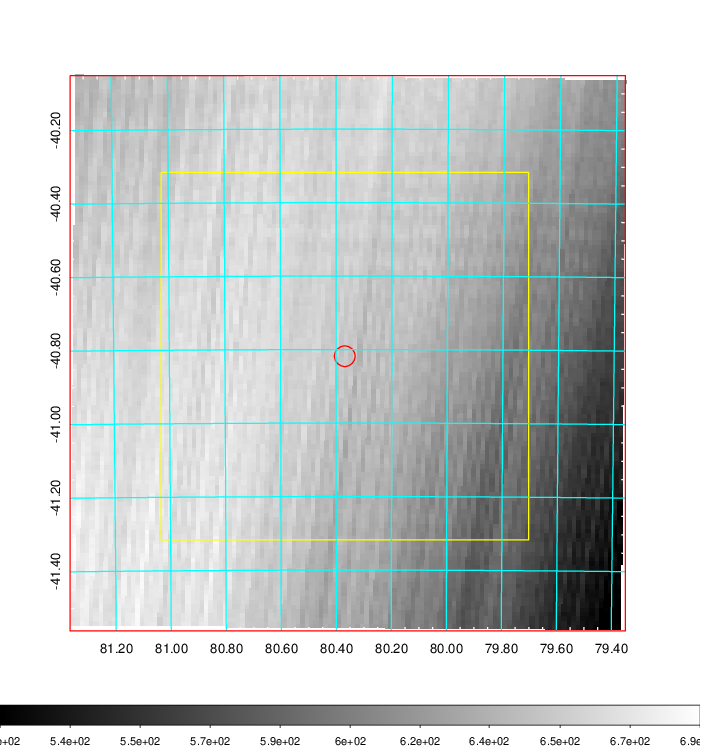
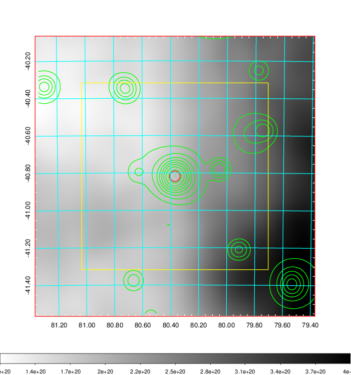
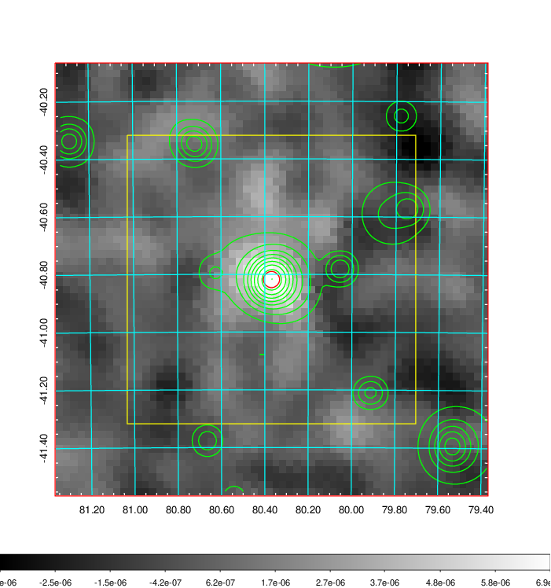
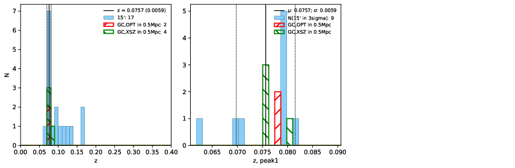
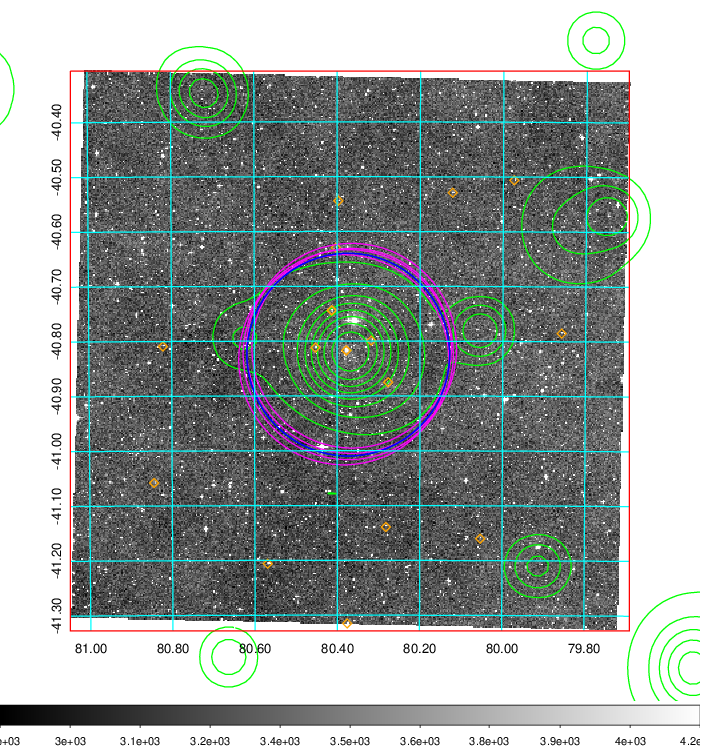
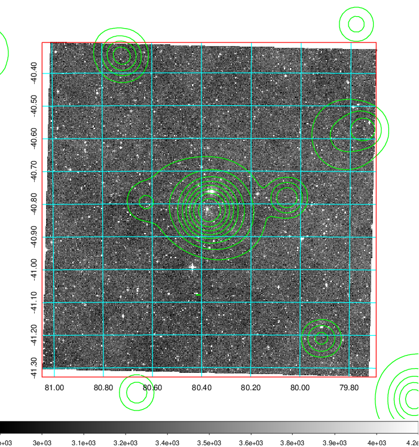
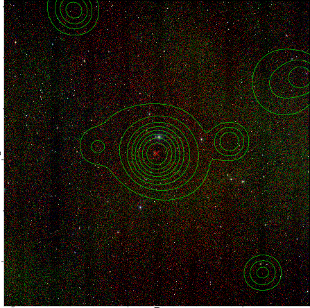

### 204

|Name|RAJ2000[deg]|DEJ2000[deg] |Ext[arcmin]| Ext,ml | z | z_src| C|GC(XSZ,Delta_z<0.01)| GC(OPT,Delta_z<0.01)|GC| R_sig[arcmin] | R500[arcmin] | R500[Mpc]| CRsig[c/s] | CR500[c/s] |L500[1E44 erg/s]|F500[1E-12 erg/s/cm^2]| M500[1E14 Msun]|Tx[keV]|Cnt_sig|Beta|Rc[arcmin]|Comment|Alias|
|---|---|---|---|---|---|------|---|--------|---------|----------|---|---|---|---|---|---|---|---|---|---|---|---|---|---|
|204| 80.369| -40.818| 1.68| 56.89| 0.0757(0.006)| z1, z_xsz| B| MCXC, PSZ2, Tar| A| A, MCXC, PSZ2, Tar| 8.312| 9.218| 0.794| 0.193(0.027)| 0.196(0.028)| 0.522(0.041)| 3.711(0.294)| 1.53(0.06)| 2.85(0.07)| 124.6| 0.897(-0.104+0.072)| 3.926(-0.602+0.445)| -| k153|

|[RASS image](../image/204/204_img.pdf)|[filtered image](../image/204/204_fil.pdf)|[Segment image](../image/204/204_seg.pdf)|
|-------------------|--------------------|-------------------|
|   |    |   |

|[Exposure image](../image/204/204_mex.pdf)| [nH image](../image/204/204_nh.pdf)| [Planck image](../image/204/204_p.pdf)|
|-------------------|--------------------|-------------------|
|   |     |  |

|[Redshift Histogram](../image/204/204_zg.pdf) | [DSS image(z1)](../image/204/204_dss_z1.pdf)      |  [DSS image(z2)](../image/204/204_dss_z2.pdf)    |
|-------------------|--------------------|-------------------|
| |  Blue circle for optical clusters;  Magenta circle for XSZ clusters;  all with r=1Mpc;  Only GC with Delta_z<0.01 are shown. |  Blue circle for optical clusters;  Magenta circle for XSZ clusters;  all with r=1Mpc;  Only GC with Delta_z<0.01 are shown.  |

|[known Abell/XSZ clusters](../image/204/204_gc.pdf) | [2MASS image](../image/204/204_2mass.pdf)      |
|-------------------|-------------------|
|  Magenta, blue and green circles  for optical, X-ray and SZ clusters  respectively, with redshift of clusters  labelled. The radius of circles  are 1Mpc.|  |

|[DES image](../image/204/204_des.pdf)   |
|-------------------|
|   |
