

### 205

|Name|RAJ2000[deg]|DEJ2000[deg] |Ext[arcmin]| Ext,ml | z | z_src| C|GC(XSZ,Delta_z<0.01)| GC(OPT,Delta_z<0.01)|GC| R_sig[arcmin] | R500[arcmin] | R500[Mpc]| CRsig[c/s] | CR500[c/s] |L500[1E44 erg/s]|F500[1E-12 erg/s/cm^2]| M500[1E14 Msun]|Tx[keV]|Cnt_sig|Beta|Rc[arcmin]|Comment|Alias|
|---|---|---|---|---|---|------|---|--------|---------|----------|---|---|---|---|---|---|---|---|---|---|---|---|---|---|
|205| 81.281| -30.933| 5.68| 129.78| 0.1516(0.000)| -| G| -| -| A, W| 14.162| 6.645| 1.052| 0.225(0.038)| 0.207(0.035)| 2.593(0.261)| 4.164(0.419)| 3.84(0.19)| 5.15(0.16)| 129.2| 0.939(-0.085+0.045)| 10.098(-0.879+0.750)| An Abell cluster with $z$ = 0.1599 and offset = 0.63 Mpc(3.92 arcmin)| t296|

|[RASS image](../image/205/205_img.pdf)|[filtered image](../image/205/205_fil.pdf)|[Segment image](../image/205/205_seg.pdf)|
|-------------------|--------------------|-------------------|
| 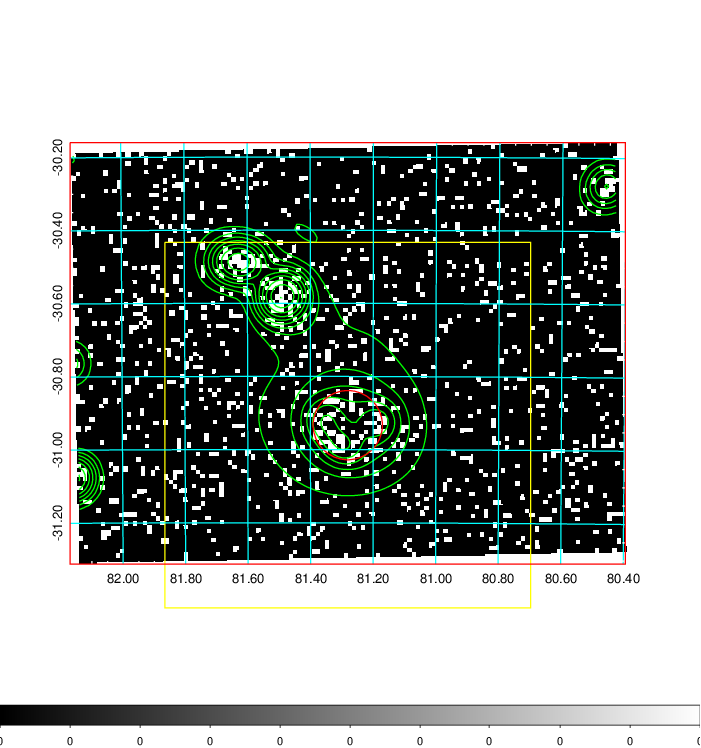  | 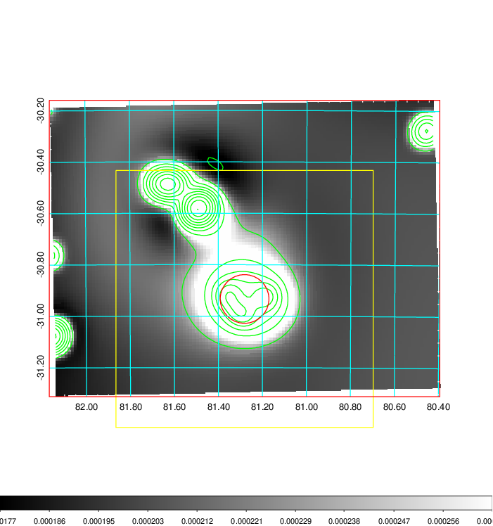   | 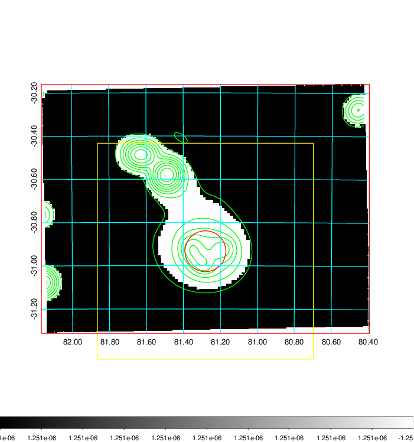  |

|[Exposure image](../image/205/205_mex.pdf)| [nH image](../image/205/205_nh.pdf)| [Planck image](../image/205/205_p.pdf)|
|-------------------|--------------------|-------------------|
|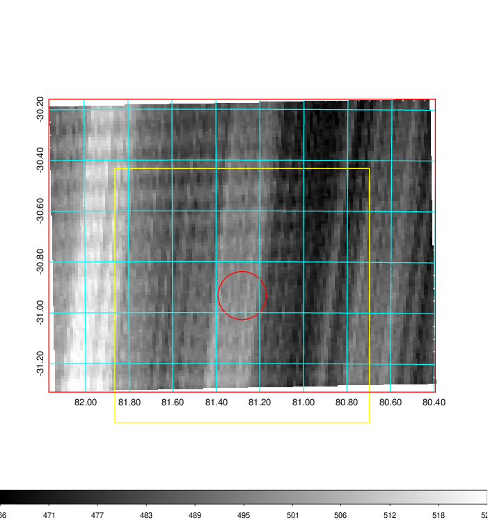   | 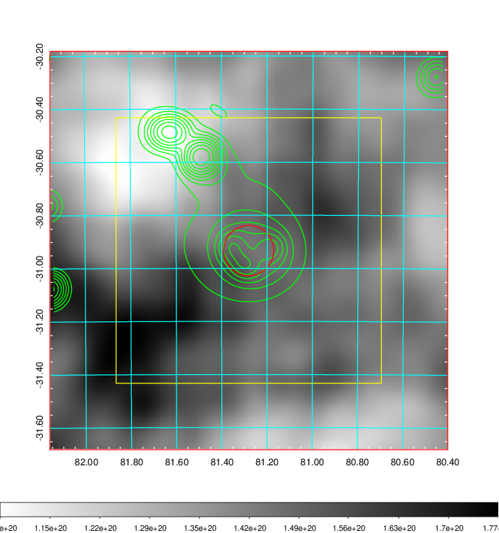    | 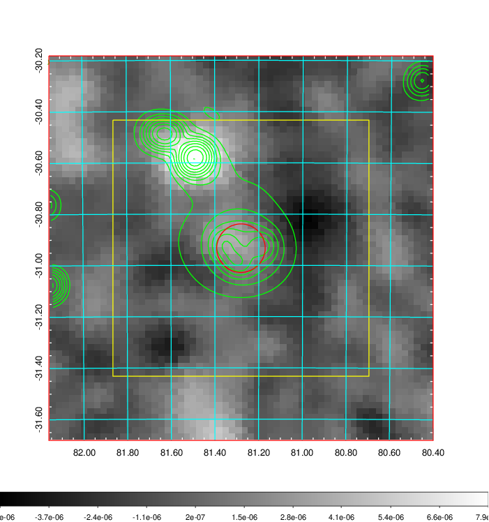 |

|[Redshift Histogram](../image/205/205_zg.pdf) | [DSS image(z1)](../image/205/205_dss_z1.pdf)      |  [DSS image(z2)](../image/205/205_dss_z2.pdf)    |
|-------------------|--------------------|-------------------|
|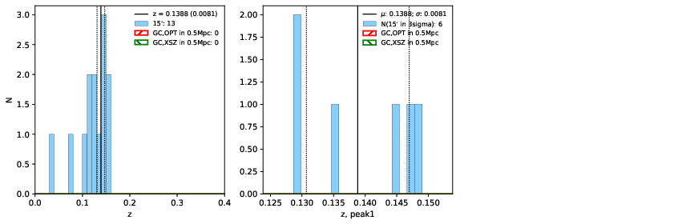 |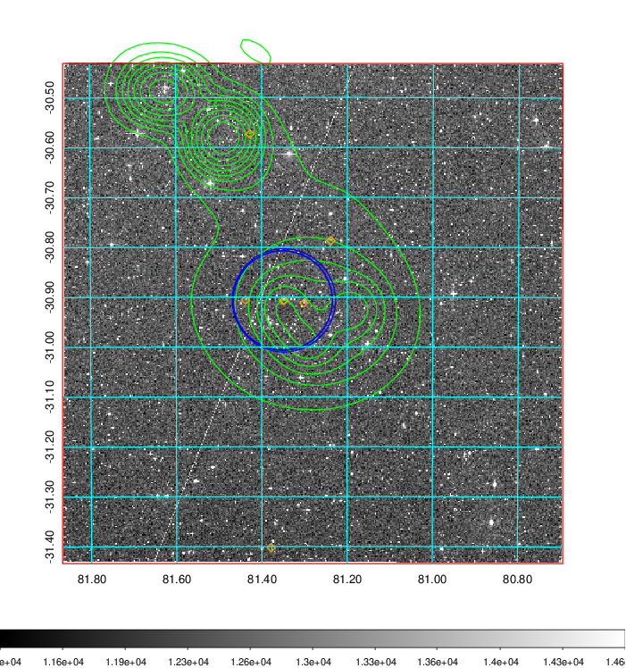  Blue circle for optical clusters;  Magenta circle for XSZ clusters;  all with r=1Mpc;  Only GC with Delta_z<0.01 are shown. | 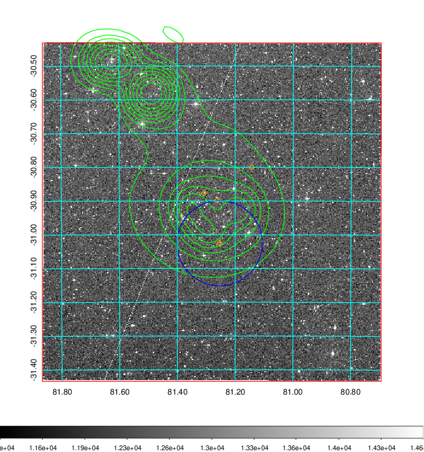 Blue circle for optical clusters;  Magenta circle for XSZ clusters;  all with r=1Mpc;  Only GC with Delta_z<0.01 are shown.  |

|[Previous-identified clusters](../image/205/205_gc.pdf) | [2MASS image](../image/205/205_2mass.pdf)      |
|-------------------|-------------------|
|  Green, magenta, and blue circles  for optical, X-ray and SZ clusters  respectively, with redshift of clusters  labelled. The radius of circles  are 1Mpc.|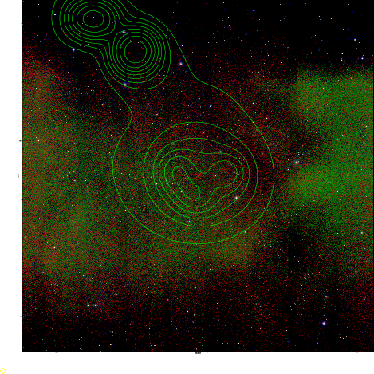  |

|[DES image](../image/205/205_des.pdf)   |[PS1 image](../image/205/205_ps1.pdf)            |
|-------------------|-------------------|
| 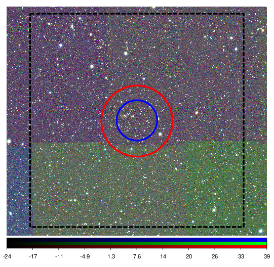  | 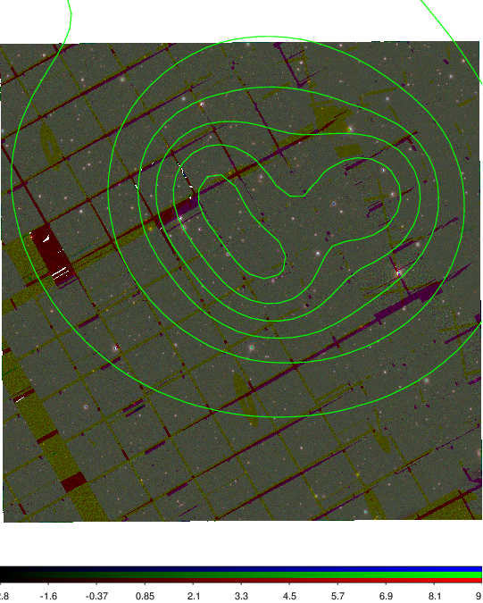  |
